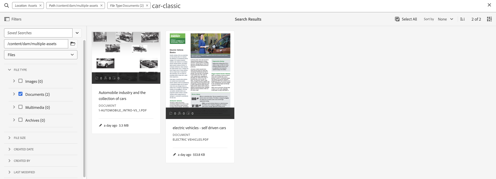

# AEM Assets搜尋最佳實務

[!DNL Adobe Experience Manager Assets]提供強大的資產搜尋方法，協助您達到更高的內容速度。 有時候，尋找正確的資產可能會很困難且耗時。 因此，[!DNL Adobe Experience Manager Assets]中的搜尋資產功能是使用數位資產管理系統的核心，無論是供創意人員進一步使用、供業務使用者和行銷人員穩健管理資產，還是DAM管理員管理。

本說明檔案包含AEM搜尋最佳實務，並透過各種案例協助AEM使用者執行基本到進階層級的搜尋。

## 存取Experience Manager搜尋 {#access-experience-manager-search}

以下是開始搜尋前需在Experience Manager中執行的基本步驟：

* 在&#x200B;**管理員檢視**&#x200B;中，前往Experience Manager中的Assets >檔案，然後按一下頂端列中的搜尋圖示。 或者，使用正斜線(/)開啟「全搜尋」欄位。
在&#x200B;**Assets檢視**&#x200B;中，搜尋列會顯示在頂端，可以直接存取。
* 已預先選取`Location:Assets`和`Path:/content/dam`，以將搜尋範圍限制在您的Experience Manager Assets存放庫。 如果您導覽至任何其他資料夾，`Path:/content/dam/<folder name>`會顯示在「全搜尋」欄位中，以將搜尋範圍限制在目前的資料夾。

## 基本搜尋 {#basic-search}

**案例1：使用`classic car`做為搜尋關鍵字來執行基本搜尋。**

關鍵字搜尋不區分大小寫，而且是在資產&#x200B;*全文搜尋*&#x200B;索引（可在索引定義中設定）中包含的中繼資料欄位中的全文搜尋。 如果使用多個關鍵字，則&#x200B;**AND是關鍵字之間的預設運運算元，因此會將&#39;classic car&#39;的搜尋視為&#39;classic AND car&#39;**。

符合中繼資料欄位中所有搜尋字詞的搜尋結果會先顯示，接著顯示符合智慧標籤中任何搜尋字詞的搜尋結果。 搜尋結果的大約顯示順序為：

1. 符合各種中繼資料欄位中的`Classic Car`。
2. 符合智慧標籤中的`Classic Car`。
3. 符合智慧標籤中的`Classic`或`Car`。

指定`classic car`做為搜尋關鍵字，然後按一下[搜尋]。 輸入關鍵字時，您可以在下拉式清單中檢視搜尋建議。 搜尋建議會根據您Experience Manager部署上的搜尋索引內容而定。 如果您無法在下拉式功能表中檢視適當的資產，請按下Enter鍵以檢視結果清單。 結果會依相關性排序，從最接近的相符專案開始。

<!---->

您可以用雙引號(「 」)新增搜尋關鍵字，讓搜尋更具體。 此搜尋僅包含同時包含指定辭彙的Assets。 搜尋條件看起來像 — `"classic car"`。 因此，會顯示同時包含`classic`和`car`的搜尋結果。

<!---->

如果您也在&#x200B;**[!UICONTROL Assets檢視]**&#x200B;中工作，搜尋會顯示類似的結果。

>[!VIDEO](https://video.tv.adobe.com/v/3425489)

## 檔案和資料夾 {#files-folders}

**案例2：在`automobile`資料夾中使用`classic car`關鍵字搜尋所有檔案。**

檔案和資料夾篩選器可協助您縮小搜尋範圍。 根據您的需求，使用下拉式清單中可用的檔案、資料夾或檔案和資料夾選項。 只能在&#x200B;**[!UICONTROL 管理員檢視]**&#x200B;中存取在檔案、資料夾或檔案和資料夾之間進行選擇的選項。 在&#x200B;**[!UICONTROL Assets檢視]**&#x200B;中，移至[!UICONTROL 路徑]並瀏覽您要執行搜尋的資料夾。

* 當您需要特別搜尋存放庫中特定路徑上的檔案時，請使用&#x200B;**[!UICONTROL 檔案]**&#x200B;選項。 您不需要在定義的路徑內搜尋資料夾。
* 當您需要將搜尋限制在特定路徑的資料夾時，請使用&#x200B;**[!UICONTROL 資料夾]**&#x200B;選項。
* 如果您需要搜尋存放庫內指定路徑的所有可用資產，請使用&#x200B;**[!UICONTROL 檔案和資料夾]**&#x200B;選項。

若要實現此案例，請執行以下步驟：

1. 指定`classic car`做為搜尋關鍵字，然後按一下[搜尋]。
2. 按一下「篩選」並定義`automobile`資料夾的資料夾路徑。 例如，`/content/dam/multiple-assets/automobile`
如果要在特定資料夾中搜尋，請從路徑中選取資料夾，並導覽至所需的資料夾。
3. 從下拉式清單中選取[檔案]，以顯示關鍵字為`classic car`的所有檔案。

<!---->

>[!VIDEO](https://video.tv.adobe.com/v/3425487)

## 運算子 {#operators}

**案例3：使用各種運運算元組合搜尋`Classic Car`或`Car`關鍵字，以縮小您的搜尋範圍。**

若要在&#x200B;**[!UICONTROL 管理員檢視]**&#x200B;中執行上述情境，您可以使用各種運運算元的組合來增強您的搜尋體驗。 支援的運運算元包括：

### AND運運算元 {#and-operator}

AND運運算元是全域搜尋中兩個關鍵字之間的預設運運算元。 例如，當您在搜尋列中輸入`classic car`時，搜尋結果中預設會顯示包含`classic`和`car`關鍵字的結果。

### OR運運算元 {#or-operator}

當您想要指定搜尋結果的特定專案，並想要在搜尋結果中選取某個選項時，可以使用OR運運算元。 例如，`classic OR car`關鍵字提供搜尋結果的中繼資料中包含任一關鍵字。

### NOT運運算元 {#not-operator}

當您要擷取排除某些關鍵字的結果時，可以使用NOT運運算元。 NOT運運算元使用連字型大小(-)符號來指示AEM搜尋要從搜尋結果中排除的專案。 例如，指定包含`car`但排除`classic`的中繼資料的`car - classic`搜尋查詢。

同樣地，您可以搜尋所有汽車，但不能搜尋吉普。 查詢看起來像： `car - jeep`。 它會顯示中繼資料為`car`的所有資產，但排除中繼資料為`jeep`的資產。

**[!UICONTROL Assets檢視]**&#x200B;不支援使用運運算元。

## 萬用字元 {#wildcards}

萬用字元可用來取代搜尋中的一或多個字元。 若要在&#x200B;**[!UICONTROL 管理員檢視]**&#x200B;中執行上述案例，您可以使用各種萬用字元的組合來增強您的搜尋體驗。 有兩個萬用字元可用來執行搜尋 — 問號(？) 和星號(*)。 問號符號是用來搜尋單一字元，而星號符號則是用來搜尋多個字元。

### 問號(？) {#question-mark}

問號符號可作為條件運運算元使用，以方便您在Experience Manager中搜尋。

* `car?`查詢與car後面有一個字元的字相符。 例如，購物車。
* `?car`查詢符合汽車前有一個字元的文字。 例如，scar。
* `car????`查詢與car後面有四個字元的單字相符。 例如，洗車服務。

### 星號(*) {#asterisk}

星號是一種萬用字元運運算元，可用來輸入較少的字元來擴大搜尋範圍。 如果您知道要搜尋之資產的開始字元，但不知道其餘字元，則可以在搜尋中使用星號運運算元。 例如，`*car`查詢會傳回其中繼資料中所有具有後置字元卡的資產。 結果可能是經典汽車、跑車、經典和跑車等。 以下是幾個以各種方式使用星號運運算元的範例：

* `*car*`會傳回所有可能的組合。
* `car*`會傳回包含洗車、承運商、運輸等等的資產。
* `*car`會以現代汽車、跑車等傳回資產。

>[!VIDEO](https://video.tv.adobe.com/v/3425488)

**[!UICONTROL Assets檢視]**&#x200B;不支援使用萬用字元。

## 篩選條件 {#filters}

Adobe Experience Manager提供各種搜尋篩選器，您可以使用這些篩選器來縮小搜尋範圍，並使用範圍查詢來劃分搜尋區段。 當您不確定資產的標題或中繼說明時，可使用各種搜尋篩選器來提高您的搜尋相關性。 您可以使用包含或不包含輸入關鍵字的搜尋篩選器。 若要在&#x200B;**[!UICONTROL 管理員檢視]**&#x200B;中開啟篩選器面板，請按一下&#x200B;**GlobalNav**&#x200B;圖示並選取&#x200B;**[!UICONTROL 篩選器]**。 若要在&#x200B;**[!UICONTROL Assets檢視]**&#x200B;中開啟篩選器面板，請按一下搜尋列旁的[!UICONTROL 篩選器]。

您可以選取單一或多個篩選器，以精簡Adobe Experience Manager中的搜尋。
<!--The following filters are available out of the box for all the users of Experience Manager:

* File Type Search Filters  
* File Size Search Filters 
* Date of Creation 
* Created by 
* Last Modified date 
* Last Modified by 
* Search by Language 
* Search by Status 
* Search based on Orientation 
* Search by Style 
* Search based on insights 
* Search by Adobe Stock 
* Color specific Asset search 
* Content fragment model 
 -->

<!--**Scenario 5: Search for an Asset named 'classic car' in Black color which has either meta description or a similar asset in Japanese language.**  
 
To perform a search on such a requirement, type 'classic car' in the search bar.  Navigate to the filters panel and expand the language search filter drop-down. Type "ja-jp", which represents the Japanese language. Expand the 'Asset Color' filter and select black color or add the hexadecimal code for the black color (#000000).

-->

**案例4：搜尋含有`classic car`關鍵字的未發佈PDF檔案型別檔案。**

在&#x200B;**[!UICONTROL 管理檢視]**&#x200B;中執行以下步驟：

1. 在搜尋列中輸入`classic car`。
1. 前往「篩選器」。 在[!UICONTROL 檔案型別]下，展開[!UICONTROL 檔案]，再展開[!UICONTROL 文書處理]。
1. 選取[!UICONTROL PDF]。
1. 移至[!UICONTROL 狀態] > [!UICONTROL 發佈] > [!UICONTROL 已取消發佈]。

<!---->

在&#x200B;**[!UICONTROL Assets檢視]**&#x200B;中執行以下步驟：

1. 在搜尋列中輸入`classic car`。
1. 前往「篩選器」。 在[!UICONTROL MIME型別]下，選取[!UICONTROL PDF]。
1. 移至[!UICONTROL 資產狀態]，選取[!UICONTROL 全部]以包含所有已發佈和未發佈的資產。

**案例5：搜尋除PNG以外的所有影像**

當您不確定資產的標題或中繼說明時，可使用各種搜尋篩選器來提高您的搜尋相關性。 例如，若要在&#x200B;**[!UICONTROL 管理員檢視]**&#x200B;中搜尋資產，請遵循下列步驟：

1. 前往搜尋篩選器。
1. 前往「篩選器」。 在[!UICONTROL 檔案型別]下，展開[!UICONTROL 影像]並選取[!UICONTROL 已啟用網頁]
1. 取消選取「PNG」。

<!---->

若要使用&#x200B;**[!UICONTROL Assets檢視]**&#x200B;中提及的案例來搜尋資產，請遵循下列步驟：

1. 前往搜尋篩選器。
1. 前往「篩選器」。 在[!UICONTROL MIME型別]下，選取所有指定的MIME型別，但取消選取PNG。

>[!VIDEO](https://video.tv.adobe.com/v/3425486)

## 進階搜尋 {#advanced-search}

AEM搜尋可讓您以更省力的方式製作複雜的搜尋查詢。 以下提供各種範例，協助您建立複雜的搜尋查詢：

**案例6：搜尋Experience Manager存放庫中所有中繼資料中有`classic car`的檔案。 檔案的內容必須包含`classic car`關鍵字。**

Adobe Experience Manager可讓您將多個條件新增至搜尋。 您可以使用關鍵字、運運算元和篩選的組合來縮小搜尋結果的範圍。

若要搜尋案例6：

1. 在搜尋列中輸入`classic car`關鍵字。
2. 瀏覽至篩選器面板，然後選取「檔案型別」下的「檔案」。
3. 使用星號萬用字元縮小搜尋範圍。 輸入`"classic car"`以搜尋所有包含`classic car`關鍵字的資產。

<!---->

案例6無法在&#x200B;**[!UICONTROL Assets檢視]**&#x200B;中執行，因為它不支援使用萬用字元。

**案例7：搜尋Experience Manager存放庫中的所有檔案，其中檔案內容必須包含`car`但不包含`classic`。 相同條件適用於資產的中繼資料。**

若要搜尋案例7：

在搜尋列中輸入`car - classic`關鍵字。 瀏覽至篩選器面板，然後選取「檔案型別」下的「檔案」。 搜尋的優先順序取決於下列專案：
優先順序1：中繼資料
優先順序2：智慧標籤

<!---->

案例7無法在&#x200B;**[!UICONTROL Assets檢視]**&#x200B;中執行，因為它不支援使用萬用字元。

<!--
**Scenario 9: Search for all images except PNG**

When you are unsure about the title or meta description of an asset, you can use various search filters to make your search more relevant. Follow the steps below:

1. Go to search filters. 
1. Under [!UICONTROL File Type], expand [!UICONTROL Images] and select [!UICONTROL Web enabled]
1. Deselect PNG.

**Method 1:** Go to search bar and type `images - PNG`. All the images appear excluding PNG.

**Method 2:** Go to search filters. Under [!UICONTROL File Type], expand [!UICONTROL Images] > select [!UICONTROL Web enabled] > deselect PNG.

-->

**案例8：搜尋具有中繼資料jeep**&#x200B;的中繼資料標籤

您可以使用各種搜尋篩選條件來擷取特定條件。 標籤是指派給資產的關鍵字，可讓它於大量資產中識別。 例如，在此案例中，搜尋含有&#x200B;*jeep*&#x200B;標籤的資產。 若要這麼做，請在搜尋列中輸入`tags:jeep`。 搜尋結果中只會列出符合此條件的資產。

<!---->

如果您也在&#x200B;**[!UICONTROL Assets檢視]**&#x200B;中工作，搜尋會顯示類似的結果。

>[!VIDEO](https://video.tv.adobe.com/v/3425490)

**案例9：尋找類似的紅色車廂相符專案**

在AEM上執行搜尋時，您可以顯示與所選資產類似的資產，以篩選結果。 您可以使用&#x200B;**尋找類似**&#x200B;選項，將搜尋範圍縮小至所搜尋資產的完全相符或類似相符專案。 這有助於尋找與所選資產具有類似智慧標籤的資產。 例如，當您想要搜尋類似的資產時，請執行以下步驟：

1. 依您的需求搜尋資產。
1. 將游標停留在資產上>按一下省略符號>選取[!UICONTROL 尋找類似專案]。
或
選取資產>導覽至右上方的省略符號>選取[!UICONTROL 尋找類似專案]。

   

1. 請注意搜尋列。 選取資產的縮圖會出現在搜尋列上，指出您的搜尋需求。 因此，它會傳回具有類似智慧標籤的資產。

在&#x200B;**[!UICONTROL Assets檢視]**&#x200B;中執行以下步驟：

1. 依您的需求搜尋資產。
1. 選取影像>導覽至頂端導覽列中的[!UICONTROL 尋找類似影像]選項。
它會帶您前往具有類似顏色和中繼資料的資產集合。

## 自訂搜尋多面向 {#custom-search-facets}

Adobe Experience Manager中的搜尋Facet可讓您以多種方式搜尋資產，而非使用單一、預先決定或分類順序。 您可以自訂搜尋Facet並根據需求新增述詞。 如需新增自訂述詞的逐步指南，請參閱[搜尋Facet](https://experienceleague.adobe.com/docs/experience-manager-cloud-service/content/assets/admin/search-facets.html?lang=zh-Hant#)。

<!--**Scenario 10: Search assets based on Sku ID**
to be added later
-->

**案例10：根據上次修改或到期日搜尋特定資產**

日期限制可讓您將自訂搜尋縮小至特定時段，例如，使用時段搜尋篩選器。 若要搜尋上述需求，請在搜尋列中輸入`classic car`。 在[!UICONTROL 建立日期]和[!UICONTROL 上次修改時間]日期篩選器中選取日期範圍。

如果您也在[!UICONTROL Assets檢視]中工作，搜尋會顯示類似的結果。

## 提升關鍵字的相關性 {#boosting-keywords}

您可以改善特定資產的關鍵字關聯性，以協助根據關鍵字提升搜尋次數。 換言之，當您根據這些關鍵字進行搜尋時，您為其升級特定關鍵字的影像會出現在搜尋結果的最上方。

1. 從「資產」使用者介面，開啟資產的屬性頁面。按一下「進階」，然後按一下「[!UICONTROL 提升搜尋關鍵字]」下的「新增」。
2. 在「搜尋提升」方塊中，指定您要提升影像搜尋的關鍵字，然後按一下「新增[!UICONTROL 」]。 您可以用相同方式指定多個關鍵字。
3. 按一下[!UICONTROL 儲存並關閉]。 您針對此關鍵字提升的資產會出現在最上層的搜尋結果中。

## 在Experience Manager中執行搜尋時的重大事項 {#notable-things}

* 提供資產的中繼資料資訊，以準備可透過全域搜尋演演算法搜尋的資產。 請確定資產的中繼資料資訊已更新。
* 使用雙引號(「 」)精確搜尋並切入點。
* 交叉檢查您要檢視的路徑。 在資料夾、檔案或檔案與資料夾之間選取適當的選項，以在適當的位置執行搜尋查詢。
* 您可以在全搜尋列上檢查套用至搜尋的篩選器。
* 如果您沒有收到任何結果，請交叉檢查您要檢視的路徑。 另外，檢查您執行搜尋的資料夾。 例如，如果您在「Automobile資料夾」內執行搜尋，但您使用的關鍵字與「Apparels」相關，則搜尋結果不合適。
* 如果您已在搜尋的關鍵字前新增空白字元，請勾選。
* 使用混合及相符的關鍵字、運運算元和篩選器，可以簡化和提升您的搜尋體驗。

<!--
* Use stemming search approach while searching for the asset. It means using an exact keyword that you are looking for.
* Specify Smart tags to the asset properties to boost the ranking of the search results.
The newly added assets are not indexed.
-->

## [!UICONTROL 管理員檢視]與[!UICONTROL Assets檢視]搜尋之間的差異 {#differences-asset-and-admin-view}

<table>
    <tr>
        <th> 參數 </th>
        <th> 管理員視圖 </th>
        <th> 資產檢視 </th>
    </tr>
    <tr>
        <td> 自訂Facet </td>
        <td> 您可以視需求新增<a href="https://experienceleague.adobe.com/docs/experience-manager-cloud-service/content/assets/admin/search-facets.html?lang=zh-Hant">個自訂搜尋Facet。</td>
        <td> Assets檢視部分支援自訂Facet。 支援的Facet包括：
            <ul>
            <li> 預測標籤
            <li> 名稱
            <li> 預測的標籤信賴度
            <li> 資產大小
            <li> 標題
            </ul>
        </td>
    </tr>
    <tr>
        <td> 運算子 </td>
        <td> 支援AND、OR和NOT </td>
        <td> 不支援 </td>
    </tr>
    <tr>
        <td> 萬用字元 </td>
        <td> 支援問號(？) 和星號(*)。</td>
        <td> 不支援 </td>
    </tr>
    <tr>
        <td> 提升搜尋結果 </td>
        <td> 支援 </td>
        <td> 不支援 </td>
    </tr>
     <tr>
        <td> 一次清除所有篩選器 </td>
        <td> 不支援 </td>
        <td> 支援</td>
    </tr>
     <tr>
        <td> 檔案/資料夾/檔案與資料夾 </td>
        <td> 支援 </td>
        <td> 「檔案型別」底下有選取資料夾的選項 </td>
    </tr>
     <tr>
        <td> 資產狀態 </td>
        <td> 
            支援的選項包括：
            <ul>
            <li> 發佈
            <li> 發佈日期
            <li> 上次發佈者
            <li> 核准 
            <li> 簽出
            <li> 到期日
            <li> Dynamic Media
            </ul>
        </td>
        <td>
        支援的選項包括：
            <ul>
            <li> 全部
            <li> 已核准
            <li> 已拒絕
            <li> 無狀態
            </ul> 
        </td>
    </tr>
     <tr>
        <td> 檔案類型 </td>
        <td>
        支援的選項包括：
            <ul>
            <li> 影像
            <li> 文件
            <li> 多媒體
            <li> 封存 
            </ul>
            它們有更進一步的階層選項。
        </td>
        <td>
        支援的選項包括：
            <ul>
            <li> 影像
            <li> 文件
            <li> 影片
            <li> 資料夾 
            </ul> 
        MIME型別下列出更多選項。
        </td>
    </tr>
     <tr>
        <td> 檔案大小 </td>
        <td>
        支援的選項包括：
            <ul>
            <li> 從 — 到
            <li> 大小（位元組、KB、MB、GB）
            </ul> 
        </td>
        <td> 不支援 </td>
    </tr>
     <tr>
        <td> 其他篩選器 </td>
        <td>
            <ul>
            <li> 語言
            <li> 狀態
            <li> 方向
            <li> 樣式 
            <li> Insights
            <li> Stock
            <li> 資產顏色
            <li> 內容片段模型
            </ul> 
        </td>
        <td> 不支援 </td>
    </tr>
</table>

>[!MORELIKETHIS]
>
>* [搜尋資產](https://experienceleague.adobe.com/docs/experience-manager-cloud-service/content/assets/manage/search-assets.html?lang=zh-Hant)
>* [搜尋 Facet](https://experienceleague.adobe.com/docs/experience-manager-cloud-service/content/assets/admin/search-facets.html?lang=zh-Hant)
