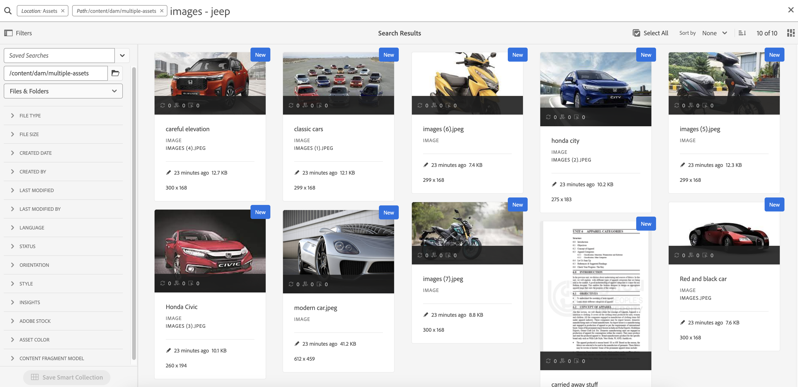
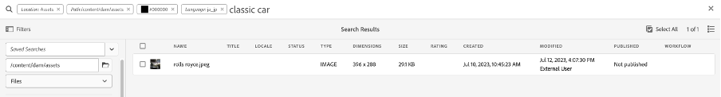
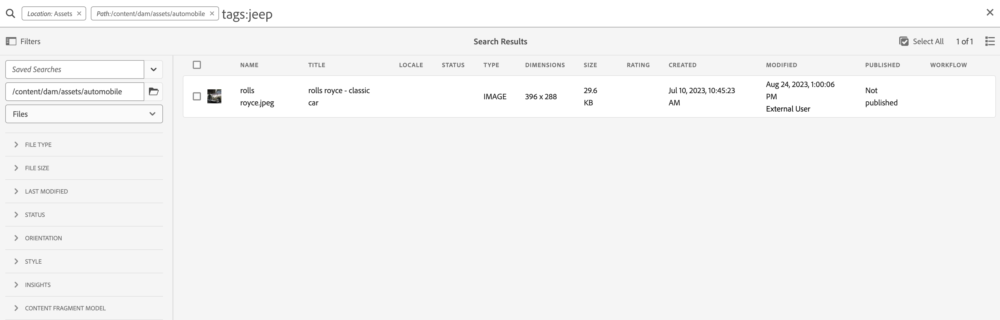

# AEM Assets搜尋最佳實務

[!DNL Adobe Experience Manager Assets] 提供強大的資產搜尋方法，協助您實現更高的內容速度。 有時候，尋找正確的資產可能會很困難且耗時。 因此，搜尋中的資產功能 [!DNL Adobe Experience Manager Assets] 是使用數位資產管理系統的關鍵所在 — 無論是供創意人員進一步使用、供業務使用者和行銷人員健全管理資產，還是DAM管理員管理。

本說明檔案包含AEM搜尋最佳實務，並提供各種案例的協助，以協助AEM使用者執行基本到進階層級的搜尋。

## 存取Experience Manager搜尋 {#access-experience-manager-search}

以下是開始搜尋前在Experience Manager中執行的基本步驟：

* 在 **管理員檢視**，前往「資產>Experience Manager中的檔案」並按一下頂端列中的搜尋圖示。 或者，使用正斜線(/)開啟「全搜尋」欄位。
在 **資產檢視**，搜尋列會顯示在頂端，且可直接存取。
* `Location:Assets` 和 `Path:/content/dam` 已預先選取，以將搜尋範圍限制在您的Experience Manager Assets存放庫。 如果您導覽至任何其他資料夾， `Path:/content/dam/<folder name>` 會顯示在「全域搜尋」欄位中，以將搜尋範圍限制在目前的資料夾。

## 基本搜尋 {#basic-search}

**案例1：使用執行基本搜尋 `classic car` 作為搜尋關鍵字。**

關鍵字搜尋不區分大小寫，且是在資產中包含的中繼資料欄位中進行全文搜尋 *全文檢索搜尋* 索引（可在索引定義中設定）。 如果使用多個關鍵字， **AND是關鍵字之間的預設運運算元，因此會將「classic car」的搜尋視為「classic AND car」**.

符合中繼資料欄位中所有搜尋字詞的搜尋結果會先顯示，接著顯示符合智慧標籤中任何搜尋字詞的搜尋結果。 搜尋結果的大約顯示順序為：

1. 符合的 `Classic Car` 於各種中繼資料欄位中。
2. 符合的 `Classic Car` 在智慧標籤中。
3. 符合的 `Classic` 或 `Car` 在智慧標籤中。

指定 `classic car` 作為搜尋關鍵字，然後按一下「搜尋」。 輸入關鍵字時，您可以在下拉式清單中檢視搜尋建議。 搜尋建議是根據Experience Manager部署上的搜尋索引內容而定。 如果您無法在下拉式功能表中檢視適當的資產，請按下Enter鍵以檢視結果清單。 結果會依相關性排序，從最接近的相符專案開始。

<!---->

您可以用雙引號(「 」)新增搜尋關鍵字，讓搜尋更具體。 此搜尋僅包含同時包含指定字詞的資產。 搜尋條件看起來像 —  `"classic car"`. 因此，搜尋結果會同時包含這兩個詞語 `classic` 和 `car` 「 」會顯示。

<!---->

如果您使用的是 **[!UICONTROL 資產檢視]** 以及。

>[!VIDEO](https://video.tv.adobe.com/v/3425489)

## 檔案和資料夾 {#files-folders}

**案例2：使用搜尋所有檔案 `classic car` 中的關鍵字 `automobile` 資料夾。**

檔案和資料夾篩選器可協助您縮小搜尋範圍。 根據您的需求，使用下拉式清單中可用的檔案、資料夾或檔案和資料夾選項。 您可在以下位置存取檔案、資料夾或檔案與資料夾之間的選擇選項： **[!UICONTROL 管理員檢視]** 僅限。 在 **[!UICONTROL 資產檢視]**，前往 [!UICONTROL 路徑] 並瀏覽您要執行搜尋的資料夾。

* 使用 **[!UICONTROL 檔案]** 選項。 您不需要在定義的路徑內搜尋資料夾。
* 使用 **[!UICONTROL 資料夾]** 選項。
* 使用 **[!UICONTROL 檔案和資料夾]** 選項，以搜尋存放庫中指定路徑的所有可用資產。

若要實現此案例，請執行以下步驟：

1. 指定 `classic car` 作為搜尋關鍵字，然後按一下「搜尋」。
2. 按一下「篩選」並定義資料夾路徑 `automobile` 資料夾。 例如， `/content/dam/multiple-assets/automobile`
如果要在特定資料夾中搜尋，請從路徑中選取資料夾，並導覽至所需的資料夾。
3. 從下拉式清單中選取「檔案」，以顯示包含關鍵字的所有檔案 `classic car`.

<!---->

>[!VIDEO](https://video.tv.adobe.com/v/3425487)

## 運算子 {#operators}

**案例3：搜尋 `Classic Car` 或 `Car` 關鍵字使用各種運運算元組合來縮小搜尋範圍。**

若要在中執行上述案例 **[!UICONTROL 管理員檢視]**，您可以使用各種運運算元的組合來增強您的搜尋體驗。 支援的運運算元包括：

### AND運運算元 {#and-operator}

AND運運算元是全域搜尋中兩個關鍵字之間的預設運運算元。 例如，當您輸入 `classic car` 在搜尋列中，結果為 `classic` 和 `car` 關鍵字預設會出現在搜尋結果中。

### OR運運算元 {#or-operator}

當您想要指定搜尋結果的特定專案，並想要在搜尋結果中選取某個選項時，可以使用OR運運算元。 例如， `classic OR car` 關鍵字提供搜尋結果的中繼資料中包含任一關鍵字。

### NOT運運算元 {#not-operator}

當您要擷取排除某些關鍵字的結果時，可以使用NOT運運算元。 NOT運運算元使用連字型大小(-)符號來指示AEM搜尋要從搜尋結果中排除的專案。 例如， `car - classic` 搜尋查詢，指定包含的中繼資料 `car` 但排除 `classic`.

同樣地，您可以搜尋所有汽車，但不能搜尋吉普。 查詢如下所示： `car - jeep`. 它會顯示所有包含中繼資料的資產 `car` 但排除具有中繼資料的資產 `jeep`.

**[!UICONTROL 資產檢視]** 不支援使用運運算元。

## 萬用字元 {#wildcards}

萬用字元可用來取代搜尋中的一或多個字元。 若要在中執行上述案例 **[!UICONTROL 管理員檢視]**，您可以使用各種萬用字元的組合來增強您的搜尋體驗。 有兩個萬用字元可用來執行搜尋 — 問號(？) 和星號(*)。 問號符號是用來搜尋單一字元，而星號符號則是用來搜尋多個字元。

### 問號(？) {#question-mark}

問號符號可作為條件運運算元使用，以簡化在Experience Manager中的搜尋。

* `car?` 查詢會比對出車後有一個字元的文字。 例如，購物車。
* `?car` 查詢會比對car前有一個字元的文字。 例如，scar。
* `car????` 查詢會在car後面比對四個字元的文字。 例如，洗車服務。

### 星號(*) {#asterisk}

星號是一種萬用字元運運算元，可用來輸入較少的字元來擴大搜尋範圍。 如果您知道要搜尋之資產的開始字元，但不知道其餘字元，則可以在搜尋中使用星號運運算元。 例如， `*car` 查詢會傳回其中繼資料中所有具有後置字元卡的資產。 結果可能是經典汽車、跑車、經典和跑車等。 以下是幾個以各種方式使用星號運運算元的範例：

* `*car*` 傳回所有可能的組合。
* `car*` 傳回含洗車、承運商、運費等的資產。
* `*car` 以現代汽車、跑車等傳回資產。

>[!VIDEO](https://video.tv.adobe.com/v/3425488)

**[!UICONTROL 資產檢視]** 不支援使用萬用字元。

## 篩選條件 {#filters}

Adobe Experience Manager提供各種搜尋篩選器，您可以使用這些篩選器來縮小搜尋範圍，並使用範圍查詢來劃分搜尋區段。 當您不確定資產的標題或中繼說明時，可使用各種搜尋篩選器來提高您的搜尋相關性。 您可以使用包含或不包含輸入關鍵字的搜尋篩選器。 若要開啟中的篩選器面板 **[!UICONTROL 管理員檢視]**，按一下 **GlobalNav** 圖示並選取 **[!UICONTROL 篩選器]**. 反之，若要開啟中的篩選器面板 **[!UICONTROL 資產檢視]**，按一下 [!UICONTROL 篩選器] 位於搜尋列旁。

您可以選取單一或多個篩選器，以精簡Adobe Experience Manager中的搜尋。
<!--The following filters are available out of the box for all the users of Experience Manager:

* File Type Search Filters  
* File Size Search Filters 
* Date of Creation 
* Created by 
* Last Modified date 
* Last Modified by 
* Search by Language 
* Search by Status 
* Search based on Orientation 
* Search by Style 
* Search based on insights 
* Search by Adobe Stock 
* Color specific Asset search 
* Content fragment model 
 -->

<!--**Scenario 5: Search for an Asset named 'classic car' in Black color which has either meta description or a similar asset in Japanese language.**  
 
To perform a search on such a requirement, type 'classic car' in the search bar.  Navigate to the filters panel and expand the language search filter drop-down. Type "ja-jp", which represents the Japanese language. Expand the 'Asset Color' filter and select black color or add the hexadecimal code for the black color (#000000).

-->

**案例4：使用搜尋未發佈的PDF檔案型別檔案 `classic car` 中的關鍵字。**

在中執行以下步驟 **[!UICONTROL 管理員檢視]**：

1. 型別 `classic car` 於搜尋列中。
1. 前往「篩選器」。 在 [!UICONTROL 檔案型別]，展開 [!UICONTROL 檔案]，進一步展開 [!UICONTROL 文書處理].
1. 選取 [!UICONTROL PDF].
1. 前往 [!UICONTROL 狀態] > [!UICONTROL 發佈] > [!UICONTROL 已取消發佈].

<!---->

在中執行以下步驟 **[!UICONTROL 資產檢視]**：

1. 型別 `classic car` 於搜尋列中。
1. 前往「篩選器」。 在 [!UICONTROL MIME型別]，選取 [!UICONTROL PDF].
1. 前往 [!UICONTROL 資產狀態]，選取 [!UICONTROL 全部] 以包含所有已發佈和未發佈的資產。

**案例5：搜尋除PNG以外的所有影像**

當您不確定資產的標題或中繼說明時，可使用各種搜尋篩選器來提高您的搜尋相關性。 例如，若要搜尋中的資產 **[!UICONTROL 管理員檢視]**，請遵循下列步驟：

1. 前往搜尋篩選器。
1. 前往「篩選器」。 在 [!UICONTROL 檔案型別]，展開 [!UICONTROL 影像] 並選取 [!UICONTROL 已啟用Web]
1. 取消選取「PNG」。

<!---->

若要使用中提及的案例搜尋資產 **[!UICONTROL 資產檢視]**，請遵循下列步驟：

1. 前往搜尋篩選器。
1. 前往「篩選器」。 在 [!UICONTROL MIME型別]，選取所有指定MIME型別，但取消選取PNG。

>[!VIDEO](https://video.tv.adobe.com/v/3425486)

## 進階搜尋 {#advanced-search}

AEM搜尋可讓您以更省力的方式製作複雜的搜尋查詢。 以下提供各種範例，協助您建立複雜的搜尋查詢：

**案例6：搜尋Experience Manager存放庫中的所有檔案，其中 `classic car` 在其中繼資料中。 檔案的內容必須包含 `classic car` 中的關鍵字。**

Adobe Experience Manager可讓您將多個條件新增至搜尋。 您可以使用關鍵字、運運算元和篩選的組合來縮小搜尋結果的範圍。

若要搜尋案例6：

1. 輸入 `classic car` 搜尋列中的關鍵字。
2. 瀏覽至篩選器面板，然後選取「檔案型別」下的「檔案」。
3. 使用星號萬用字元縮小搜尋範圍。 型別 `"classic car"` 以搜尋包含 `classic car` 關鍵字。

<!---->

案例6無法在中執行 **[!UICONTROL 資產檢視]** 因為它不支援使用萬用字元。

**案例7：搜尋Experience Manager存放庫中的所有檔案，其中檔案的內容必須包括 `car` 但排除 `classic`. 相同的條件適用於資產的中繼資料。**

若要搜尋案例7：

輸入 `car - classic` 搜尋列中的關鍵字。 瀏覽至篩選器面板，然後選取「檔案型別」下的「檔案」。 搜尋的優先順序是根據下列專案：優先順序1：中繼資料優先順序2：智慧標籤

<!---->

案例7無法在中執行 **[!UICONTROL 資產檢視]** 因為它不支援使用萬用字元。

<!--
**Scenario 9: Search for all images except PNG**

When you are unsure about the title or meta description of an asset, you can use various search filters to make your search more relevant. Follow the steps below:

1. Go to search filters. 
1. Under [!UICONTROL File Type], expand [!UICONTROL Images] and select [!UICONTROL Web enabled]
1. Deselect PNG.

**Method 1:** Go to search bar and type `images - PNG`. All the images appear excluding PNG.

**Method 2:** Go to search filters. Under [!UICONTROL File Type], expand [!UICONTROL Images] > select [!UICONTROL Web enabled] > deselect PNG.

-->

**案例8：使用中繼資料jeep搜尋中繼資料標籤**

您可以使用各種搜尋篩選條件來擷取特定條件。 標籤是指派給資產的關鍵字，可讓它於大量資產中識別。 例如，在此案例中，搜尋具有以下特性的資產： *吉普* 標籤中。 若要這麼做，請輸入 `tags:jeep` 於搜尋列中。 搜尋結果中只會列出符合此條件的資產。

<!---->

如果您使用的是 **[!UICONTROL 資產檢視]** 以及。

>[!VIDEO](https://video.tv.adobe.com/v/3425490)

**案例9：尋找類似的紅色轎車相符專案**

在AEM上執行搜尋時，您可以顯示與所選資產類似的資產，以篩選結果。 您可以使用 **尋找類似專案** 將搜尋範圍縮小至所搜尋資產完全相符或類似相符的選項。 這有助於尋找與所選資產具有類似智慧標籤的資產。 例如，當您想要搜尋類似的資產時，請執行以下步驟：

1. 依您的需求搜尋資產。
1. 將游標停留在資產上>按一下省略符號>選取 [!UICONTROL 尋找類似專案].
或選取資產>導覽至右上方的省略符號>選取 [!UICONTROL 尋找類似專案].

   

1. 請注意搜尋列。 選取資產的縮圖會出現在搜尋列上，指出您的搜尋需求。 因此，它會傳回具有類似智慧標籤的資產。

在中執行以下步驟 **[!UICONTROL 資產檢視]**：

1. 依您的需求搜尋資產。
1. 選取影像>導覽至 [!UICONTROL 尋找類似影像] 選項於頂端。
它會帶您前往具有類似顏色和中繼資料的資產集合。

## 自訂搜尋多面向 {#custom-search-facets}

Adobe Experience Manager中的搜尋Facet可讓您以多種方式搜尋資產，而非使用單一、預先決定或分類順序。 您可以自訂搜尋Facet並根據需求新增述詞。 讀取 [搜尋Facet](https://experienceleague.adobe.com/docs/experience-manager-cloud-service/content/assets/admin/search-facets.html?lang=en#) 以取得新增自訂述詞的逐步指南。

<!--**Scenario 10: Search assets based on Sku ID**
to be added later
-->

**案例10：根據特定資產的上次修改或到期日搜尋這些資產**

日期限制可讓您將自訂搜尋縮小至特定時段，例如，使用時段搜尋篩選器。 若要搜尋上述需求，請輸入 `classic car` 於搜尋列中。 在「 」中選擇日期範圍 [!UICONTROL 建立日期] 和 [!UICONTROL 上次修改時間] 日期篩選器。

如果您使用的是 [!UICONTROL 資產檢視] 以及。

## 提升關鍵字的相關性 {#boosting-keywords}

您可以改善特定資產的關鍵字關聯性，以協助根據關鍵字提升搜尋次數。 換言之，當您根據這些關鍵字進行搜尋時，您為其升級特定關鍵字的影像會出現在搜尋結果的最上方。

1. 從「資產」使用者介面，開啟資產的屬性頁面。按一下 [!UICONTROL 進階] 並按一下 [!UICONTROL 新增] 在 [!UICONTROL 針對搜尋關鍵字提升].
2. 在「搜尋提升」方塊中，指定您要提升影像搜尋的關鍵字，然後按一下 [!UICONTROL 新增]. 您可以用相同方式指定多個關鍵字。
3. 按一下 [!UICONTROL 儲存並關閉]. 您針對此關鍵字提升的資產會出現在最上層的搜尋結果中。

## 在Experience Manager中執行搜尋時的重大事項 {#notable-things}

* 提供資產的中繼資料資訊，以準備可透過全域搜尋演演算法搜尋的資產。 請確定資產的中繼資料資訊已更新。
* 使用雙引號(「 」)精確搜尋並切入點。
* 交叉檢查您要檢視的路徑。 在資料夾、檔案或檔案與資料夾之間選取適當的選項，以在適當的位置執行搜尋查詢。
* 您可以在全搜尋列上檢查套用至搜尋的篩選器。
* 如果您沒有收到任何結果，請交叉檢查您要檢視的路徑。 另外，檢查您執行搜尋的資料夾。 例如，如果您在「Automobile資料夾」內執行搜尋，但您使用的關鍵字與「Apparels」相關，則搜尋結果不合適。
* 如果您已在搜尋的關鍵字前新增空白字元，請勾選。
* 使用混合及相符的關鍵字、運運算元和篩選器，可以簡化和提升您的搜尋體驗。

<!--
* Use stemming search approach while searching for the asset. It means using an exact keyword that you are looking for.
* Specify Smart tags to the asset properties to boost the ranking of the search results.
The newly added assets are not indexed.
-->

## 之間的差異 [!UICONTROL 管理員檢視] 和 [!UICONTROL 資產檢視] 搜尋 {#differences-asset-and-admin-view}

<table>
    <tr>
        <th> 參數 </th>
        <th> 管理員檢視 </th>
        <th> 資產檢視 </th>
    </tr>
    <tr>
        <td> 自訂Facet </td>
        <td> 您可以新增 <a href="https://experienceleague.adobe.com/docs/experience-manager-cloud-service/content/assets/admin/search-facets.html?lang=en">根據需求自訂搜尋Facet。</td>
        <td> 「資產」檢視部分支援自訂Facet。 支援的Facet包括：
            <ul>
            <li> 預測標籤
            <li> 名稱
            <li> 預測的標籤信賴度
            <li> 資產大小
            <li> 標題
            </ul>
        </td>
    </tr>
    <tr>
        <td> 運算子 </td>
        <td> 支援AND、OR和NOT </td>
        <td> 不支援 </td>
    </tr>
    <tr>
        <td> 萬用字元 </td>
        <td> 支援問號(？) 和星號(*)。</td>
        <td> 不支援 </td>
    </tr>
    <tr>
        <td> 提升搜尋結果 </td>
        <td> 支援 </td>
        <td> 不支援 </td>
    </tr>
     <tr>
        <td> 一次清除所有篩選器 </td>
        <td> 不支援 </td>
        <td> 支援</td>
    </tr>
     <tr>
        <td> 檔案/資料夾/檔案與資料夾 </td>
        <td> 支援 </td>
        <td> 「檔案型別」底下有選取資料夾的選項 </td>
    </tr>
     <tr>
        <td> 資產狀態 </td>
        <td> 
            支援的選項包括：
            <ul>
            <li> 發佈
            <li> 發佈日期
            <li> 上次發佈者
            <li> 核准 
            <li> 結帳
            <li> 到期日
            <li> Dynamic Media
            </ul>
        </td>
        <td>
        支援的選項包括：
            <ul>
            <li> 全部
            <li> 已核准
            <li> 已拒絕
            <li> 無狀態
            </ul> 
        </td>
    </tr>
     <tr>
        <td> 檔案型別 </td>
        <td>
        支援的選項包括：
            <ul>
            <li> 影像
            <li> 文件
            <li> 多媒體
            <li> 封存 
            </ul>
            它們有更進一步的階層選項。
        </td>
        <td>
        支援的選項包括：
            <ul>
            <li> 影像
            <li> 文件
            <li> 影片
            <li> 資料夾 
            </ul> 
        MIME型別下列出更多選項。
        </td>
    </tr>
     <tr>
        <td> 檔案大小 </td>
        <td>
        支援的選項包括：
            <ul>
            <li> 從 — 到
            <li> 大小（位元組、KB、MB、GB）
            </ul> 
        </td>
        <td> 不支援 </td>
    </tr>
     <tr>
        <td> 其他篩選器 </td>
        <td>
            <ul>
            <li> 語言
            <li> 狀態
            <li> 方向
            <li> 樣式 
            <li> Insights
            <li> Stock
            <li> 資產顏色
            <li> 內容片段模型
            </ul> 
        </td>
        <td> 不支援 </td>
    </tr>
</table>

>[!MORELIKETHIS]
>
>* [搜尋資產](https://experienceleague.adobe.com/docs/experience-manager-cloud-service/content/assets/manage/search-assets.html?lang=en)
>* [搜尋 Facet](https://experienceleague.adobe.com/docs/experience-manager-cloud-service/content/assets/admin/search-facets.html?lang=en)
