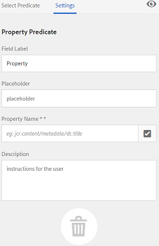
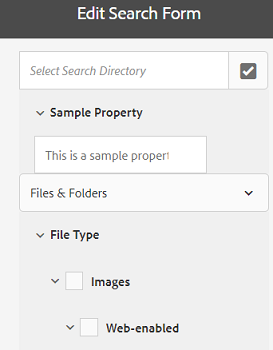

# 搜尋 Facet {#search-facets}

企業範圍的Adobe Experience Manager資產部署能夠儲存許多資產。 有時，如果僅使用Experience Manager的通用搜索功能，則查找正確的資產可能既困難又耗時。

使用「過濾器」面板中的搜索小平面，可為您的搜索體驗添加更精細的內容，並使搜索功能更高效、更通用。 搜索小平面添加了多個尺寸（謂語），使您能夠執行更複雜的搜索。 「濾鏡」面板包括幾個標準小平面。 也可以添加自定義搜索小平面。

總之，搜索方面允許您以多種方式而不是按單個預先確定的分類順序來搜索資產。 您可以輕鬆細化到所需的詳細級別，以便進行更集中的搜索。

例如，如果要查找影像，則可以選擇是要點陣圖還是向量影像。 通過指定影像的MIME類型，可以進一步縮小搜索範圍。 同樣，在搜索文檔時，可以指定格式，例如PDF或MS Word。

## 添加謂詞 {#adding-a-predicate}

The search facets that appear in the Filters panel are defined in the underlying search form using predicates. 要顯示更多或不同的小平面，可將謂語添加到預設窗體，或使用包含所選小平面的自定義窗體。

For full-text searches, add the `Fulltext` predicate to the form. 使用「屬性」謂詞搜索與指定的單個屬性匹配的資產。 使用「選項」謂詞搜索與特定屬性的一個或多個值匹配的資產。 添加「日期範圍」謂詞以搜索在指定日期範圍內建立的資產。

1. 按一下Experience Manager徽標，然後轉到 **[!UICONTROL 工具]** > **[!UICONTROL 常規]** > **[!UICONTROL 搜索Forms]**。
1. From the Search Forms page, select **[!UICONTROL Assets Admin Search Rail]**, then tap  **Edit** .

   

1. 在「編輯搜索Forms」頁中，從 **[!UICONTROL 選擇謂詞]** 的子菜單。 For example, drag **[!UICONTROL Property Predicate]**.

   

   *圖：選擇並移動謂詞以自定義搜索篩選器。*

1. 在「設定」頁籤中，輸入謂詞的欄位標籤、佔位符文本和說明。 指定要與謂詞關聯的元資料屬性的有效名稱。 「設定」頁籤中的標題標籤標識所選謂詞的類型。

   

   *圖：使用「設定」頁籤提供謂語的必需選項。*

1. 在「屬 **[!UICONTROL 性名稱]** 」欄位中，指定您要與謂語關聯的中繼資料屬性的有效名稱。它是根據其執行搜索的名稱。例如，輸入 `jcr:content/metadata/dc:description` 或 `./jcr:content/metadata/dc:description`。也可以從「選擇」對話框中選擇現有節點。

   

   *圖：將元資料屬性與屬性名稱欄位中的謂詞關聯。*

1. 按一下 **[!UICONTROL 預覽]**  生成「篩選器」面板的預覽，如添加謂詞後顯示的那樣。
1. 在「預覽」模式下查看謂詞的佈局。

   

   在提交更改之前預覽搜索表單

1. 要關閉預覽，請按一下 **[!UICONTROL 關閉]**  的上界。
1. 點擊 **[!UICONTROL 完成]** 按鈕。
1. 導航到「資產」用戶介面中的「搜索」面板。 屬性謂語將添加到面板。
1. 在文本框中輸入要搜索的資產的說明。 例如，輸入&quot;Adobe&quot;。 執行搜索時，搜索結果中會列出描述與「Adobe」匹配的資產。

## 添加選項謂詞 {#adding-an-options-predicate}

「選項」謂語允許您在「篩選器」面板中添加多個搜索選項。 可以在「篩選器」面板中選擇一個或多個這些選項以搜索資產。 例如，要根據檔案類型搜索資產，請在搜索表單中配置選項，如「影像」、「多媒體」、「文檔」和「存檔」。 配置這些選項後，在「過濾器」面板中選擇「影像」選項時，將對GIF、JPEG、PNG等類型的資產執行搜索。

要將選項映射到相應的屬性，請為選項建立節點結構，並在「選項」謂詞的「屬性名稱」屬性中提供父節點的路徑。 父節點應為類型 `sling`: `OrderedFolder`。 選項應為類型 `nt:unstructured`。 選項節點應具有 `jcr:title` 和 `value` 已配置。

的 `jcr:title` 屬性是「篩選器」面板上顯示的選項的用戶友好名稱。 的 `value` 欄位用於查詢以匹配指定的屬性。

選擇選項時，根據 `value` 選項節點及其子節點的屬性（如果有）。 遍歷選項節點下的整個樹， `value` 使用OR操作組合每個子節點的屬性以形成搜索查詢。

例如，如果您為檔案類型選取「影像」，則會使用OR運算結合屬性來建立資 `value` 產的搜尋查詢。例如，通過組合影像/jpeg *、* image/gif *、* png影像、影像 */jpeg影像、以及使用OR操作對Tiff屬性進行搜索的Joff影像*****`jcr:content/metadata/dc:format` /Tiff影像的匹配結果來構建影像搜索查詢。

CRXDE中所示的檔案類型的值屬性用於搜索查詢以工作

您不必在CRX儲存庫中手動建立選項的節點結構，而是可以透過指定對應的索引鍵值配對，在JSON檔案中定義選項。在「屬性名稱」欄位中指定JSON檔 **[!UICONTROL 案的路徑]** 。例如，您可以定義鍵值配對、 `image/bmp`、 `image/gif``image/jpeg`、和 `image/png` 並指定其值，如下列範例JSON檔案中所示。在「屬 **[!UICONTROL 性名稱]** 」欄位中，您可以指定此檔案的CRX路徑。

```json
{
    "options" :
 [
          {"value" : "image/bmp","text" : "BMP"},
          {"value" : "image/gif","text" : "GIF"},
          {"value" : "image/jpeg","text" : "JPEG"},
          {"value" : "image/png","text" : "PNG"}
 ]
}
```

如果要使用現有節點，請使用「選擇」對話框指定它。

>[!NOTE]
>
>「選項」謂語是一個自定義包裝，包含用於演示所述行為的屬性謂語。 目前，沒有可用於本機支援該功能的REST終結點。

1. 點擊Experience Manager徽標，然後轉到 **[!UICONTROL 工具>常規>搜索Forms]**。
1. 從「搜 **[!UICONTROL 尋表單」頁面]** ，選取「資 ****&#x200B;產管理搜尋邊欄」，然後點選「編輯」圖示。
1. 在「編 **[!UICONTROL 輯搜索表單]** 」頁中，將「選 **[!UICONTROL 項謂詞」從]** 「選擇謂詞 **** 」頁籤拖到主窗格。
1. 在「設 **[!UICONTROL 定]** 」標籤中，輸入屬性的標籤和名稱。例如，若要根據資產的格式來搜尋資產，請為標籤指定好記的名稱，例如「檔案類 **[!UICONTROL 型」]**。指定在屬性欄位中根據其執行搜索的屬性，例如 `jcr:content/metadata/dc:format.`
1. 執行下列任一項作業：

   * 在 **[!UICONTROL 屬性名稱]** 欄位中，提及JSON檔案的路徑，在該路徑中為選項定義節點並指定相應的鍵值對。
   * 點擊  在「選項」欄位旁邊，指定要在「篩選器」面板中提供的選項的顯示文本和值。 要添加其他選項，請點擊/按一下  然後重複步驟。

1. 確保清 **[!UICONTROL 除「單選]** 」，讓使用者一次為檔案類型選取多個選項 (例如影像、檔案、多媒體和封存)。如果您選 **[!UICONTROL 取「單選]**」，使用者一次只能為檔案類型選取一個選項。

   

   「選項」謂詞中的可用欄位

1. 在 **說明** ，輸入可選說明，然後按一下 **[!UICONTROL 完成]**。
1. 導航到「搜索」面板。 「選項」謂詞將添加到 **搜索** 的子菜單。 選項 **[!UICONTROL 檔案類型]** 複選框。

## 添加多值屬性謂語 {#adding-a-multi-value-property-predicate}

The `Multi Value Property` predicate lets you search assets for multiple values. 請考慮您在中有多個產品的映像的情形 [!DNL Assets] 每個映像的元資料包括與產品關聯的SKU號。 You can use this predicate to search for product images based on multiple SKU numbers.

1. 按一下Experience Manager徽標，然後轉到 **[!UICONTROL 工具]** > **[!UICONTROL 常規]** > **[!UICONTROL 搜索Forms]**。
1. On the Search Forms page, select **[!UICONTROL Assets Admin Search Rail]**, the tap **Edit** .
1. 在「編輯搜索表單」頁中，將「 **[!UICONTROL Multi Value Property Predicate]** 」從「 **[!UICONTROL Select Predicate]** 」頁籤拖動到主窗格。
1. 在 **[!UICONTROL 設定]** 頁籤，輸入謂詞的標籤和佔位符文本。 指定屬性名稱，例如，在屬性欄位中根據該名稱執行搜索 `jcr:content/metadata/dc:value`。 也可以使用選擇對話框來選擇節點。
1. 請確定已 **[!UICONTROL 選取「分隔字元]** 」支援。在「輸入 **[!UICONTROL 分隔字元]** 」欄位中，指定分隔字元以分隔個別值。依預設，逗號會指定為分隔字元。您可以指定不同的分隔字元。
1. 在 **說明** 欄位，輸入可選說明，然後點擊 **[!UICONTROL 完成]**。
1. 導覽至「資產」使用者介面中的「篩選」面板。The **[!UICONTROL Multi Value Property]** predicate is added to the panel.
1. 在「多值」欄位中指定多個值，由分隔符分隔並執行搜索。 謂詞將獲取與您指定的值完全匹配的文本。

## 添加標籤謂詞 {#adding-a-tags-predicate}

的 `Tags` 謂詞允許您對資產執行基於標籤的搜索。 預設情況下， [!DNL Assets] 根據您指定的標籤搜索資產以查找一個或多個標籤匹配項。 換句話說，搜索查詢使用指定的標籤執行OR操作。 但是，您可以使用「匹配所有標籤」選項來搜索包含您指定的所有標籤的資產。

1. 按一下Experience Manager徽標，然後轉到 **[!UICONTROL 工具]** > **[!UICONTROL 常規]** > **[!UICONTROL 搜索Forms]**。
1. 從「搜索Forms」頁中，選擇 **[!UICONTROL 資產管理搜索欄]** 然後點擊 **編輯** 。
1. 在「編輯搜索表單」頁中，拖動 **[!UICONTROL 標籤謂詞]** 的子菜單。
1. 在「設定」頁籤中，輸入謂詞的佔位符文本。 指定屬性名稱，例如，在屬性欄位中根據該名稱執行搜索 `jcr:content/metadata/cq:tags`。 或者，可以從「選擇」(selection)對話框中選取CRXDE中的節點。
1. 配置此謂語的根標籤路徑屬性以填充「標籤」清單中的各種標籤。
1. 選取 **[!UICONTROL 「顯示符合所有標籤」選項]** ，以搜尋包含您所指定之所有標籤的資產。

   

1. 在 **[!UICONTROL 說明]** 欄位，輸入可選說明，然後按一下/點擊 **[!UICONTROL 完成]**。
1. 導航到「搜索」面板。 的 **[!UICONTROL 標籤]** 謂詞將添加到「搜索」面板。
1. 指定要根據其搜索資產或從建議清單中選擇的標籤。
1. 選擇 **[!UICONTROL 全部匹配]** 搜索包含您指定的所有標籤的匹配項。

您可以根據 **[!UICONTROL 名稱]** （按字母順序排列）, **[!UICONTROL 已建立]** 日期或 **[!UICONTROL 已修改]** 日期。 在下圖中，標籤結構根據 **[!UICONTROL 名稱]**。


## 添加其他謂語 {#adding-other-predicates}

與添加屬性謂詞或選項謂詞的方式類似，您可以將以下附加謂詞添加到「搜索」面板：

<table>
 <tbody>
  <tr>
   <td><p><strong>謂詞名稱</strong></p> </td>
   <td><p><strong>說明</strong></p> </td>
   <td><p><strong>屬性</strong></p> </td>
  </tr>
  <tr>
   <td><p>全文</p> </td>
   <td>搜索謂詞以對整個資產節點執行全文搜索。 它與 <code>jcr</code>:<code>contains</code> 運算子。 如果要對資產節點的特定部分執行全文搜索，可以指定相對路徑。</td>
   <td>
    <ul>
     <li>標籤</li>
     <li>預留位置</li>
     <li>屬性名稱</li>
     <li>說明</li>
    </ul> </td>
  </tr>
  <tr>
   <td>路徑瀏覽器</td>
   <td>搜索謂詞以在預配置的根路徑上搜索資料夾和子資料夾中的資產</td>
   <td>
    <ul>
     <li>預留位置</li>
     <li>根路徑</li>
     <li>說明</li>
    </ul> </td>
  </tr>
  <tr>
   <td><p>路徑</p> </td>
   <td><p>使用它篩選位置結果。 可以指定不同的路徑作為選項。</p> </td>
   <td>
    <ul>
     <li>標籤</li>
     <li>路徑</li>
     <li>說明</li>
    </ul> </td>
  </tr>
  <tr>
   <td><p>發佈狀態</p> </td>
   <td><p>搜索謂詞以根據資產的發佈狀態搜索資產</p> </td>
   <td>
    <ul>
     <li>標籤</li>
     <li>屬性名稱</li>
     <li>說明</li>
    </ul> </td>
  </tr>
  <tr>
   <td><p>相對日期</p> </td>
   <td><p>Search predicate to search assets based on the relative date of their creation. 例如，可以配置選項，如2個月前、3週前等。 </p> </td>
   <td>
    <ul>
     <li>標籤</li>
     <li>屬性名稱</li>
     <li>Relative date</li>
    </ul> </td>
  </tr>
  <tr>
   <td><p>範圍</p> </td>
   <td><p>搜索謂詞以搜索位於指定範圍內的資產。 在「搜索」面板中，可以指定範圍的最小值和最大值。</p> </td>
   <td>
    <ul>
     <li>標籤</li>
     <li>Property name</li>
     <li>說明</li>
    </ul> </td>
  </tr>
  <tr>
   <td><p>日期範圍</p> </td>
   <td><p>搜索謂詞以搜索在指定範圍內為日期屬性建立的資產。 在「搜索」面板中，您可以使用日期選擇器指定開始和結束日期。</p> </td>
   <td>
    <ul>
     <li>標籤</li>
     <li>預留位置</li>
     <li>屬性名稱</li>
     <li>範圍文本（自）</li>
     <li>Range text (To)</li>
     <li>說明</li>
    </ul> </td>
  </tr>
  <tr>
   <td><p>日期</p> </td>
   <td><p>基於日期屬性搜索基於滑塊的資產的搜索謂語。</p> </td>
   <td>
    <ul>
     <li>標籤</li>
     <li>屬性名稱</li>
     <li>說明</li>
    </ul> </td>
  </tr>
  <tr>
   <td><p>File Size</p> </td>
   <td><p>搜索謂詞以根據資產大小搜索資產。 它是基於滑塊的謂詞，在其中可以從可配置節點中選擇滑塊選項。 The default options are defined at /libs/dam/options/predicates/filesize in the CRX repository. 檔案大小以位元組為單位提供。</p> </td>
   <td>
    <ul>
     <li>標籤</li>
     <li>屬性名稱</li>
     <li>路徑</li>
     <li>說明</li>
    </ul> </td>
  </tr>
  <tr>
   <td>上次修改的資產</td>
   <td>搜索謂詞以搜索最近修改的資產 </td>
   <td>
    <ul>
     <li>屬性名稱</li>
     <li>屬性值</li>
     <li>說明</li>
    </ul> </td>
  </tr>
  <tr>
   <td>發佈狀態</td>
   <td>搜索謂詞以根據資產的發佈狀態搜索資產 </td>
   <td>
    <ul>
     <li>標籤</li>
     <li>屬性名稱</li>
     <li>說明</li>
    </ul> </td>
  </tr>
  <tr>
   <td>到期狀態</td>
   <td>搜索謂詞以根據資產的到期狀態搜索資產 </td>
   <td>
    <ul>
     <li>標籤</li>
     <li>屬性名稱</li>
     <li>說明</li>
    </ul> </td>
  </tr>
  <tr>
   <td>隱藏</td>
   <td>定義隱藏欄位屬性以搜索資產的搜索謂詞</td>
   <td>
    <ul>
     <li>屬性名稱</li>
     <li>屬性值</li>
     <li>說明</li>
    </ul> </td>
  </tr>
 </tbody>
</table>

## 還原預設搜索小平面 {#restoring-default-search-facets}

預設情況下，「鎖定」表徵圖出現在 **[!UICONTROL 資產管理搜索欄]** 的 **[!UICONTROL 搜索Forms]** 的子菜單。 如果向表單中添加搜索小平面，則「鎖定」(Lock)表徵圖將消失，表單中顯示預設表單已被修改。

針對「搜索Forms」頁面上的選項的鎖定表徵圖表示預設設定未更改且未自定義。

要恢復預設搜索方面，請執行以下步驟：

1. 選擇 **[!UICONTROL 資產管理搜索欄]** 的 **[!UICONTROL 搜索Forms]** 的子菜單。
1. 點擊 **[!UICONTROL 刪除]**  的子菜單。
1. 在確認對話框中，按一下 **[!UICONTROL 刪除]** 的子菜單。

   刪除搜尋Facet的自訂變更後，在「搜尋表單」頁面的「資產管 **[!UICONTROL 理搜尋邊欄]** 」前會重 **** 新顯示「鎖定」圖示。

## 用戶權限 {#user-permissions}

如果沒有為您分配管理員角色，則此處將列出您執行涉及搜索小平面的編輯、刪除和預覽操作所需的權限。

| 動作 | 權限 |
|---|---|
| 編輯 | 對 `/apps` 的子目錄。 |
| 刪除 | 讀取、寫入和刪除 `/apps` 的子目錄。 |
| 預覽 | 讀取、寫入和刪除 `/var/dam/content` 的子目錄。 此外，對 `/apps` 的下界。 |

>[!MORELIKETHIS]
>
>* [搜索數字資產](search-assets.md)。

