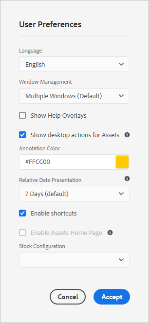

# 分享和分發在Experience Manager中管理的資產 {#share-assets-from-aem}

Adobe Experience Manager(AEM)Assets可讓您與組織成員及外部實體（包括合作夥伴和廠商）共用資產、資料夾和系列。 使用下列方法，將Experience Manager Assets中的資產共用為雲端服務：

* 以連結的形式分享。
* 下載資產並個別分享。
* 透過AEM案頭應用程式分享。
* 透過Adobe Asset Link分享。
* （即將推出的功能）使用品牌入口網站分享。

## 以連結方式共用資產 {#sharelink}

若要產生您要與使用者共用之資產的URL，請使用「連結共用」對話方塊。 具有管理員權限或在位置具有讀取權 `/var/dam/share` 限的使用者可檢視與其共用的連結。 透過連結分享資產是讓外部廠商可使用資源的便利方式，而不需要先登入AEM Assets。

>[!NOTE]
>
>* 您需要對要作為連結共用的資料夾或資產的編輯ACL權限。
>* 在您與使用者共用連結之前，請確定已設定Day CQ Mail Service。 否則，會發生錯誤。

1. 在「資產」使用者介面中，選取要以連結形式共用的資產。
1. 在工具列中，按一下／點選「共 **[!UICONTROL 用連結」]**。 資產連結會在「共用連結」欄位中 **[!UICONTROL 自動建立]** 。 複製此連結並與使用者共用。 連結的預設有效期為一天。

   >[!NOTE]
   >
   >如果共用資產移至不同位置，其連結將停止運作。 重新建立連結並與使用者重新共用。

<!--
## Share assets as a link {#sharelink}

To generate the URL for assets you want to share with users, use the Link Sharing dialog. Users with administrator privileges or with read permissions at `/var/dam/share` location are able to view the links shared with them. Sharing assets through a link is a convenient way of making resources available to external parties without them having to first log in to AEM Assets.

>[!NOTE]
>
>* You need Edit ACL permission on the folder or the asset that you want to share as a link.
>* Before you share a link with users, ensure that Day CQ Mail Service is configured. Otherwise, an error occurs.

1. In the Assets user interface, select the asset to share as a link.
1. From the toolbar, click/tap the **[!UICONTROL Share Link]**.

   An asset link is auto-created in the **[!UICONTROL Share Link]** field. Copy this link and share it with the users. The default expiration time for the link is one day.

   Alternatively, proceed to perform steps 3-7 of this procedure to add email recipients, configure the expiration time for the link, and send it from the dialog.

   >[!NOTE]
   >
   >If a shared asset is moved to a different location, its link stops working. Re-create the link and re-share with the users.

1. From the web console, open the **[!UICONTROL Day CQ Link Externalizer]** configuration and modify the following properties in the **[!UICONTROL Domains]** field with the values mentioned against each:

    * local
    * author
    * publish

   For the local and author properties, provide the URL for the local and author instance respectively. Both local and author properties have the same value if you run a single AEM author instance. For publish, provide the URL for the publish instance.

1. In the email address box of the **[!UICONTROL Link Sharing]** dialog, type the email ID of the user you want to share the link with. You can also share the link with multiple users.

   If the user is a member of your organization, select the user's email ID from the suggested email IDs that appear in the list below the typing area. For an external user, type the complete email ID and then select it from the list.

   To enable emails to be sent out to users, configure the SMTP server details in [Day CQ Mail Service](/help/assets/configure-asset-sharing.md#configmailservice).

   >[!NOTE]
   >
   >If you enter an email ID of a user that is not a member of your organization, the words "External User" are prefixed with the email ID of the user.

1. In the **[!UICONTROL Subject]** box, enter a subject for the asset you want to share.
1. In the **[!UICONTROL Message]** box, enter an optional message.
1. In the **[!UICONTROL Expiration]** field, specify an expiration date and time for the link using the date picker. By default, the expiration date is set for a week from the date you share the link.
1. To let users download the original image along with the renditions, select **[!UICONTROL Allow download of original file]**.

   >[!NOTE]
   >
   >By default, users can only download the renditions of the asset that you share as a link.

1. Click **[!UICONTROL Share]**. A message confirms that the link is shared with the users through an email.
1. To view the shared asset, click/tap the link in the email that is sent to the user. The shared asset is displayed in the **[!UICONTROL Adobe Marketing Cloud]** page.

   To toggle to the list view, click/tap the layout icon in the toolbar.

1. To generate a preview of the asset, click/tap the shared asset. To close the preview and return to the **[!UICONTROL Marketing Cloud]** page, click/tap **[!UICONTROL Back]** in the toolbar. If you have shared a folder, click/tap **[!UICONTROL Parent Folder]** to return to the parent folder.

   >[!NOTE]
   >
   >AEM supports generating the preview of assets of these MIME types: JPG, PNG, GIF, BMP, INDD, PDF, and PPT. You can only download the assets of the other MIME types.

1. To download the shared asset, click/tap **[!UICONTROL Select]** from the toolbar, click/tap the asset, and then click/tap **[!UICONTROL Download]** from the toolbar.
1. To view the assets you shared as links, go to the Assets user interface and click/tap the GlobalNav icon. Choose **[!UICONTROL Navigation]** from the list to display the Navigation pane.
1. From the Navigation pane, choose **[!UICONTROL Shared Links]** to display a list of shared assets.
1. To un-share an asset, select it and tap/click **[!UICONTROL Unshare]** from the toolbar.

A message confirms that you unshared the asset. In addition, the entry for the asset is removed from the list.
-->

## 下載及分享資產 {#download-and-share-assets}

使用者可以下載一些資產，並在Experience manager之外共用這些資產。如需詳細資訊，請 [參閱如何搜尋資產](/help/assets/search-assets.md)[、如何下載資產](/help/assets/download-assets-from-aem.md), [以及如何下載系列](manage-collections.md#download-a-collection)

## 與創意專業人員共用資產 {#share-with-creatives}

行銷人員和業務線使用者可以使用、

* **AEM案頭應用程式**:應用程式可在Windows和Mac上運作。 請參閱桌 [面應用程式概觀](https://docs.adobe.com/content/help/en/experience-manager-desktop-app/using/introduction.html)。 若要瞭解任何授權案頭使用者如何輕鬆存取共用資產，請參 [閱瀏覽、搜尋和預覽資產](https://docs.adobe.com/content/help/en/experience-manager-desktop-app/using/using.html#browse-search-preview-assets)。 案頭使用者可以建立資產，並與AEM使用者的對應人員共用資產，例如上傳新影像。 請參閱 [使用案頭應用程式上傳資產](https://docs.adobe.com/content/help/en/experience-manager-desktop-app/using/using.html#upload-and-add-new-assets-to-aem)。

* **Adobe Asset Link**:創意專業人員可直接在Adobe InDesign、Adobe Illustrator和Adobe Photoshop中搜尋及使用資產。

## 設定資產共用 {#configure-sharing}

共用資產的不同選項需要特定的設定，並具備特定的先決條件。

### 設定資產連結共用 {#asset-link-sharing}

<!-- TBD: Web Console is not there so how to configure Day CQ email service? Or is it not required now? -->

若要產生您要與使用者共用之資產的URL，請使用「連結共用」對話方塊。 具有管理員權限或在位置具有讀取權 `/var/dam/share` 限的使用者可檢視與其共用的連結。 透過連結分享資產是讓外部廠商可使用資源的便利方式，而不需要先登入AEM Assets。

>[!NOTE]
>
>如果您想要將AEM Author例項的連結共用給外部實體，請確定您只針對請求公開下列 `GET` URL。 封鎖其他URL，以確保您的AEM Author例項安全。
>* `[aem_server]:[port]/linkshare.html`
>* `[aem_server]:[port]/linksharepreview.html`
>* `[aem_server]:[port]/linkexpired.html`

<!--
## Configure Day CQ mail service {#configmailservice}

Before you can share assets as links, configure the email service.

1. Click or tap the AEM logo, and then navigate to **[!UICONTROL Tools]** &gt; **[!UICONTROL Operations]** &gt; **[!UICONTROL Web Console]**.
1. From the list of services, locate **[!UICONTROL Day CQ Mail Service]**.
1. Click the **[!UICONTROL Edit]** icon beside the service, and configure the following parameters for **Day CQ Mail Service]** with the details mentioned against their names:

    * SMTP server host name: email server host name
    * SMTP server port: email server port
    * SMTP user: email server user name
    * SMTP password: email server password

1. Click/tap **[!UICONTROL Save]**.
-->

### 配置最大資料大小 {#maxdatasize}

當您使用「連結共用」功能從共用的連結下載資產時，AEM會從儲存庫壓縮資產階層，然後以ZIP檔案傳回資產。 但是，在ZIP檔案中壓縮的資料量沒有限制的情況下，大量資料會遭受壓縮，造成JVM中記憶體錯誤。 要保護系統免受因此情況而可能發生的拒絕服務攻擊，您可以配置下載檔案的最大大小。 如果資產的未壓縮大小超過設定的值，資產下載請求便會遭拒。 預設值為100 MB。

1. 按一下/點選AEM標誌，然後前往「工 **[!UICONTROL 具]** > **[!UICONTROL 作業]** >網 **[!UICONTROL 頁主控台]**」。
1. 在Web主控台中，找 **[!UICONTROL 到Day CQ DAM Adhoc Asset Share Proxy Servlet設定]** 。
1. 在編輯模式中開啟設定，並修改「最大內容大小（未壓縮） **[!UICONTROL 」參數的值]** 。
1. 儲存變更。

<!--
Add content or link about how to configure sharing via BP, DA, AAL, etc.
-->

### 啟用案頭動作以搭配案頭應用程式使用 {#desktop-actions}

在瀏覽器的「資產」使用者介面中，您可以探索資產位置或結帳並開啟資產，以便在案頭應用程式中編輯。 這些選項稱為案頭動作，若要啟用它，請參閱「在 [AEM網頁介面中啟用案頭動作」](https://docs.adobe.com/help/en/experience-manager-desktop-app/using/using.html#desktopactions-v2)。

### 使用Adobe Asset Link的設定 {#configure-asset-link}

Adobe Asset Link可簡化創作人員與行銷人員在內容建立程式中的協作。 它將Adobe Experience Manager(AEM)資產與Creative Cloud案頭應用程式Adobe InDesign、Adobe Photoshop和Adobe Illustrator連結在一起。 Adobe Asset Link面板可讓創意人員存取並修改儲存在AEM Assets中的內容，而不需離開他們最熟悉的創意應用程式。

了 [解如何設定AEM以搭配Adobe Asset Link使用](https://helpx.adobe.com/enterprise/using/configure-aem-assets-for-asset-link.html)。

## Best practices and troubleshooting {#bestpractices}

* 名稱中包含空白字元的資產資料夾或系列可能無法共用。
* 如果使用者無法下載共用資產，請洽詢您的AEM管理員下 [載限制](#maxdatasize) 。

<!--
* If you cannot send email with links to shared assets or if the other users cannot receive your email, check with your AEM administrator if the [email service](/help/assets/configure-asset-sharing.md#configmailservice) is configured or not. 
* If you cannot share assets using link sharing functionality, ensure that you have the appropriate permissions. See [share assets](#sharelink).
-->

<!--
Add content or link about how to share using Brand Portal when it is available on Cloud Service.
-->
