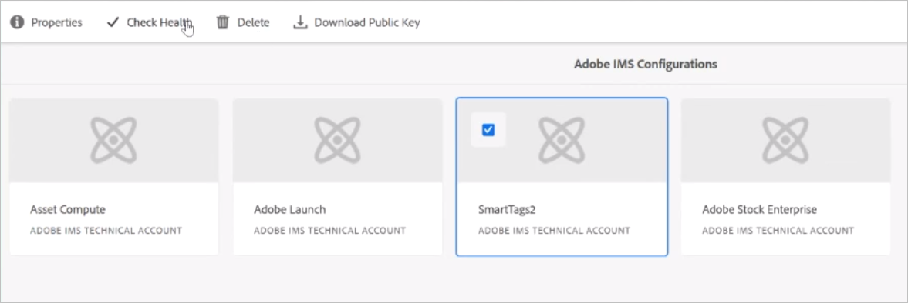

# 設定Experience Manager以智慧標籤資產 {#configure-aem-for-smart-tagging}

使用分類控制的辭彙來標籤資產，可確保透過標籤搜尋輕鬆識別和擷取資產。 Adobe提供智慧型標籤，使用人工智慧和機器學習演算法來訓練影像。 智慧型標籤使用 [Adobe Sensei的人工智慧架構](https://www.adobe.com/sensei/experience-cloud-artificial-intelligence.html) ，針對您的標籤結構和商業分類法訓練其影像識別演算法。

智慧型標籤功能可作為附加元件購買 [!DNL Experience Manager]。 在您購買後，系統會寄送電子郵件給您組織的管理員，並附上Adobe Developer Console的連結。 管理員會存取連結，以使用Adobe Developer Console將智慧型標 [!DNL Experience Manager] 簽與之整合。

<!-- TBD: 
1. Can a similar flowchart be created about how training works in CS? 
2. Is there a link to buy SCS or initiate a sales call.
3. Keystroke all steps and check all screenshots.
4. Post-GA, if time permits, create a video.
-->

## 與Adobe Developer Console整合 {#aio-integration}

在使用SCS標籤影像之前，請先使用Adobe Developer Console [!DNL Adobe Experience Manager] 與智慧標籤服務整合。 在後端，伺服器會先 [!DNL Experience Manager] 使用Adobe Developer Console閘道驗證您的服務認證，然後再將您的要求轉送至服務。

* 在中建立配 [!DNL Experience Manager] 置以生成公共密鑰。 取得OAuth整合的公用憑證。
* 在Adobe Developer Console中建立整合，並上傳產生的公開金鑰。
* 使用Adobe [!DNL Experience Manager] Developer Console的API金鑰和其他認證來設定您的例項。
* （可選）在資產上傳時啟用自動標籤。

### Adobe Developer Console整合的先決條件 {#prerequisite-for-aio-integration}

在使用智慧型標籤之前，請確定下列項目以在Adobe Developer Console上建立整合：

* 具有組織管理員權限的Adobe ID帳戶。
* 您的組織會啟用智慧標籤。

### Obtain a public certificate {#obtain-public-certificate}

公開憑證可讓您在Adobe Developer Console上驗證您的個人檔案。 您可從中建立證書 [!DNL Experience Manager]。

1. 在使用 [!DNL Experience Manager] 者介面中，存 **[!UICONTROL 取「工具]** > **[!UICONTROL 保全]** > **[!UICONTROL Adobe IMS設定」]**。

1. 在「 [!UICONTROL Adobe IMS設定」頁面上] ，按一下「 **[!UICONTROL 建立」]**。 從「 **[!UICONTROL 雲端解決方案]** 」選單中，選 **[!UICONTROL 取「智慧標籤」]**。

1. 選擇 **[!UICONTROL 建立新證書]**。 提供名稱，然後按一下「 **[!UICONTROL 建立憑證」]**。 按一下 **[!UICONTROL 確定]**。

1. 按一 **[!UICONTROL 下下載公開金鑰]**。

   

### 如果證書過期，請重新配置 {#certrenew}

當憑證過期時，它不再受信任。 若要新增憑證，請依照下列步驟進行。 您無法為過期的憑證續約。

1. Log in your [!DNL Experience Manager] deployment as an administrator. 按一 **[!UICONTROL 下「工具]** >安 **[!UICONTROL 全性]** >使 **[!UICONTROL 用者]**」。

1. 找到並按 **[!UICONTROL 一下dam-update-service使用者]** 。 按一下「密鑰 **[!UICONTROL 庫]** 」頁籤。
1. 刪除具有過 **[!UICONTROL 期證書的]** 現有相似性search密鑰庫。 Click **[!UICONTROL Save &amp; Close]**.

   

   *圖： 刪除Keystore中`similaritysearch`的現有條目，以添加新的安全證書。*

1. 在使用 [!DNL Experience Manager] 者介面中，存 **[!UICONTROL 取「工具]** > **[!UICONTROL 保全]** > **[!UICONTROL Adobe IMS設定」]**。 開啟可用的智慧標籤設定。 若要下載公用憑證，請按一下「 **[!UICONTROL 下載公用憑證」]**。

1. 存 [取https://console.adobe.io](https://console.adobe.io) ，並導覽至專案中的現有服務。 上傳新憑證並進行設定。 如需設定的詳細資訊，請參閱「建立Adobe開發人 [員主控台」整合中的指示](#create-aio-integration)。

### 建立整合 {#create-aio-integration}

若要使用智慧型標籤，請在Adobe Developer Console中建立整合，以產生API金鑰、技術帳戶ID、組織ID和用戶端密碼。

1. 在瀏 [覽器中](https://console.adobe.io/) ，存取https://console.adobe.io。 選擇適當的帳戶並驗證關聯的組織角色是系統管理員。
1. 建立任何所需名稱的專案。 按一 **[!UICONTROL 下新增API]**。
1. 在「新 **[!UICONTROL 增API]** 」頁面上，選 **[!UICONTROL 取「Experience Cloud]** 」並選 **[!UICONTROL 取「智慧內容]**」。 按一下&#x200B;**[!UICONTROL 下一步]**。
1. 選擇 **[!UICONTROL 上傳公開金鑰]**。 提供從下載的憑證檔案 [!DNL Experience Manager]。 會顯 [!UICONTROL 示成功上傳的公開金鑰] 。 按一下&#x200B;**[!UICONTROL 下一步]**。
1. [!UICONTROL 建立新的服務帳戶(JWT)憑據頁] ，顯示剛配置的服務帳戶的公鑰。 按一下&#x200B;**[!UICONTROL 下一步]**。
1. 在「選擇 **[!UICONTROL 產品配置檔案]** 」頁上，選擇 **[!UICONTROL Smart Content Services]**。 按一 **[!UICONTROL 下「儲存已設定的API]**」。 一個頁面會顯示更多有關設定的資訊。 在中進一步設定智慧標籤時，請保持此頁面的開啟狀態，以複製並新增這些值至Experience Manager [!DNL Experience Manager]。

   

### 設定智慧標籤 {#configure-smart-content-service}

若要設定整合，請使用Adobe Developer Console整合中的「裝載」、「用戶端密碼」、「授權伺服器」和API金鑰欄位值。

1. 在使用 [!DNL Experience Manager] 者介面中，存 **[!UICONTROL 取「工具]** > **[!UICONTROL 保全]** > **[!UICONTROL Adobe IMS設定」]**。
1. 存取 **[!UICONTROL Adobe IMS技術帳戶設定頁面]** ，提供所要的 **[!UICONTROL 標題]**。
1. 在「授 **[!UICONTROL 權伺服器]** 」欄位中，提供 `https://ims-na1.adobelogin.com` URL。
1. 在「 **[!UICONTROL API金鑰]** 」欄位中 **[!UICONTROL ，提供]** 用戶端ID [!DNL Adobe Developer Console]（來自）。
1. 在「 **[!UICONTROL 用戶端密碼]** 」欄位中，從 **[!UICONTROL 提供「用戶端密碼]** 」 [!DNL Adobe Developer Console]。 按一下 **[!UICONTROL Retrieve Client Secret(檢索客戶機密碼]** )選項可查看它。
1. 在您 [!DNL Adobe Developer Console]的專案中，按一下 **[!UICONTROL 左側邊界的「服務帳戶(JWT)]** 」。 按一下「 **[!UICONTROL 生成JWT]** 」頁籤。 按一下 **[!UICONTROL 複製]** ，複製顯示的 **[!UICONTROL JWT裝載]**。 在中的「裝載」( **[!UICONTROL Payload]** )欄位中提供此值 [!DNL Experience Manager]。 按一下&#x200B;**[!UICONTROL 建立]**。

### 驗證配置 {#validate-the-configuration}

完成配置後，請按照以下步驟驗證配置。

1. 在使用 [!DNL Experience Manager] 者介面中，存 **[!UICONTROL 取「工具]** > **[!UICONTROL 保全]** > **[!UICONTROL Adobe IMS設定」]**。

1. 選擇「智慧標籤」配置。 按一下工 **[!UICONTROL 具欄中的]** 「檢查運行狀況」。 按一下&#x200B;**[!UICONTROL 檢查]**。顯示「健 [!UICONTROL 康配置] 」消息的對話框確認配置工作正常。

## 為新上傳的資產啟用智慧標籤（可選） {#enable-smart-tagging-for-uploaded-assets}

1. 在中， [!DNL Experience Manager]轉至「工 **[!UICONTROL 具」>「工作流」>「模型」]**。
1. 在「工 **[!UICONTROL 作流模型]** 」頁面上，選擇 **** 「DAM更新資產」工作流模型。
1. 從工具 **[!UICONTROL 列按一下]** 「編輯」。
1. 展開「側面板」以顯示步驟。拖 **[!UICONTROL 曳DAM Workflow]**  (DAM工作流程) 區段中可用的智慧型標籤資產步驟，並將其置於「處理縮 **[!UICONTROL 圖」步驟之後]** 。

   

   *圖： 在「DAM更新資產」工作流程中，在流程縮圖步驟之後新增智慧型標籤資產步驟。*

1. 開啟要設定的步驟。 在「 **[!UICONTROL 進階設定]**」下，確定已選 **[!UICONTROL 取「處理常式進階]** 」選項。

   

1. 在「參 **[!UICONTROL 數]** 」頁籤中，如果希望工作流在預測標籤時忽略失敗 **** ，請選擇「忽略錯誤」。 若要在資產上傳時標籤資產，而不論資料夾上是否啟用智慧型標籤，請選取「忽略智慧 **[!UICONTROL 型標籤標籤」]**。

1. 按一下 **[!UICONTROL 確定]** ，關閉流程步驟，然後保存工作流。 按一 **[!UICONTROL 下同步]**。

>[!MORELIKETHIS]
>
>* [使用智慧型服務來標籤資產](smart-tags.md)

