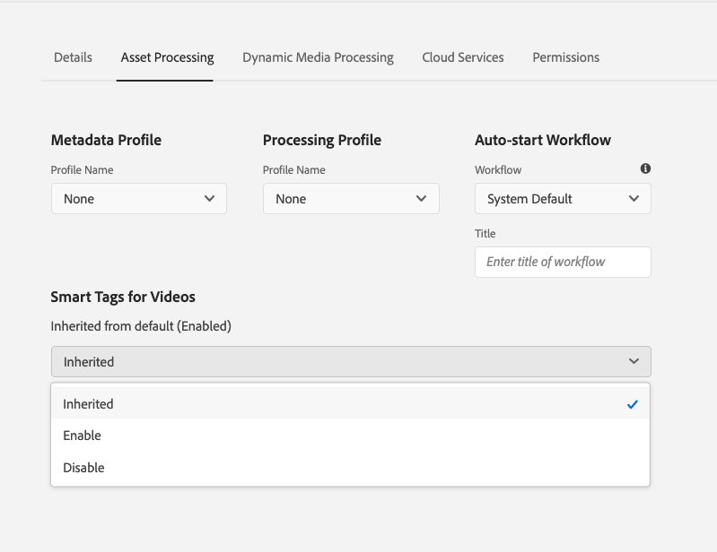

# 為您視訊資產加上智慧型標記 {#video-smart-tags}

對新內容的需求日益增長，需要減少手動工作，以迅速提供引人入勝的數位體驗。 [!DNL Adobe Experience Manager] as a [!DNL Cloud Service] 支援使用人工智慧自動標籤視訊資產。 手動標籤視訊可能很耗時。 不過， [!DNL Adobe Sensei] 支援的視訊智慧標籤功能會使用人工智慧模型來分析視訊內容並將標籤新增至視訊資產。 從而減少DAM使用者為客戶提供豐富體驗的時間。 Adobe的機器學習服務為影片產生兩組標籤。 而其中一組對應於該視訊中的物件、場景和屬性；另一組則與飲酒、跑步和慢跑等動作相關。

視訊標籤預設為啟用，位於 [!DNL Adobe Experience Manager] as a [!DNL Cloud Service]. 不過，您可以 [選擇退出視訊智慧標籤](#opt-out-video-smart-tagging) 在資料夾中。 當您上傳新視訊或重新處理現有視訊時，會自動標籤視訊。 [!DNL Experience Manager] 也會建立縮圖，並擷取視訊檔案的中繼資料。 智慧型標籤會依其遞減順序顯示 [信賴分數](#confidence-score-video-tag) 在資產中 [!UICONTROL 屬性].

## 上傳時的智慧標籤影片 {#smart-tag-assets-on-ingestion}

當您 [上傳視訊資產](add-assets.md#upload-assets) 至 [!DNL Adobe Experience Manager] as a [!DNL Cloud Service]，則會處理視訊。 處理完成後，請參閱 [!UICONTROL 基本] 資產索引標籤 [!UICONTROL 屬性] 頁面。 智慧型標籤會自動新增到下的視訊中 [!UICONTROL 智慧標籤]. 資產微服務使用 [!DNL Adobe Sensei] 以建立這些智慧標籤。


套用的智慧標籤會依遞減順序排序， [信賴分數](#confidence-score-video-tag)，結合物件和動作標籤，在 [!UICONTROL 智慧標籤].

>[!IMPORTANT]
>
>建議您檢閱這些自動產生的標籤，以確保其符合您的品牌及其值。

## 為DAM中的現有影片加上智慧標籤 {#smart-tag-existing-videos}

DAM中現有的視訊資產不會自動加上智慧標籤。 您需要 [!UICONTROL 重新處理資產] 手動為其產生智慧標籤。

若要以智慧標籤視訊資產，或資產存放庫中已存在資產的資料夾（包括子資料夾），請遵循下列步驟：

1. 選取 [!DNL Adobe Experience Manager] 標誌，然後選取 [!UICONTROL 導覽] 頁面。

1. 選取 [!UICONTROL 檔案] 以顯示「資產」介面。

1. 導覽至您要套用智慧標籤的資料夾。

1. 選取整個資料夾或特定視訊資產。

1. 選取  [!UICONTROL 重新處理資產] 圖示並選取 [!UICONTROL 完整程式] 選項。

<!-- TBD: Limit size -->


程式完成後，請導覽至 [!UICONTROL 屬性] 資料夾中任何視訊資產的頁面。 自動新增的標籤會顯示在 [!UICONTROL 智慧標籤] 中的區段 [!UICONTROL 基本] 標籤。 這些套用的智慧標籤會依遞減順序排序， [信賴分數](#confidence-score-video-tag).

## 搜尋標籤的影片 {#search-smart-tagged-videos}

若要根據自動產生的智慧標籤來搜尋視訊資產，請使用 [Omnisearch](search-assets.md#search-assets-in-aem)：

1. 選取搜尋圖示  以顯示「全能搜尋」欄位。

1. 在Omnisearch欄位中指定您尚未明確新增至視訊的標籤。

1. 根據標籤進行搜尋。

搜尋結果會根據您指定的標籤顯示視訊資產。

您的搜尋結果為中繼資料中具有已搜尋關鍵字的視訊資產的組合，以及以已搜尋關鍵字作為智慧標籤的視訊資產。 不過，符合中繼資料欄位中所有搜尋字詞的搜尋結果會先顯示，接著顯示符合智慧標籤中任何搜尋字詞的搜尋結果。 如需詳細資訊，請參閱 [瞭解 [!DNL Experience Manager] 包含智慧標籤的搜尋結果](smart-tags.md#understand-search).

## 稽核視訊智慧標籤 {#moderate-video-smart-tags}

[!DNL Adobe Experience Manager] 可讓您組織智慧標籤：

* 移除指派給品牌影片的不準確標籤。

* 確保您的影片出現在最相關標籤的搜尋結果中，以精簡標籤式視訊搜尋。 因此，它可避免無關的影片出現在搜尋結果中。

* 將較高的排名指派給標籤，以增加其與視訊的相關性。 升級視訊標籤會增加視訊在根據該標籤執行搜尋時，出現在搜尋結果中的機會。

若要進一步瞭解如何稽核資產的智慧標籤，請參閱 [管理智慧標籤](smart-tags.md#manage-smart-tags-and-searches).


>[!NOTE]
>
>任何已使用下列步驟稽核的標籤： [管理智慧標籤](smart-tags.md#manage-smart-tags-and-searches) 在重新處理資產時不會被記住。 原始標籤集會再次顯示。

## 選擇退出視訊智慧標籤 {#opt-out-video-smart-tagging}

由於視訊的自動標籤與其他資產處理工作（例如建立縮圖及擷取中繼資料）並行執行，因此非常耗時。 若要加快資產處理速度，您可以在資料夾層級上傳時選擇退出視訊智慧標籤。

若要選擇退出針對已上傳至特定資料夾的資產自動產生視訊智慧標籤：

1. 開啟 [!UICONTROL 資產處理] 索引標籤在資料夾中 [!UICONTROL 屬性].

1. 在 [!UICONTROL 視訊智慧標籤] 功能表， [!UICONTROL 已繼承] 選項預設為選取，且視訊智慧標籤已啟用。

   當 [!UICONTROL 已繼承] 選項，繼承的資料夾路徑也會顯示，以及是否設定為的資訊 [!UICONTROL 啟用] 或 [!UICONTROL 停用].

   

1. 選取 [!UICONTROL 停用] 以選擇退出針對已上傳至資料夾的影片進行智慧標籤。

>[!IMPORTANT]
>
>如果您在上傳時選擇不標籤資料夾中的影片，並想在上傳後為影片加上智慧標籤，則 **[!UICONTROL 啟用視訊的智慧標籤]** 從 [!UICONTROL 資產處理] 資料夾的索引標籤 [!UICONTROL 屬性] 和使用 [[!UICONTROL 重新處理資產] 選項](#smart-tag-existing-videos) 將智慧標籤新增至視訊。

## 信賴分數 {#confidence-score-video-tag}

[!DNL Adobe Experience Manager] 套用物件和動作智慧標籤的最低信賴臨界值，以避免每個視訊資產有太多標籤，這會減慢索引速度。 您的資產搜尋結果會根據可信度分數進行排名，這通常會改善搜尋結果，超越任何視訊資產的指派標籤檢查所建議的範圍。 不準確的標籤通常會有較低的信賴分數，因此很少會出現在資產的智慧標籤清單頂端。

中動作和物件標籤的預設臨界值 [!DNL Adobe Experience Manager] 為0.7 （值應介於0和1之間）。 如果某些視訊資產未使用特定標籤進行標籤，則表示演演算法對於預測標籤的信賴度低於70%。 預設臨界值並非總是適用於所有使用者。 因此，您可以在OSGI設定中變更信賴分數值。

若要將信賴分數OSGI設定新增至部署到的專案 [!DNL Adobe Experience Manager] as a [!DNL Cloud Service] 到 [!DNL Cloud Manager]：

* 在 [!DNL Adobe Experience Manager] 專案(`ui.config` 自Archetype 24或之前 `ui.apps`) `config.author` OSGi設定，包含名為的設定檔案 `com.adobe.cq.assetcompute.impl.senseisdk.SenseiSdkImpl.cfg.json` 包含下列內容：

```json
{
  "minVideoActionConfidenceScore":0.5,
  "minVideoObjectConfidenceScore":0.5,
}
```

>[!NOTE]
>
>手動標籤被指派為100%的信賴度（最大信賴度）。 因此，如果影片資產具有符合搜尋查詢的手動標籤，則會先顯示符合搜尋查詢的智慧標籤。

## 限制 {#video-smart-tagging-limitations}

* 您無法訓練使用任何特定視訊將智慧標籤套用至視訊的服務。 此功能適用於預設值 [!DNL Adobe Sensei] 設定。

* 標籤進度不會顯示。

* 系統只會自動標籤檔案大小小於300 MB的視訊。 此 [!DNL Adobe Sensei] 服務會略過較大大小的視訊檔案。

* 僅檔案格式的視訊和支援的轉碼器(如 [智慧標籤](/help/assets/smart-tags.md#smart-tags-supported-file-formats) 已標籤。

**另請參閱**

* [翻譯資產](translate-assets.md)
* [Assets HTTP API](mac-api-assets.md)
* [資產支援的檔案格式](file-format-support.md)
* [搜尋資產](search-assets.md)
* [連接的資產](use-assets-across-connected-assets-instances.md)
* [資產報表](asset-reports.md)
* [中繼資料結構描述](metadata-schemas.md)
* [下載資產](download-assets-from-aem.md)
* [管理中繼資料](manage-metadata.md)
* [搜尋 Facet](search-facets.md)
* [管理收藏集](manage-collections.md)
* [大量中繼資料匯入](metadata-import-export.md)
* [發佈資產至 AEM 和 Dynamic Media](/help/assets/publish-assets-to-aem-and-dm.md)

>[!MORELIKETHIS]
>
>* [管理智慧標籤和資產搜尋](smart-tags.md#manage-smart-tags-and-searches)
>* [訓練智慧標籤服務並標籤您的影像](smart-tags.md)
