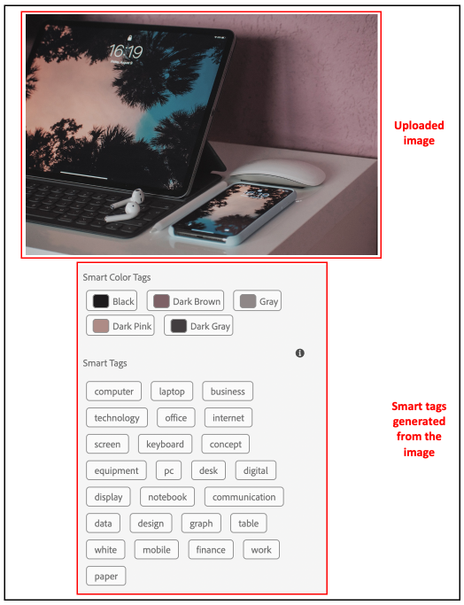

# AEM Assets的智慧標籤 {#using-smart-tags}

組織擁有許多數位資產，且數量持續快速增長。 在如此大量的資料中搜尋特定資產是一項重大挑戰。 為了解決這個問題，已使用`metadata`和`tags`來增強數位資產的可搜尋性。 組織會在資產中繼資料中使用分類控制的辭彙。 這些通常包含員工、合作夥伴和客戶常用來參照和尋找數位資產的關鍵字清單。

智慧標籤不僅是出現在文字中的關鍵字，也是描述資產的最佳關鍵字。 使用分類控制的辭彙來標籤資產，可確保透過搜尋輕鬆識別和擷取資產。

例如，在字典中依字母順序排列的單字比隨機散佈的單字更容易找到。 標籤有類似的用途。 它會根據商業分類法組織資產，確保最相關的資產會出現在搜尋結果中。 例如，汽車製造商可以使用模型名稱來標籤汽車影像，以便在設計促銷活動時只顯示相關影像。 無論是「跑鞋」或「跑鞋」標籤的使用者無需擔心拼字、拼字變化或替代搜尋詞 — 智慧標籤可識別所有搜尋詞。

在背景中，此功能使用[Adobe Sensei](https://business.adobe.com/tw/products/sensei/adobe-sensei.html)的人工智慧型架構，依預設會自動將智慧標籤套用至已上傳的資產，連同對齊商業分類的文字。

## 必要條件和設定 {#smart-tags-prereqs-config}

智慧標籤會自動布建為[!DNL Adobe Experience Manager]做為[!DNL Cloud Service]，因此不需要設定。

## 智慧標籤工作流程 {#smart-tags-workflow}

[!DNL Adobe Sensei]支援的智慧標籤使用人工智慧模型來分析內容並將標籤新增到資產。 從而減少DAM使用者為客戶提供豐富體驗的時間。 智慧標籤在資產屬性中會依其[信賴分數](#confidence-score)的遞減順序顯示。

* **影像型資產**
對於影像，智慧標籤是以某些視覺方面為基礎。 許多格式的影像會使用智慧內容服務加以標籤。 智慧標籤已套用至[支援的檔案型別](#supported-file-formats)，這些檔案型別會產生JPG和PNG格式的轉譯。

  <!-- -->

* **視訊資產**
對於視訊型資產，標籤在[!DNL Adobe Experience Manager]中預設為[!DNL Cloud Service]啟用。 同樣地，當您上傳新影片或重新處理現有影片時，也會以影像和文字標籤自動標籤影片。 [!DNL Adobe Sensei]為視訊產生兩組標籤：一組對應至該視訊中的物件、場景和屬性，而另一組則與飲酒、跑步和慢跑等動作相關。 同時檢查[選擇退出視訊智慧標籤](#opt-out-video-smart-tagging)。

* **文字型資產**
針對支援的資產，[!DNL Experience Manager]已擷取文字，然後編制索引並用於搜尋資產。 不過，以文字中的關鍵字為基礎的智慧標籤可提供專用的、結構化的和較高優先順序的搜尋Facet。 相較於搜尋索引，後者有助於改善資產探索。
對於文字型資產，智慧標籤的功效並不取決於資產中的文字數量，而是取決於資產文字中出現的相關關鍵字或實體。

  

智慧標籤是使用下列工作流程在AEM Assets中實作：

1. 在AEM中建立或上傳資產。 系統會為影像、視訊和文字型Assets產生立即可用的標籤。

1. 如果您發現未產生特定標籤，則可據此訓練影像型別標籤。 請參閱[智慧標籤培訓](/help/assets/smart-tags-training.md)。

## 支援的智慧標籤檔案格式 {#supported-file-formats}

| 影像（MIME型別） | 文字型資產（檔案格式） | 視訊資產（檔案格式和轉碼器） |
|----|-----|------|
| image/jpeg | CSV | MP4 (H264/AVC) |
| image/tiff | DOC | MKV (H264/AVC) |
| image/png | DOCX | MOV (H264/AVC、Motion JPEG) |
| image/bmp | HTML | AVI (indeo4) |
| image/gif | PDF | FLV (H264/AVC、vp6f) |
| image/pjpeg | PPT | WMV (WMV2) |
| image/x-portable-anymap | PPTX |  |
| image/x-portable-bitmap | RTF |  |
| image/x-portable-graymap | SRT |  |
| image/x-portable-pixmap | TXT |  |
| image/x-rgb | VTT |  |
| image/x-xbitmap | |  |
| image/x-xpixmap | |  |
| image/x-icon |  |  |
| image/photoshop |  |  |
| image/x-photoshop |  |  |
| image/psd |  |  |
| image/vnd.adobe.photoshop |  |  |

## 準備立即可用的智慧標籤資產

當您[將資產](add-assets.md#upload-assets)上傳至[!DNL Adobe Experience Manager]做為[!DNL Cloud Service]時，系統會處理上傳的資產。 處理完成後，請參閱資產[!UICONTROL 屬性]頁面的[!UICONTROL 基本]標籤。 智慧標籤會自動新增至[!UICONTROL 智慧標籤]下的資產。 資產微服務使用[!DNL Adobe Sensei]來建立這些智慧標籤。


<!--
The applied smart tags are sorted in descending order of [confidence score](#confidence-score), combined for object and action tags, within [!UICONTROL Smart Tags].
-->

>[!IMPORTANT]
>
>建議您檢閱這些自動產生的標籤，以確保其符合您的品牌及其值。

## DAM中未標籤的Assets {#smart-tag-existing-assets}

DAM中的現有或舊版資產不會自動加上智慧標籤。 您必須手動[重新處理](https://experienceleague.adobe.com/docs/experience-manager-cloud-service/content/assets/admin/about-image-video-profiles.html?lang=zh-Hant#adjusting-load) Assets，才能為其產生智慧標籤。 程式完成後，請導覽至資料夾內任何資產的[!UICONTROL 屬性]頁面。 自動新增的標籤會顯示在[!UICONTROL 基本]索引標籤的[!UICONTROL 智慧標籤]區段中。 這些套用的智慧標籤會以[信賴分數](#confidence-score)的遞減順序排序。

<!--
To smart tag assets, or folders (including subfolders) of assets that exist in assets repository, follow these steps:

1. Select the [!DNL Adobe Experience Manager] logo and then select assets from the [!UICONTROL Navigation] page.

1. Select [!UICONTROL Files] to display the Assets interface.

1. Navigate to the folder to which you want to apply Smart Tags.

1. Select the assets and click  [!UICONTROL Reprocess Assets] icon and select the [!UICONTROL Full Process] option.

-->

## 信賴分數 {#confidence-score}

您的資產搜尋結果會根據可信度分數進行排名，這通常會改善搜尋結果，超越任何資產指派標籤檢查所建議的範圍。 不準確的標籤通常會有較低的信賴分數，因此很少會出現在資產的智慧標籤清單頂端。
<!--
[!DNL Adobe Experience Manager] as a [!DNL Cloud Service] applies a minimum confidence threshold for object and action-smart tags to avoid having too many tags for each asset, which slows down indexing. 

The default threshold for action and object tags in [!DNL Adobe Experience Manager] for an image is 0.5 and for video it is 0.7 (should be value from 0 through 1). If some assets are not tagged by a specific tag, then it indicates that the algorithm is less than 70% confident in the predicted tags. The default threshold might not always be optimal for all the users. You can, therefore, change the confidence score value in OSGI configuration.

To add the confidence score OSGI configuration to the project deployed to [!DNL Adobe Experience Manager] as a [!DNL Cloud Service] through [!DNL Cloud Manager]:

In the [!DNL Adobe Experience Manager] project (`ui.config` since Archetype 24, or previously `ui.apps`) the `config.author` OSGi configuration, include a config file named `com.adobe.cq.assetcompute.impl.senseisdk.SenseiSdkImpl.cfg.json` with the following contents:

```json
{
  "minVideoActionConfidenceScore":0.5,
  "minVideoObjectConfidenceScore":0.5,
}
```
-->

>[!NOTE]
>
>手動標籤被指派為100%的信賴度（最大信賴度）。 因此，如果存在手動標籤符合搜尋查詢的資產，則會先顯示這些資產，然後再顯示符合搜尋查詢的智慧標籤。

## 稽核智慧標籤 {#moderate-smart-tags}

[!DNL Adobe Experience Manager]做為[!DNL Cloud Service]可讓您組織智慧標籤：

* 移除指派給品牌資產的不準確標籤。

* 透過確保您的資產出現在最相關標籤的搜尋結果中，精簡標籤式資產搜尋。 因此，它可避免無關資產出現在搜尋結果中。

* 將較高的排名指派給標籤，以增加其與資產的相關性。 為資產推廣標籤，會增加根據標籤執行搜尋時，特定資產出現在搜尋結果中的機會。

若要進一步瞭解如何稽核資產的智慧標籤，請參閱[管理智慧標籤](smart-tags.md#manage-smart-tags-and-searches)。


>[!NOTE]
>
>重新處理資產時，不會記住任何使用[管理智慧標籤](smart-tags.md#manage-smart-tags-and-searches)中的步驟進行仲裁的標籤。 原始標籤集會再次顯示。

## 管理智慧標籤和資產搜尋 {#manage-smart-tags-and-searches}

您可以組織智慧標籤，移除任何可能已指派給品牌資產的不正確標籤，以便只顯示最相關的標籤。

仲裁智慧標籤也可透過確保您的資產出現在最相關標籤的搜尋結果中，有助於精簡資產的標籤式搜尋。 基本上，它有助於避免無關資產出現在搜尋結果中的機會。

您也可以為標籤指派較高的排名，以增加標籤與資產的相關性。 根據特定標籤執行搜尋時，為資產促銷標籤會增加資產出現在搜尋結果中的機會。

若要稽核數位資產的智慧標籤：

1. 在搜尋欄位中，根據標籤搜尋數位資產。

1. 若要識別您找不到與搜尋相關的數位資產，請檢查搜尋結果。

1. 選取資產，然後從工具列選取。

1. 從&#x200B;**[!UICONTROL 管理標籤]**&#x200B;頁面，檢查標籤。 如果您不想根據特定標籤搜尋資產，請選取標籤，然後從工具列選取。 或者，選取標籤旁的。

1. 若要指派較高的排名給標籤，請選取該標籤，然後從工具列選取。 您促銷的標籤已移至&#x200B;**[!UICONTROL 標籤]**&#x200B;區段。

1. 選取「**[!UICONTROL 儲存]**」，然後選取「**[!UICONTROL 確定]**」以關閉[!UICONTROL 成功]對話方塊。

1. 導覽至資產的[!UICONTROL 屬性]頁面。 請注意，您提升的標籤會獲得高關聯性，因此出現在搜尋結果中較高的位置。

### 使用智慧標籤瞭解[!DNL Experience Manager]搜尋結果 {#understand-search}

根據預設，[!DNL Experience Manager]會將搜尋字詞與`AND`或`OR`子句結合，以尋找套用智慧標籤中的任何搜尋字詞。 使用智慧標籤不會變更此預設行為。 例如，考慮搜尋`woman running`。 依預設，中繼資料中只有`woman`或只有`running`關鍵字的Assets不會出現在搜尋結果中。 但是，使用智慧標籤以`woman`或`running`標籤的資產會出現在這樣的搜尋查詢中。 所以搜尋結果是，

* Assets的中繼資料中有`woman`和`running`個關鍵字。

* 使用任一關鍵字加上標籤的Assets智慧標籤。

符合中繼資料欄位中所有搜尋字詞的搜尋結果會先顯示，接著顯示符合智慧標籤中任何搜尋字詞的搜尋結果。 在上述範例中，顯示搜尋結果的大約順序為：

1. 符合各種中繼資料欄位中的`woman running`。
1. 符合智慧標籤中的`woman running`。
1. 符合智慧標籤中的`woman`或`running`。

## 選擇退出智慧標籤 {#opt-out-smart-tagging}

由於資產的自動標籤與其他資產處理工作（如縮圖建立和中繼資料擷取）並行執行，因此可能很耗時。 若要加快資產處理速度，您可以在資料夾層級上傳時選擇退出智慧標籤。 若要選擇退出針對已上傳至特定資料夾的資產自動產生智慧標籤：

1. 開啟資料夾[!UICONTROL 屬性]中的[!UICONTROL 資產處理]索引標籤。
1. 在[!UICONTROL 視訊智慧標籤]功能表中，例如，[!UICONTROL 已繼承]選項預設為選取，且視訊智慧標籤已啟用。

   選取[!UICONTROL 繼承]選項時，繼承的資料夾路徑也會與資訊一起顯示，無論其設定為[!UICONTROL 啟用]或[!UICONTROL 停用]。

   

1. 選取[!UICONTROL 停用]以選擇退出上傳至資料夾的智慧標籤。

1. 同樣地，您可以選擇不使用[!UICONTROL 文字智慧標籤]、[!UICONTROL 影像智慧標籤]和[!UICONTROL 影像顏色標籤]的智慧標籤。

>[!IMPORTANT]
>
>如果您在上傳時選擇不標籤資料夾，並想要在上傳後智慧標籤，請從資料夾&#x200B;**[!UICONTROL 屬性]**&#x200B;的[!UICONTROL 資產處理]索引標籤中[!UICONTROL 啟用智慧標籤]，並使用[[!UICONTROL 重新處理資產]選項](#smart-tag-existing-assets)將智慧標籤新增至資產。

<!--
## Benefits of Smart Tags to your assets {#benefits-of-smart-tags}

Following are the benefits of using Smart Tags in your AEM Assets:
*  Makes an asset searchable.
*  Smart Tags are generated automatically to your assets, thus, it minimizes your effort to perform tagging manually.
*  It allows the usage of the same vocabulary, tag structure, and taxonomy so that you need not to worry about tagging if by chance you miss tagging at first.
*  Whether you are tagging "runners" or "running" shoes, you do not need to worry about typos, wrong spellings, or alternative search terms as Smart Tags know it already!
*  Helps your assets to become organized and categorized.
-->

## 智慧標籤的相關限制和最佳實務 {#limitations-best-practices-smart-tags}

這些模型並非總能完美地識別標籤。 目前版本的智慧標籤有下列限制：

* 無法辨認影像中的細微差異。 例如，超薄襯衫和一般襯衫。
* 無法根據影像的微小模式或部分識別標籤。 例如，襯衫上的標誌。
* 未處理的標籤與：

   * 非視覺化抽象層面。 例如，產品發佈的年份或季節、影像引發的情緒或情感，以及視訊的主觀內涵。
   * 產品的細微視覺差異，例如有領襯衫和沒有領子的襯衫，或嵌入在產品上的小產品標誌。

* 系統只會自動標籤檔案大小小於300 MB的視訊。 [!DNL Adobe Sensei]服務會略過較大大小的視訊檔案。
* 若要搜尋含有智慧標籤的檔案（一般或增強功能），請使用[!DNL Assets]搜尋（全文檢索搜尋）。 智慧標籤沒有單獨的搜尋述詞。
* 相較於一般標籤，使用商業分類法標籤的資產更容易透過標籤式搜尋識別和擷取。

## 常見問題{#faq-smart-tags}

+++**智慧標籤如何改善資產的搜尋體驗？**

上傳資產後，[!DNL Adobe]個Sensei會自動標籤資產。 自動化程式在後端執行得太快，您會在上傳完成數秒後看到資產中新增的標籤。

+++

+++**如果智慧標籤清單不正確或顯示不想要的標籤，會發生什麼情況？**

可以從清單中移除不精確或不需要的標籤。 例如，作為汽車經銷商，您可能想要從清單中移除「已損壞」標籤。

+++

+++**如何排列包含相同標籤的資產的優先順序？**

可以，您可以優先處理包含相同標籤的資產。 您可以將標籤提升至資產的智慧標籤清單中，以執行優先順序。 升級標籤可讓您優先處理出現在特定標籤搜尋結果中的影像。

+++

+++**智慧標籤的應用程式是否僅限於特定資料夾？**

智慧標籤是可設定的，並可套用在DAM內的任何資料夾上。

+++

+++**我如何知道標籤需要訓練？**

請參閱[決定智慧標籤培訓的需求](/help/assets/smart-tags-training.md#smart-tag-training-requirement)。

+++

+++**標籤資產時支援哪些檔案格式？**

請參考[支援的檔案格式](#supported-file-formats)。

+++

+++**使用哪種語言產生智慧標籤？**

智慧型標籤只會以英文產生。 透過翻譯整個資產（包括中繼資料），可以將這些內容翻譯成其他語言。

+++

+++**我不想再使用智慧標籤。**

您隨時可以[選擇退出智慧標籤](#opt-out-smart-tagging)，以停止執行。

+++
