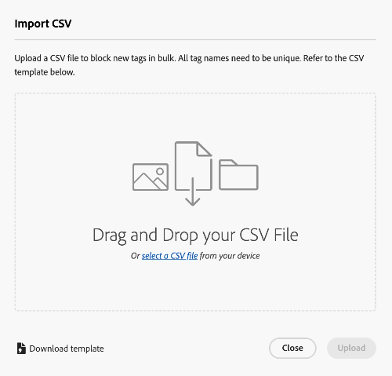

# 在資產視圖中管理標記 {#view-assets-and-details}

>[!CONTEXTUALHELP]
>id="assets_taxonomy_management"
>title="管理標記"
>abstract="標記可協助您將資產分類，以便更有效地瀏覽和搜尋。管理員可使用標記階層結構，這有助於套用相關的中繼資料、將資產分類、支援搜尋、重複使用標記、提高易尋性等。"

標記可協助您將資產分類，以便更有效地瀏覽和搜尋。標記有助於將適當的分類法傳播給其他使用者和工作流程。

受控詞彙的平面清單會隨著時間推移而變得難以管理。管理員可使用標記階層結構，這有助於套用相關的中繼資料、將資產分類、支援搜尋、重複使用標記、提高易尋性等。

您可以在根級別建立命名空間，並在命名空間內建立子標記的階層式結構。例如，您可以在根級別建立一個`Activities`命名空間，並且在該命名空間內有 `Cycling`、`Hiking` 和 `Running` 標記。您可以有更多子標記 `Clothing` 和 `Shoes`，就在 `Running` 之內。

標記提供了許多優點，例如：

* 標記允許著作者透過常見的分類法輕鬆整理不同的資產。著作者可以透過常見的標記快速搜尋和整理資產。

* 階層式標記非常靈活，是以邏輯方式整理詞彙的絕佳方式。透過命名空間、標記和子標記，可以代表整個分類系統。

* 隨著組織詞彙的改變，標記可能會隨著時間的推移而演變。

* 在管理員視圖中所管理的標記與資產視圖中所管理的標記保持同步，此確保中繼資料控管和完整性。

為了能夠將標記套用於資產，首先必須建立一個命名空間，然後建立與新增標記。您也可以建立標記並將其新增到現有的命名空間。您在根級別建立的任何標記都會自動新增到標準標記命名空間。然後，您可以將「標記」欄位新增到中繼資料表單，以便顯示於「資產詳細資訊」頁面上。在配置這些設定之後，您可以開始將標記套用到資產。

>[!NOTE]
>
>只有在您不使用預設的中繼資料表單時，才必須將「標記」欄位新增到中繼資料表單。

除了本文提到的之外，管理員視圖中還提供了包括合併、重新命名、本地化和發佈標記等其他功能。

## 建立命名空間 {#create-a-namespace}

命名空間是只能存在於根級別的標記容器。您可以透過先為命名空間定義邏輯名稱，開始設定標記的階層式結構。如果您未將標記新增到任何現有的命名空間，該標記將自動移至標準標記。

請執行下列步驟以建立一個命名空間：

1. 前往 `Taxonomy Management` (在 `Settings` 下方) 檢視現有命名空間的清單。您也可以檢視上次修改日期、修改命名空間或其下標記的使用者，以及標記在資產中使用的次數。
1. 按一下 `Create Namespace`.
1. 針對命名空間新增 `Title`、`Name` 和 `Description`。您在 `Title` 欄位中指定的輸入會顯示於階層式結構的頂端。例如，在下面的影像中，**活動**&#x200B;指的是命名空間的標題。

   

1. 按一下 `Save`。

## 將標記新增到命名空間 {#add-tags-to-namespace}

請執行下列步驟以新增標記到一個命名空間：

1. 前往&#x200B;**[!UICONTROL Taxonomy Management]**。
1. 選取命名空間並按一下 `Create`，在命名空間下方的頂端層級建立標記。如果您需要在命名空間存在的標記下建立子標記，請選取該標記，然後按一下 `Create`。
   

   在此範例中，左側的影像代表在命名空間正下方的標記`automobile-four-wheeler`，顯示於 `Path` 欄位中。右圖是標記內新增子標記的範例，因為標記名稱較多，除了命名空間之外，`jeep` 和 `jeep-meridian`，顯示於 `Path` 欄位中。
1. 指定標記的標題、名稱和說明，然後按一下 `Save`。

   >[!NOTE]
   >
   >* `Title` 和 `Name` 欄位是必要的，而 `Description` 欄位是可選的。
   >* 預設情況下，該工具會複製您在「標題」欄位中鍵入的文字，移除空格或特殊字元 (.&amp; / \ : * ? [ ]| &quot; %)，並將其儲存為名稱。
   >* 之後可以更新 `Title` 欄位，但 `Name` 欄位是唯讀的。

## 將標記新增到標準標記 {#add-tags-to-standard-tags}

非結構化標記或沒有任何階層的標記儲在`Standard Tags`命名空間。再者，當您想要新增其他描述性詞彙而不影響管控的分類法時，可以將該值儲存在 `Standard Tags`。您可以隨著時間的推移，將這些值移到結構化的命名空間之下。此外，您也可以使用`Standard Tags`命名空間做為關鍵字的自由形式項目。

若要建立標準標記，請在根級別按一下 `Create Tag`。指定標題、名稱和說明，然後按一下 `Save`。

>[!NOTE]
>
>如果使用 Assets as a Cloud Service 刪除 `Standard Tags` 命名空間，在根級別建立的標記不會顯示在可用標記的清單中。

## 移動標記 {#move-tags}

如果您將標記儲存在錯誤的階層之下，或者分類法隨著時間的推移而改變，您可以移動選取的標記以保持資料完整性。移動標記時必須考慮以下條件：

* 標記只能在現有命名空間之下或現有標記階層之內移動。
* 標記不能移動到根而成為命名空間。
* 移動父系標記也會移動儲存在階層中的所有子系標記。

執行以下步驟將標記從一個位置移動到另一位置：

1. 選取相應命名空間之下的標記或整個標記階層，然後按一下 `Move`。
1. 在「移動」對話框中，使用 `Select Tag` 部分選取新的目標標記或命名空間。
1. 按一下 `Save`。標記顯示在其新的位置。

## 編輯標記 {#edit-tags}

若要編輯標記的標題，請選取該標記並按一下`Edit`。指定新的標題並按一下 `Save`。

>[!NOTE]
>
>* 無法更新標記的 `Name`。標記的根路徑也根據標記的名稱。即使更新了 `Title` 欄位，該路徑也維持不變。
>* Assets as a Cloud Service 中提供了其他操作，例如合併、本地化和發佈。

## 刪除標記 {#delete-tags}

您可以同時刪除多個命名空間或標記。刪除操作無法復原。

請執行下列步驟以刪除標記：

1. 選取命名空間或標記，然後按一下 `Delete`。
1. 按一下 `Confirm`。

>[!NOTE]
>
>* 刪除父系標記或命名空間也會刪除儲存在階層中的子標記。如果需要刪除或更新父系命名空間，建議在刪除父系階層之前，[將您的標記移動](#moving-tags)到新目標。
>* 刪除標記也會從資產中刪除其所有的參考。
>* 您無法刪除存在於根級別的標準標記。

## 將標記元件新增到中繼資料表單 {#add-tags-to-metadata-form}

標記元件自動被新增到`default`中繼資料表單。您可以透過使用範本或從零開始，設計一個 [中繼資料表單](https://experienceleague.adobe.com/docs/experience-manager-assets-essentials/help/metadata.html?lang=en#metadata-forms)。如果您沒有使用現有的中繼資料表單範本，則可以修改中繼資料表單並新增標記元件。中繼資料屬性對應是自動填入的，此時無法修改。[!DNL Assets as a Cloud Service]使用者可以更新對應，以使用自訂命名空間儲存標記值，並使用根路徑僅公開階層的子集。

觀看此簡短影片，了解如何將標記元件新增到中繼資料表單中：

>[!VIDEO](https://video.tv.adobe.com/v/3420452)

### 將標記新增到資產 {#add-tags-to-assets}

1. 前往資產詳細資訊頁面並瀏覽至`Tags`中繼資料表單的部分。
1. 選取「標記」欄位旁邊的標記選取器圖示，或開始輸入標記名稱以查看建議的結果。

   

1. 選取一個或多個標記。子標記與父系標記或命名空間一起自動選取。
在 Assets Essentials 中修改的標記會套用在 Assets as a Cloud Service。

## 將標記新增至封鎖清單 {#blocklist-essentials}

[!DNL Assets view] 可讓您設定封鎖清單，其中包含上傳到存放庫時，不應當成智慧標記上傳到資產的單詞。此功能可協助您維持品牌合規性，並減少審核智慧標記的工作量。
<!--
### Block smart tags for single asset {#block-smart-tags-for-single-asset}

-->

### 封鎖所有資產的智慧標記 {#block-smart-tags-for-all-assets}

[!DNL Assets view] 可讓管理員封鎖現有和新新增資產的智慧標記。若要封鎖標記，請執行以下步驟：

1. 瀏覽到「**[!UICONTROL 設定]**」底下的「**[!UICONTROL 已封鎖標記]**」。
1. 按一下「**[!UICONTROL 新增已封鎖標記]**」。
1. 在文字方塊中輸入您要封鎖的標記，然後按一下「**[!UICONTROL Enter]**」。
1. 新增完標記後，按一下「**[!UICONTROL 新增]**」。輸入的標記將列在封鎖的標記清單中。

   >[!NOTE]
   >
   >一次最多可以將 25 個標記新增至清單。重複這些步驟以將更多標記新增到封鎖清單中。

您也可以封鎖單一資產的智慧標記。瀏覽至資產的詳細資料。在「**[!UICONTROL 標記]**」標籤下移除不需要的智慧標記，然後按一下「**[!UICONTROL 儲存]**」。標記列在所選資產的封鎖清單中。

### 對封鎖清單執行的動作 {#blocklist-actions}

* **移除標記：**&#x200B;您也可以從封鎖清單中移除標記。為此，請選擇一個或多個要移除的標記。按一下「**[!UICONTROL 移除]**」。一次最多可以從清單中移除 25 個標記。
* **全選：**&#x200B;選取「**標記名稱**」旁的核取方塊以選取封鎖清單中的所有標記。
* **排序：**&#x200B;您可以按升序或降序對封鎖清單進行排序。若要這樣做，請按一下「**標記名稱**」旁邊的箭頭。

  

  >[!NOTE]
  >
  >在封鎖清單中新增標記時請勿使用特殊字元。可使用 a-z、A-Z、0-9 和 - 等字元。

### 匯出封鎖清單{#export-blocklist}

Assets檢視可讓您將列出的封鎖標籤匯出為CSV格式。 若要匯出封鎖清單，請執行以下步驟：

1. 按一下「**[!UICONTROL 以 CSV 匯出]**」。
1. 選擇適當的位置來儲存 CSV 檔案。您也可以根據要求重新命名該檔案。
1. 按一下「**[!UICONTROL 儲存]**」。CSV 格式的匯出清單將下載到所選位置。

### 匯入封鎖清單{#import-blocklist}

Assets檢視提供從資料來源(CSV)匯入封鎖標籤的功能。 若要匯入封鎖清單，請執行以下步驟：

1. 按一下「**[!UICONTROL 以 CSV 匯入]**」。
1. 從您的裝置中選擇 CSV 檔案。按一下「**[!UICONTROL 選取檔案]**」以瀏覽到裝置上的檔案。或者，您可以從裝置拖放 CSV 檔案。
1. 按一下「**[!UICONTROL 上傳]**」。CSV 檔案中的標記列在已封鎖標記清單中。

   

如果要下載已封鎖標記範本，請按照以下步驟執行：

1. 按一下「**[!UICONTROL 下載範本]**」。
1. 選擇適當的位置來儲存 CSV 檔案。您也可以根據要求重新命名該檔案。
1. 按一下「**[!UICONTROL 儲存]**」。CSV 格式的區塊標記範本將下載到所選位置。
