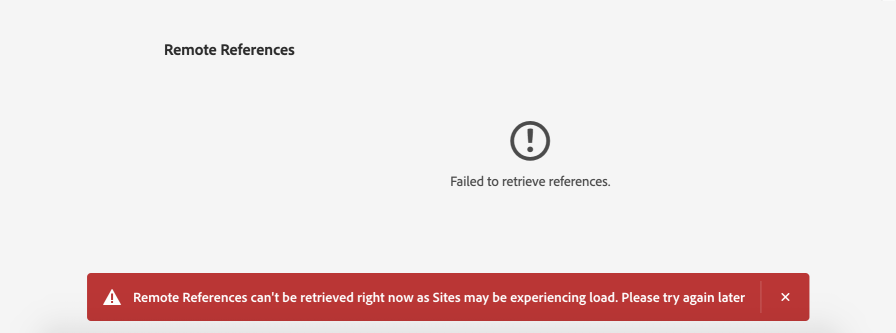

# 使用「連線資產」在 中共用 DAM 資產 [!DNL Experience Manager Sites] {#use-connected-assets-to-share-dam-assets-in-aem-sites}

大型企業中，建立網站所需的基礎架構可能很分散。有時候，建立這些網站的網站建立功能和數位資產可能會存放在不同的部署中。原因之一，是現有部署分散，需要搭配使用。 另一個原因可能是收購導致基礎設施的差異，包括不同 [!DNL Experience Manager] 版本，母公司想要搭配使用。

「連線資產」功能透過整合，支援上述使用案例 [!DNL Experience Manager Sites] 和 [!DNL Experience Manager Assets]. 使用者可在 [!DNL Sites] 使用來自 [!DNL Assets] 部署。

>[!NOTE]
>
>只有在您需要使用遠端DAM部署上可用的資產，並以個別Sites部署進行製作網頁時，才設定「連線資產」 。

## 連線資產概觀 {#overview-of-connected-assets}

在中編輯頁面時 [!UICONTROL 頁面編輯器] 作者可以作為目標目的地，從不同的 [!DNL Assets] 作為資產來源的部署。 管理員會建立部署的一次性整合 [!DNL Experience Manager] with [!DNL Sites] 能力與其他部署 [!DNL Experience Manager] with [!DNL Assets] 功能。 您也可以透過「連線資產」在網站的網頁中使用Dynamic Media影像，並運用Dynamic Media功能，例如智慧型裁切和影像預設集。

若 [!DNL Sites] 作者可將遠端資產以唯讀本機資產的形式提供。 此功能可支援順暢的搜尋作業，並可存取網站編輯器上的遠端資產。 若是任何其他使用案例而可能需要Sites提供完整的資產語料庫，請考慮大量移轉資產，而非運用連線資產。

### 先決條件和支援的部署 {#prerequisites}

使用或設定此功能之前，請先確定下列事項：

* 使用者是每個部署中適當使用者群組的成員。
* 針對 [!DNL Adobe Experience Manager] 部署類型，即滿足支援的條件之一。 [!DNL Experience Manager] as a Cloud Service [!DNL Assets] 搭配 [!DNL Experience Manager] 6.5.如需此功能如何運作的詳細資訊，請參閱 [!DNL Experience Manager] 6.5，見 [中的連線資產 [!DNL Experience Manager] 6.5 [!DNL Assets]](https://experienceleague.adobe.com/docs/experience-manager-65/assets/using/use-assets-across-connected-assets-instances.html).

   |  | [!DNL Sites] as a [!DNL Cloud Service] | [!DNL Experience Manager] 6.5 [!DNL Sites] 在AMS上。 | [!DNL Experience Manager] 6.5 [!DNL Sites] 內部部署 |
   |---|---|---|---|
   | **[!DNL Experience Manager Assets]as a[!DNL Cloud Service]** | 支援 | 支援 | 支援 |
   | **[!DNL Experience Manager]6.5 [!DNL Assets] 在AMS上。** | 支援 | 支援 | 支援 |
   | **[!DNL Experience Manager]6.5 [!DNL Assets] 內部部署** | 不支援 | 不支援 | 不支援 |

### 支援的檔案格式 {#mimetypes}

作者在「內容尋找器」中搜尋影像和下列類型的檔案，並在「頁面編輯器」中拖曳搜尋的資產。 檔案會新增至 `Download` 元件和影像 `Image` 元件。 作者也可以在任何自訂項目中新增遠端資產 [!DNL Experience Manager] 擴展預設值的元件 `Download` 或 `Image` 元件。 支援的格式為：

* **影像格式**:格式 [影像元件](file-format-support.md#image-formats) 支援。
* **檔案格式**:請參閱 [支援的文檔格式](file-format-support.md#document-formats).

### 相關使用者和群組 {#users-and-groups-involved}

以下說明進行設定所涉及的各種角色、功能及其對應的使用者群組。 本機範圍適用於作者建立網頁的使用案例。 遠端範圍適用於託管所需資產的 DAM 部署。此 [!DNL Sites] 作者會擷取這些遠端資產。

| 角色 | 範圍 | 使用者群組 | 說明 |
|------|--------|-----------|----------|
| [!DNL Sites] 管理員 | 本機 | [!DNL Experience Manager] `administrators` | 設定 [!DNL Experience Manager] 和配置與遠程伺服器的整合 [!DNL Assets] 部署。 |
| DAM 使用者 | 本機 | `Authors` | 用於檢視及複製 `/content/DAM/connectedassets/` 中擷取的資產。 |
| [!DNL Sites] 作者 | 本機 | <ul><li>`Authors` (在遠端DAM上具有讀取存取權，並在本機上具有作者存取權 [!DNL Sites]) </li> <li>`dam-users` 本地 [!DNL Sites]</li></ul> | 一般使用者為 [!DNL Sites] 使用此整合來改善其內容速度的作者。 作者可以使用 [!UICONTROL 內容尋找器] 以及在本機網頁中使用所需的影像。 |
| [!DNL Assets] 管理員 | 遠端 | [!DNL Experience Manager] `administrators` | 設定跨原始資源共用 (CORS)。 |
| DAM 使用者 | 遠端 | `Authors` | 作者 遠程角色 [!DNL Experience Manager] 部署。 使用 [!UICONTROL 內容尋找器]. |
| DAM 經銷商 (技術使用者) | 遠端 | <ul> <li> [!DNL Sites] `Authors`</li> <li> `connectedassets-assets-techaccts` </li> </ul> | 遠程部署上存在的此用戶由 [!DNL Experience Manager] 本地伺服器(不是 [!DNL Sites] 作者角色)，代表 [!DNL Sites] 作者。 |
| [!DNL Sites] 技術使用者 | 本機 | `connectedassets-sites-techaccts` | 允許 [!DNL Assets] 部署以搜尋中資產的參考 [!DNL Sites] 網頁。 |

### 連線資產架構 {#connected-assets-architecture}

Experience Manager可讓您將遠端DAM部署連結為來源，以連接多個Experience Manager [!DNL Sites] 部署。 最多可以連接4個 [!DNL Sites] 部署至來源遠端DAM。 不過，您可以連結 [!DNL Sites] 只部署一個遠端DAM部署。

下列圖表說明了支援的方案：

下圖說明不支援的案例：

## 配置連接 [!DNL Sites] 和 [!DNL Assets] 部署 {#configure-a-connection-between-sites-and-assets-deployments}

安 [!DNL Experience Manager] 管理員可以建立此整合。 建立後，需要的使用權限會透過使用者群組建立。 使用者群組定義於 [!DNL Sites] 部署及部署DAM。

設定連線資產和本機 [!DNL Sites] 連接，請遵循下列步驟：

1. 存取現有 [!DNL Sites] 部署。 此 [!DNL Sites] 部署用於網頁編寫，例如 `https://<sites_server_fqdn>:[port]`. 當頁面編寫發生在 [!DNL Sites] 部署，我們呼叫 [!DNL Sites] 從頁面製作的角度，以本機部署。

1. 存取現有 [!DNL Assets] 部署。 此 [!DNL Assets] 部署用於管理數位資產，例如 `https://[assets_servername]:port`.

1. 請確定 [!DNL Sites] 部署和 [!DNL Assets] 在AMS上部署。 建立技術使用者 [!DNL Assets] 部署，並新增至 [相關的使用者和群組](/help/assets/use-assets-across-connected-assets-instances.md#users-and-groups-involved).

1. 存取本機 [!DNL Sites] 部署 `https://[sites_servername]:port`. 按一下&#x200B;**[!UICONTROL 「工具]** > **[!UICONTROL 資產]** > **[!UICONTROL 連線資產設定」]**，並提供下列各值：

   1. A **[!UICONTROL 標題]** 的下界。
   1. **[!UICONTROL 遠端DAM URL]** 是 [!DNL Assets] 格式中的位置 `https://[assets_servername]:[port]`.
   1. DAM 經銷商 (技術使用者) 的認證。
   1. 在 **[!UICONTROL 掛接點]** 欄位，輸入本地 [!DNL Experience Manager] 路徑的位置 [!DNL Experience Manager] 擷取資產。 例如，`connectedassets` 資料夾。從DAM擷取的資產會儲存在 [!DNL Sites] 部署。
   1. **[!UICONTROL 本機網站URL]** 是 [!DNL Sites] 部署。 [!DNL Assets] 部署會使用此值來維護此擷取的數位資產的參考 [!DNL Sites] 部署。
   1. 憑據 [!DNL Sites] 技術使用者。
   1. 的值 **[!UICONTROL 原始二進位傳輸優化閾值]** 欄位會指定原始資產（包括轉譯）是否同步傳輸。 檔案大小較小的資產可以輕鬆擷取，而檔案大小相對較大的資產最好以非同步方式同步。 值取決於您的網路功能。
   1. 選擇 **[!UICONTROL 與連線資產共用的資料存放區]**，則會使用資料存放區來儲存資產，且資料存放區會在兩個部署之間共用。 在此情況下，臨界值限制並不重要，因為資料存放區上有實際的資產二進位檔，且不會傳輸。

   

   *圖：「連線資產」功能的一般設定。*

1. 上的現有數位資產 [!DNL Assets] 已處理部署並產生轉譯。 這些轉譯會使用此功能擷取，因此不需要重新產生轉譯。 停用工作流程啟動器以防止重新產生轉譯。 調整([!DNL Sites])要排除的部署 `connectedassets` 資料夾（資產會擷取至此資料夾中）。

   1. 開啟 [!DNL Sites] 部署，按一下 **[!UICONTROL 工具]** > **[!UICONTROL 工作流程]** > **[!UICONTROL 啟動器]**.

   1. 搜尋將 **[!UICONTROL DAM 更新資產]**&#x200B;和 **[!UICONTROL DAM 中繼資料回寫]**&#x200B;設為工作流程的啟動器。

   1. 選取工作流程啟動器，然後按一下動作列上的&#x200B;**[!UICONTROL 「屬性」]**。

   1. 在 [!UICONTROL 屬性] 嚮導，更改 **[!UICONTROL 路徑]** 欄位，作為下列對應以更新其規則運算式以排除掛接點 **[!UICONTROL connectedassets]**.

   | 變更前 | 變更後 |
   | ------ | ------------ |
   | `/content/dam(/((?!/subassets).)*/)renditions/original` | `/content/dam(/((?!/subassets)(?!connectedassets).)*/)renditions/original` |
   | `/content/dam(/.*/)renditions/original` | `/content/dam(/((?!connectedassets).)*/)renditions/original` |
   | `/content/dam(/.*)/jcr:content/metadata` | `/content/dam(/((?!connectedassets).)*/)jcr:content/metadata` |

   >[!NOTE]
   >
   >作者擷取資產時，會擷取遠端 部署上可用的所有轉譯項目。若要針對所擷取的資產建立更多轉譯項目，請略過此設定步驟。此 [!UICONTROL DAM更新資產] 工作流程會觸發，並建立更多轉譯。 這些轉譯僅可在本機 [!DNL Sites] 部署，而非遠端DAM部署。

1. 新增 [!DNL Sites] 部署為上CORS設定中允許的來源 [!DNL Assets] 部署。 如需詳細資訊，請參閱 [了解CORS](https://experienceleague.adobe.com/docs/experience-manager-learn/foundation/security/understand-cross-origin-resource-sharing.html).

1. 設定 [相同網站Cookie支援](/help/security/same-site-cookie-support.md).

您可以檢查已配置 [!DNL Sites] 部署和 [!DNL Assets] 部署。

![已設定連線資產的連線測試 [!DNL Sites]](assets/connected-assets-multiple-config.png)
*圖：已設定連線資產的連線測試 [!DNL Sites].*

<!-- TBD: Check if Launchers are to be disabled on CS instances. Is this option even available to the users on CS? -->

## 使用Dynamic Media資產 {#dynamic-media-assets}

透過「連線資產」，您可以使用 [!DNL Dynamic Media] 從Sites頁面上的遠端DAM部署，並運用Dynamic Media功能，例如智慧型裁切和影像預設集。

使用 [!DNL Dynamic Media] 連線資產：

1. 設定 [!DNL Dynamic Media] 在啟用同步模式的遠端DAM部署上。
1. 設定 [連線資產](#configure-a-connection-between-sites-and-assets-deployments).
1. 設定 [!DNL Dynamic Media] 在Sites例項上，其公司名稱與遠端DAM上所設定的相同。 Sites部署必須擁有Dynamic Media帳戶的唯讀存取權，才能與連線的資產搭配使用。 因此，請務必在Sites例項上停用Dynamic Media設定中的同步模式。

>[!CAUTION]
>
>具有連線資產和 [!DNL Dynamic Media] 設定，您無法使用 [!DNL Dynamic Media] 處理上可用的本機資產 [!DNL Sites] 部署。

## 設定 [!DNL Dynamic Media] {#configure-dynamic-media}

配置 [!DNL Dynamic Media] on [!DNL Assets] 和 [!DNL Sites] 部署：

1. 按上述方式建立連線資產設定，但設定功能時除外，請選取 **[!UICONTROL 擷取Dynamic Media Connected Assets的原始轉譯]** 選項。

1. 設定 [!DNL Dynamic Media] 本地 [!DNL Sites] 和遠程 [!DNL Assets] 部署。 請依照 [設定 [!DNL Dynamic Media]](/help/assets/dynamic-media/config-dm.md#configuring-dynamic-media-cloud-services).

   * 在所有設定中使用相同的公司名稱。
   * 本地 [!DNL Sites]，在 [!UICONTROL Dynamic Media同步模式]，選取 **[!UICONTROL 預設為停用]**. 此 [!DNL Sites] 部署必須具有對 [!DNL Dynamic Media] 帳戶。
   * 本地 [!DNL Sites]，在 **[!UICONTROL 發佈資產]** 選項，選擇 **[!UICONTROL 選擇性發佈]**. 不選擇 **[!UICONTROL 同步所有內容]**.
   * 在遠程 [!DNL Assets] 部署，在 [!UICONTROL Dynamic Media同步模式]，選取 **[!UICONTROL 預設為啟用]**.

1. 啟用 [[!DNL Dynamic Media] 影像核心元件支援](https://experienceleague.adobe.com/docs/experience-manager-core-components/using/components/image.html#dynamic-media). 此功能會啟用預設值 [影像元件](https://www.aemcomponents.dev/content/core-components-examples/library/core-content/image.html) 顯示 [!DNL Dynamic Media] 影像 [!DNL Dynamic Media] 作者在本機網頁中使用影像 [!DNL Sites] 部署。

## 使用遠端資產 {#use-remote-assets}

網站作者使用「內容尋找器」連線至DAM部署。 作者可以瀏覽、搜尋和拖曳元件中的遠端資產。若要向遠端DAM驗證，請備妥管理員提供的認證（如果有的話）。

作者可在單一網頁中使用本機DAM和遠端DAM部署上可用的資產。 使用「內容尋找器」，以便在搜尋本機 DAM 和搜尋遠端 DAM 之間切換。

系統只會擷取具有完全對應標籤的遠端資產標籤，以及本機上可用的相同分類階層 [!DNL Sites] 部署。 其他所有標籤會一概捨棄。作者可以使用遠端上的所有標籤來搜尋遠端資產 [!DNL Experience Manager] 部署，因為它提供全文搜索。

### 逐步使用說明 {#walk-through-of-usage}

不妨使用上述設定試著編寫體驗，以了解功能的運作方式。在遠端 DAM 部署中使用您所選擇的文件或影像。

1. 導覽至 [!DNL Assets] 通過訪問 **[!UICONTROL 資產]** > **[!UICONTROL 檔案]** 從 [!DNL Experience Manager] 工作區。 或者，您也可以在瀏覽器中存取 `https://[assets_servername_ams]:[port]/assets.html/content/dam`。上傳您選擇的資產。

1. 在 [!DNL Sites] 部署，在右上角的配置檔案激活器中，按一下 **[!UICONTROL 模擬為]**. 指定使用者名稱，選取提供的選項，然後按一下 **[!UICONTROL 確定]**.

1. 開啟 [!DNL Sites] 頁面和編輯頁面。

   按一下頁面左上角的&#x200B;**[!UICONTROL 「切換側面板」]**。

1. 開啟 [!UICONTROL 資產] 標籤（遠端內容尋找器），然後按一下 **[!UICONTROL 登入連線資產]**.

1. 指定要登入「已連線資產」的憑證。 此使用者對 [!DNL Experience Manager] 部署。

1. 搜尋您新增至 DAM 的資產。遠端資產會顯示於左側面板。篩選影像或文件，並進一步篩選支援的文件類型。拖曳 `Image` 元件上的影像和 `Download` 元件上的文件。

   本機上唯讀擷取的資產 [!DNL Sites] 部署。 您仍可使用 [!DNL Sites] 元件，以編輯擷取的資產。 由元件進行編輯屬於非破壞性動作。

   

   *圖：在遠端 DAM 上搜尋資產時，篩選文件類型和影像的選項.*

1. 如果資產的原始內容是以非同步方式擷取，且任何擷取工作失敗，網站作者會收到通知。 編寫時或甚至在完成編寫後，作者都能在 [非同步作業](/help/operations/asynchronous-jobs.md) 使用者介面。

   

   *圖：背景中非同步擷取資產作業的相關通知。*

1. 發佈頁面時， [!DNL Experience Manager] 顯示頁面上使用的完整資產清單。 請確認發佈時，系統已成功擷取遠端資產。若要檢查所擷取資產的每個狀態，請參閱 [非同步作業](/help/operations/asynchronous-jobs.md) 使用者介面。

   >[!NOTE]
   >
   >即使一或多個遠端資產未完全擷取，頁面仍會發佈。 此 [!DNL Experience Manager] 通知區域會顯示非同步作業頁面中顯示錯誤的通知。

>[!CAUTION]
>
>擷取的遠端資產一旦用於網頁中，只要任何人有權存取本機資料夾，都可搜尋和使用。 擷取的資產會儲存在本機資料夾中(`connectedassets` 中)。 這些資產也可供搜尋，並可透過[!UICONTROL 「內容尋找器」]顯示於本機存放庫。

擷取的資產可設為其他任何本機資產以供使用，只是相關聯的中繼資料無法編輯。

### 檢查跨網頁的資產使用情形 {#asset-usage-references}

[!DNL Experience Manager] 可讓DAM使用者檢查資產的所有參考。 它有助於了解及管理資產在遠端的使用情形 [!DNL Sites] 和複合資產。 許多網頁的作者 [!DNL Experience Manager Sites] 部署可在不同網頁的遠端DAM上使用資產。 為了簡化資產管理，避免導致參考損毀，DAM使用者必須檢查本機和遠端網頁上資產的使用情形。 此 [!UICONTROL 參考] 標籤 [!UICONTROL 屬性] 頁面列出資產的本機和遠端參考。

若要在 [!DNL Assets] 部署，請遵循下列步驟：

1. 在中選取資產 [!DNL Assets] 主控台並按一下 **[!UICONTROL 屬性]** 的上界。
1. 按一下 **[!UICONTROL 參考]** 標籤。 請參閱 **[!UICONTROL 本地引用]** ，以在 [!DNL Assets] 部署。 參見**[!UICONTROL 遠端參考] 以便在 [!DNL Sites] 使用「連線資產」功能擷取資產的部署。

   

1. 的參考 [!DNL Sites] 頁面會顯示每個本機的參考總數 [!DNL Sites]. 查找所有參照並顯示參照總數可能需要一些時間。
1. 參考清單是互動式的，DAM使用者可以按一下參考以開啟參考頁面。 如果由於某些原因無法擷取遠端參考，則會顯示通知，通知使用者失敗。
1. 使用者可以移動或刪除資產。 移動或刪除資產時，所有選取資產/資料夾的參考總數會顯示在警告對話方塊中。 刪除尚未擷取參考的資產時，會顯示警告對話方塊。

   

### 在遠端DAM中管理資產更新 {#handling-updates-to-remote-assets}

之後 [配置連接](#configure-a-connection-between-sites-and-assets-deployments) 在遠端DAM和Sites部署之間，遠端DAM上的資產可在Sites部署中使用。 然後，您就可以對遠端DAM資產或資料夾執行更新、刪除、重新命名和移動作業。 Sites部署會自動提供延遲的更新。 此外，如果本機Experience Manager Sites頁面上使用遠端DAM上的資產，遠端DAM上資產的更新會顯示在「網站」頁面上。

將資產從一個位置移至另一個位置時，請確定您 [調整參照](manage-digital-assets.md) 讓資產顯示在「網站」頁面上。 如果您將資產移至無法從本機Sites部署存取的位置，則資產無法顯示在Sites部署上。

您也可以更新遠端DAM上資產的中繼資料屬性，而變更可在本機Sites部署中使用。

Sites作者可以在Sites部署上預覽可用的更新，然後重新發佈變更，以便在AEM發佈例項上使用。

Experience Manager顯示 `expired` 「遠端資產內容尋找器」中資產的狀態視覺指標，可讓網站作者停止在「網站」頁面上使用資產。 如果您使用資產搭配 `expired` 狀態時，資產無法顯示在Experience Manager發佈例項上。

>[!NOTE]
>
>只有在遠端DAM和Sites部署處於Experience Manageras a Cloud Service狀態時，遠端DAM中的資產更新才可供Sites部署使用。

## 常見問答 {#frequently-asked-questions}

+++**如果您需要使用上可用的資產，應設定「連線資產」 [!DNL Sites] 部署？**

在此情況下，不需要設定連線資產。 您可以使用 [!DNL Sites] 部署。

+++

+++**您何時需要設定「連線資產」功能？**

只有在您需要使用 [!DNL Sites] 部署。

+++

+++**多少 [!DNL Sites] 在設定連線資產後，您是否可以連線至遠端DAM部署？**

最多可以連接4個 [!DNL Sites] 在設定連線資產後部署至遠端DAM。 如需詳細資訊，請參閱 [連線資產架構](#connected-assets-architecture).

+++

+++**您可以連線至 [!DNL Sites] 配置連線資產後進行部署？**

您可以將一個遠端DAM部署連結至 [!DNL Sites] 在設定連線資產後進行部署。 如需詳細資訊，請參閱 [連線資產架構](#connected-assets-architecture).

+++

+++**您是否可以透過 [!DNL Sites] 配置連線資產後進行部署？**

設定連線資產後， [!DNL Dynamic Media] 可在 [!DNL Sites] 以唯讀模式部署。 因此，您無法使用 [!DNL Dynamic Media] 在 [!DNL Sites] 部署。 如需詳細資訊，請參閱 [設定Sites與Dynamic Media部署之間的連線](#dynamic-media-assets).

+++

+++**您可以在 [!DNL Sites] 配置連線資產後進行部署？**

可以，您可以在 [!DNL Sites] 在設定連線資產後進行部署。

+++

+++**您可以在 [!DNL Sites] 配置連線資產後進行部署？**

否，您無法在 [!DNL Sites] 在設定連線資產後進行部署。

+++

+++**您是否可以在上使用遠端DAM部署的Dynamic Media資產 [!DNL Sites] 配置連線資產後進行部署？**

可以，您可以在 [!DNL Sites] 在設定連線資產後進行部署。 如需詳細資訊，請參閱 [設定Sites與Dynamic Media部署之間的連線](#dynamic-media-assets).

+++

+++**設定「連線資產」後，您是否可以對遠端DAM資產或資料夾執行更新、刪除、重新命名和移動作業？**

是的，在設定「連線資產」後，您可以對遠端DAM資產或資料夾執行更新、刪除、重新命名和移動作業。 Sites部署會自動提供延遲的更新。 如需詳細資訊，請參閱 [在遠端DAM中管理資產更新](#handling-updates-to-remote-assets).

+++

+++**設定連線資產後，您可以在 [!DNL Sites] 部署，並在遠端DAM部署中提供使用？**

您可以將資產新增至 [!DNL Sites] 不過，這些資產無法供遠端DAM部署使用。

+++

## 限制和最佳實務 {#tip-and-limitations}

* 若要取得資產使用情況的相關分析，請設定 [Assets Insight](/help/assets/assets-insights.md) 功能 [!DNL Sites] 例項。

### 權限與資產管理 {#permissions-and-managing-assets}

* 本機資產為唯讀副本。[!DNL Experience Manager] 元件會對資產執行非破壞性的編輯作業。不允許執行其他編輯作業。
* 本機擷取的資產僅適用於編寫用途。無法套用資產更新工作流程，也無法編輯中繼資料。
* 使用時 [!DNL Dynamic Media] in [!DNL Sites] 頁面不會擷取原始資產並儲存在本機部署上。 此 `dam:Asset` 節點、中繼資料和轉譯 [!DNL Assets] 部署都會擷取 [!DNL Sites] 部署。
* 僅支援影像和列出的文件格式。[!DNL Content Fragments] 和 [!DNL Experience Fragments] 不支援。
* [!DNL Experience Manager] 不會擷取中繼資料結構。 這表示所有擷取的中繼資料都可能無法顯示。 若結構已在 [!DNL Sites] 部署後，將顯示所有元資料屬性。
* 全部 [!DNL Sites] 即使作者無法存取遠端DAM部署，作者仍對擷取的復本擁有讀取權限。
* 不提供 API 以支援自訂整合。
* 此功能可支援順暢的搜尋作業及使用遠端資產。若要在本機部署中一次提供多個遠端資產，不妨考慮移轉資產。
* 您無法將遠端資產當做頁面上的縮圖 [!UICONTROL 頁面屬性] 使用者介面。 您可以在 [!UICONTROL 頁面屬性] 使用者介面 [!UICONTROL 縮圖] 按一下 [!UICONTROL 選擇影像].

### 設定和授權 {#setup-licensing}

* [!DNL Assets] 部署 [!DNL Adobe Managed Services] 支援。
* [!DNL Sites] 可以連接到單個 [!DNL Assets] 一次部署。
* 許可證 [!DNL Assets] 需要遠程儲存庫。
* 一或多個 [!DNL Sites] 需要部署本機編寫功能。

### 使用狀況 {#usage}

* 使用者可在編寫時搜尋遠端資產，並拖曳到本機頁面上。 不支援其他功能。
* 擷取作業會於 5 秒後逾時。如果有網路或其他方面的問題，作者擷取資產時就可能遇到問題。作者可從 [!UICONTROL 內容尋找器] to [!UICONTROL 頁面編輯器].
* 您可以對擷取的資產執行非破壞性的簡單編輯作業，也能執行透過 `Image` 元件支援的編輯工作。資產僅供唯讀。
* 重新擷取資產的唯一方法是將其拖曳至頁面上。 沒有API支援或其他方法可重新擷取資產以進行更新。
* 如果從DAM終止服務資產，這些資產仍會繼續在上使用 [!DNL Sites] 頁面。
* 資產的遠端參考項目會以非同步方式擷取。 參考和總計並非即時，若 [!DNL Sites] 當DAM使用者檢視參考時，作者會使用資產。 DAM使用者可以重新整理頁面，並在幾分鐘內重試以取得總計數。

## 疑難排解問題 {#troubleshoot}

若要疑難排解常見錯誤，請遵循下列步驟：

* 如果您無法從 [!UICONTROL 內容尋找器]，然後確定已具備必要的角色和權限。

* 從遠端DAM擷取的資產可能因一或多個原因無法發佈在網頁上。 遠程伺服器上不存在它，缺少獲取它的適當權限，或者網路故障可能是原因。 確認資產未從遠端DAM中移除。 請確定已具備適當權限，並符合必要條件。 重試將資產新增至頁面並重新發佈。 檢查[非同步工作清單](/help/operations/asynchronous-jobs.md)，找出資產擷取作業的錯誤。

* 如果您無法從本機存取遠端DAM部署 [!DNL Sites] 部署，確保允許跨網站cookie，並 [相同網站Cookie支援](/help/security/same-site-cookie-support.md) 已設定。 如果跨網站Cookie被封鎖， [!DNL Experience Manager] 不能驗證。 例如， [!DNL Google Chrome] 在無痕模式中，可能會封鎖第三方Cookie。 若要在 [!DNL Chrome] 瀏覽器，按一下位址列中的「眼睛」圖示，導覽至 **網站無法運作** > **已阻止**，選取「遠端DAM URL」 ，並允許登入代號Cookie。 或者，請參見 [如何啟用協力廠商cookie](https://support.google.com/chrome/answer/95647).

   

* 如果未檢索遠程引用並導致錯誤消息，請檢查 [!DNL Sites] 部署可用，並檢查網路連線問題。 稍後重試以檢查。 [!DNL Assets] 部署嘗試兩次建立連接 [!DNL Sites] 部署後報告失敗。

   
