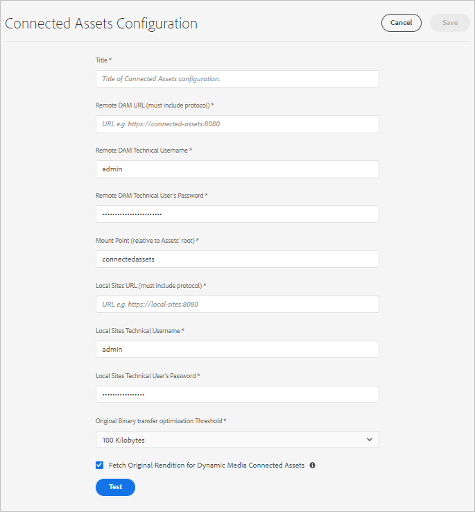

# 在[!DNL Experience Manager Sites]中使用連線的Assets共用DAM資產 {#use-connected-assets-to-share-dam-assets-in-aem-sites}

| 版本 | 文章連結 |
| -------- | ---------------------------- |
| AEM 6.5 | [按一下這裡](https://experienceleague.adobe.com/docs/experience-manager-65/assets/using/use-assets-across-connected-assets-instances.html) |
| AEM as a Cloud Service  | 本文章 |

大型企業中，建立網站所需的基礎架構可能很分散。有時候，建立這些網站的網站建立功能和數位資產可能會存放在不同的部署中。其中一個原因可能是地理上分散且需要協同工作的現有部署。 另一個原因可能是收購導致基礎架構迥異，包括母公司希望一起使用的不同[!DNL Experience Manager]版本。

>[!NOTE]
>
>Adobe建議利用具有OpenAPI功能的Dynamic Media來連線AEM Assets as a Cloud Service和AEM Sites。 請參閱[整合遠端AEM Assets與AEM Sites](/help/assets/integrate-remote-approved-assets-with-sites.md)。

連線Assets功能整合[!DNL Experience Manager Sites]和[!DNL Experience Manager Assets]，可支援上述使用案例。 使用者可以在[!DNL Sites]中建立使用來自單獨[!DNL Assets]部署的數位資產的網頁。

>[!NOTE]
>
>只有在您需要使用遠端DAM部署中的可用資產（位於單獨的Sites部署中）來製作網頁時，才能設定連線的Assets。

## 連線Assets概觀 {#overview-of-connected-assets}

在[!UICONTROL 頁面編輯器]中編輯作為目標目的地的頁面時，作者可以從作為資產來源的不同[!DNL Assets]部署順暢地搜尋、瀏覽及內嵌資產。 管理員會建立具有[!DNL Sites]功能的[!DNL Experience Manager]部署與具有[!DNL Assets]功能的[!DNL Experience Manager]部署的一次性整合。 您也可以透過「連線的Assets」，在網站的網頁中使用Dynamic Media影像，並使用Dynamic Media功能，例如智慧型裁切和影像預設集。

對於[!DNL Sites]作者，遠端資產可以唯讀本機資產形式使用。 此功能可支援順暢的搜尋作業，並可存取網站編輯器上的遠端資產。 若有任何其他使用案例，需要完整的資產語料庫才能在Sites上使用，請考慮大量移轉資產，而非使用「連線Assets」。

### 先決條件和支援的部署 {#prerequisites}

使用或設定此功能之前，請先確定下列事項：

* 使用者是每個部署中適當使用者群組的一部分。
* 對於[!DNL Adobe Experience Manager]部署型別，符合其中一個支援的條件。 [!DNL Experience Manager] as a Cloud Service [!DNL Assets]搭配[!DNL Experience Manager] 6.5使用。如需此功能在[!DNL Experience Manager] 6.5中如何運作的詳細資訊，請參閱 [!DNL Experience Manager] 6.5 [!DNL Assets][&#128279;](https://experienceleague.adobe.com/docs/experience-manager-65/assets/using/use-assets-across-connected-assets-instances.html)中的連線Assets。

  | | [!DNL Sites] as a [!DNL Cloud Service] | AMS上的[!DNL Experience Manager] 6.5 [!DNL Sites] | [!DNL Experience Manager] 6.5 [!DNL Sites]內部部署 |
  |---|---|---|---|
  | **[!DNL Experience Manager Assets]as a[!DNL Cloud Service]** | 支援 | 支援 | 支援 |
  | AMS **上的**&#x200B;[!DNL Experience Manager] 6.5 [!DNL Assets] | 支援 | 支援 | 支援 |
  | **[!DNL Experience Manager]6.5 [!DNL Assets]內部部署** | 不支援 | 不支援 | 不支援 |

### 支援的檔案格式 {#mimetypes}

作者在「內容尋找器」中搜尋影像和下列型別的檔案，並在「頁面編輯器」中拖曳搜尋的資產。 檔案已新增至`Download`元件，而影像已新增至`Image`元件。 作者也可以在任何可延伸預設`Download`或`Image`元件的自訂[!DNL Experience Manager]元件中新增遠端資產。 支援的格式為：

* **影像格式**： [影像元件](file-format-support.md#image-formats)支援的格式。
* **檔案格式**：請參閱[支援的檔案格式](file-format-support.md#document-formats)。

### 相關使用者和群組 {#users-and-groups-involved}

以下說明設定及功能與其對應的使用者群組時涉及的各種角色。 本機範圍適用於作者建立網頁的使用案例。 遠端範圍適用於託管所需資產的 DAM 部署。[!DNL Sites]作者擷取這些遠端資產。

| 角色 | 範圍 | 使用者群組 | 說明 |
|------|--------|-----------|----------|
| [!DNL Sites]管理員 | 本機 | [!DNL Experience Manager] `administrators` | 設定[!DNL Experience Manager]並設定與遠端[!DNL Assets]部署的整合。 |
| DAM 使用者 | 本機 | `Authors` | 用於檢視及複製 `/content/DAM/connectedassets/` 中擷取的資產。 |
| [!DNL Sites]作者 | 本機 | <ul><li>`Authors` （在遠端DAM上擁有讀取存取權，在本機[!DNL Sites]上擁有作者存取權） </li> <li>本機[!DNL Sites]上的`dam-users`</li></ul> | 一般使用者是[!DNL Sites]個使用此整合來提高其內容速度的作者。 作者可使用[!UICONTROL 內容尋找器]在本機網頁中使用所需的影像，在遠端DAM中搜尋和瀏覽資產。 |
| [!DNL Assets]管理員 | 遠端 | [!DNL Experience Manager] `administrators` | 設定跨原始資源共用 (CORS)。 |
| DAM 使用者 | 遠端 | `Authors` | 遠端[!DNL Experience Manager]部署上的作者角色。 使用[!UICONTROL 內容尋找器]，在「連線的Assets」中搜尋和瀏覽資產。 |
| DAM 經銷商 (技術使用者) | 遠端 | <ul> <li> [!DNL Sites] `Authors`</li> <li> `connectedassets-assets-techaccts` </li> </ul> | [!DNL Experience Manager]本機伺服器（非[!DNL Sites]作者角色）會代表[!DNL Sites]作者使用遠端部署上的這個使用者來擷取遠端資產。 |
| [!DNL Sites]個技術使用者 | 本機 | `connectedassets-sites-techaccts` | 允許[!DNL Assets]部署搜尋[!DNL Sites]網頁中資產的參考。 |

### 連線Assets架構 {#connected-assets-architecture}

Experience Manager可讓您將遠端DAM部署作為來源連線至多個Experience Manager [!DNL Sites]部署。 不過，您只能連線一個遠端DAM部署的[!DNL Sites]部署。

評估要連線至遠端DAM部署的最佳站台執行個體數量。 Adobe建議將Sites例項逐步連線至部署，並測試遠端DAM的效能是否不受影響，因為每個已連線的Sites例項都會對遠端DAM上的資料流量造成影響。

下列圖表說明支援的情境：

下圖說明不支援的情況：

## 設定[!DNL Sites]和[!DNL Assets]部署之間的連線 {#configure-a-connection-between-sites-and-assets-deployments}

[!DNL Experience Manager]管理員可以建立此整合。 建立後，系統會透過使用者群組建立使用該整合所需的許可權。 使用者群組是在[!DNL Sites]部署和DAM部署中定義。

若要設定「連線的Assets」和本機[!DNL Sites]連線，請遵循下列步驟：

1. 存取現有的[!DNL Sites]部署。 此[!DNL Sites]部署用於網頁製作，例如`https://<sites_server_fqdn>:[port]`。 當頁面製作發生在[!DNL Sites]部署上時，讓我們從頁面製作的角度將[!DNL Sites]部署呼叫為本機。

1. 存取現有的[!DNL Assets]部署。 此[!DNL Assets]部署用於管理數位資產，例如`https://[assets_servername]:port`。

1. 請確定[!DNL Sites]部署和AMS上的[!DNL Assets]部署中，存在具有適當範圍的使用者和角色。 在[!DNL Assets]部署上建立技術使用者，並新增至[相關使用者和群組](/help/assets/use-assets-across-connected-assets-instances.md#users-and-groups-involved)中提及的使用者群組。

1. 在`https://[sites_servername]:port`存取本機[!DNL Sites]部署。 按一下&#x200B;**[!UICONTROL 「工具]** > **[!UICONTROL 資產]** > **[!UICONTROL 連線資產設定」]**，並提供下列各值：

   1. 設定的&#x200B;**[!UICONTROL 標題]**。
   1. **[!UICONTROL 遠端DAM URL]**&#x200B;是[!DNL Assets]位置的URL，格式為`https://[assets_servername]:[port]`。
   1. DAM 經銷商 (技術使用者) 的認證。
   1. 在&#x200B;**[!UICONTROL 掛接點]**&#x200B;欄位中，輸入[!DNL Experience Manager]擷取資產的本機[!DNL Experience Manager]路徑。 例如，`connectedassets`資料夾。 從DAM擷取的資產會儲存在[!DNL Sites]部署的此資料夾中。
   1. **[!UICONTROL 本機站台URL]**&#x200B;是[!DNL Sites]部署的位置。 [!DNL Assets]部署使用此值來維護此[!DNL Sites]部署所擷取的數位資產的參考。
   1. [!DNL Sites]技術使用者的認證。
   1. **[!UICONTROL 原始二進位傳輸最佳化閾值]**&#x200B;欄位的值指定是否同步傳輸原始資產（包括轉譯）。 具有較小檔案大小的Assets可隨時擷取，而檔案大小相對較大的資產則最適合非同步處理。 該值取決於您的網路功能。
   1. 如果您使用資料存放區來儲存資產，且資料存放區在兩個部署之間共用，請選取&#x200B;**[!UICONTROL 與連線的Assets共用的資料存放區]**。 在此情況下，臨界值限制並不重要，因為實際的資產二進位檔可在資料存放區上取得且不會傳輸。

   

   *圖：連線Assets功能的典型設定。*

1. 已處理[!DNL Assets]部署上現有的數位資產，且已產生轉譯。 系統會使用此功能來擷取這些轉譯，因此不需要重新產生轉譯。 停用工作流程啟動器，以防止重新產生轉譯。 調整([!DNL Sites])部署上的啟動器設定，以排除`connectedassets`資料夾（在此資料夾中擷取資產）。

   1. 在[!DNL Sites]部署上，按一下&#x200B;**[!UICONTROL 工具]** > **[!UICONTROL 工作流程]** > **[!UICONTROL 啟動器]**。

   1. 搜尋將 **[!UICONTROL DAM 更新資產]**&#x200B;和 **[!UICONTROL DAM 中繼資料回寫]**&#x200B;設為工作流程的啟動器。

   1. 選取工作流程啟動器，然後按一下動作列上的&#x200B;**[!UICONTROL 「屬性」]**。

   1. 在[!UICONTROL 屬性]精靈中，將&#x200B;**[!UICONTROL 路徑]**&#x200B;欄位變更為下列對應以更新其規則運算式來排除掛接點&#x200B;**[!UICONTROL connectedassets]**。

   | 變更前 | 變更後 |
   | ------ | ------------ |
   | `/content/dam(/((?!/subassets).)*/)renditions/original` | `/content/dam(/((?!/subassets)(?!connectedassets).)*/)renditions/original` |
   | `/content/dam(/.*/)renditions/original` | `/content/dam(/((?!connectedassets).)*/)renditions/original` |
   | `/content/dam(/.*)/jcr:content/metadata` | `/content/dam(/((?!connectedassets).)*/)jcr:content/metadata` |

   >[!NOTE]
   >
   >作者擷取資產時，會擷取遠端部署上可用的所有轉譯。 若要針對所擷取的資產建立更多轉譯項目，請略過此設定步驟。會觸發[!UICONTROL DAM更新資產]工作流程，並建立更多轉譯。 這些轉譯專案僅適用於本機[!DNL Sites]部署，不適用於遠端DAM部署。

1. 將[!DNL Sites]部署新增為[!DNL Assets]部署上CORS設定中的允許來源。 如需詳細資訊，請參閱[瞭解CORS](https://experienceleague.adobe.com/docs/experience-manager-learn/foundation/security/understand-cross-origin-resource-sharing.html)。

1. 設定[相同網站Cookie支援](/help/security/same-site-cookie-support.md)。

您可以檢查已設定的[!DNL Sites]部署與[!DNL Assets]部署之間的連線。

![已設定連線Assets的連線測試[!DNL Sites]](assets/connected-assets-multiple-config.png)
*圖：已連線Assets的連線測試已設定[!DNL Sites]。*

<!-- TBD: Check if Launchers are to be disabled on CS instances. Is this option even available to the users on CS? -->

## 使用Dynamic Media資產 {#dynamic-media-assets}

有了連線Assets，您就可以使用[!DNL Dynamic Media]從Sites頁面上的遠端DAM部署處理的影像資產，並使用Dynamic Media功能，例如智慧型裁切和影像預設集。

若要搭配連線的Assets使用[!DNL Dynamic Media]：

1. 在啟用同步處理模式的遠端DAM部署上設定[!DNL Dynamic Media]。
1. 設定[連線的Assets](#configure-a-connection-between-sites-and-assets-deployments)。
1. 在Sites執行個體上以與遠端DAM上設定的公司名稱設定[!DNL Dynamic Media]。 Sites部署必須擁有Dynamic Media帳戶的唯讀存取權，才能使用連線的資產。 因此，請務必在Sites例項上的Dynamic Media設定中停用同步模式。

>[!CAUTION]
>
>使用「連線的Assets」和[!DNL Dynamic Media]設定，您無法使用[!DNL Dynamic Media]處理[!DNL Sites]部署上可用的本機資產。

## 設定 [!DNL Dynamic Media] {#configure-dynamic-media}

若要在[!DNL Assets]和[!DNL Sites]部署上設定[!DNL Dynamic Media]：

1. 如上所述建立連線Assets設定，除了設定功能時，請選取&#x200B;**[!UICONTROL 為Dynamic Media連線Assets擷取原始轉譯]**&#x200B;選項。

1. 在本機[!DNL Sites]和遠端[!DNL Assets]部署上設定[!DNL Dynamic Media]。 依照指示進行[設定 [!DNL Dynamic Media]](/help/assets/dynamic-media/config-dm.md#configuring-dynamic-media-cloud-services)。

   * 在所有設定中使用相同的公司名稱。
   * 在本機[!DNL Sites]上，在[!UICONTROL Dynamic Media同步處理模式]中，選取&#x200B;**[!UICONTROL 預設為停用]**。 [!DNL Sites]部署必須具有[!DNL Dynamic Media]帳戶的唯讀存取權。
   * 在本機[!DNL Sites]上的&#x200B;**[!UICONTROL 發佈Assets]**&#x200B;選項中，選取&#x200B;**[!UICONTROL 選擇性發佈]**。 不要選取&#x200B;**[!UICONTROL 同步處理所有內容]**。
   * 在遠端[!DNL Assets]部署中，在[!UICONTROL Dynamic Media同步處理模式]中，選取&#x200B;**[!UICONTROL 預設啟用]**。

1. 啟用影像核心元件[&#128279;](https://experienceleague.adobe.com/docs/experience-manager-core-components/using/components/image.html#dynamic-media)中的[!DNL Dynamic Media] 支援。 當作者在本機[!DNL Sites]部署的網頁中使用[!DNL Dynamic Media]個影像時，此功能可讓預設的[影像元件](https://www.aemcomponents.dev/content/core-components-examples/library/core-content/image.html)顯示[!DNL Dynamic Media]個影像。

## 使用遠端資產 {#use-remote-assets}

網站作者使用「內容尋找器」連線至DAM部署。 作者可以瀏覽、搜尋和拖曳元件中的遠端資產。若要向遠端DAM驗證，請備妥管理員提供的認證（如有）。

作者可以在單一網頁中使用本機DAM和遠端DAM部署上可用的資產。 使用「內容尋找器」，以便在搜尋本機 DAM 和搜尋遠端 DAM 之間切換。

系統只會擷取那些具有完全對應標籤以及相同分類階層（可用於本機[!DNL Sites]部署）的遠端資產標籤。 其他所有標籤會一概捨棄。作者可使用遠端[!DNL Experience Manager]部署上的所有標籤來搜尋遠端資產，因為它提供全文檢索搜尋。

### 逐步使用說明 {#walk-through-of-usage}

不妨使用上述設定試著編寫體驗，以了解功能的運作方式。在遠端 DAM 部署中使用您所選擇的文件或影像。

1. 從[!DNL Experience Manager]工作區存取&#x200B;**[!UICONTROL Assets]** > **[!UICONTROL 檔案]**，導覽至遠端部署上的[!DNL Assets]介面。 或者，您也可以在瀏覽器中存取 `https://[assets_servername_ams]:[port]/assets.html/content/dam`。上傳您選擇的資產。

1. 在[!DNL Sites]部署上，按一下右上角的設定檔啟動器，然後按一下&#x200B;**[!UICONTROL 模擬為]**。 指定使用者名稱，選取提供的選項，然後按一下[確定]。**&#x200B;**

1. 開啟[!DNL Sites]頁面並編輯頁面。

   按一下頁面左上角的&#x200B;**[!UICONTROL 「切換側面板」]**。

1. 開啟[!UICONTROL Assets]標籤（遠端內容尋找器），然後按一下&#x200B;**[!UICONTROL 登入連線的Assets]**。

1. 指定要登入連線Assets的認證。 此使用者擁有兩個[!DNL Experience Manager]部署的編寫許可權。

1. 搜尋您新增至 DAM 的資產。遠端資產會顯示於左側面板。篩選影像或文件，並進一步篩選支援的文件類型。拖曳 `Image` 元件上的影像和 `Download` 元件上的文件。

   擷取的資產在本機[!DNL Sites]部署上是唯讀的。 您仍然可以使用[!DNL Sites]元件提供的選項來編輯所擷取的資產。 由元件進行編輯屬於非破壞性動作。

   

   *圖：在遠端DAM上搜尋資產時，篩選檔案型別和影像的選項。*

1. 如果資產的原始檔案是以非同步方式擷取，且擷取任務失敗，網站作者會收到通知。 編寫過程中或甚至在完成編寫之後，作者可以在[非同步工作](/help/operations/asynchronous-jobs.md)使用者介面中檢視擷取任務和錯誤的詳細資訊。

   

   *圖：背景中非同步擷取資產作業的相關通知。*

1. 發佈頁面時，[!DNL Experience Manager]會顯示頁面上使用的完整資產清單。 請確認發佈時，系統已成功擷取遠端資產。若要檢查每個所擷取資產的狀態，請參閱[非同步作業](/help/operations/asynchronous-jobs.md)使用者介面。

   >[!NOTE]
   >
   >即使有一或多個遠端資產未完全擷取，頁面還是會發佈。 [!DNL Experience Manager]通知區域會顯示通知，指出非同步工作頁面中顯示的錯誤。

>[!CAUTION]
>
>擷取的遠端資產一旦用於網頁中，只要任何人有權存取本機資料夾，都可以搜尋和使用。 擷取的資產會儲存在本機資料夾中（上述逐步說明中的`connectedassets`）。 這些資產也可供搜尋，並可透過[!UICONTROL 「內容尋找器」]顯示於本機存放庫。

擷取的資產可設為其他任何本機資產以供使用，只是相關聯的中繼資料無法編輯。

### 檢查跨網頁資產的使用情況 {#asset-usage-references}

[!DNL Experience Manager]可讓DAM使用者檢查資產的所有參考。 它有助於瞭解和管理遠端[!DNL Sites]和複合資產中的資產使用情況。 部署[!DNL Experience Manager Sites]之網頁的許多作者都可以在不同網頁中，使用遠端DAM上的資產。 若要簡化資產管理，避免導致參照損毀，DAM使用者務必要檢查本機與遠端網頁上資產的使用情形。 資產[!UICONTROL 屬性]頁面中的[!UICONTROL 參考]索引標籤會列出資產的本機和遠端參考。

若要檢視和管理[!DNL Assets]部署上的參考，請遵循下列步驟：

1. 在[!DNL Assets]主控台中選取資產，然後從工具列按一下&#x200B;**[!UICONTROL 屬性]**。
1. 按一下「**[!UICONTROL 參考]**」標籤。 檢視&#x200B;**[!UICONTROL 本機參考]**，以瞭解[!DNL Assets]部署中的資產使用情況。 請參閱**[!UICONTROL 遠端參考]，以瞭解[!DNL Sites]部署上資產的使用情況，其中資產是使用「連線的Assets」功能擷取的。

   資產屬性頁面中的

1. [!DNL Sites]頁面的參考會顯示每個本機[!DNL Sites]的參考總數。 尋找所有參照並顯示參照總數可能需要一些時間。
1. 引用清單是互動式的，DAM使用者可以按一下引用以開啟引用頁面。 如果由於某種原因無法擷取遠端參考，則會顯示通知，通知使用者發生失敗。
1. 使用者可以移動或刪除資產。 移動或刪除資產時，所有選定資產/資料夾的參照總數會顯示在警告對話方塊中。 刪除尚未擷取參考的資產時，會顯示警告對話方塊。

   

### 管理遠端DAM中資產的更新 {#handling-updates-to-remote-assets}

在設定遠端DAM與Sites部署之間的連線[之後，遠端DAM上的資產便可在Sites部署中使用。 ](#configure-a-connection-between-sites-and-assets-deployments)然後，您可以在遠端DAM資產或資料夾上執行更新、刪除、重新命名和移動操作。 這些更新會在Sites部署中自動提供，但會有一些延遲。 此外，如果本機Experience Manager Sites頁面上使用了遠端DAM上的資產，則Sites頁面上會顯示遠端DAM上資產的更新。

將資產從一個位置移動至另一個位置時，請確定您[調整引用](manage-digital-assets.md)，讓資產顯示在Sites頁面上。 如果您將資產移至無法從本機Sites部署存取的位置，資產就無法顯示在Sites部署上。

您也可以更新遠端DAM上資產的中繼資料屬性，而變更可在本機Sites部署中使用。

Sites作者可以預覽Sites部署上可用的更新，然後重新發佈變更，以便在AEM發佈執行個體上使用。

Experience Manager會在遠端Assets內容尋找器中的資產上顯示`expired`狀態視覺指示器，以停止網站作者在Sites頁面上使用該資產。 如果您在Sites頁面上使用具有`expired`狀態的資產，則該資產無法顯示在Experience Manager發佈執行個體上。

## 常見問題 {#frequently-asked-questions}

+++**如果您需要使用[!DNL Sites]部署中可用的資產，是否應該設定「連線的Assets」？**

在這種情況下，不需要設定「連線的Assets」。 您可以使用[!DNL Sites]部署上可用的資產。

+++

+++**您何時需要設定「連線的Assets」功能？**

只有在您需要使用[!DNL Sites]部署上遠端DAM部署上可用的資產時，才設定「連線Assets」功能。

+++

+++**設定「連線的Assets」後，您能將多個[!DNL Sites]部署連線到遠端DAM部署嗎？**

是，在設定「連線的Assets」後，您可以將多個[!DNL Sites]部署連線至遠端DAM部署。 如需詳細資訊，請參閱[連線的Assets架構](#connected-assets-architecture)。

+++

+++**設定「連線的Assets」後，您能連線到[!DNL Sites]部署的遠端DAM部署數目為何？**

設定「連線的Assets」後，您可以將一個遠端DAM部署連線至[!DNL Sites]部署。 如需詳細資訊，請參閱[連線的Assets架構](#connected-assets-architecture)。

+++

+++**在設定「連線的Assets」後，您能否使用[!DNL Sites]部署中的Dynamic Media資產？**

設定「連線的Assets」後，[!DNL Sites]部署中的[!DNL Dynamic Media]個資產將以唯讀模式提供。 因此，您無法在[!DNL Sites]部署上使用[!DNL Dynamic Media]處理資產。 如需詳細資訊，請參閱[設定Sites與Dynamic Media部署之間的連線](#dynamic-media-assets)。

+++

+++**設定「連線的Assets」後，您能否在[!DNL Sites]部署上使用遠端DAM部署中的影像和檔案格式型別資產？**

是，在設定「連線的Assets」後，您就可以在[!DNL Sites]部署上使用遠端DAM部署中的影像和檔案格式型別資產。

+++

+++**設定「連線的Assets」後，您能否在[!DNL Sites]部署上使用遠端DAM部署的內容片段和視訊資產？**

否，在設定「連線的Assets」後，您無法在[!DNL Sites]部署上使用來自遠端DAM部署的內容片段和視訊資產。

+++

+++**設定「連線的Assets」後，您能否在[!DNL Sites]部署上使用遠端DAM部署的Dynamic Media資產？**

是，您可以在設定「連線的Assets」後，在[!DNL Sites]部署上從遠端DAM部署設定及使用Dynamic Media影像資產。 如需詳細資訊，請參閱[設定Sites與Dynamic Media部署之間的連線](#dynamic-media-assets)。

+++

+++**設定「連線的Assets」後，您能否對遠端DAM資產或資料夾執行更新、刪除、重新命名和移動作業？**

可以，在設定「連線的Assets」後，您可以在遠端DAM資產或資料夾上執行更新、刪除、重新命名和移動操作。 這些更新會在Sites部署中自動提供，但會有一些延遲。 如需詳細資訊，請參閱[管理遠端DAM中資產的更新](#handling-updates-to-remote-assets)。

+++

+++**設定「連線的Assets」後，您能否在[!DNL Sites]部署中新增或修改資產，並使其可用於遠端DAM部署？**

您可以將資產新增至[!DNL Sites]部署，但這些資產無法用於遠端DAM部署。

+++

## 限制和最佳實務 {#tip-and-limitations}

* 若要取得資產使用方式的深入分析，請在[!DNL Sites]執行個體上設定[Assets Insight](/help/assets/assets-insights.md)功能。
* 連線資產不支援在製作元件中使用路徑瀏覽器。

* 您無法將遠端資產拖曳至[影像元件設定對話方塊](https://experienceleague.adobe.com/docs/experience-manager-core-components/using/wcm-components/image.html?lang=en#configure-dialog)。 不過，您可以直接將遠端資產拖曳至Sites頁面上的影像元件，而不需按一下&#x200B;**[!UICONTROL 設定]**。

### 許可權與資產管理 {#permissions-and-managing-assets}

* 本機資產為唯讀副本。[!DNL Experience Manager]元件會對資產執行非破壞性編輯。 不允許執行其他編輯作業。
* 本機擷取的資產僅適用於編寫用途。無法套用資產更新工作流程，也無法編輯中繼資料。
* 在[!DNL Sites]個頁面中使用[!DNL Dynamic Media]時，不會擷取原始資產並儲存在本機部署中。 [!DNL Assets]部署產生的`dam:Asset`節點、中繼資料和轉譯都在[!DNL Sites]部署上擷取。
* 僅支援影像和列出的文件格式。不支援[!DNL Content Fragments]和[!DNL Experience Fragments]。
* [!DNL Experience Manager]未擷取中繼資料結構。 這表示可能不會顯示所有擷取的中繼資料。 如果在[!DNL Sites]部署上單獨更新結構描述，則會顯示所有中繼資料屬性。
* 所有[!DNL Sites]作者都擁有所擷取副本的讀取許可權，即使作者無法存取遠端DAM部署。
* 不提供 API 以支援自訂整合。
* 此功能可支援順暢的搜尋作業及使用遠端資產。若要在本機部署中一次提供多個遠端資產，不妨考慮移轉資產。
* 無法在[!UICONTROL 頁面屬性]使用者介面上使用遠端資產做為頁面縮圖。 您可以按一下[!UICONTROL 選取影像]，從[!UICONTROL 縮圖]的[!UICONTROL 頁面屬性]使用者介面中設定網頁的縮圖。

### 設定和授權 {#setup-licensing}

* 支援[!DNL Adobe Managed Services]上的[!DNL Assets]部署。
* [!DNL Sites]一次可以連線到單一[!DNL Assets]部署。
* 需要[!DNL Assets]的授權作為遠端存放庫。
* 需要[!DNL Sites]的一或多個授權做為本機編寫部署。

### 使用情況 {#usage}

* 使用者可在編寫時搜尋遠端資產，並將這些資產拖曳至本機頁面。 不支援其他功能。
* 擷取作業會於 5 秒後逾時。如果有網路或其他方面的問題，作者擷取資產時就可能遇到問題。作者可從[!UICONTROL 內容尋找器]將遠端資產拖曳至[!UICONTROL 頁面編輯器]，以重新嘗試。
* 您可以對擷取的資產執行非破壞性的簡單編輯作業，也能執行透過`Image`元件支援的編輯工作。 資產僅供唯讀。
* 重新擷取資產的唯一方法是將其拖曳至頁面上。 沒有API支援或其他方法可重新擷取資產以進行更新。
* 如果資產從DAM解除委任，這些資產將繼續在[!DNL Sites]頁面上使用。
* 系統會非同步擷取資產的遠端參考專案。 引用和總計數並非即時產生，且如果[!DNL Sites]作者在DAM使用者檢視引用時使用資產，則可能會有一些差異。 DAM使用者可以重新整理頁面，並在幾分鐘後重試以取得總計數。

## 疑難排解問題 {#troubleshoot}

若要疑難排解常見錯誤，請遵循下列步驟：

* 如果您無法從[!UICONTROL 內容尋找器]搜尋遠端資產，請確定您具備必要的角色和許可權。

* 由於一個或多個原因，從遠端DAM擷取的資產可能不會發佈在網頁上。 遠端伺服器上沒有擷取檔案，缺少擷取檔案的適當許可權，或是網路故障可能是原因。 確保資產沒有從遠端DAM移除。 確保有適當的許可權且符合先決條件。 再次嘗試將資產新增至頁面並重新發佈。 檢查[非同步工作清單](/help/operations/asynchronous-jobs.md)，找出資產擷取作業的錯誤。

* 如果您無法從本機[!DNL Sites]部署存取遠端DAM部署，請確定允許跨站台Cookie，並設定[相同的站台Cookie支援](/help/security/same-site-cookie-support.md)。 如果跨網站Cookie遭到封鎖，[!DNL Experience Manager]的部署可能無法驗證。 例如，無痕模式下的[!DNL Google Chrome]可能會封鎖第三方Cookie。 若要在[!DNL Chrome]瀏覽器中允許Cookie，請按一下位址列中的「眼睛」圖示，導覽至&#x200B;**網站無法運作** > **已封鎖**，選取遠端DAM URL，並允許登入權杖Cookie。 或者，請參閱[如何啟用第三方Cookie](https://support.google.com/chrome/answer/95647)。

  無痕模式中Chrome瀏覽器的

* 如果未擷取遠端參考，並造成錯誤訊息，請檢查[!DNL Sites]部署是否可用，並檢查網路連線問題。 請稍後重試以檢查。 [!DNL Assets]部署嘗試與[!DNL Sites]部署建立連線兩次，然後報告失敗。

  

**另請參閱**

* [翻譯資產](translate-assets.md)
* [Assets HTTP API](mac-api-assets.md)
* [資產支援的檔案格式](file-format-support.md)
* [搜尋資產](search-assets.md)
* [資產報表](asset-reports.md)
* [中繼資料結構描述](metadata-schemas.md)
* [下載資產](download-assets-from-aem.md)
* [管理中繼資料](manage-metadata.md)
* [搜尋 Facet](search-facets.md)
* [管理收藏集](manage-collections.md)
* [大量中繼資料匯入](metadata-import-export.md)
* [發佈資產至 AEM 和 Dynamic Media](/help/assets/publish-assets-to-aem-and-dm.md)
