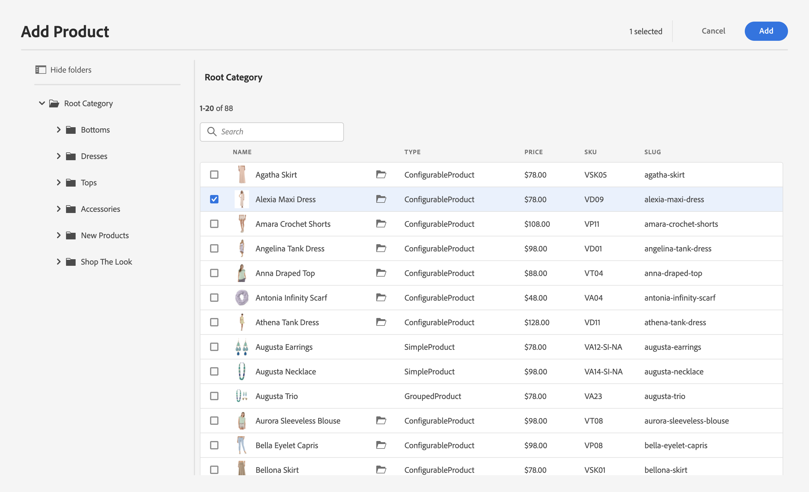
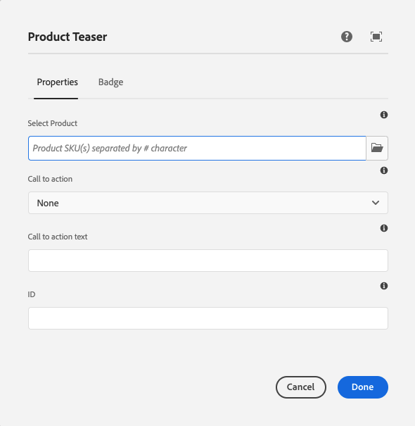
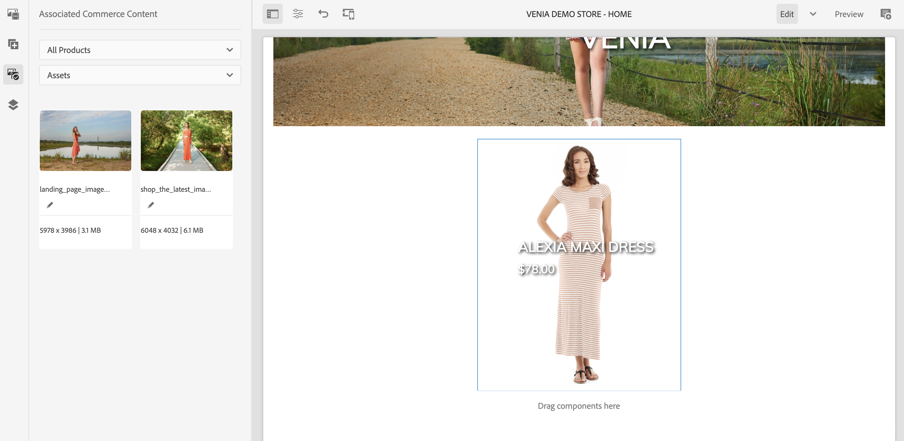

# 創作商業體驗 {#authoring-commerce-experiences}

## 概覽 {#overview}

CIF附加模組擴展了具AEM有特定商業功能的創作。 這使作者能夠通過訪問產品資料和內容而無需離開上下文而高效地構建和管理與商業相關的體驗。

## 扒手 {#pickers}

產品和類別選擇器是模式UI對話框，它為作者提供了一種舒適的方AEM法，以便在需要時查找和選擇產品或類別。 核心元件、內容關聯和產品模板是配置中需要產品目錄資料的典型區域。 選取器支援各種配置選項，如多選、變異選擇和預選值。

### 產品挑選器 {#product-picker}

此選取器提供瀏覽目錄結構或全文搜索以查找產品。 帶有變體的產品在「類型」列中提供資料夾表徵圖。 按一下資料夾表徵圖可開啟選定產品的變體。

按一下父類別將使作者返回產品級別。

**示例產品預告**

此元件的配置對話框需要產品。 CIF使用SKU作為產品標識符。 作者可以手動輸入sku，或按一下資料夾表徵圖開啟產品選取器。 選擇並關閉選取器後，元件對話框將顯示所選產品的名稱

### 類別選取器 {#category-picker}

此選取器提供瀏覽目錄結構以查找類別。

**類別旋轉木馬**

此元件的配置對話框需要1 :n類別。 CIF使用UID / ID作為類別標識符。 作者可以手動輸入UID，或按一下資料夾表徵圖開啟類別選取器。 選擇並關閉選取器後，元件對話框將顯示選定類別的名稱。

## 通用編輯器 {#universal-editor}

通用編輯器擴展了訪問即時產品資料和相關產品內容的功能。

### 訪問產品資料 {#access-product-data}

編輯器「側」面板中的「資產」頁籤通過選擇「產品」類型提供對產品資料的訪問。 從配置的商業終結點即時獲取資料。 篩選器是對商業終結點進行的全文搜索，以查找特定產品。

與資產類似，產品可以在頁面上（建立預設的產品預告元件）或元件（當前支援的產品預告和產品傳送）。

### 使用RTE在文本欄位中添加連結 {#rte}

CIF產品目錄頁是即時呈現的虛擬頁。 因此，不可能為常規頁AEM面嵌入超連結。 CIF向RTE（富格文本編輯器）添加一個新操作「商業連結」。 此操作與常規的「超連結」操作完全相同，但允許作者使用選取器選擇產品或類別。

    >[！注釋]
    >
    >如果同時選擇了類別和產品，則將選擇產品。

這將建立一個佔位符連結，在呈現頁面時，該連結將被實際連結替換。

### 訪問關聯的產品內容 {#associated-content}

如果通用編輯器在頁面上識別1:n產品，則側面板將自動顯示「關聯的商業內容」頁籤。 此頁籤允許作者快速訪AEM問用產品標籤的內容(請參見 [對相關內容豐富產品數AEM據](./enrich-product-associated-content.md) )的正平方根。 如果頁面上有多個產品，則此頁籤提供用於篩選內容類型和特定產品的下拉清單。 使用內容與使用「資產」頁籤中的內容非常相似。

### 預覽已提貨的產品資料 {#staged-data}

編輯器中的Timewarp模式允許作者根據Timewarp日AEM期預覽和瀏覽分階段產品目錄資料的體驗。

如果已暫存使用的日期，則元件將顯示可視指示器。

## Omnisearch {#omnisearch}

使用Omnisearch是使用全文搜索來查找AEM內容和產品目錄資料的簡便方法。 Omnisearch將在商業後端運行全AEM文搜索，以在商業後端和內容中查找產AEM品目錄對象。 結AEM果還包括用產品/類別資料標籤的內容。

結果按類型分組。

    >[！注釋]
    >
    > Omnisearch中的全文搜索不支援關聯的內容片段。 使用SKU或UID查找關聯的內容片段。
