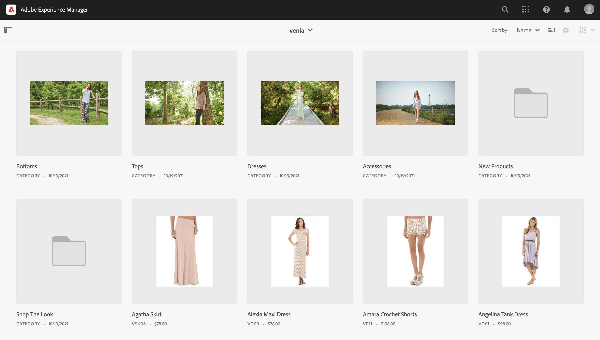

# 產品座艙 {#product-cockpit}

## 總覽 {#overview}

「產品座艙」提供連結產品目錄和相關內容的統一概述。 所有相關內容都具有可從駕駛艙快速訪問的連結。

分階段產品資料包含未來的任何變異，例如新類別、產品或更新的屬性。

>[!NOTE]
>
>術語產品目錄可與商務商店、商店視圖和類似的表達式互換。

## 設定 {#configuration}

產品目錄需在AEM中設定。 請參閱 [配置儲存和目錄](https://experienceleague.adobe.com/docs/experience-manager-cloud-service/content-and-commerce/storefront/getting-started.html?#catalog) 以取得更多資訊。

啟用分段目錄功能需要驗證。 請參閱 [快速入門](https://experienceleague.adobe.com/docs/experience-manager-cloud-service/content-and-commerce/storefront/getting-started.html) 以取得更多資訊。

>[!NOTE]
>
>分級目錄功能僅適用於支援權杖式驗證的Adobe Commerce和第三方連接器。

## 開啟產品座艙 {#opening-product-cockpit}

要存取「產品座艙」，最簡單的方式是透過AEM主功能表中的「商務」功能表。 您也可以使用Omnisearch（搜尋商務）或開啟 `https://<yourAEMInstance>/commerce.html`.

## 瀏覽產品目錄 {#browsing-product-catalogs}

產品座艙按照產品目錄結構以分層方式組織。 第一層顯示所有已配置產品目錄的目錄根級別，包括商務後端的元資訊。

按一下類別會載入已點按類別的子項。

按一下產品會載入產品變數（如果有）。

>[!NOTE]
>
>AEM中的產品目錄資料是透過設定的商務端點即時擷取的資料。 沒有產品目錄資料儲存在AEM中。

## 搜尋產品目錄 {#searching-product-catalog}

左側篩選器標籤中提供針對完整產品目錄的全文搜尋，以快速尋找產品。

## 瀏覽分段產品目錄 {#staged-product-catalogs}

依預設，產品座艙會顯示即時產品目錄資料。 使用左側篩選標籤中的「分階段目錄」，將載入任何所選日期的產品目錄。

## 產品目錄屬性 {#catalog-properties}

按一下產品或類別的屬性圖示，將會開啟所選物件的屬性檢視。 產品變體的開啟屬性等於開啟主要產品屬性。

### 商務標籤 {#tabs}

一般標籤和變體標籤會顯示來自商務後端的預先定義商務屬性。 此資料(包括 變體)是AEM中的唯讀資料，因為記錄系統是商務後端。 變體頁簽只會針對具有變體的產品顯示，並顯示所有變體的清單。

### AEM內容標籤 {#content-tabs}

這些標籤會依AEM內容類型（體驗片段、內容片段、關聯資產）分組，顯示與商務物件相關聯的AEM內容。 「檢視詳細資料」動作會開啟含有所選內容的新瀏覽器標籤。

