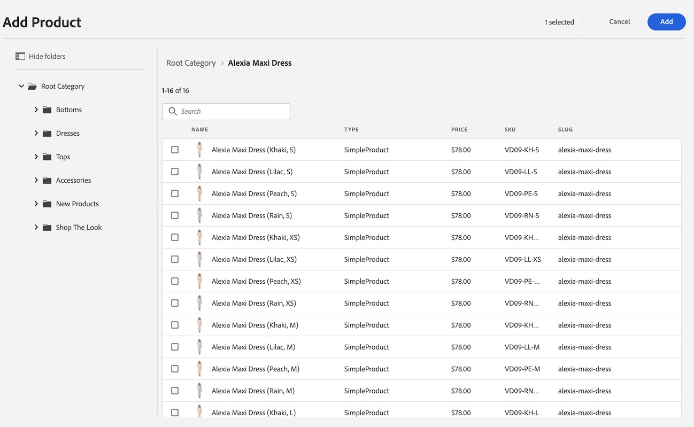

# 編寫Commerce體驗 {#authoring-commerce-experiences}

## 概觀 {#overview}

CIF附加元件以特定於Commerce的功能擴充AEM的製作功能。 這可讓作者在不離開內容的情況下存取產品資料和內容，以有效率地建置和管理商務相關的體驗。

## 選取器 {#pickers}

產品和類別選擇器是模組UI對話方塊，可讓AEM作者在需要時輕鬆尋找和選取產品或類別。 核心元件、內容關聯和產品範本是設定需要產品目錄資料的一般區域。 選擇器支援各種設定選項，例如多重選擇、變數選擇和預先選擇值。

### 產品挑選器 {#product-picker}

此選取器提供在目錄結構或全文檢索搜尋中瀏覽，以尋找產品的功能。 具有變數的產品會在「型別」欄中提供資料夾圖示。 按一下資料夾圖示會開啟所選產品的變化。

按一下父類別會將作者帶回產品層級。

#### 產品Teaser範例 {#example-product-teaser}

此元件的設定對話方塊需要產品。 CIF使用SKU作為產品識別碼。 作者可以手動輸入SKU或按一下資料夾圖示以開啟產品選擇器。 選取並關閉選擇器後，元件對話方塊會顯示所選產品的名稱

### 類別選取器 {#category-picker}

此選取器提供在目錄結構中瀏覽以尋找類別的功能。

#### 類別輪播範例 {#example-carousel}

此元件的設定對話方塊需要1 ： n類別。 CIF使用UID / ID作為類別識別碼。 作者可以手動輸入UID或按一下資料夾圖示以開啟類別選擇器。 選取並關閉選擇器後，元件對話方塊會顯示所選類別的名稱。

具有選取範圍的

## 頁面編輯器 {#page-editor}

AEM中的頁面編輯器已擴充功能，可存取即時產品資料和相關產品內容。

### 存取產品資料 {#access-product-data}

在編輯器側面板中的「Assets」索引標籤中，選取「產品」型別即可存取產品資料。 會從設定的商務端點即時擷取資料。 此篩選器是商務端點上的全文檢索搜尋，以尋找特定產品。

與資產類比，產品可在頁面上加入（這會建立產品Teaser元件作為預設）或元件（目前支援的是產品Teaser和產品輪播）。

### 使用RTE在文字欄位中新增連結 {#rte}

CIF產品目錄頁面是即時轉譯的虛擬頁面。 因此，不可能內嵌一般AEM頁面之類的超連結。 CIF將動作「Commerce連結」新增至RTE （RTF編輯器）。 此動作的運作方式與一般的「超連結」動作完全相同，但可讓作者使用選擇器選取產品或類別。

>[!NOTE]
>
> 如果同時選取類別和產品，則會採用產品。

這會建立預留位置連結，在頁面轉譯時以實際連結取代。

### 存取關聯產品內容 {#associated-content}

如果編輯器在頁面上辨識1:n個產品，側面板會自動顯示「關聯的Commerce內容」索引標籤。 此索引標籤可讓作者快速存取已使用產品標籤的AEM內容(如需詳細資訊，請參閱[以相關AEM內容擴充產品資料](/help/commerce-cloud/cif-storefront/authoring/enrich-product-associated-content.md))。 如果頁面上有多個產品，此索引標籤會提供下拉式清單，以篩選內容型別和特定產品。 使用內容的運作方式與使用「Assets」標籤中的內容完全相同。

### 預覽階段產品資料 {#staged-data}

編輯器中的時間扭曲模式可讓作者根據時間扭曲日期，使用分階段產品目錄資料來預覽和瀏覽AEM體驗。

如果使用的日期已分段，元件會顯示視覺指示器。

## Omnisearch {#omnisearch}

使用Omnisearch可讓從業人員透過全文檢索搜尋，輕鬆尋找AEM內容和產品目錄資料。 Omnisearch將在AEM和commerce後端中執行全文搜尋，以在commerce後端和AEM內容中尋找產品目錄物件。 AEM結果也包含已標籤產品/類別資料的內容。

結果會依型別分組。

>[!NOTE]
>
> Omnisearch中的全文檢索搜尋不支援相關聯的內容片段。 使用SKU或UID來尋找相關聯的內容片段。
