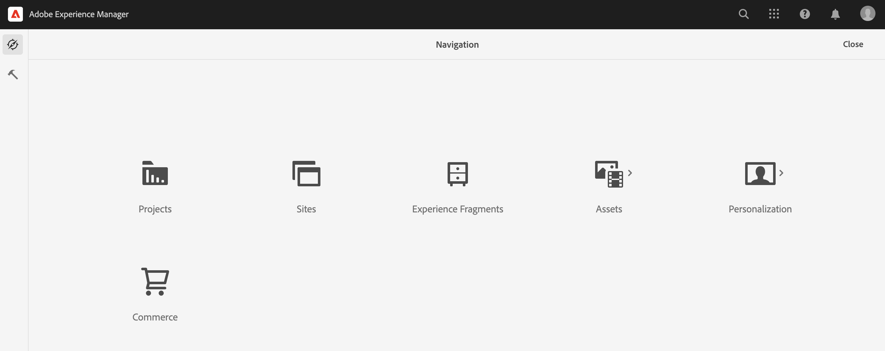
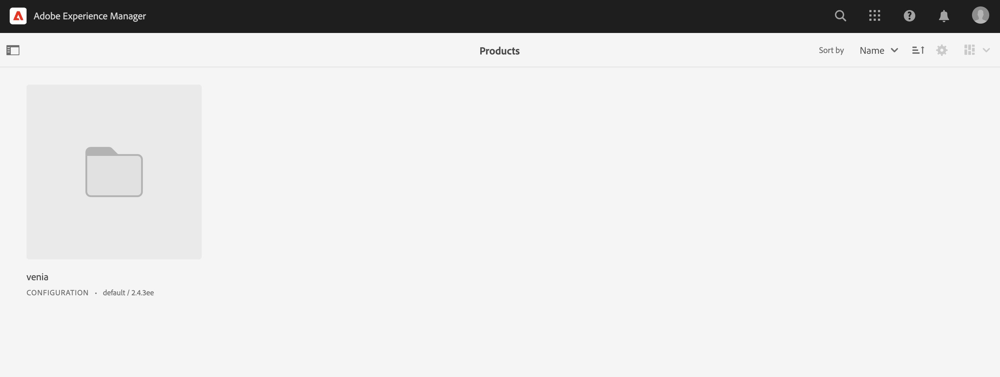
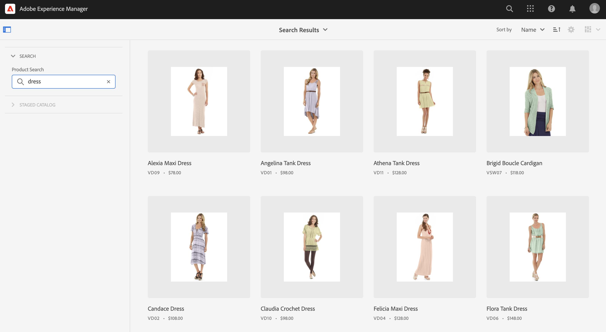

# 產品駕駛艙 {#product-cockpit}

瞭解如何使用產品駕駛艙，提供連結產品目錄和相關內容的統一總覽。

## 概觀 {#overview}

「產品駕駛艙」提供連結產品目錄和相關內容的統一概觀。 所有關聯內容都有連結，可快速從駕駛艙存取內容。

分階段產品資料包含未來的任何突變，例如新類別、產品或更新的屬性。

>[!NOTE]
>
>術語產品目錄可與商務商店、商店檢視和類似運算式互換。

## 設定 {#configuration}

產品目錄必須在AEM中設定。 如需詳細資訊，請參閱[設定存放區和目錄](/help/commerce-cloud/cif-storefront/getting-started.md#catalog)。

啟用分階段目錄功能需要驗證。 如需詳細資訊，請參閱[快速入門](/help/commerce-cloud/cif-storefront/getting-started.md)。

>[!NOTE]
>
>只有支援權杖式驗證的Adobe Commerce和協力廠商聯結器才提供分階段目錄功能。

## 開啟產品駕駛艙 {#opening-product-cockpit}

存取產品駕駛艙最簡單的方式是透過AEM主要功能表中的「Commerce」功能表。 也可以使用Omnisearch (搜尋Commerce)或開啟`https://<yourAEMInstance>/commerce.html`。

## 瀏覽產品目錄 {#browsing-product-catalogs}

「產品駕駛艙」會依照產品目錄結構以階層方式組織。 第一個層級顯示所有已設定產品目錄的目錄根層級，包括商業後端的中繼資訊。

按一下類別會載入已按一下類別的子系。

按一下產品會載入產品變數（若有）。

>[!NOTE]
>
>AEM中的產品目錄資料是透過設定的商務端點即時擷取的資料。 AEM中未儲存任何產品目錄資料。

## 搜尋產品目錄 {#searching-product-catalog}

在左側篩選索引標籤中提供完整產品目錄的全文檢索搜尋，以快速尋找產品。

## 瀏覽分階段產品目錄 {#staged-product-catalogs}

依預設，產品駕駛艙會顯示即時產品目錄資料。 使用左側篩選索引標籤中的「階段目錄」，載入任何所選日期的產品目錄。

## 產品目錄屬性 {#catalog-properties}

按一下產品或類別的屬性圖示會開啟所選物件的屬性檢視。 產品變體的開啟屬性等於開啟主要產品屬性。

### Commerce標籤 {#tabs}

一般和變體標籤會顯示來自商務後端的預先定義商務屬性。 此資料(包括 變體)是AEM中的唯讀資料，因為記錄系統是商務後端。 變體索引標籤只會針對具有變體的產品顯示，並顯示所有變體的清單。

### AEM內容標籤 {#content-tabs}

這些按AEM內容型別(體驗片段、內容片段、相關Assets)分組的標籤會顯示與商業物件相關的AEM內容。 「檢視詳細資料」動作會開啟新的瀏覽器索引標籤，其中包含選取的內容。

