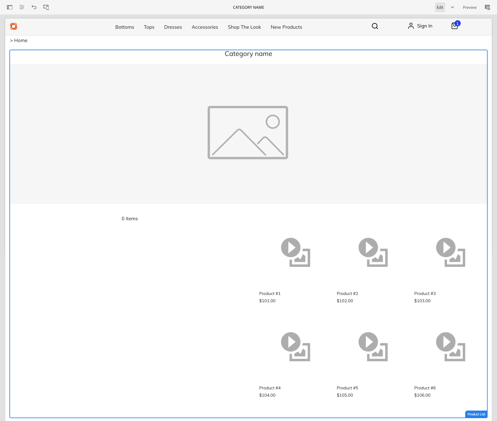
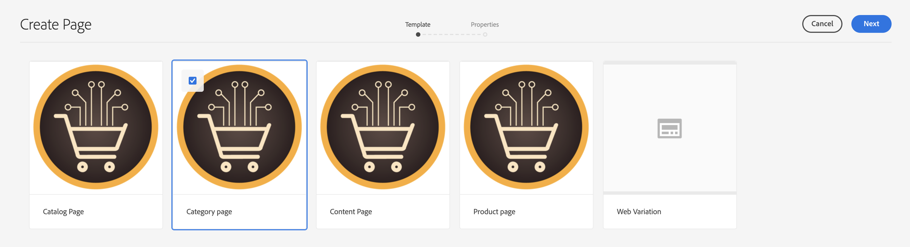
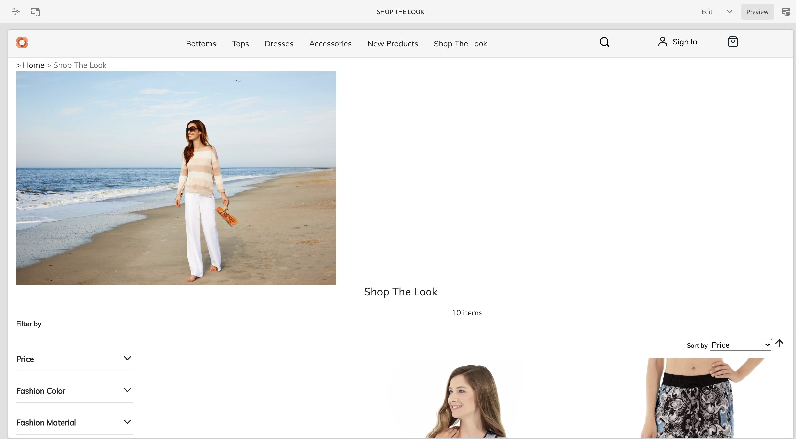

# 管理產品目錄頁面和範本 {#product-catalog}

瞭解如何管理產品目錄頁面和範本。

## 目前進度 {#story-so-far}

在AEM內容與Commerce製作歷程的上一份檔案中，[AEM CIF製作基本知識快速入門，](/help/commerce-cloud/cif-storefront/commerce-journeys/aem-commerce-content-author/getting-started.md)您已瞭解CIF製作的基本知識。

本文基於這些基礎之上。

## 目標 {#objective}

本檔案可協助您瞭解如何管理產品目錄頁面和範本。 閱讀本文件後，您應該：

* 瞭解目錄範本的概念
* 一般範本的運作方式
* 已建立個別範本

## 基本概念 {#basic-concept}

Venia storefront提供典型的產品目錄體驗，包括導覽、登陸、類別(PLP)和產品詳細資料頁面(PDP)。

目錄頁面是使用AEM CIF目錄範本及即時產品資料來動態建置，且會在需要時從商務端點擷取。 每個目錄都有產品和類別頁面的一般範本。

導覽元件會顯示內容和目錄頁面。 可以顯示目錄登陸頁面或導覽中的第一級類別。 將游標暫留在類別上會將第二層類別顯示為第二行。

按一下類別會開啟類別頁面（或產品清單頁面）。

按一下產品會開啟產品詳細資料頁面。

## 範本 {#templates}

### 通用範本 {#generic}

一般Venia目錄範本使用產品清單核心元件。 此元件會顯示類別影像（如果可用）和類別中的產品。

一般Venia產品範本使用產品詳細資料核心元件。 此元件會顯示各種產品型別和加入購物車動作的產品資訊。

### 編輯範本 {#edit-templates}

您可以直接開啟範本頁面或在瀏覽產品目錄頁面時切換到編輯模式來編輯範本。 請記住，變更頁面將會變更範本，而不僅僅是產品/類別的特定頁面。

### 類別或產品特定範本 {#specific}

只要按幾下，CIF即可支援多個範本。 若要建立其他範本，請從個別類別中選取一般範本，並使用&#x200B;**建立**&#x200B;動作建立頁面。

選取個別產品或類別範本。

輸入標題並建立頁面。

請注意，您現在在一般範本底下有一個特定範本。

開啟範本。 它看起來與一般類別範本完全相同。

在頁面上方新增任何影像。

範本可與任何類別/產品一起預覽。 開啟&#x200B;**頁面資訊**，然後選取&#x200B;**使用類別/產品檢視**。 從選擇器選取產品/類別，以取得此產品/類別的預覽。 選取&#x200B;**購買Look**&#x200B;類別以取得更新範本的預覽。

現在您必須將此範本指派給特定類別。 開啟&#x200B;**頁面資訊**&#x200B;功能表中的屬性，並切換至商務標籤。 按一下資料夾圖示，從類別選擇器選取&#x200B;**Shop The Look**&#x200B;類別。 您可以啟用核取方塊，將多個類別指派給範本，也可以包含子類別。

返回主首頁，然後按一下&#x200B;**購買Look**&#x200B;類別以檢視特定範本。 所有其他類別仍使用一般範本。

可套用相同的工作流程來建立個別產品範本。

## 後續步驟 {#what-is-next}

現在您已完成歷程的這一部分，您應該：

* 瞭解目錄範本的概念
* 一般範本的運作方式
* 已建立個別範本

在此基礎上繼續您的歷程，接下來檢閱檔案[管理分階段產品目錄體驗，](/help/commerce-cloud/cif-storefront/commerce-journeys/aem-commerce-content-author/staged-catalog.md)，瞭解如何使用分階段產品資料和AEM啟動。

## 其他資源 {#additional-resources}

我們建議您檢閱檔案[管理分階段產品目錄體驗，](/help/commerce-cloud/cif-storefront/commerce-journeys/aem-commerce-content-author/staged-catalog.md)來繼續此歷程的下一部分，以下是一些其他選擇性資源，這些資源會更深入地研究本檔案中提到的一些概念，但並非繼續無周邊歷程所必需的：

* [建立多個類別和產品頁面](/help/commerce-cloud/cif-storefront/authoring/multi-template-usage.md)
* [Experience Manager Cloud Service移轉指南](/help/commerce-cloud/cif-storefront/migration.md) — 如何從舊版移轉至AEM Commerce integration framework (CIF)附加元件
