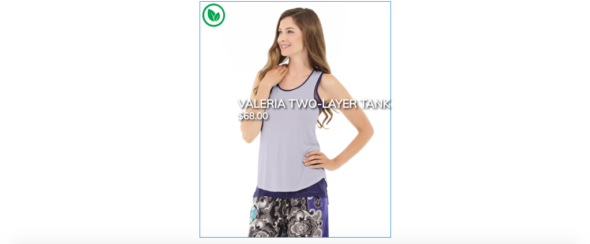
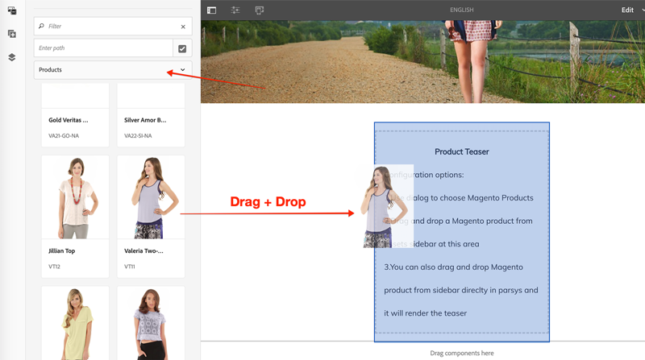
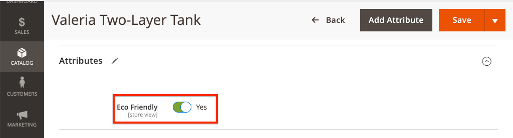
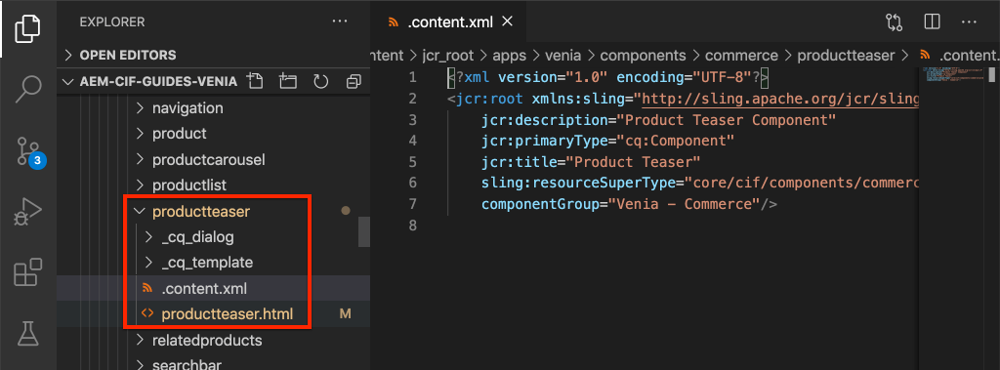
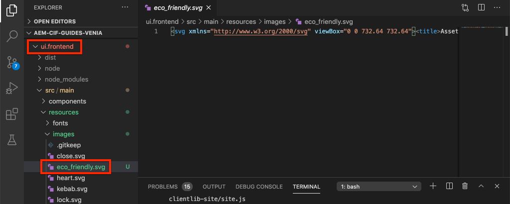

# 自訂AEM CIF核心元件 {#customize-cif-components}

[CIF Venia專案](https://github.com/adobe/aem-cif-guides-venia)是使用[CIF核心元件的參考程式碼基底。](https://github.com/adobe/aem-core-cif-components)在本教學課程中，您進一步延伸[產品預告](https://github.com/adobe/aem-core-cif-components/tree/master/ui.apps/src/main/content/jcr_root/apps/core/cif/components/commerce/productteaser/v1/productteaser)元件，以顯示來自Adobe Commerce的自訂屬性。 您也會進一步瞭解AEM與Adobe Commerce之間的GraphQL整合，以及CIF核心元件所提供的擴充功能勾點。

>[!TIP]
>
> 開始您自己的商務實作時使用[AEM專案原型](https://github.com/adobe/aem-project-archetype)。

## 您將建置的內容

Venia品牌最近開始使用永續性材料來製造某些產品，而企業想要在Product Teaser中顯示&#x200B;**環保型**&#x200B;徽章。 在Adobe Commerce中建立新的自訂屬性，以指出產品是否使用&#x200B;**環保材料**。 此自訂屬性會新增為GraphQL查詢的一部分，並顯示在指定產品的產品Teaser上。



## 先決條件 {#prerequisites}

本機開發環境是完成本教學課程的必要條件。 此環境包含已設定並連線至AEM執行個體的Adobe Commerce執行個體。 檢閱[使用AEM as a Cloud Service SDK設定本機開發的需求和步驟。](/help/commerce-cloud/cif-storefront/develop.md)若要完全遵循教學課程，您需要許可權才能將[屬性新增至Adobe Commerce中的產品](https://docs.magento.com/user-guide/catalog/product-attributes-add.html)。

您也需要GraphQL IDE （例如[GraphiQL](https://github.com/graphql/graphiql)）或瀏覽器擴充功能來執行程式碼範例和教學課程。 如果您安裝瀏覽器擴充功能，請確定它可設定請求標頭。 在Google Chrome上，_Altair GraphQL Client_&#x200B;是可執行工作的擴充功能。

## 原地複製Venia專案 {#clone-venia-project}

複製[Venia專案，](https://github.com/adobe/aem-cif-guides-venia)，然後覆寫預設樣式。

>[!NOTE]
>
> **請隨時使用現有的專案** (根據包含CIF的AEM專案原型)並略過本節。

1. 執行下列git命令，以便複製專案：

   ```shell
   $ git clone git@github.com:adobe/aem-cif-guides-venia.git
   ```

1. 建立專案並將其部署到AEM的本機執行個體：

   ```shell
   $ cd aem-cif-guides-venia/
   $ mvn clean install -PautoInstallSinglePackage,cloud
   ```

1. 新增必要的OSGi設定，以便將AEM執行個體連結至Adobe Commerce執行個體，或將設定新增至已建立的專案。

1. 此時，您應該有已連線至Adobe Commerce執行個體的有效店面版本。 導覽至`US` > `Home`頁面： [http://localhost:4502/editor.html/content/venia/us/en.html](http://localhost:4502/editor.html/content/venia/us/en.html)。

   您應該會看到店面目前使用Venia佈景主題。 展開店面的「主要」功能表，應該會看到各種類別，表示與Adobe Commerce的連線正常運作。

   的店面

## 編寫產品Teaser {#author-product-teaser}

產品Teaser元件在本教學課程中皆已擴充。 首先，將產品Teaser的執行個體新增到首頁以瞭解基準功能。

1. 瀏覽至網站的&#x200B;**首頁**： [http://localhost:4502/editor.html/content/acme/us/en.html](http://localhost:4502/editor.html/content/acme/us/en.html)

1. 將新的&#x200B;**Product Teaser**&#x200B;元件插入頁面上的主要配置容器。

   

1. 展開「側面板」（如果尚未切換），並將資產尋找器下拉式清單切換為&#x200B;**產品**。 此清單應會顯示已連線Adobe Commerce執行個體的可用產品清單。 選取產品並&#x200B;**將其拖放**&#x200B;至頁面上的&#x200B;**產品Teaser**&#x200B;元件。

   

   >[!NOTE]
   >
   > 請注意，您也可以使用對話方塊（按一下&#x200B;_扳手_&#x200B;圖示）設定元件，以設定顯示的產品。

1. 您現在應該會看到產品Teaser顯示的產品。 產品的「名稱」和產品的「價格」是顯示的預設屬性。

   

## 在Adobe Commerce中新增自訂屬性 {#add-custom-attribute}

AEM中顯示的產品和產品資料儲存在Adobe Commerce中。 接著，使用Adobe Commerce UI將&#x200B;**環保型**&#x200B;的屬性新增為產品屬性集的一部分。

>[!TIP]
>
> 已有自訂&#x200B;**是/否**&#x200B;屬性作為產品屬性集的一部分嗎？ 歡迎您隨時使用，並略過本節。

1. 登入您的Adobe Commerce執行個體。
1. 導覽至&#x200B;**目錄** > **產品**。
1. 更新搜尋篩選器，以便您可以找到在前一個練習中新增至Teaser元件時所使用的&#x200B;**可設定產品**。 在編輯模式中開啟產品。

   

1. 在產品檢視中，按一下&#x200B;**新增屬性** > **建立新屬性**。
1. 使用下列值填寫&#x200B;**新屬性**&#x200B;表單（保留其他值的預設設定）

   | 欄位集 | 欄位標籤 | 值 |
   | ----------------------------- | ------------------ | ---------------- |
   | 屬性屬性 | 屬性標籤 | **環保型** |
   | 屬性屬性 | 目錄輸入型別 | **是/否** |
   | 進階屬性特性 | 屬性代碼 | **環保** |

   

   完成時，按一下&#x200B;**儲存屬性**。

1. 捲動至產品底部，並展開&#x200B;**屬性**&#x200B;標題。 您應該會看到新的&#x200B;**環保型**&#x200B;欄位。 切換至&#x200B;**是**。

   

   **儲存**&#x200B;產品的變更。

   >[!TIP]
   >
   > 如需有關管理[產品屬性的詳細資訊，請參閱Adobe Commerce使用手冊。](https://docs.magento.com/user-guide/catalog/attribute-best-practices.html)

1. 瀏覽至&#x200B;**系統** > **工具** > **快取管理**。 由於資料結構已更新，因此您必須使Adobe Commerce中的部分快取型別失效。
1. 勾選&#x200B;**組態**&#x200B;旁的方塊，然後提交&#x200B;**重新整理**&#x200B;的快取型別

   

   >[!TIP]
   >
   > 有關[快取管理的詳細資訊，請參閱Adobe Commerce使用手冊。](https://docs.magento.com/user-guide/system/cache-management.html)

## 使用GraphQL IDE驗證屬性 {#use-graphql-ide}

在跳入AEM程式碼之前，使用GraphQL IDE來探索[GraphQL概觀](https://devdocs.magento.com/guides/v2.4/graphql/)會很有用。 Adobe Commerce與AEM的整合主要是透過一系列GraphQL查詢來完成。 瞭解並修改GraphQL查詢是擴充CIF核心元件的重要方式之一。

接下來，使用GraphQL IDE來驗證`eco_friendly`屬性是否已新增至產品屬性集。 本教學課程中的熒幕擷取畫面使用&#x200B;_Altair GraphQL Client_ Google Chrome擴充功能。

1. 開啟GraphQL IDE，並在IDE或擴充功能的URL列中，輸入URL `http://<commerce-server>/graphql`。
1. 新增下列[產品查詢](https://devdocs.magento.com/guides/v2.4/graphql/queries/products.html)，其中`YOUR_SKU`是上一個練習中所使用產品的&#x200B;**SKU**：

   ```json
     {
       products(
       filter: { sku: { eq: "YOUR_SKU" } }
       ) {
           items {
           name
           sku
           eco_friendly
           }
       }
   }
   ```

1. 執行查詢，您應該會收到如下的回應：

   ```json
   {
     "data": {
       "products": {
         "items": [
           {
             "name": "Valeria Two-Layer Tank",
             "sku": "VT11",
             "eco_friendly": 1
           }
         ]
       }
     }
   }
   ```

   

   **Yes**&#x200B;的值是&#x200B;**1**&#x200B;的整數。 當您使用Java™撰寫GraphQL查詢時，這個值相當實用。

   >[!TIP]
   >
   > 如需詳細資訊，請參閱[Adobe Commerce GraphQL。](https://devdocs.magento.com/guides/v2.4/graphql/index.html)

## 更新產品Teaser的Sling模型 {#updating-sling-model-product-teaser}

接下來，您可以實作Sling模型來擴充產品Teaser的商業邏輯。 [Sling模型](https://sling.apache.org/documentation/bundles/models.html)是註釋導向的「POJO」(純舊的Java™物件)，可實作元件所需的商業邏輯。 Sling模型會搭配HTL指令碼使用作為元件的一部分。 遵循Sling模型[的](https://github.com/adobe/aem-core-wcm-components/wiki/Delegation-Pattern-for-Sling-Models)委派模式，以便您可以擴充現有產品Teaser模型的部分。

Sling模型已實作為Java™，且可在產生專案的&#x200B;**核心**&#x200B;模組中找到。

使用[您選擇的IDE](https://experienceleague.adobe.com/docs/experience-manager-learn/cloud-service/local-development-environment-set-up/development-tools.html#set-up-the-development-ide)匯入Venia專案。 使用的熒幕擷取畫面來自[Visual Studio Code IDE。](https://experienceleague.adobe.com/docs/experience-manager-learn/cloud-service/local-development-environment-set-up/development-tools.html#microsoft-visual-studio-code)

1. 在您的IDE中，在&#x200B;**核心**&#x200B;模組下方導覽至： `core/src/main/java/com/venia/core/models/commerce/MyProductTeaser.java`。

   

   `MyProductTeaser.java`是擴充CIF [ProductTeaser](https://github.com/adobe/aem-core-cif-components/blob/master/bundles/core/src/main/java/com/adobe/cq/commerce/core/components/models/productteaser/ProductTeaser.java)介面的Java™介面。

   已經新增名為`isShowBadge()`的新方法，以在產品視為「新」時顯示徽章。

1. 將`isEcoFriendly()`新增至介面：

   ```java
   @ProviderType
   public interface MyProductTeaser extends ProductTeaser {
       // Extend the existing interface with the additional properties which you
       // want to expose to the HTL template.
       public Boolean isShowBadge();
   
       public Boolean isEcoFriendly();
   }
   ```

   引入這個新方法是為了封裝邏輯，以指出產品的`eco_friendly`屬性是否設定為&#x200B;**是**&#x200B;或&#x200B;**否**。

1. 接下來，在`MyProductTeaserImpl.java`檢查`core/src/main/java/com/venia/core/models/commerce/MyProductTeaserImpl.java`。

   Sling模型[的](https://github.com/adobe/aem-core-wcm-components/wiki/Delegation-Pattern-for-Sling-Models)委派模式允許`MyProductTeaserImpl`透過`ProductTeaser`屬性參考`sling:resourceSuperType`模型：

   ```java
   @Self
   @Via(type = ResourceSuperType.class)
   private ProductTeaser productTeaser;
   ```

   對於您不想覆寫或變更的方法，您可以傳回`ProductTeaser`傳回的值。 例如：

   ```java
   @Override
   public String getImage() {
       return productTeaser.getImage();
   }
   ```

   此方法可將實作必須寫入的Java™程式碼數量降至最低。

1. AEM CIF核心元件提供的其中一個額外擴充點是`AbstractProductRetriever`，可讓您存取特定產品屬性。 檢查`initModel()`方法：

   ```java
   import javax.annotation.PostConstruct;
   ...
   @Model(adaptables = SlingHttpServletRequest.class, adapters = MyProductTeaser.class, resourceType = MyProductTeaserImpl.RESOURCE_TYPE)
   public class MyProductTeaserImpl implements MyProductTeaser {
       ...
       private AbstractProductRetriever productRetriever;
   
       /* add this method to initialize the productRetriever */
       @PostConstruct
       public void initModel() {
           productRetriever = productTeaser.getProductRetriever();
   
           if (productRetriever != null) {
               productRetriever.extendProductQueryWith(p -> p.createdAt());
           }
   
       }
   ...
   ```

   `@PostConstruct`註解可確保在Sling模型初始化時呼叫此方法。

   請注意，產品GraphQL查詢已使用`extendProductQueryWith`方法延伸，以擷取額外的`created_at`屬性。 此屬性稍後會用作`isShowBadge()`方法的一部分。

1. 更新GraphQL查詢以將`eco_friendly`屬性包含在部分查詢中：

   ```java
   //MyProductTeaserImpl.java
   
   private static final String ECO_FRIENDLY_ATTRIBUTE = "eco_friendly";
   
   @PostConstruct
   public void initModel() {
       productRetriever = productTeaser.getProductRetriever();
   
       if (productRetriever != null) {
           productRetriever.extendProductQueryWith(p -> p
               .createdAt()
               .addCustomSimpleField(ECO_FRIENDLY_ATTRIBUTE)
           );
       }
   }
   ```

   將新增至`extendProductQueryWith`方法是確保其他產品屬性可供模型其他部分使用的強大方法。 它也會將執行的查詢數減到最少。

   在上述程式碼中，`addCustomSimpleField`是用來擷取`eco_friendly`屬性。 此屬性說明如何查詢屬於Adobe Commerce結構描述一部分的任何自訂屬性。

   >[!NOTE]
   >
   > `createdAt()`方法已實作為[產品介面的一部分。](https://github.com/adobe/commerce-cif-magento-graphql/blob/master/src/main/java/com/adobe/cq/commerce/magento/graphql/ProductInterface.java)大部分常見的結構描述屬性已經實作，因此請只將`addCustomSimpleField`用於真正的自訂屬性。

1. 新增記錄器，以便針對Java™程式碼進行偵錯：

   ```java
   import org.slf4j.Logger;
   import org.slf4j.LoggerFactory;
   ...
   @Model(adaptables = SlingHttpServletRequest.class, adapters = MyProductTeaser.class, resourceType = MyProductTeaserImpl.RESOURCE_TYPE)
   public class MyProductTeaserImpl implements MyProductTeaser {
   
   private static final Logger LOGGER = LoggerFactory.getLogger(MyProductTeaserImpl.class);
   ```

1. 接下來，實作`isEcoFriendly()`方法：

   ```java
   @Override
   public Boolean isEcoFriendly() {
   
       Integer ecoFriendlyValue;
       try {
           ecoFriendlyValue = productRetriever.fetchProduct().getAsInteger(ECO_FRIENDLY_ATTRIBUTE);
           if(ecoFriendlyValue != null && ecoFriendlyValue.equals(Integer.valueOf(1))) {
               LOGGER.info("*** Product is Eco Friendly**");
               return true;
           }
       } catch (SchemaViolationError e) {
           LOGGER.error("Error retrieving eco friendly attribute");
       }
       LOGGER.info("*** Product is not Eco Friendly**");
       return false;
   }
   ```

   在上述方法中，`productRetriever`用於擷取產品，`getAsInteger()`方法用於取得`eco_friendly`屬性的值。 根據您先前執行的GraphQL查詢，您知道`eco_friendly`屬性設為&quot;**是**&quot;時的預期值實際上是&#x200B;**1**&#x200B;的整數。

   現在Sling模型已更新，元件標籤必須更新，才能根據Sling模型實際顯示&#x200B;**環保型**&#x200B;的指標。

## 自訂產品Teaser的標籤 {#customize-markup-product-teaser}

AEM元件的常見擴充功能是修改元件產生的標籤。 此編輯是透過覆寫元件用來呈現其標籤的[HTL指令碼](https://experienceleague.adobe.com/docs/experience-manager-htl/content/overview.html)來完成。 HTML範本語言(HTL)是一種輕量型的範本語言，AEM元件會使用它來根據編寫的內容動態呈現標籤，並允許元件重複使用。 例如，產品Teaser可以重複使用以顯示不同的產品。

在此案例中，您想要在Teaser上方呈現橫幅，以根據自訂屬性指出產品是「環保的」。 自訂元件標籤[的](https://experienceleague.adobe.com/docs/experience-manager-core-components/using/developing/customizing.html#customizing-the-markup)設計模式，是所有AEM元件的標準設定，不只是AEM CIF核心元件的標準設定。

>[!NOTE]
>
> 如果您使用CIF產品和類別選擇器(例如此產品Teaser或CIF頁面元件)自訂元件，請務必加入元件對話方塊所需的`cif.shell.picker` clientlib。 如需詳細資訊，請參閱[CIF產品和類別選擇器的使用情形](use-cif-pickers.md)。

1. 在IDE中，導覽並展開`ui.apps`模組，並將資料夾階層展開至： `ui.apps/src/main/content/jcr_root/apps/venia/components/commerce/productteaser`並檢查`.content.xml`檔案。

   

   ```xml
   <?xml version="1.0" encoding="UTF-8"?>
   <jcr:root xmlns:sling="http://sling.apache.org/jcr/sling/1.0" xmlns:cq="http://www.day.com/jcr/cq/1.0" xmlns:jcr="http://www.jcp.org/jcr/1.0"
       jcr:description="Product Teaser Component"
       jcr:primaryType="cq:Component"
       jcr:title="Product Teaser"
       sling:resourceSuperType="core/cif/components/commerce/productteaser/v1/productteaser"
       componentGroup="Venia - Commerce"/>
   ```

   以上元件定義適用於專案中的產品Teaser元件。 請注意屬性`sling:resourceSuperType="core/cif/components/commerce/productteaser/v1/productteaser"`。 此屬性是建立[Proxy元件](https://experienceleague.adobe.com/docs/experience-manager-core-components/using/get-started/using.html#create-proxy-components)的範例。 您可以使用`sling:resourceSuperType`繼承所有功能，而不必從AEM CIF核心元件複製和貼上產品Teaser HTL指令碼。

1. 開啟檔案`productteaser.html`。 此檔案是來自`productteaser.html`CIF產品預告的[檔案的復本。](https://github.com/adobe/aem-core-cif-components/blob/master/ui.apps/src/main/content/jcr_root/apps/core/cif/components/commerce/productteaser/v1/productteaser/productteaser.html)

   ```html
   <!--/* productteaser.html */-->
   <sly
     data-sly-use.product="com.venia.core.models.commerce.MyProductTeaser"
     data-sly-use.templates="core/wcm/components/commons/v1/templates.html"
     data-sly-use.actionsTpl="actions.html"
     data-sly-test.isConfigured="${properties.selection}"
     data-sly-test.hasProduct="${product.url}"
   ></sly>
   ```

   請注意，`MyProductTeaser`的Sling模型已使用並指派給`product`變數。

1. 修改`productteaser.html`，以便呼叫前一個練習中實作的`isEcoFriendly`方法：

   ```html
   ...
   <div
     data-sly-test="${isConfigured && hasProduct}"
     class="item__root"
     data-cmp-is="productteaser"
     data-virtual="${product.virtualProduct}"
   >
     <div data-sly-test="${product.showBadge}" class="item__badge">
       <span>${properties.text || 'New'}</span>
     </div>
     <!--/* Insert call to Eco Friendly here */-->
     <div data-sly-test="${product.ecoFriendly}" class="item__eco">
       <span>Eco Friendly</span>
     </div>
     ...
   </div>
   ```

   在HTL中呼叫Sling模型方法時，會捨棄方法的`get`和`is`部分，且第一個字母會變成小寫。 因此，`isShowBadge()`會變成`.showBadge`，`isEcoFriendly`會變成`.ecoFriendly`。 根據從`.isEcoFriendly()`傳回的布林值，決定是否顯示`<span>Eco Friendly</span>`。

   有關`data-sly-test`和其他HTL區塊陳述式的詳細資訊，請參閱[HTL規格。](https://experienceleague.adobe.com/docs/experience-manager-htl/content/specification.html)

1. 從命令列終端機，使用Maven技能儲存變更並將更新部署到AEM：

   ```shell
   $ cd aem-cif-guides-venia/
   $ mvn clean install -PautoInstallSinglePackage,cloud
   ```

1. 開啟新的瀏覽器視窗，並導覽至AEM和&#x200B;**OSGi主控台** > **狀態** > **Sling模型**： [http://localhost:4502/system/console/status-slingmodels](http://localhost:4502/system/console/status-slingmodels)

1. 搜尋`MyProductTeaserImpl`，您應該會看到如下所示的一行：

   ```plain
   com.venia.core.models.commerce.MyProductTeaserImpl - venia/components/commerce/productteaser
   ```

   這行表示Sling模型已正確部署並對應至正確的元件。

1. 重新整理至&#x200B;**Venia首頁** (位於[http://localhost:4502/editor.html/content/venia/us/en.html](http://localhost:4502/editor.html/content/venia/us/en.html)，其中已新增Product Teaser)。

   顯示

   如果產品的`eco_friendly`屬性設定為&#x200B;**是**，您應該會在頁面上看到「環保友好」文字。 請嘗試切換至不同的產品，以檢視行為變更。

1. 接著開啟AEM `error.log`，檢視新增的記錄陳述式。 `error.log`位於`<AEM SDK Install Location>/crx-quickstart/logs/error.log`。

   搜尋AEM記錄檔以檢視Sling模型中新增的記錄檔陳述式：

   ```plain
   2020-08-28 12:57:03.114 INFO [com.venia.core.models.commerce.MyProductTeaserImpl] *** Product is Eco Friendly**
   ...
   2020-08-28 13:01:00.271 INFO [com.venia.core.models.commerce.MyProductTeaserImpl] *** Product is not Eco Friendly**
   ...
   ```

   >[!CAUTION]
   >
   > 如果Teaser中使用的產品不具有`eco_friendly`屬性作為其屬性集的一部分，您也可能會看到一些棧疊追蹤。

## 新增環保徽章的樣式 {#add-styles}

此時，顯示&#x200B;**環保標誌**&#x200B;的邏輯正在運作，不過純文字可能會使用某些樣式。 接下來，將圖示和樣式新增至`ui.frontend`模組，以完成實作。

1. 下載[eco_friendly.svg](../assets/customize-cif-components/eco_friendly.svg)檔案。 此檔案已用作&#x200B;**環保的**&#x200B;徽章。
1. 返回IDE並導覽至`ui.frontend`資料夾。
1. 將`eco_friendly.svg`檔案新增至`ui.frontend/src/main/resources/images`資料夾：

   

1. 在`productteaser.scss`開啟檔案`ui.frontend/src/main/styles/commerce/_productteaser.scss`。
1. 在`.productteaser`類別中新增下列Sass規則：

   ```scss
   .productteaser {
       ...
       .item__eco {
           width: 60px;
           height: 60px;
           left: 0px;
           overflow: hidden;
           position: absolute;
           padding: 5px;
   
       span {
           display: block;
           position: absolute;
           width: 45px;
           height: 45px;
           text-indent: -9999px;
           background: no-repeat center center url('../resources/images/eco_friendly.svg');
           }
       }
   ...
   }
   ```

   >[!NOTE]
   >
   > 檢視[設定CIF核心元件的樣式](./style-cif-component.md)，以取得有關前端工作流程的更多詳細資訊。

1. 從命令列終端機，使用Maven技能儲存變更並將更新部署到AEM：

   ```shell
   $ cd aem-cif-guides-venia/
   $ mvn clean install -PautoInstallSinglePackage,cloud
   ```

1. 重新整理至&#x200B;**Venia首頁** (位於[http://localhost:4502/editor.html/content/venia/us/en.html](http://localhost:4502/editor.html/content/venia/us/en.html)，其中已新增Product Teaser)。

   

## 恭喜 {#congratulations}

您已自訂您的第一個AEM CIF元件！ 您可以[在此下載解決方案檔案。](../assets/customize-cif-components/customize-cif-component-SOLUTION_FILES.zip)

## 額外挑戰 {#bonus-challenge}

檢閱已在產品Teaser中實作的&#x200B;**新**&#x200B;徽章的功能。 嘗試新增額外的核取方塊，讓作者控制何時應顯示&#x200B;**環保標誌**。 更新位於`ui.apps/src/main/content/jcr_root/apps/venia/components/commerce/productteaser/_cq_dialog/.content.xml`的元件對話方塊。


## 其他資源 {#additional-resources}

- [AEM原型](https://experienceleague.adobe.com/docs/experience-manager-core-components/using/developing/archetype/overview.html)
- [AEM CIF核心元件](https://github.com/adobe/aem-core-cif-components)
- [自訂核心元件](https://experienceleague.adobe.com/docs/experience-manager-core-components/using/developing/customizing.html)
- [AEM Sites 快速入門](https://experienceleague.adobe.com/docs/experience-manager-learn/getting-started-wknd-tutorial-develop/overview.html)
- [CIF產品和類別選擇器的使用方式](use-cif-pickers.md)
