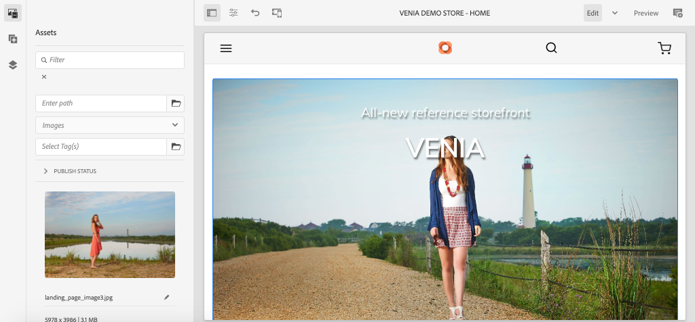
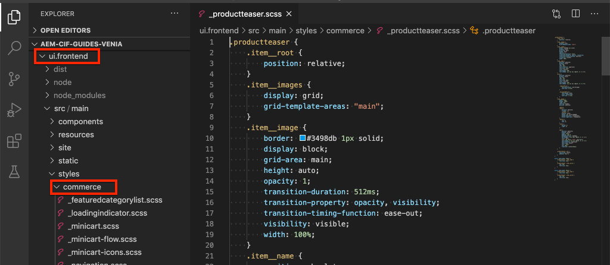
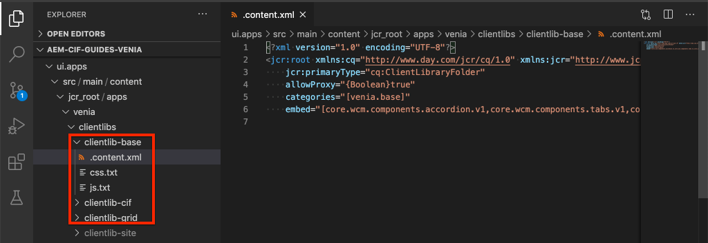
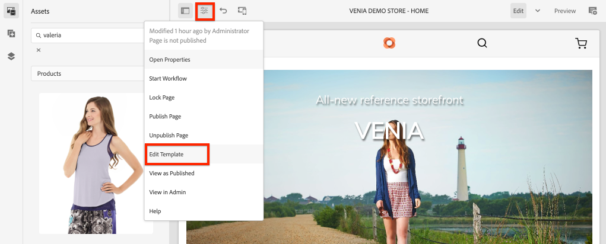

# 樣式AEM CIF核心元件 {#style-aem-cif-core-components}

[CIF Venia專案](https://github.com/adobe/aem-cif-guides-venia)是使用[CIF核心元件的參考程式碼基底。](https://github.com/adobe/aem-core-cif-components)在本教學課程中，您需檢查Venia參考專案，瞭解AEM CIF核心元件所使用的CSS和JavaScript如何進行組織整理。 您也可以使用CSS建立樣式，以更新&#x200B;**Product Teaser**&#x200B;元件的預設樣式。

>[!TIP]
>
> 開始您自己的商務實作時使用[AEM專案原型](https://github.com/adobe/aem-project-archetype)。

## 您將建置的內容 {#what-you-will-build}

在本教學課程中，將針對類似卡片的Product Teaser元件實作新樣式。 在本教學課程中吸取的課程可套用至其他CIF核心元件。


## 先決條件 {#prerequisites}

本機開發環境是完成本教學課程的必要條件。 此環境包含已設定並連線至AEM執行個體的Adobe Commerce執行個體。 檢閱[使用AEM as a Cloud Service SDK設定本機開發的需求和步驟。](/help/commerce-cloud/cif-storefront/develop.md)

## 原地複製Venia專案 {#clone-venia-project}

您即將複製[Venia專案](https://github.com/adobe/aem-cif-guides-venia)，然後覆寫預設樣式。

>[!NOTE]
>
> **請隨時使用現有的專案** (根據包含CIF的AEM專案原型)並略過本節。

1. 執行下列git命令，以便複製專案：

   ```shell
   $ git clone git@github.com:adobe/aem-cif-guides-venia.git
   ```

1. 建立專案並將其部署到AEM的本機執行個體：

   ```shell
   $ cd aem-cif-guides-venia/
   $ mvn clean install -PautoInstallPackage,cloud
   ```

1. 新增必要的OSGi設定，以便將AEM執行個體連線至Adobe Commerce執行個體，或將設定新增至已建立的專案。

1. 此時，您應該有已連線至Adobe Commerce執行個體的有效店面版本。 導覽至`US` > `Home`頁面： [http://localhost:4502/editor.html/content/venia/us/en.html.](http://localhost:4502/editor.html/content/venia/us/en.html)

   您應該會看到店面目前使用Venia佈景主題。 展開店面的「主要」功能表，應該會看到各種類別，表示與Adobe Commerce的連線正常運作。

   的店面

## 使用者端程式庫和ui.frontend模組 {#introduction-to-client-libraries}

負責轉譯店面主題/樣式的CSS和JavaScript由[使用者端資料庫](/help/implementing/developing/introduction/clientlibs.md)或&quot;clientlibs&quot; （簡稱）在AEM中管理。 使用者端資料庫提供的機制，可讓您以專案的程式碼來整理CSS和JavaScript，然後將內容傳送至頁面。

您可以新增及覆寫這些使用者端程式庫管理的CSS，將品牌專屬樣式套用至AEM CIF核心元件。 瞭解使用者端程式庫如何建構並包含在頁面上至關重要。

[ui.frontend](https://experienceleague.adobe.com/docs/experience-manager-core-components/using/developing/archetype/uifrontend.html?lang=zh-Hant)是專用的[webpack](https://webpack.js.org/)專案，用於管理專案的所有前端資產。 此Webpack可讓前端開發人員使用任意數量的語言和技術，例如[TypeScript](https://www.typescriptlang.org/)、[Sass](https://sass-lang.com/)等等。

`ui.frontend`模組也是Maven模組，並使用NPM模組[aem-clientlib-generator](https://github.com/wcm-io-frontend/aem-clientlib-generator)與較大的專案整合。 在建置期間，`aem-clientlib-generator`會將編譯的CSS和JavaScript檔案複製到`ui.apps`模組中的使用者端程式庫中。


*在Maven組建期間，已編譯的CSS和JavaScript會從`ui.frontend`模組複製到`ui.apps`模組，作為使用者端程式庫*

## 更新Teaser樣式 {#ui-frontend-module}

接下來，對Teaser樣式進行小幅變更，以瞭解`ui.frontend`模組和使用者端程式庫如何運作。 使用[您選擇的IDE](https://experienceleague.adobe.com/docs/experience-manager-learn/cloud-service/local-development-environment-set-up/development-tools.html?lang=zh-Hant#set-up-the-development-ide)匯入Venia專案。 使用的熒幕擷取畫面來自[Visual Studio Code IDE。](https://experienceleague.adobe.com/docs/experience-manager-learn/cloud-service/local-development-environment-set-up/development-tools.html?lang=zh-Hant#microsoft-visual-studio-code)

1. 瀏覽並展開&#x200B;**ui.frontend**&#x200B;模組，並將資料夾階層展開至： `ui.frontend/src/main/styles/commerce`：

   

   請注意，資料夾下有多個Sass (`.scss`)檔案。 這些檔案是每個Commerce元件的Commerce專屬樣式。

1. 開啟檔案`_productteaser.scss`。

1. 更新`.item__image`規則並修改框線規則：

   ```scss
   .item__image {
       border: #ea00ff 8px solid; /* <-- modify this rule */
       display: block;
       grid-area: main;
       height: auto;
       opacity: 1;
       transition-duration: 512ms;
       transition-property: opacity, visibility;
       transition-timing-function: ease-out;
       visibility: visible;
       width: 100%;
   }
   ```

   上述規則應為產品Teaser元件新增粗粉紅色邊框。

1. 開啟新的終端機視窗並瀏覽至`ui.frontend`資料夾：

   ```shell
   $ cd <project-location>/aem-cif-guides-venia/ui.frontend
   ```

1. 執行下列Maven命令：

   ```shell
   $ mvn clean install
   ...
   [INFO] ------------------------------------------------------------------------
   [INFO] BUILD SUCCESS
   [INFO] ------------------------------------------------------------------------
   [INFO] Total time:  29.497 s
   [INFO] Finished at: 2020-08-25T14:30:44-07:00
   [INFO] ------------------------------------------------------------------------
   ```

   檢查終端機輸出。 請注意，Maven命令已執行數個NPM指令碼，包括`npm run build`。 `npm run build`命令定義於`package.json`檔案中，會編譯webpack專案並觸發使用者端程式庫產生。

1. 檢查檔案`ui.frontend/dist/clientlib-site/site.css`：

   

   此檔案是專案中所有Sass檔案的編譯及縮製版本。

   >[!NOTE]
   >
   > 原始檔控制會忽略這類檔案，因為它們應該在建置期間產生。

1. 檢查檔案`ui.frontend/clientlib.config.js`。

   ```js
   /* clientlib.config.js*/
   ...
   // Config for `aem-clientlib-generator`
   module.exports = {
       context: BUILD_DIR,
       clientLibRoot: CLIENTLIB_DIR,
       libs: [
           {
               ...libsBaseConfig,
               name: 'clientlib-site',
               categories: ['venia.site'],
               dependencies: ['venia.dependencies', 'aem-core-cif-react-components'],
               assets: {
   ...
   ```

   此設定檔適用於[aem-clientlib-generator](https://github.com/wcm-io-frontend/aem-clientlib-generator)，可決定編譯的CSS和JavaScript轉換成AEM使用者端程式庫的位置和方式。

1. 在`ui.apps`模組中，檢查檔案： `ui.apps/src/main/content/jcr_root/apps/venia/clientlibs/clientlib-site/css/site.css`：

   

   此檔案是`site.css`複製到`ui.apps`專案中。 它現在是名為`clientlib-site`的使用者端資料庫的一部分，類別為`venia.site`。 一旦檔案成為`ui.apps`模組的一部分，即可將其部署到AEM。

   >[!NOTE]
   >
   > 原始檔控制也會忽略這類檔案，因為它們應該在建置期間產生。

1. 接下來，檢查專案產生的其他使用者端程式庫：

   

   這些使用者端程式庫不是由`ui.frontend`模組管理。 這些使用者端資料庫會包含由Adobe提供的CSS和JavaScript相依性。 這些使用者端資料庫的定義位於每個資料夾下方的`.content.xml`檔案中。

   **clientlib-base** — 空白的使用者端程式庫，僅嵌入[AEM核心元件的必要相依性。](https://experienceleague.adobe.com/docs/experience-manager-core-components/using/introduction.html?lang=zh-Hant)類別為`venia.base`。

   **clientlib-cif** — 空白的使用者端程式庫，僅嵌入[AEM CIF核心元件的必要相依性。](https://github.com/adobe/aem-core-cif-components)類別為`venia.cif`。

   **clientlib-grid** — 包含CSS以啟用AEM的回應式格線功能。 使用AEM格線會在AEM編輯器中啟用[佈局模式](/help/sites-cloud/authoring/page-editor/responsive-layout.md)，並讓內容作者能夠調整元件大小。 類別為`venia.grid`且內嵌於`venia.base`資料庫中。

1. 檢查`customheaderlibs.html`底下的檔案`customfooterlibs.html`和`ui.apps/src/main/content/jcr_root/apps/venia/components/page`：

   

   這些指令碼包含&#x200B;**venia.base**&#x200B;和&#x200B;**venia.cif**&#x200B;資料庫作為所有頁面的一部分。

   >[!NOTE]
   >
   > 只有基底程式庫會在頁面指令碼中「以硬式編碼」。 `venia.site`未包含在這些檔案中，而是包含在頁面範本中，以擁有更大的彈性。 稍後會檢查此程式。

1. 從終端機，建置並部署整個專案到AEM的本機執行個體：

   ```shell
   $ cd aem-cif-guides-venia/
   $ mvn clean install -PautoInstallPackage,cloud
   ```

## 編寫產品Teaser {#author-product-teaser}

現在已部署程式碼更新，請使用AEM編寫工具，將Product Teaser元件的例項新增到網站的首頁。 這麼做可讓我們檢視更新的樣式。

1. 開啟新的瀏覽器分頁，並瀏覽至網站的&#x200B;**首頁**： [http://localhost:4502/editor.html/content/venia/us/en.html.](http://localhost:4502/editor.html/content/venia/us/en.html)

1. 在&#x200B;**編輯**&#x200B;模式中展開資產尋找器（側邊欄）。 將資產篩選器切換為&#x200B;**產品**。

   

1. 將新產品拖放至主配置容器的首頁：

   

   您應該會看到，根據先前建立的CSS規則變更，產品Teaser現在有亮粉紅色邊框。

## 驗證頁面上的使用者端程式庫 {#verify-client-libraries}

接下來，驗證頁面上是否包含使用者端程式庫。

1. 瀏覽至網站的&#x200B;**首頁**： [http://localhost:4502/editor.html/content/venia/us/en.html.](http://localhost:4502/editor.html/content/venia/us/en.html)

1. 選取&#x200B;**頁面資訊**&#x200B;功能表，然後按一下&#x200B;**以發佈的形式檢視**：

   

   此頁面會開啟，不會載入任何AEM作者JavaScript，如同發佈網站上的顯示方式。 請注意，該url已附加查詢引數`?wcmmode=disabled`。 開發CSS和JavaScript時，最好使用此引數來簡化頁面，而無需AEM作者採取任何動作。

1. 檢視頁面來源，您應該能夠識別已包含數個使用者端程式庫：

   ```html
   <!DOCTYPE html>
   <html lang="en-US">
   <head>
       ...
       <link rel="stylesheet" href="/etc.clientlibs/venia/clientlibs/clientlib-base.min.css" type="text/css">
       <link rel="stylesheet" href="/etc.clientlibs/venia/clientlibs/clientlib-site.min.css" type="text/css">
   </head>
   ...
       <script type="text/javascript" src="/etc.clientlibs/venia/clientlibs/clientlib-site.min.js"></script>
       <script type="text/javascript" src="/etc.clientlibs/core/wcm/components/commons/site/clientlibs/container.min.js"></script>
       <script type="text/javascript" src="/etc.clientlibs/venia/clientlibs/clientlib-base.min.js"></script>
   <script type="text/javascript" src="/etc.clientlibs/core/cif/clientlibs/common.min.js"></script>
   <script type="text/javascript" src="/etc.clientlibs/venia/clientlibs/clientlib-cif.min.js"></script>
   </body>
   </html>
   ```

   傳遞給網頁的使用者端資料庫會加上前置詞`/etc.clientlibs`，並透過[Proxy](/help/implementing/developing/introduction/clientlibs.md)提供，以避免公開`/apps`或`/libs`中的任何敏感專案。

   通知`venia/clientlibs/clientlib-site.min.css`和`venia/clientlibs/clientlib-site.min.js`。 這些檔案是衍生自`ui.frontend`模組的已編譯CSS和JavaScript檔案。

## 頁面範本包含使用者端資料庫 {#client-library-inclusion-pagetemplates}

包含使用者端程式庫有數個選項。 接著檢查產生的專案如何透過`clientlib-site`頁面範本包含[資料庫。](/help/implementing/developing/components/templates.md)

1. 在AEM編輯器中，導覽至網站的&#x200B;**首頁**： [http://localhost:4502/editor.html/content/venia/us/en.html.](http://localhost:4502/editor.html/content/venia/us/en.html)

1. 選取&#x200B;**頁面資訊**&#x200B;功能表，然後按一下&#x200B;**編輯範本**：

   

   已開啟&#x200B;**首頁**&#x200B;頁面所依據的&#x200B;**登陸頁面**&#x200B;範本。

   >[!NOTE]
   >
   > 若要從AEM開始畫面檢視所有可用的範本，請瀏覽至&#x200B;**工具** > **一般** > **範本**。

1. 在左上角，選取&#x200B;**頁面資訊**&#x200B;圖示並按一下&#x200B;**頁面原則**。

   

1. 「頁面原則」會針對登入頁面範本開啟：

   

   在右側，您可以看到包含在使用此範本的所有頁面上的使用者端資料庫&#x200B;**類別**&#x200B;清單。

   * `venia.dependencies` — 提供`venia.site`所依賴的任何廠商程式庫。
   * `venia.site` - `clientlib-site`模組產生的`ui.frontend`類別。

   請注意，其他範本使用相同的原則、**內容頁面**、**登陸頁面**&#x200B;等。 透過重複使用相同原則，可確保在所有頁面上包含相同的使用者端程式庫。

   使用範本和頁面原則來管理使用者端資料庫之包含專案的優點在於，您可以根據範本變更原則。 例如，您可能在同一個AEM執行個體中管理兩個不同的品牌。 每個品牌都有自己的獨特樣式或&#x200B;*佈景主題*，但基底程式庫和程式碼相同。 另一個範例，如果您有一個大型使用者端程式庫，您只想讓它出現在某些頁面上，您可以為該範本制定唯一的頁面原則。

## 本機Webpack開發 {#local-webpack-development}

在上一個練習中，已對`ui.frontend`模組中的Sass檔案進行更新，然後在執行Maven組建後，會將變更部署到AEM。 接下來，您會考慮使用webpack-dev-server來快速開發前端樣式。

webpack-dev-server會代理來自AEM本機執行個體的影像和部分CSS/JavaScript，但可讓開發人員修改`ui.frontend`模組中的樣式和JavaScript。

1. 在瀏覽器中，瀏覽至&#x200B;**首頁**&#x200B;和&#x200B;**以發佈的形式檢視**： [http://localhost:4502/content/venia/us/en.html？wcmmode=disabled。](http://localhost:4502/content/venia/us/en.html?wcmmode=disabled)

1. 檢視頁面來源，以及&#x200B;**複製**&#x200B;頁面的原始HTML。

1. 在`ui.frontend`模組下方返回您選擇的IDE開啟檔案： `ui.frontend/src/main/static/index.html`

   

1. 覆寫`index.html`和&#x200B;**貼上** HTML在上一步中複製的內容。

1. 尋找`clientlib-site.min.css`、`clientlib-site.min.js`和&#x200B;**移除**&#x200B;它們的「包含」。

   ```html
   <head>
       <!-- remove this link -->
       <link rel="stylesheet" href="/etc.clientlibs/venia/clientlibs/clientlib-base.min.css" type="text/css">
       ...
   </head>
   <body>
       ...
        <!-- remove this link -->
       <script type="text/javascript" src="/etc.clientlibs/venia/clientlibs/clientlib-site.min.js"></script>
   </body>
   ```

   這些「包含」已移除，因為它們代表`ui.frontend`模組產生的CSS和JavaScript編譯版本。 將其他使用者端程式庫保留為即將從執行中的AEM例項代理的程式庫。

1. 開啟新的終端機視窗並瀏覽至`ui.frontend`資料夾。 執行命令`npm start`：

   ```shell
   $ cd ui.frontend
   $ npm start
   ```

   此命令會啟動[http://localhost:8080/.](http://localhost:8080/)上的webpack-dev-server

   >[!CAUTION]
   >
   > 如果您收到Sass相關錯誤，請停止伺服器並執行命令`npm rebuild node-sass`並重複上述步驟。 如果您的`npm`和`node`版本與專案`aem-cif-guides-venia/pom.xml`中指定的版本不同，則會發生此錯誤。

1. 使用與AEM登入執行個體相同的瀏覽器，導覽至新標籤中的[http://localhost:8080/](http://localhost:8080/)。 您應該會透過webpack-dev-server看到Venia首頁：

   上的Webpack開發伺服器

   讓webpack-dev-server保持執行。 它將在下一個練習中使用。

## 實作產品Teaser的卡片樣式 {#update-css-product-teaser}

接下來，修改`ui.frontend`模組中的Sass檔案，以實作產品Teaser的卡片樣式。 webpack-dev-server用於快速檢視變更。

返回IDE和生成的專案。

1. 在&#x200B;**ui.frontend**&#x200B;模組中，於`_productteaser.scss`重新開啟檔案`ui.frontend/src/main/styles/commerce/_productteaser.scss`。

1. 對產品Teaser邊框進行下列變更：

   ```diff
       .item__image {
   -       border: #ea00ff 8px solid;
   +       border-bottom: 1px solid #c0c0c0;
           display: block;
           grid-area: main;
           height: auto;
           opacity: 1;
           transition-duration: 512ms;
           transition-property: opacity, visibility;
           transition-timing-function: ease-out;
           visibility: visible;
           width: 100%;
       }
   ```

   儲存變更，webpack-dev-server應該會使用新樣式自動重新整理。

1. 在「產品Teaser」中新增投影並包含圓角。

   ```scss
    .item__root {
        position: relative;
        box-shadow: 0 4px 8px 0 rgba(0,0,0,0.2);
        transition: 0.3s;
        border-radius: 5px;
        float: left;
        margin-left: 12px;
        margin-right: 12px;
   }
   
   .item__root:hover {
      box-shadow: 0 8px 16px 0 rgba(0,0,0,0.2);
   }
   ```

1. 更新產品名稱以顯示於Teaser底部，並修改文字顏色。

   ```css
   .item__name {
       color: #000;
       display: block;
       float: left;
       font-size: 22px;
       font-weight: 900;
       line-height: 1em;
       padding: 0.75em;
       text-transform: uppercase;
       width: 75%;
   }
   ```

1. 更新產品的價格，使其也出現在Teaser底部，並修改文字顏色。

   ```css
   .price {
       color: #000;
       display: block;
       float: left;
       font-size: 18px;
       font-weight: 900;
       padding: 0.75em;
       padding-bottom: 2em;
       width: 25%;
   
       ...
   ```

1. 更新底部的媒體查詢，以便在小於&#x200B;**992px**&#x200B;的熒幕中棧疊名稱和價格。

   ```css
   @media (max-width: 992px) {
       .productteaser .item__name {
           font-size: 18px;
           width: 100%;
       }
       .productteaser .item__price {
           font-size: 14px;
           width: 100%;
       }
   }
   ```

   您現在應該會看到卡片樣式反映在webpack-dev-server中：

   

   不過，這些變更尚未部署至AEM。 您可以[在此下載解決方案檔案](../assets/style-cif-component/_productteaser.scss)。

1. 從命令列終端機，使用您的Maven技能將更新部署到AEM：

   ```shell
   $ cd aem-cif-guides-venia/
   $ mvn clean install -PautoInstallPackage,cloud
   ```

   >[!NOTE]
   >還有其他的[IDE設定和工具](https://experienceleague.adobe.com/docs/experience-manager-learn/foundation/development/set-up-a-local-aem-development-environment.html?lang=zh-Hant#set-up-an-integrated-development-environment)可以直接將專案檔案同步到本機AEM執行個體，而不需要執行完整的Maven建置。

## 檢視更新的產品Teaser {#view-updated-product-teaser}

將專案的程式碼部署至AEM後，您現在應該能夠檢視產品Teaser的變更。

1. 返回瀏覽器並重新整理首頁： [http://localhost:4502/editor.html/content/venia/us/en.html。](http://localhost:4502/editor.html/content/venia/us/en.html)您應該會看到已套用的更新產品Teaser樣式。

   

1. 新增其他產品Teaser以進行實驗。 使用「版面模式」來變更元件的寬度和位移，以在一列中顯示多個Teaser。

   

## 疑難排解 {#troubleshooting}

您可以在[CRXDE-Lite](http://localhost:4502/crx/de/index.jsp)中確認已部署更新的CSS檔案： [http://localhost:4502/crx/de/index.jsp#/apps/venia/clientlibs/clientlib-site/css/site.css](http://localhost:4502/crx/de/index.jsp#/apps/venia/clientlibs/clientlib-site/css/site.css)

部署新的CSS檔案或JavaScript檔案（或兩者）時，請務必確保瀏覽器不會提供過時的檔案。 您可以清除瀏覽器快取或啟動新的瀏覽器工作階段，藉此消除此潛在問題。

AEM也會嘗試快取使用者端程式庫以提高效能。 在程式碼部署後，偶爾會提供舊檔案。 您可以使用[重新建置使用者端程式庫工具，手動讓AEM的使用者端程式庫快取失效。如果您懷疑AEM已快取舊版的使用者端程式庫，建議使用](http://localhost:4502/libs/granite/ui/content/dumplibs.rebuild.html) *讓快取無效的方法。 重新建置程式庫效率低下且耗時。*

## 恭喜 {#congratulations}

您已完成第一個AEM CIF核心元件的樣式設定，而且使用的是webpack開發伺服器！

## 額外挑戰 {#bonus-challenge}

使用[AEM樣式系統](/help/sites-cloud/authoring/page-editor/style-system.md)建立兩個可由內容作者切換的樣式。 [使用樣式系統進行開發](https://experienceleague.adobe.com/docs/experience-manager-learn/getting-started-wknd-tutorial-develop/project-archetype/style-system.html?lang=zh-Hant)包含有關如何完成此工作的詳細步驟和資訊。


## 其他資源 {#additional-resources}

* [AEM專案原型](https://github.com/adobe/aem-project-archetype)
* [AEM CIF核心元件](https://github.com/adobe/aem-core-cif-components)
* [設定本機AEM開發環境](https://experienceleague.adobe.com/docs/experience-manager-learn/cloud-service/local-development-environment-set-up/overview.html?lang=zh-Hant)
* [用戶端資源庫](/help/implementing/developing/introduction/clientlibs.md)
* [AEM Sites 快速入門](https://experienceleague.adobe.com/docs/experience-manager-learn/getting-started-wknd-tutorial-develop/overview.html?lang=zh-Hant)
* [使用樣式系統進行開發](https://experienceleague.adobe.com/docs/experience-manager-learn/getting-started-wknd-tutorial-develop/project-archetype/style-system.html?lang=zh-Hant)
