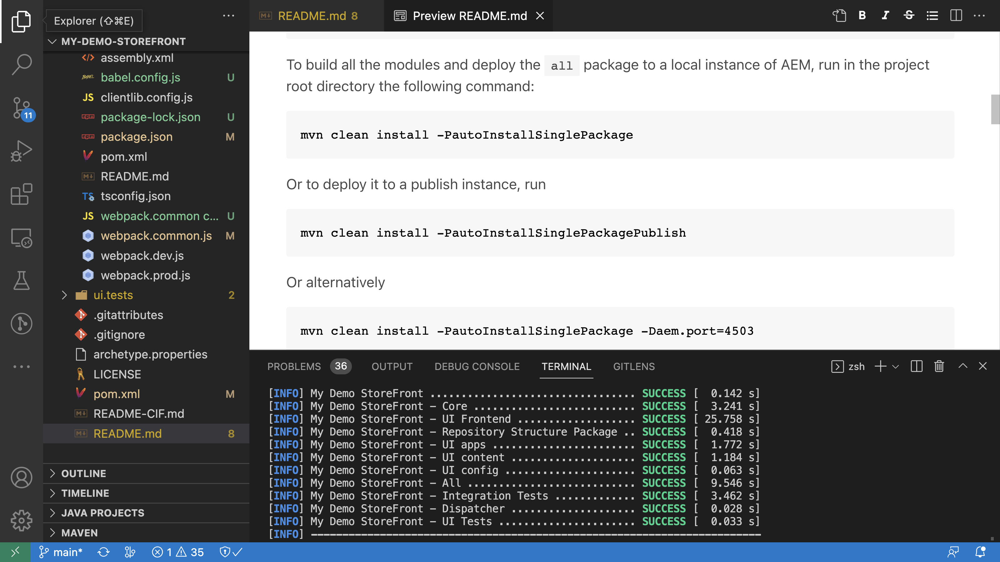

# AEM-CIF核心元件與Adobe Experience Platform整合 {#aem-cif-aep-integration}

[Commerce integration framework (CIF)](https://github.com/adobe/aem-core-cif-components)核心元件提供與[Adobe Experience Platform](https://experienceleague.adobe.com/docs/experience-platform/landing/platform-overview.html)的緊密整合，以從使用者端互動（例如&#x200B;__加入購物車__）轉送店面事件及其資料。

[AEM CIF核心元件](https://github.com/adobe/aem-core-cif-components)專案為Adobe Commerce[提供名為](https://github.com/adobe/aem-core-cif-components/tree/master/extensions/experience-platform-connector)Adobe Experience Platform connector的JavaScript資料庫，以從Commerce店面收集事件資料。 該事件資料會傳送至Experience Platform，並用於其他Adobe Experience Cloud產品(例如Adobe Analytics和Adobe Target)，以建立涵蓋客戶歷程的360度個人資料。 透過將Commerce資料連線到Adobe Experience Cloud中的其他產品，您可以執行分析您網站上的使用者行為、執行AB測試和建立個人化行銷活動等工作。

深入瞭解[Experience Platform資料收集](https://experienceleague.adobe.com/docs/experience-platform/collection/home.html)技術套件，可讓您從使用者端來源收集客戶體驗資料。

## 將`addToCart`個事件資料傳送至Experience Platform {#send-addtocart-to-aep}

下列步驟說明如何使用CIF - Experience Platform Connector將`addToCart`事件資料從AEM轉譯的產品頁面傳送到Experience Platform。 您可以使用Adobe Experience Platform Debugger瀏覽器擴充功能來測試和檢閱提交的資料。


## 先決條件 {#prerequisites}

使用本機開發環境來完成此示範。 這包括已設定並連線至AEM執行個體的Adobe Commerce執行個體。 檢閱[使用AEM as a Cloud Service SDK設定本機開發的需求和步驟。](/help/commerce-cloud/cif-storefront/develop.md)

您也需要存取[Adobe Experience Platform](https://experienceleague.adobe.com/docs/experience-platform/landing/platform-ui/ui-guide.html)以及建立資料收集之結構描述、資料集和資料串流的許可權。 如需詳細資訊，請參閱[許可權管理。](https://experienceleague.adobe.com/docs/experience-platform/collection/permissions.html)

## AEM Commerce as a Cloud Service設定 {#aem-setup}

若要讓具備必要程式碼和設定的有效&#x200B;__AEM Commerce as a Cloud Service__&#x200B;本機環境，請完成下列步驟。

### 本機設定

請依照[本機設定](/help/commerce-cloud/cif-storefront/develop.md#local-setup)步驟操作，讓您的AEM Commerce as a Cloud Service環境能夠正常運作。

### 專案設定

請依照[AEM專案原型](/help/commerce-cloud/cif-storefront/develop.md#project)步驟操作，以建立全新的AEM Commerce (CIF)專案。

>[!TIP]
>
>在下列範例中，AEM Commerce專案名稱為： `My Demo Storefront`，但您可以選擇自己的專案名稱。




從專案的根目錄執行下列命令，建置已建立的AEM Commerce專案並將其部署至本機AEM SDK。

```bash
$ mvn clean install -PautoInstallSinglePackage
```

本機部署的`My Demo StoreFront`商務網站具有預設的程式碼和內容，如下所示：


### 安裝Peregrine和CIF-AEP聯結器相依性

若要從此AEM Commerce網站的類別和產品頁面收集並傳送事件資料，請將金鑰`npm`套件安裝到AEM Commerce專案的`ui.frontend`模組中。

從命令列執行下列命令，瀏覽至`ui.frontend`模組並安裝必要的套件。

```bash
npm i --save lodash.get@^4.4.2 lodash.set@^4.3.2
npm i --save apollo-cache-persist@^0.1.1
npm i --save redux-thunk@~2.3.0
npm i --save @adobe/apollo-link-mutation-queue@~1.1.0
npm i --save @magento/peregrine@~12.5.0
npm i --save @adobe/aem-core-cif-react-components --force
npm i --save-dev @magento/babel-preset-peregrine@~1.2.1
npm i --save @adobe/aem-core-cif-experience-platform-connector --force
```

>[!IMPORTANT]
>
>`--force`引數有時是必要的，因為[PWA Studio](https://developer.adobe.com/commerce/pwa-studio/)受支援的對等相依性限制。 這通常不會造成任何問題。


### 設定Maven使用`--force`引數

作為Maven建置流程的一部分，會觸發npm全新安裝（使用`npm ci`）。 這也需要`--force`引數。

導覽至專案的根POM檔案`pom.xml`，並找到`<id>npm ci</id>`執行區塊。 更新區塊，使其如下所示：

```xml
<execution>
    <id>npm ci</id>
    <goals>
    <goal>npm</goal>
    </goals>
    <configuration>
    <arguments>ci --force</arguments>
    </configuration>
</execution>
```

### 變更Babel組態格式

從預設的`.babelrc`檔案相對組態檔格式切換為`babel.config.js`格式。 此為專案範圍的組態格式，可讓外掛程式和預設集套用至`node_module`，且具有更強大的控制力。

1. 瀏覽至`ui.frontend`模組並刪除現有的`.babelrc`檔案。

1. 建立使用`babel.config.js`預設集的`peregrine`檔案。

   ```javascript
   const peregrine = require('@magento/babel-preset-peregrine');
   
   module.exports = (api, opts = {}) => {
       const config = {
           ...peregrine(api, opts),
           sourceType: 'unambiguous'
       } 
   
       config.plugins = config.plugins.filter(plugin => plugin !== 'react-refresh/babel');
   
       return config;
   }
   ```

### 設定webpack以使用Babel

若要使用Babel載入器(`babel-loader`)和Webpack傳輸JavaScript檔案，請編輯`webpack.common.js`檔案。

導覽至`ui.frontend`模組並更新`webpack.common.js`檔案，以便您可以在`module`屬性值內有下列規則：

```javascript
{
    test: /\.jsx?$/,
    exclude: /node_modules\/(?!@magento\/)/,
    loader: 'babel-loader'
}
```

### 設定Apollo使用者端

[Apollo使用者端](https://www.apollographql.com/docs/react/)是用來透過GraphQL管理本機與遠端資料。 它也會將GraphQL查詢的結果儲存在本機、標準化、記憶體中的快取中。

若要讓[`InMemoryCache`](https://www.apollographql.com/docs/react/caching/cache-configuration/)有效運作，您需要`possibleTypes.js`檔案。 若要產生此檔案，請參閱[自動產生possibleTypes。](https://www.apollographql.com/docs/react/data/fragments/#generating-possibletypes-automatically)

另請參閱[PWA Studio參考實作](https://github.com/magento/pwa-studio/blob/1977f38305ff6c0e2b23a9da7beb0b2f69758bed/packages/pwa-buildpack/lib/Utilities/graphQL.js#L106-L120)和[`possibleTypes.js`](../assets/aep-integration/possibleTypes.js)檔案的範例。

1. 瀏覽至`ui.frontend`模組並將檔案儲存為`./src/main/possibleTypes.js`

1. 更新`webpack.common.js`檔案的`DefinePlugin`區段，以便在建置期間取代必要的靜態變數。

   ```javascript
   const { DefinePlugin } = require('webpack');
   const { POSSIBLE_TYPES } = require('./src/main/possibleTypes');
   
   ...
   
   plugins: [
       ...
       new DefinePlugin({
           'process.env.USE_STORE_CODE_IN_URL': false,
           POSSIBLE_TYPES
       })
   ]
   ```

### 初始化Peregrine和CIF核心元件

若要初始化React型Peregrine和CIF核心元件，請建立所需的設定和JavaScript檔案。

1. 瀏覽至`ui.frontend`模組並建立下列資料夾： `src/main/webpack/components/commerce/App`

1. 建立包含下列內容的`config.js`檔案：

   ```javascript
   // get and parse the CIF store configuration from the <head>
   const storeConfigEl = document.querySelector('meta[name="store-config"]');
   const storeConfig = storeConfigEl ? JSON.parse(storeConfigEl.content) : {};
   
   // the following global variables are needed for some of the peregrine features
   window.STORE_VIEW_CODE = storeConfig.storeView || 'default';
   window.AVAILABLE_STORE_VIEWS = [
       {
           code: window.STORE_VIEW_CODE,
           base_currency_code: 'USD',
           default_display_currency_code: 'USD',
           id: 1,
           locale: 'en',
           secure_base_media_url: '',
           store_name: 'My Demo StoreFront'
       }
   ];
   window.STORE_NAME = window.STORE_VIEW_CODE;
   window.DEFAULT_COUNTRY_CODE = 'en';
   
   export default {
       storeView: window.STORE_VIEW_CODE,
       graphqlEndpoint: storeConfig.graphqlEndpoint,
       // Can be GET or POST. When selecting GET, this applies to cache-able GraphQL query requests only.
       // Mutations will always be executed as POST requests.
       graphqlMethod: storeConfig.graphqlMethod,
       headers: storeConfig.headers,
   
       mountingPoints: {
           // TODO: define the application specific mount points as they may be used by <Portal> and <PortalPlacer>
       },
       pagePaths: {
           // TODO: define the application specific paths/urls as they may be used by the components
           baseUrl: storeConfig.storeRootUrl
       },
       eventsCollector: {
           eventForwarding: {
               acds: true,
               aep: false,
           }
       }
   };
   ```

   >[!IMPORTANT]
   >
   >雖然您可能已熟悉[`config.js`AEM Guides - CIF Venia專案](https://github.com/adobe/aem-cif-guides-venia/blob/main/ui.frontend/src/main/components/App/config.js)中的&#x200B;____&#x200B;檔案，但您必須對此檔案進行一些變更。 首先，檢閱任何&#x200B;__TODO__&#x200B;註解。 然後，在`eventsCollector`屬性內，尋找`eventsCollector > aep`物件並將`orgId`和`datastreamId`屬性更新為正確的值。 [深入了解.](#add-aep-values-to-aem)

1. 建立包含下列內容的`App.js`檔案。 此檔案類似典型的React應用程式起點檔案，並包含React和自訂鉤點以及React Context使用方式，以促進Experience Platform整合。

   ```javascript
   import config from './config';
   
   import React, { useEffect } from 'react';
   import ReactDOM from 'react-dom';
   import { IntlProvider } from 'react-intl';
   import { BrowserRouter as Router } from 'react-router-dom';
   import { combineReducers, createStore } from 'redux';
   import { Provider as ReduxProvider } from 'react-redux';
   import { createHttpLink, ApolloProvider } from '@apollo/client';
   import { ConfigContextProvider, useCustomUrlEvent, useReferrerEvent, usePageEvent, useDataLayerEvents, useAddToCartEvent } from '@adobe/aem-core-cif-react-components';
   import { EventCollectorContextProvider, useEventCollectorContext } from '@adobe/aem-core-cif-experience-platform-connector';
   import { useAdapter } from '@magento/peregrine/lib/talons/Adapter/useAdapter';
   import { customFetchToShrinkQuery } from '@magento/peregrine/lib/Apollo/links';
   import { BrowserPersistence } from '@magento/peregrine/lib/util';
   import { default as PeregrineContextProvider } from '@magento/peregrine/lib/PeregrineContextProvider';
   import { enhancer, reducers } from '@magento/peregrine/lib/store';
   
   const storage = new BrowserPersistence();
   const store = createStore(combineReducers(reducers), enhancer);
   
   storage.setItem('store_view_code', config.storeView);
   
   const App = () => {
       const [{ sdk: mse }] = useEventCollectorContext();
   
       // trigger page-level events
       useCustomUrlEvent({ mse });
       useReferrerEvent({ mse });
       usePageEvent({ mse });
       // listen for add-to-cart events and enable forwarding to the magento storefront events sdk
       useAddToCartEvent(({ mse }));
       // enable CIF specific event forwarding to the Adobe Client Data Layer
       useDataLayerEvents();
   
       useEffect(() => {
           // implement a proper marketing opt-in, for demo purpose you hard-set the consent cookie
           if (document.cookie.indexOf('mg_dnt') < 0) {
               document.cookie += '; mg_dnt=track';
           }
       }, []);
   
       // TODO: use the App to create Portals and PortalPlaceholders to mount the CIF / Peregrine components to the server side rendered markup
       return <></>;
   };
   
   const AppContext = ({ children }) => {
       const { storeView, graphqlEndpoint, graphqlMethod = 'POST', headers = {}, eventsCollector } = config;
       const { apolloProps } = useAdapter({
           apiUrl: new URL(graphqlEndpoint, window.location.origin).toString(),
           configureLinks: (links, apiBase) =>
               // reconfigure the HTTP link to use the configured graphqlEndpoint, graphqlMethod and storeView header
   
               links.set('HTTP', createHttpLink({
                   fetch: customFetchToShrinkQuery,
                   useGETForQueries: graphqlMethod !== 'POST',
                   uri: apiBase,
                   headers: { ...headers, 'Store': storeView }
               }))
       });
   
       return (
           <ApolloProvider {...apolloProps}>
               <IntlProvider locale='en' messages={{}}>
                   <ConfigContextProvider config={config}>
                       <ReduxProvider store={store}>
                           <PeregrineContextProvider>
                               <EventCollectorContextProvider {...eventsCollector}>
                                   {children}
                               </EventCollectorContextProvider>
                           </PeregrineContextProvider>
                       </ReduxProvider>
                   </ConfigContextProvider>
               </IntlProvider>
           </ApolloProvider>
       );
   };
   
   window.onload = async () => {
       const root = document.createElement('div');
       document.body.appendChild(root);
   
       ReactDOM.render(
           <Router>
               <AppContext>
                   <App />
               </AppContext>
           </Router>,
           root
       );
   };
   ```

   `EventCollectorContext`匯出React內容，其中：

   - 載入commerce-events-sdk和commerce-events-collector資料庫，
   - 使用指定的Experience Platform和/或ACDS設定來初始化它們
   - 從Peregrine訂閱所有事件並將它們轉送到SDK事件

   您可以檢閱`EventCollectorContext`的實作詳細資料。 請參閱GitHub上的[aem-core-cif-components。](https://github.com/adobe/aem-core-cif-components/blob/3d4e44d81fff2f398fd2376d24f7b7019f20b31b/extensions/experience-platform-connector/src/events-collector/EventCollectorContext.js)

### 建置和部署更新的AEM專案 {#build-and-deploy}

為確保上述套件安裝、程式碼和設定變更正確，請使用以下Maven命令重新建置和部署更新的AEM Commerce專案： `$ mvn clean install -PautoInstallSinglePackage`。

## Experience Platform設定 {#aep-setup}

若要接收並儲存來自AEM Commerce頁面（例如類別和產品）的事件資料，請完成下列步驟：

>[!AVAILABILITY]
>
>請確定您是&#x200B;__Adobe Experience Platform__&#x200B;和&#x200B;__Adobe Experience Platform資料彙集__&#x200B;下正確&#x200B;__產品設定檔__&#x200B;的一部分。 如有需要，請與您的系統管理員合作，在&#x200B;__Admin Console.__&#x200B;下建立、更新或指派[產品設定檔](https://adminconsole.adobe.com/)。

### 使用Commerce欄位群組建立結構描述 {#create-schema}

若要定義商務事件資料的結構，您必須建立體驗資料模型(XDM)結構描述。 結構是一組規則，可代表及驗證資料的結構和格式。

1. 在瀏覽器中，導覽至&#x200B;__Adobe Experience Platform__&#x200B;產品首頁。 例如，<https://experience.adobe.com/#/@YOUR-ORG-NAME/sname:prod/platform/home>。

1. 在左側導覽區段中找出&#x200B;__結構描述__&#x200B;功能表，從右上方區段中按一下&#x200B;__建立結構描述__&#x200B;按鈕，然後選取&#x200B;__XDM ExperienceEvent__。

   

1. 使用&#x200B;__結構描述屬性>顯示名稱__&#x200B;欄位為結構描述命名，並使用&#x200B;__構成>欄位群組>新增__&#x200B;按鈕新增欄位群組。

   

1. 在&#x200B;__新增欄位群組__&#x200B;對話方塊中，搜尋`Commerce`，選取&#x200B;__Commerce詳細資料__&#x200B;核取方塊，然後按一下&#x200B;__新增欄位群組__。

   


>[!TIP]
>
>如需詳細資訊，請參閱結構描述組合[的](https://experienceleague.adobe.com/docs/experience-platform/xdm/schema/composition.html)基本概念。

### 建立資料集 {#create-dataset}

若要儲存事件資料，您必須建立符合結構描述定義的資料集。 資料集是資料集合的儲存和管理結構，通常是包含方案（欄）和欄位（列）的表格。

1. 在瀏覽器中，導覽至&#x200B;__Adobe Experience Platform__&#x200B;產品首頁。 例如，<https://experience.adobe.com/#/@YOUR-ORG-NAME/sname:prod/platform/home>。

1. 在左側導覽區段中找出&#x200B;__資料集__&#x200B;功能表，然後從右上角區段中按一下&#x200B;__建立資料集__&#x200B;按鈕。

   

1. 在新頁面上，選取「__從結構描述__&#x200B;卡片建立資料集」。

   

   在新頁面上，__搜尋並選取__&#x200B;您在上一步中建立的結構描述，然後按一下&#x200B;__下一步__&#x200B;按鈕。

   

1. 使用&#x200B;__設定資料集>名稱__&#x200B;欄位來命名您的資料集，然後按一下&#x200B;__完成__&#x200B;按鈕。

   

>[!TIP]
>
>如需詳細資訊，請參閱[資料集總覽](https://experienceleague.adobe.com/docs/experience-platform/catalog/datasets/overview.html)。


### 建立資料串流 {#create-datastream}

請完成下列步驟，以便在Experience Platform中建立資料串流。

1. 在瀏覽器中，導覽至&#x200B;__Adobe Experience Platform__&#x200B;產品首頁。 例如，<https://experience.adobe.com/#/@YOUR-ORG-NAME/sname:prod/platform/home>。

1. 在左側導覽區段中找到&#x200B;__資料串流__&#x200B;功能表，然後從右上角區段中按一下&#x200B;__新增資料串流__&#x200B;按鈕。

   

1. 使用&#x200B;__名稱__&#x200B;必要欄位來命名您的資料流。 在&#x200B;__事件結構描述__&#x200B;欄位下，選取已建立的結構描述，然後按一下&#x200B;__儲存__。

   

1. 開啟已建立的資料串流，然後按一下&#x200B;__新增服務__。

   

1. 在&#x200B;__服務__&#x200B;欄位下，選取&#x200B;__Adobe Experience Platform__&#x200B;選項。 在&#x200B;__事件資料集__&#x200B;欄位下，選取上一步驟中的資料集名稱，然後按一下&#x200B;__儲存__。

   

>[!TIP]
>
>如需詳細資訊，請參閱[資料流概觀](https://experienceleague.adobe.com/docs/experience-platform/datastreams/overview.html)。

## 將資料串流值新增至AEM Commerce設定 {#add-aep-values-to-aem}

完成上述Experience Platform設定後，您應該會在「資料串流詳細資料」的左邊欄中顯示`datastreamId`，並在「`orgId`個人資料圖片>帳戶資訊>使用者資訊&#x200B;__」強制回應視窗的右上角顯示__。


1. 在AEM Commerce專案的`ui.frontend`模組中，更新`config.js`檔案，並特別更新`eventsCollector > aep`物件屬性。

1. 建置和部署更新的AEM Commerce專案


## 觸發`addToCart`事件並驗證資料收集 {#event-trigger-verify}

上述步驟已完成AEM Commerce和Experience Platform設定。 您現在可以在產品UI中使用Google Chrome擴充功能`addToCart`雪鏟檢測器&#x200B;_和資料集_&#x200B;量度和圖形&#x200B;__切換來觸發__&#x200B;事件及驗證資料集合。

若要觸發事件，您可以使用本機設定中的AEM作者或發佈服務。 在此範例中，使用AEM作者登入您的帳戶。

1. 從Sites頁面，選取&#x200B;__My Demo StoreFront >我們> en__&#x200B;頁面，然後按一下頂端動作列中的&#x200B;__編輯__。

1. 在頂端動作列中，按一下&#x200B;__以發佈的形式檢視__，然後按一下店面導覽中任何偏好的類別。

1. 按一下&#x200B;__產品頁面__&#x200B;中任何偏好的產品卡，然後選取&#x200B;__顏色，大小__&#x200B;以啟用&#x200B;__加入購物車__&#x200B;按鈕。

1. 從瀏覽器的擴充功能面板開啟&#x200B;__Snowplow Inspector__&#x200B;擴充功能，並在左側邊欄中選取&#x200B;__Experience Platform Wed SDK__。

1. 返回&#x200B;__產品頁面__&#x200B;並按一下&#x200B;__加入購物車__&#x200B;按鈕。 這會將資料傳送至Experience Platform。 __Adobe Experience Platform Debugger__&#x200B;擴充功能會顯示事件詳細資料。

   

1. 在Experience Platform產品UI中，導覽至&#x200B;__資料集活動__&#x200B;標籤下的&#x200B;__資料集> My Demo StoreFront__。 如果已啟用&#x200B;__度量和圖形__，則會顯示事件資料統計資料。

   

## 實作詳細資料 {#implementation-details}

[CIF Experience Platform Connector](https://github.com/adobe/aem-core-cif-components/tree/master/extensions/experience-platform-connector)建置在Adobe Commerce[的](https://commercemarketplace.adobe.com/magento-experience-platform-connector.html)資料連線上，這是[PWA Studio](https://developer.adobe.com/commerce/pwa-studio/)專案的一部分。

PWA Studio專案可讓您建立由Adobe Commerce或Magento Open Source支援的Progressive Web Application (PWA)店面。 專案也包含名為[Peregrin](https://developer.adobe.com/commerce/pwa-studio/api/peregrine/)的元件庫，用於新增邏輯至視覺元件。 [Peregrin資料庫](https://developer.adobe.com/commerce/pwa-studio/api/peregrine/)也提供[CIF Experience Platform Connector](https://github.com/adobe/aem-core-cif-components/tree/master/extensions/experience-platform-connector)用來與Experience Platform無縫整合的自訂React鉤點。

## 支援的事件 {#supported-events}

截至目前，已支援下列事件：

__體驗XDM事件&#x200B;:__

1. 加入購物車(AEM)
1. 檢視頁面(AEM)
1. 檢視產品(AEM)
1. 搜尋請求已傳送(AEM)
1. 已收到搜尋回應(AEM)

在AEM Commerce專案中重複使用[Peregrine元件](https://developer.adobe.com/commerce/pwa-studio/guides/packages/peregrine/)時：

__體驗XDM事件&#x200B;:__

1. 從購物車移除
1. 開啟購物車
1. 檢視購物車
1. 立即購買
1. 開始簽出
1. 完成簽出

__設定檔XDM事件&#x200B;:__

1. 登入
1. 建立帳戶
1. 編輯帳戶

## 其他資源 {#additional-resources}

如需詳細資訊，請參閱下列資源：

- [PWA Studio](https://developer.adobe.com/commerce/pwa-studio/)
- [[!DNL Data Connection] 總覽](https://experienceleague.adobe.com/docs/commerce-merchant-services/data-connection/overview.html)
- [[!DNL Data Connection] 個活動](https://experienceleague.adobe.com/docs/commerce-merchant-services/data-connection/event-forwarding/events.html)
- [Adobe Experience Platform概觀](https://experienceleague.adobe.com/docs/experience-platform/landing/home.html)
