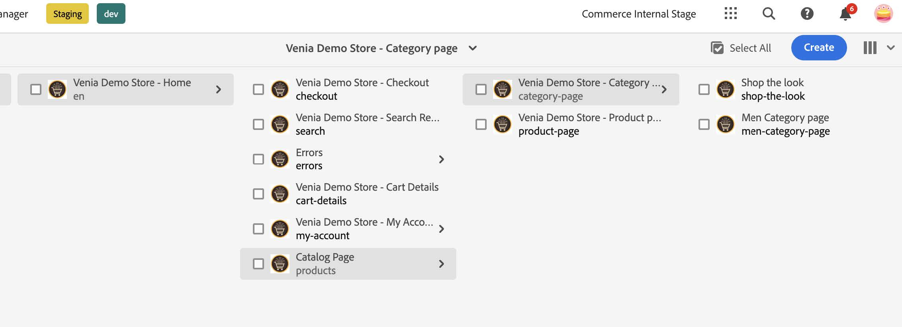

# [!DNL Live Search] CIF元件 {#live-search-cif-component}

Adobe Commerce的Live Search提供快速、相關且直覺的搜尋體驗，不需額外付費。 由Adobe AI提供支援的即時搜尋功能會使用人工智慧和機器學習演演算法，對彙總的訪客資料執行深入分析。 此資料與您的Adobe Commerce目錄結合時，會產生相關的個人化購物體驗。

本主題說明如何使用AEM CIF元件，將[!DNL Live Search]產品清單頁面(PLP) Widget實作至您的AEM網站。

## 先決條件 {#prerequisites}

本主題假設您已設定本機[AEM環境](https://experienceleague.adobe.com/docs/experience-manager-learn/foundation/development/set-up-a-local-aem-development-environment.html?lang=zh-Hant)。

PLP元件需要安裝[[!DNL Live Search] Popover CIF元件](/help/commerce-cloud/cif-storefront/integrating/live-search-popover.md)。 PLP Widget需要由彈出視窗產生的瀏覽器工作階段變數。

## 更新撰寫器 {#update-composer}

將事件模組新增至`ui.frontend/package.json`。

在第27行，變更：

```json
...
  },

  "devDependencies": {

    "@babel/core": "^7.3.4",
...
```

至:

```json
...
  },
  "type": "module",
  "devDependencies": {
    "@adobe/magento-storefront-event-collector": "^1.5.4",
    "@adobe/magento-storefront-events-sdk": "^1.5.4",
    "@babel/core": "^7.3.4",
...
```

## 檔案變更 {#files-changes}

必須更新多個檔案才能啟用[!DNL Live Search]功能。 編輯下列檔案。 行號可能與此處顯示的稍有不同。

* `ui.apps/src/main/content/jcr_root/apps/venia/clientlibs/clientlib-cif/.content.xml`

  將`core.cif.productlist.v1`附加至`embed`行。

  ```text
  embed="[core.cif.components.common,core.cif.components.product.v3,core.cif.components.productcarousel.v1,core.cif.components.productcollection.v2,core.cif.components.productteaser.v1,core.cif.components.searchbar.v2,core.cif.components.header.v1,core.cif.components.carousel.v1,core.cif.components.categorycarousel.v1,core.cif.components.featuredcategorylist.v1,core.cif.components.storefront-events.v1,core.cif.components.extensions.product-recs.storefront-events-collector.v1,core.wcm.components.commons.site.link,core.cif.productlist.v1]"
  ```

* `ui.apps/src/main/content/jcr_root/apps/venia/components/commerce/productlist/clientlibs/.content.xml`

  建立檔案`.content.xml`：

  ```xml
  <?xml version="1.0" encoding="UTF-8"?>
  <jcr:root xmlns:cq="http://www.day.com/jcr/cq/1.0" xmlns:jcr="http://www.jcp.org/jcr/1.0"
    jcr:primaryType="cq:ClientLibraryFolder"
    allowProxy="{Boolean}true"
    categories="[core.cif.productlist.v1]"
    jsProcessor="[default:none,min:none]"/>
  ```

* `ui.apps/src/main/content/jcr_root/apps/venia/components/commerce/productlist/clientlibs/css.txt`

  建立檔案`css.txt`：

  ```text
  #base=css
  
  productlist.css
  ```

* `ui.apps/src/main/content/jcr_root/apps/venia/components/commerce/productlist/clientlibs/css/productlist.css`

  建立檔案`productlist.css`

  ```css
    /* #search-plp-root */
  
  html {
    font-size: 62.5% !important;
  }
  
  body {
    font-size: 1.6rem;
  }
  
  .root.container {
    max-width: inherit;
  }
  
  .container {
    margin-left: auto;
    margin-right: auto;
  }
  
  div.ds-sdk-sort-dropdown {
    z-index: 9;
  }
  ```

* `ui.apps/src/main/content/jcr_root/apps/venia/components/commerce/productlist/clientlibs/js.txt`

  建立檔案`js.txt`：

  ```text
  js/productlist.js
  ```

* `ui.apps/src/main/content/jcr_root/apps/venia/components/commerce/productlist/clientlibs/js/productlist.js`

  建立檔案`productlist.js`：

  ```javascript
  /*~~~~~~~~~~~~~~~~~~~~~~~~~~~~~~~~~~~~~~~~~~~~~~~~~~~~~~~~~~~~~~~~~~~~~~~~~~~~~~
  ~ Copyright 2023 Adobe
  ~
  ~ Licensed under the Apache License, Version 2.0 (the "License");
  ~ you may not use this file except in compliance with the License.
  ~ You may obtain a copy of the License at
  ~
  ~     http://www.apache.org/licenses/LICENSE-2.0
  ~
  ~ Unless required by applicable law or agreed to in writing, software
  ~ distributed under the License is distributed on an "AS IS" BASIS,
  ~ WITHOUT WARRANTIES OR CONDITIONS OF ANY KIND, either express or implied.
  ~ See the License for the specific language governing permissions and
  ~ limitations under the License.
  ~~~~~~~~~~~~~~~~~~~~~~~~~~~~~~~~~~~~~~~~~~~~~~~~~~~~~~~~~~~~~~~~~~~~~~~~~~~~~*/
  "use strict";
  
  class ProductList {
    constructor() {
      const stateObject = {
        categoryName: null,
        currentCategoryUrlPath: null,
      };
      this._state = stateObject;
      this._init();
    }
  
    _init() {
      this._initWidgetPLP();
    }
  
    _injectStoreScript(src) {
      const script = document.createElement("script");
      script.type = "text/javascript";
      script.src = src;
  
      document.head.appendChild(script);
    }
  
    async _getStoreData() {
      // get from session storage
      const sessionData = sessionStorage.getItem(
        "WIDGET_STOREFRONT_INSTANCE_CONTEXT"
      );
      // WIDGET_STOREFRONT_INSTANCE_CONTEXT is set from searchbar/clientlibs/js/searchbar.js
      // if not, we will need to retrieve from graphql separately here.
  
      if (sessionData) {
        this._state.dataServicesSessionContext = JSON.parse(sessionData);
        return;
      }
    }
  
    getStoreConfigMetadata() {
      const storeConfig = JSON.parse(
        document
          .querySelector("meta[name='store-config']")
          .getAttribute("content")
      );
  
      const { storeRootUrl } = storeConfig;
      const redirectUrl = storeRootUrl.split(".html")[0];
      return { storeConfig, redirectUrl };
    }
  
    async _initWidgetPLP() {
      if (!window.LiveSearchPLP) {
        const liveSearchPlpSrc =
          "https://plp-widgets-ui.magento-ds.com/v1/search.js";
        this._injectStoreScript(liveSearchPlpSrc);
        // wait until script is loaded
        await new Promise((resolve) => {
          const interval = setInterval(() => {
            if (window.LiveSearchPLP && window.LiveSearchAutocomplete) {
              // Widget expects LiveSearchAutocomplete already loaded to rely on data-service-graphql
              clearInterval(interval);
              resolve();
            }
          }, 200);
        });
      }
      await this._getStoreData();
      const { dataServicesSessionContext } = this._state;
      if (!dataServicesSessionContext) {
        console.log("no dataServicesSessionContext");
        return;
      }
  
      const root = document.getElementById("search-plp-root");
      if (!root) {
        console.log("plp root not found.");
        return;
      }
      // get dataset from root
      const categoryUrlPath = root.getAttribute("data-plp-urlPath") || "";
      const categoryName = root.getAttribute("data-plp-title") || "";
      const storeDetails = {
        environmentId: dataServicesSessionContext.environment_id,
        environmentType: dataServicesSessionContext.environment,
        apiKey: dataServicesSessionContext.api_key,
        websiteCode: dataServicesSessionContext.website_code,
        storeCode: dataServicesSessionContext.store_code,
        storeViewCode: dataServicesSessionContext.store_view_code,
        config: {
          pageSize: dataServicesSessionContext.page_size,
          perPageConfig: {
            pageSizeOptions: dataServicesSessionContext.page_size_options,
            defaultPageSizeOption:
              dataServicesSessionContext.default_page_size_option,
          },
          minQueryLength: dataServicesSessionContext.min_query_length,
          currencySymbol: dataServicesSessionContext.currency_symbol,
          currencyRate: dataServicesSessionContext.currency_rate,
          displayOutOfStock: dataServicesSessionContext.display_out_of_stock,
          allowAllProducts: dataServicesSessionContext.allow_all_products,
          locale: dataServicesSessionContext.locale,
          currentCategoryUrlPath: categoryUrlPath,
          categoryName,
          displayMode: "", // "" for plp || "PAGE" for category/catalog
        },
        context: {
          customerGroup: dataServicesSessionContext.customer_group,
        },
        route: ({ sku }) => {
          return `${
            this.getStoreConfigMetadata().redirectUrl
          }.cifproductredirect.html/${sku}`;
        },
        searchQuery: "search_query",
      };
      setTimeout(() => {
        console.log("init PLP");
        window.LiveSearchPLP({ storeDetails, root });
      }, 0);
    }
  }
  
  (function () {
    function onDocumentReady() {
      new ProductList({});
    }
  
    if (document.readyState !== "loading") {
      onDocumentReady();
    } else {
      document.addEventListener("DOMContentLoaded", onDocumentReady);
    }
  })();
  ```

* `ui.apps/src/main/content/jcr_root/apps/venia/components/commerce/productlist/productlist.html`

  建立檔案`productlist.html`：

  ```html
  <div
  data-sly-use.productList="com.adobe.cq.commerce.core.components.models.productlist.ProductList"
  id="search-plp-root"
  class="productlist__root"
  data-plp-urlPath="${productList.storefrontContext.urlPath}"
  data-plp-title="${productList.title}">
  </div>
  ```

* `ui.apps/src/main/content/jcr_root/apps/venia/components/commerce/searchresults/.content.xml`

  在第6行編輯`.content.xml`：

  ```xml
  sling:resourceSuperType="venia/components/commerce/productlist"
  ```

* `ui.content/src/main/content/jcr_root/content/venia/language-masters/en/search/.content.xml`

  在第21-22行編輯`.content.xml`：

  ```xml
  sling:resourceType="venia/components/commerce/productlist"
  ```

* `ui.content/src/main/content/jcr_root/content/venia/us/en/search/.content.xml`

  在第26行編輯`.content.xml`：

  ```xml
  sling:resourceType="venia/components/commerce/productlist"
  ```

* `ui.frontend/src/main/components/App/App.js`

  在第47行編輯`App.js` （位於`../../site/main.scss`的正上方）：

  ```javascript
  import '@adobe/magento-storefront-event-collector';
  ```

* `ui.tests/test-module/specs/venia/productlist-dialog.js`

  編輯`productlist-dialog.js`並在第20行將`describe`變更為`describe.skip`：

  ```javascript
  describe.skip('Product List Component Dialog', function () {
  ```

## 非PLP頁面 {#non-plp-pages}

可能需要預設類別或目錄頁面，而非使用PLP Widget的某些類別。 在AEM中，必須手動設定這些類別頁面。

1. 從作者頁面中，選取類別頁面範本。 _Venia商店 — 首頁_ > _目錄頁面_ > _Venia商店 — 類別頁面_，然後選取[購買外觀]或建立新的頁面範本。



1. 按一下「_屬性_」區段並選取「_Commerce_」標籤。


1. 選擇您要與選取的類別頁面範本一起顯示的類別。


