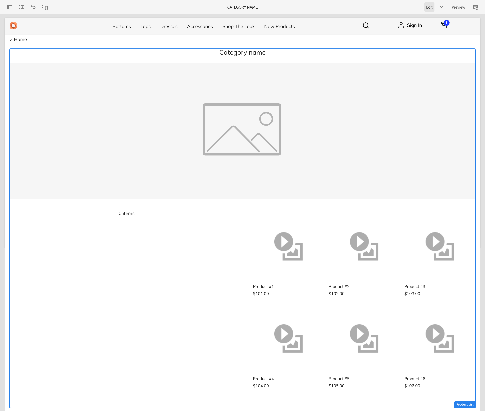
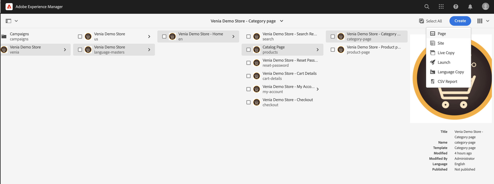

# 管理產品目錄頁面和範本 {#product-catalog}

了解如何管理產品目錄頁面和範本。

## 迄今為止的故事 {#story-so-far}

在AEM內容與商務製作歷程的上一份檔案中， [AEM CIF製作基本概念快速入門](getting-started.md)，您就學到了CIF製作的基本知識。

本文以這些基本知識為基礎。

## 目標 {#objective}

本檔案可協助您了解如何管理產品目錄頁面和範本。 閱讀後，您應：

* 了解目錄範本的概念
* 一般範本如何運作
* 已建立個別範本

## 基本概念 {#basic-concept}

Venia storefront提供典型的產品目錄體驗，包括導覽、登陸、類別(PLP)和產品詳細資訊頁面(PDP)。

目錄頁面是使用AEM CIF目錄範本和即時產品資料，以動態方式建立，而即時產品資料會視需要從商務端點擷取。 每個目錄都有產品和類別頁面的一般範本。

導覽元件會顯示內容和目錄頁面。 您可以在導覽中顯示目錄登陸頁面或第一層級類別。 將滑鼠暫留在類別上，會將第二級類別顯示為第二行。

按一下類別會開啟類別頁面（或產品清單頁面）。

按一下產品會開啟產品詳細資料頁面。

## 範本 {#templates}

### 一般範本 {#generic}

通用Venia目錄範本使用產品清單核心元件。 此元件顯示類別影像（如果可用）和類別中的產品。

一般Venia產品範本使用產品詳細資料核心元件。 此元件會顯示各種產品類型和附加至購物車動作的產品資訊。

### 編輯範本 {#edit-templates}

您可以直接開啟範本頁面，或在瀏覽產品目錄頁面時切換至編輯模式，以編輯範本。 請記得，變更頁面會變更範本，而不只是產品/類別的特定頁面。

### 類別或產品特定範本 {#specific}

CIF只需按幾下，即可支援多個範本。 若要建立另一個範本，請從相應類別中選取一般範本，並使用 **建立** 動作。

選取相應的產品或類別範本。

輸入標題並建立頁面。

請注意，您現在在一般範本底下有特定範本。

開啟範本。 看起來與一般類別範本完全相同。

在頁面頂端新增任何影像。

範本可預覽為任何類別/產品。 開啟 **頁面資訊** 然後選取 **查看類別/產品**. 從選擇器中選取產品/類別，即可預覽此產品/類別。 選擇 **購買外觀** 類別來預覽更新的範本。

現在，我們必須將此範本指派給特定類別。 在 **頁面資訊** ，然後切換至「商務」標籤。 按一下資料夾圖示以選取 **購買外觀** 類別。 您可以啟用核取方塊，將多個類別指派給範本，也包括子類別。

返回主首頁，然後按一下 **購買外觀** 類別，以查看特定範本。 所有其他類別仍使用一般範本。

可套用相同的工作流程來建立個別產品範本。

## 下一步 {#what-is-next}

現在您已完成此部分的歷程，您應：

* 了解目錄範本的概念
* 一般範本如何運作
* 已建立個別範本

根據此知識，接下來檢閱此檔案，繼續您的歷程 [管理分階段產品目錄體驗](staged-catalog.md)，您將在此了解如何使用分階段產品資料和AEM Launch。

## 其他資源 {#additional-resources}

雖然建議您檢閱檔案，以繼續前往歷程的下一個階段 [管理分階段產品目錄體驗](staged-catalog.md)，以下是一些額外的選用資源，可深入探討本檔案中提及的一些概念，但您不需要這些資源即可繼續進行無頭歷程：

* [建立多個類別和產品頁面](/help/commerce-cloud/authoring/multi-template-usage.md)
* [Experience Manager Cloud Service移轉指南](/help/commerce-cloud/migration.md)  — 如何從舊版移轉至AEM Commerce Integration Framework(CIF)附加元件
