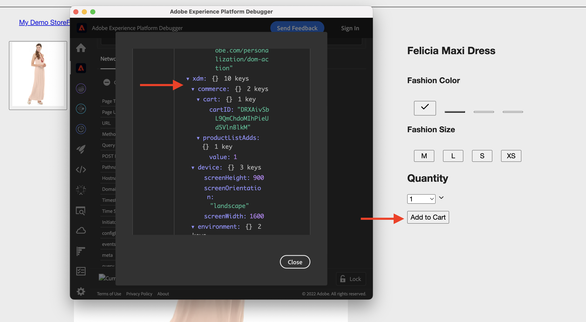

# AEM-CIF核心元件與Adobe Experience Platform整合 {#aem-cif-aep-integration}

此 [商務整合架構(CIF)](https://github.com/adobe/aem-core-cif-components) 核心元件提供緊密整合， [Adobe Experience Platform](https://experienceleague.adobe.com/docs/experience-platform/landing/platform-overview.html?lang=en) 從用戶端互動(例如 __新增至購物車__.

此 [AEM CIF核心元件](https://github.com/adobe/aem-core-cif-components) 專案提供名為的JavaScript程式庫 [Experience Platform連接器](https://github.com/adobe/aem-core-cif-components/tree/master/extensions/experience-platform-connector) 從您的商務商店收集事件資料。 該事件資料會傳送至其他Adobe Experience Cloud產品(例如Adobe Analytics和Adobe Target)中用於的Experience Platform，以建立涵蓋客戶歷程的360度設定檔。 將商務資料連結至Adobe Experience Cloud中的其他產品，您可以執行分析網站上的使用者行為、執行AB測試，以及建立個人化促銷活動等工作。

深入了解 [Experience Platform資料收集](https://experienceleague.adobe.com/docs/experience-platform/collection/home.html) 可讓您從用戶端來源收集客戶體驗資料的技術套裝。

## 傳送 `addToCart` 要Experience Platform的事件資料 {#send-addtocart-to-aep}

下列步驟顯示如何傳送 `addToCart` 從AEM轉譯的產品頁面到Experience Platform的事件資料(使用CIF -Experience Platform連接器)。 使用Adobe Experience Platform Debugger瀏覽器擴充功能，即可測試及檢閱提交的資料。


## 必備條件 {#prerequisites}

您必須使用本機開發環境才能完成此示範。 這包括已設定並連線至Adobe Commerce執行個體的AEM執行個體。 檢閱 [使用AEM SDK設定本機開發](../develop.md).

您也需要 [Adobe Experience Platform](https://experienceleague.adobe.com/docs/experience-platform/landing/platform-ui/ui-guide.html) 和建立資料收集結構、資料集和資料流的權限。 如需詳細資訊，請參閱 [權限管理](https://experienceleague.adobe.com/docs/experience-platform/collection/permissions.html).

## AEM Commerceas a Cloud Service設定 {#aem-setup}

要工作 __AEM商務as a Cloud Service__ 本機環境及必要的程式碼和設定，請完成下列步驟。

### 本機設定

關注 [本機設定](https://experienceleague.adobe.com/docs/experience-manager-cloud-service/content/content-and-commerce/storefront/developing/develop.html?#local-setup) 提供可運作AEM Commerceas a Cloud Service環境的步驟。

### 專案設定

關注 [AEM專案原型](https://experienceleague.adobe.com/docs/experience-manager-cloud-service/content/content-and-commerce/storefront/developing/develop.html?#project) 建立全新AEM Commerce(CIF)專案的步驟。

>[!TIP]
>
>在下列範例中，AEM Commerce專案的名稱為： `My Demo Storefront`，但您可以選擇您自己的專案名稱。


從專案的根目錄執行下列命令，以建立新建立的AEM Commerce專案並部署至本機AEM SDK。

```bash
$ mvn clean install -PautoInstallSinglePackage
```

本地部署的 `My Demo StoreFront` 具有預設程式碼和內容的商務網站看起來如下所示：


### 安裝Peregrine和CIF-AEP連接器相依性

若要從此AEM Commerce網站的類別和產品頁面收集和傳送事件資料，您必須安裝金鑰 `npm` 封裝 `ui.frontend` AEM Commerce專案的模組。

導覽至 `ui.frontend` 從命令行運行以下命令，以安裝所需的軟體包。

```bash
npm i --save lodash.get@^4.4.2 lodash.set@^4.3.2
npm i --save apollo-cache-persist@^0.1.1
npm i --save redux-thunk@~2.3.0
npm i --save @adobe/apollo-link-mutation-queue@~1.1.0
npm i --save @magento/peregrine@~12.5.0
npm i --save @adobe/aem-core-cif-react-components --force
npm i --save-dev @magento/babel-preset-peregrine@~1.2.1
npm i --save @adobe/aem-core-cif-experience-platform-connector --force
```

>[!IMPORTANT]
>
>此 `--force` 引數有時為必要項目，如 [PWA Studio](https://developer.adobe.com/commerce/pwa-studio/) 對受支援的對等依賴項具有限制。 這通常不會造成任何問題。


### 設定Maven以使用 `--force` 引數

作為Maven建置程式的一部分，npm會清除安裝(使用 `npm ci`)。 這也需要 `--force` 引數。

導覽至專案的根POM檔案 `pom.xml` 並找到 `<id>npm ci</id>` 執行區塊。 更新區塊以如下所示：

```xml
<execution>
    <id>npm ci</id>
    <goals>
    <goal>npm</goal>
    </goals>
    <configuration>
    <arguments>ci --force</arguments>
    </configuration>
</execution>
```

### 更改Babel配置格式

從預設值切換 `.babelrc` 檔案相對配置檔案格式 `babel.config.js` 格式。 這是專案範圍的設定格式，可將外掛程式和預設集套用至 `node_module` 更有控制力。

1. 導覽至 `ui.frontend` 模組和刪除現有 `.babelrc` 檔案。

1. 建立 `babel.config.js` 使用 `peregrine` 預設集。

   ```javascript
   const peregrine = require('@magento/babel-preset-peregrine');
   
   module.exports = (api, opts = {}) => {
       const config = {
           ...peregrine(api, opts),
           sourceType: 'unambiguous'
       } 
   
       config.plugins = config.plugins.filter(plugin => plugin !== 'react-refresh/babel');
   
       return config;
   }
   ```

### 配置Webpack以使用Babel

使用Babel載入器傳輸JavaScript檔案(`babel-loader`)和webpack，您需要修改 `webpack.common.js` 檔案。

導覽至 `ui.frontend` 模組和更新 `webpack.common.js` 檔案中的 `module` 屬性值：

```javascript
{
    test: /\.jsx?$/,
    exclude: /node_modules\/(?!@magento\/)/,
    loader: 'babel-loader'
}
```

### 配置Apollo客戶端

此 [阿波羅客戶](https://www.apollographql.com/docs/react/) 用於使用GraphQL管理本地和遠程資料。 它還將GraphQL查詢的結果儲存在本地標準化記憶體內快取中。

針對 [`InMemoryCache`](https://www.apollographql.com/docs/react/caching/cache-configuration/) 要高效工作，你需要 `possibleTypes.js` 檔案。 要生成此檔案，請參閱 [自動生成可能的類型](https://www.apollographql.com/docs/react/data/fragments/#generating-possibletypes-automatically). 另請參閱 [PWA Studio參考實作](https://github.com/magento/pwa-studio/blob/1977f38305ff6c0e2b23a9da7beb0b2f69758bed/packages/pwa-buildpack/lib/Utilities/graphQL.js#L106-L120) 和 [`possibleTypes.js`](../assets/aep-integration/possibleTypes.js) 檔案。


1. 導覽至 `ui.frontend` 模組並將檔案儲存為 `./src/main/possibleTypes.js`

1. 更新 `webpack.common.js` 檔案的 `DefinePlugin` 區段來取代建置期間所需的靜態變數。

   ```javascript
   const { DefinePlugin } = require('webpack');
   const { POSSIBLE_TYPES } = require('./src/main/possibleTypes');
   
   ...
   
   plugins: [
       ...
       new DefinePlugin({
           'process.env.USE_STORE_CODE_IN_URL': false,
           POSSIBLE_TYPES
       })
   ]
   ```

### 初始化Peregrine和CIF核心元件

若要初始化React型Peregrine和CIF核心元件，請建立必要的設定和JavaScript檔案。

1. 導覽至 `ui.frontend` 模組並建立下列資料夾： `src/main/webpack/components/commerce/App`

1. 建立 `config.js` 檔案，其內容如下：

   ```javascript
   // get and parse the CIF store configuration from the <head>
   const storeConfigEl = document.querySelector('meta[name="store-config"]');
   const storeConfig = storeConfigEl ? JSON.parse(storeConfigEl.content) : {};
   
   // the following global variables are needed for some of the peregrine features
   window.STORE_VIEW_CODE = storeConfig.storeView || 'default';
   window.AVAILABLE_STORE_VIEWS = [
       {
           code: window.STORE_VIEW_CODE,
           base_currency_code: 'USD',
           default_display_currency_code: 'USD',
           id: 1,
           locale: 'en',
           secure_base_media_url: '',
           store_name: 'My Demo StoreFront'
       }
   ];
   window.STORE_NAME = window.STORE_VIEW_CODE;
   window.DEFAULT_COUNTRY_CODE = 'en';
   
   export default {
       storeView: window.STORE_VIEW_CODE,
       graphqlEndpoint: storeConfig.graphqlEndpoint,
       // Can be GET or POST. When selecting GET, this applies to cache-able GraphQL query requests only.
       // Mutations will always be executed as POST requests.
       graphqlMethod: storeConfig.graphqlMethod,
       headers: storeConfig.headers,
   
       mountingPoints: {
           // TODO: define the application specific mount points as they may be used by <Portal> and <PortalPlacer>
       },
       pagePaths: {
           // TODO: define the application specific paths/urls as they may be used by the components
           baseUrl: storeConfig.storeRootUrl
       },
       eventsCollector: {
           // Enable the Experience Platform Connector and define the org and datastream to use
           aep: {
               orgId: // TODO: add your orgId
               datastreamId: // TODO: add your datastreamId
           }
       }
   };
   ```

   >[!IMPORTANT]
   >
   >雖然您可能已熟悉 [`config.js`](https://github.com/adobe/aem-cif-guides-venia/blob/main/ui.frontend/src/main/components/App/config.js) 檔案 __AEM指南 — CIF Venia Project__，您需要對此檔案進行一些變更。 首先，檢閱任何 __TODO__ 意見。 然後，在 `eventsCollector` 屬性，查找 `eventsCollector > aed` 對象和更新 `orgId` 和 `datastreamId` 屬性。 [了解更多](./aep.md#add-aep-values-to-aem).

1. 建立 `App.js` 檔案中包含下列內容。 此檔案類似典型的React應用程式起始點檔案，並包含React和自訂鈎點及React內容使用，以促進Experience Platform整合。

   ```javascript
   import config from './config';
   
   import React, { useEffect } from 'react';
   import ReactDOM from 'react-dom';
   import { IntlProvider } from 'react-intl';
   import { BrowserRouter as Router } from 'react-router-dom';
   import { combineReducers, createStore } from 'redux';
   import { Provider as ReduxProvider } from 'react-redux';
   import { createHttpLink, ApolloProvider } from '@apollo/client';
   import { ConfigContextProvider, useCustomUrlEvent, useReferrerEvent, usePageEvent, useDataLayerEvents, useAddToCartEvent } from '@adobe/aem-core-cif-react-components';
   import { EventCollectorContextProvider, useEventCollectorContext } from '@adobe/aem-core-cif-experience-platform-connector';
   import { useAdapter } from '@magento/peregrine/lib/talons/Adapter/useAdapter';
   import { customFetchToShrinkQuery } from '@magento/peregrine/lib/Apollo/links';
   import { BrowserPersistence } from '@magento/peregrine/lib/util';
   import { default as PeregrineContextProvider } from '@magento/peregrine/lib/PeregrineContextProvider';
   import { enhancer, reducers } from '@magento/peregrine/lib/store';
   
   const storage = new BrowserPersistence();
   const store = createStore(combineReducers(reducers), enhancer);
   
   storage.setItem('store_view_code', config.storeView);
   
   const App = () => {
       const [{ sdk: mse }] = useEventCollectorContext();
   
       // trigger page-level events
       useCustomUrlEvent({ mse });
       useReferrerEvent({ mse });
       usePageEvent({ mse });
       // listen for add-to-cart events and enable forwarding to the magento storefront events sdk
       useAddToCartEvent(({ mse }));
       // enable CIF specific event forwarding to the Adobe Client Data Layer
       useDataLayerEvents();
   
       useEffect(() => {
           // implement a proper marketing opt-in, for demo purpose we hard-set the consent cookie
           if (document.cookie.indexOf('mg_dnt') < 0) {
               document.cookie += '; mg_dnt=track';
           }
       }, []);
   
       // TODO: use the App to create Portals and PortalPlaceholders to mount the CIF / Peregrine components to the server side rendered markup
       return <></>;
   };
   
   const AppContext = ({ children }) => {
       const { storeView, graphqlEndpoint, graphqlMethod = 'POST', headers = {}, eventsCollector } = config;
       const { apolloProps } = useAdapter({
           apiUrl: new URL(graphqlEndpoint, window.location.origin).toString(),
           configureLinks: (links, apiBase) =>
               // reconfigure the HTTP link to use the configured graphqlEndpoint, graphqlMethod and storeView header
   
               links.set('HTTP', createHttpLink({
                   fetch: customFetchToShrinkQuery,
                   useGETForQueries: graphqlMethod !== 'POST',
                   uri: apiBase,
                   headers: { ...headers, 'Store': storeView }
               }))
       });
   
       return (
           <ApolloProvider {...apolloProps}>
               <IntlProvider locale='en' messages={{}}>
                   <ConfigContextProvider config={config}>
                       <ReduxProvider store={store}>
                           <PeregrineContextProvider>
                               <EventCollectorContextProvider {...eventsCollector}>
                                   {children}
                               </EventCollectorContextProvider>
                           </PeregrineContextProvider>
                       </ReduxProvider>
                   </ConfigContextProvider>
               </IntlProvider>
           </ApolloProvider>
       );
   };
   
   window.onload = async () => {
       const root = document.createElement('div');
       document.body.appendChild(root);
   
       ReactDOM.render(
           <Router>
               <AppContext>
                   <App />
               </AppContext>
           </Router>,
           root
       );
   };
   ```

   此 `EventCollectorContext` 匯出React內容，其：

   - 載入commerce-events-sdk和commerce-events-collector程式庫，
   - 用給定的配置初始化它們，以Experience Platform和/或ACDS
   - 訂閱Peregrine中的所有事件，並轉送至事件SDK

   您可以檢閱 `EventCollectorContext` [此處](https://github.com/adobe/aem-core-cif-components/blob/3d4e44d81fff2f398fd2376d24f7b7019f20b31b/extensions/experience-platform-connector/src/events-collector/EventCollectorContext.js).

### 建立並部署更新的AEM專案

若要確認上述套件安裝、程式碼和設定變更正確無誤，請使用下列Maven命令重新建置及部署更新的AEM Commerce專案： `$ mvn clean install -PautoInstallSinglePackage`.

## Experience Platform設定 {#aep-setup}

若要接收並儲存來自AEM商務頁面（例如類別和產品）的事件資料，請完成下列步驟：

>[!AVAILABILITY]
>
>請確定您是正確 __產品設定檔__ 在 __Adobe Experience Platform__ 和 __Adobe Experience Platform資料收集__. 如有需要，請與系統管理員合作以建立、更新或指派 __產品設定檔__ 在 [Admin Console](https://adminconsole.adobe.com/).

### 使用商務欄位組建立架構

若要定義商務事件資料的結構，您必須建立Experience Data Model(XDM)結構。 結構是一組規則，可代表及驗證資料的結構和格式。

1. 在瀏覽器中，導覽至 __Adobe Experience Platform__ 產品首頁。 例如， <https://experience.adobe.com/#/@YOUR-ORG-NAME/sname:prod/platform/home>.

1. 找出 __結構__ 功能表，按一下 __建立結構__ 按鈕，然後選取 __XDM ExperienceEvent__.

   

1. 使用為架構命名 __結構屬性>顯示名稱__ 欄位和新增欄位群組，方法是使用  __合成>欄位群組>新增__ 按鈕。

   

1. 在 __新增欄位群組__ 對話框，搜索 `Commerce`，請選取 __商務詳細資訊__ 核取方塊，然後按一下 __新增欄位群組__.

   


>[!TIP]
>
>請參閱 [結構構成基本概念](https://experienceleague.adobe.com/docs/experience-platform/xdm/schema/composition.html) 以取得更多資訊。

### 建立資料集

若要儲存事件資料，您必須建立符合架構定義的資料集。 資料集是資料集合（通常為表格）的儲存和管理結構，其中包含結構（欄）和欄位（列）。

1. 在瀏覽器中，導覽至 __Adobe Experience Platform__ 產品首頁。 例如， <https://experience.adobe.com/#/@YOUR-ORG-NAME/sname:prod/platform/home>.

1. 找出 __資料集__ ，然後按一下 __建立資料集__ 按鈕。

   

1. 在新頁面上，選取 __從結構建立資料集__ 卡片。

   

- 在新頁面上， __搜尋並選取__ 在上一步中建立的架構，然後按一下 __下一個__ 按鈕。

   

1. 使用為資料集命名 __設定資料集>名稱__ 欄位，然後按一下 __完成__ 按鈕。

   

>[!TIP]
>
>請參閱 [資料集概觀](https://experienceleague.adobe.com/docs/experience-platform/catalog/datasets/overview.html) 以取得更多資訊。


### 建立資料流

完成下列步驟以在Experience Platform中建立資料流。

1. 在瀏覽器中，導覽至 __Adobe Experience Platform__ 產品首頁。 例如， <https://experience.adobe.com/#/@YOUR-ORG-NAME/sname:prod/platform/home>.

1. 找出 __資料流__ ，然後按一下 __新資料流__ 按鈕。

   

1. 使用為您的資料流命名 __名稱__ 必填欄位。 在 __事件結構__ 欄位中，選擇新建立的架構並按一下 __儲存__.

   

1. 開啟新建立的資料流，然後按一下 __添加服務__.

   

1. 在 __服務__ 欄位，選擇 __Adobe Experience Platform__ 選項。 在 __事件資料集__ 欄位中，從上一步選取資料集名稱，然後按一下 __儲存__.

   

>[!TIP]
>
>請參閱 [資料流概述](https://experienceleague.adobe.com/docs/experience-platform/edge/datastreams/overview.html) 以取得更多資訊。

## 將資料流值新增至AEM Commerce設定 {#add-aep-values-to-aem}

完成上述Experience Platform設定後，您應該 `datastreamId` 資料流的左側邊欄，以及 `orgId` 在 __個人資料圖片>帳戶資訊>用戶資訊__ 模式。


1. 在AEM Commerce專案的 `ui.frontend` 模組，更新 `config.js` 檔案，尤其是 `eventsCollector > aep` 物件屬性。

1. 建立並部署更新的AEM Commerce專案


## 觸發 `addToCart` 事件與驗證資料收集 {#event-trigger-verify}

上述步驟會完成AEM Commerce和Experience Platform設定。 您現在可以觸發 `addToCart` 事件，並使用Experience Platform偵錯工具和資料集驗證資料收集 __度量和圖表__ 在產品UI中切換。

若要觸發事件，您可以使用AEM作者或本機設定中的發佈服務。 在此範例中，請登入您的帳戶以使用AEM作者。

1. 從「網站」頁面，選取 __我的演示商店前端>我們> en__ 頁面，按一下 __編輯__ 在頂端動作列。

1. 在頂端動作列中，按一下 __檢視為已發佈__，然後按一下店面導覽中的任何偏好類別。

1. 按一下 __產品頁面__，然後選取 __顏色，大小__ 啟用 __新增至購物車__ 按鈕。


1. 開啟 __Adobe Experience Platform Debugger__ 擴充功能（從瀏覽器的擴充功能面板），然後選取 __Experience PlatformWed SDK__ 在左側邊欄。

   


1. 返回 __產品頁面__ 按一下 __新增至購物車__ 按鈕。 這會傳送資料至Experience Platform。 此 __Adobe Experience Platform Debugger__ 擴充功能會顯示事件詳細資料。

   


1. 在Experience Platform產品UI中，導覽至 __資料集>我的Demo StoreFront__，在 __資料集活動__ 標籤。 若 __度量和圖表__ 切換為啟用，則會顯示事件資料統計資料。

   


## 實作詳細資料 {#implementation-details}

此 [CIFExperience Platform連接器](https://github.com/adobe/aem-core-cif-components/tree/master/extensions/experience-platform-connector) 建於 [Experience Platform Connector for Adobe Commerce](https://marketplace.magento.com/magento-experience-platform-connector.html)，此 [PWA Studio](https://developer.adobe.com/commerce/pwa-studio/) 專案。

PWA Studio專案可讓您建立由Adobe Commerce或Magento Open Source提供技術的Progressive Web Application(PWA)店面。 專案也包含名為的元件程式庫 [佩雷格林](https://developer.adobe.com/commerce/pwa-studio/api/peregrine/) ，將邏輯新增至視覺元件。 此 [Peregrin圖書館](https://developer.adobe.com/commerce/pwa-studio/api/peregrine/) 也提供使用的自訂React鈎點 [Experience Platform連接器](https://github.com/adobe/aem-core-cif-components/tree/master/extensions/experience-platform-connector) 與Experience Platform無縫整合。


## 支援的事件 {#supported-events}

目前支援下列事件：

- addToCart
- pageView
- customUrl
- referrerUrl

## 其他資源 {#additional-resources}

如需詳細資訊，請參閱下列資源：

- [PWA Studio](https://developer.adobe.com/commerce/pwa-studio/)
- [Experience Platform連接器概述](https://experienceleague.adobe.com/docs/commerce-merchant-services/experience-platform-connector/overview.html)
- [Adobe Experience Platform概述](https://experienceleague.adobe.com/docs/experience-platform/landing/home.html)

