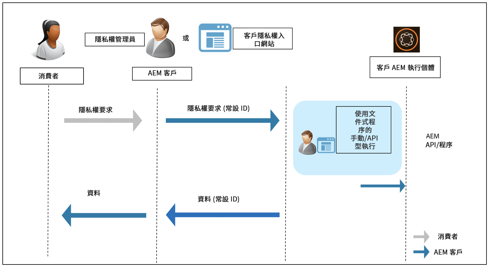

# Adobe Experience Manager as a Cloud Service對資料保護與資料隱私權法規的整備 {#aem-readiness-for-data-protection-and-data-privacy-regulations}

>[!WARNING]
>
>本檔案的內容不構成法律建議，且用意並非取代法律建議。
>
>如需資料保護與資料隱私權法規的相關建議，請諮詢貴公司的法律部門。

>[!NOTE]
>
>如需有關Adobe對隱私權問題之回應，以及這對您身為Adobe客戶所代表之意義的詳細資訊，請參閱 [Adobe的隱私中心](https://www.adobe.com/privacy.html).

Adobe提供檔案和程式（若有API可用），供客戶隱私權管理員或AEM管理員處理資料保護和資料隱私權請求，並協助客戶遵守這些法規。 記錄的程式可讓客戶手動執行法規要求，或透過外部入口網站或服務呼叫API（若有）。

>[!CAUTION]
>
>此處記錄的詳細資訊僅限於Adobe Experience Manager as a Cloud Service。
>
>其他Adobe隨選服務的資料，連同任何相關的隱私權要求，都需要對該服務採取動作。
>
>如需詳細資訊，請參閱 [Adobe的隱私中心](https://www.adobe.com/privacy.html).

## 簡介 {#introduction}

Adobe Experience Manager as a Cloud Service的例項以及在其上執行的應用程式，由我們的客戶擁有和運作。

因此，GDPR、CCPA等資料保護法規在很大程度上是客戶的責任。

作為非常簡短的介紹，資料隱私和保護法規包括了新規則，這些規則將遵循：

* 業務實體(CCPA)和/或資料控管單位(GDPR)

* 服務提供者(CCPA)及/或資料處理者(GDPR)

這些條例的主要規定是：

1. 擴展個人資料的定義，納入所有唯一ID;與可直接或間接識別的資料相同。

2. 加強同意要求。

3. 增加對刪除權限（資料擦除）的關注。

4. 選擇退出資料銷售。

若為Adobe Experience Manager as a Cloud Service:

* 執行個體和在其上執行的應用程式由客戶擁有和操作。

   * 這意味著客戶管理法規角色，包括業務實體和服務提供商、資料控制方和資料處理方等。

   * 如下圖所示，Adobe Experience Platform Privacy Service不屬於AEM的工作流程。

* AEM包含客戶隱私權管理員和/或AEM管理員執行隱私權法規要求的檔案和程式；手動或透過API（若有）。

* 未新增任何服務或UI。

   * 而是會記錄程式和API，以供處理隱私權法規要求的客戶UI/入口網站使用。

* AEM將不包含任何現成可用的工具，以支援隱私權要求工作流程。

   * Adobe將提供客戶隱私權管理員和/或AEM管理員的檔案和程式，讓他們能手動執行與隱私權法規相關的要求。

Adobe提供處理Adobe Experience Manager as a Cloud Service存取、刪除和選擇退出相關隱私權要求的程式。 某些情況下，客戶可從開發的入口網站或指令碼呼叫可用的API，以協助實現自動化。

下圖說明隱私權要求工作流程看起來的樣子(使用Adobe Experience Manager 6.5圖示):

## Adobe Experience Manager as a Cloud Service與法規整備 {#aem-as-a-cloud-service-and-regulatory-readiness}

如需AEMas a Cloud Service產品領域的規範檔案，請參閱以下各節。

## Adobe Experience Manager as a Cloud Service 基礎 {#aem-foundation}

請參閱 [AEM對資料保護與資料隱私權法規的基礎整備](/help/compliance/data-privacy-and-protection-readiness/foundation-readiness.md).

## Adobe Experience Manager as a Cloud Service Sites {#aem-sites}

請參閱 [AEM Sites對資料保護與資料隱私權法規的整備。](/help/compliance/data-privacy-and-protection-readiness/sites-readiness.md)

## Adobe Experience Manager as a Cloud Service與Adobe Target和Adobe Analytics整合 {#aem-integration-with-adobe-target-adobe-analytics}

這些Adobe Experience Manager as a Cloud Service整合包含資料保護與隱私權（例如GDPR）就緒服務。 AEM中不會儲存任何來自Adobe Target或Adobe Analytics的與整合相關的個人資料。
如需詳細資訊，請參閱：

* [Adobe Target — 隱私權概觀](https://experienceleague.adobe.com/docs/target/using/implement-target/before-implement/privacy/privacy.html)

* [Adobe Analytics資料隱私權工作流程](https://experienceleague.adobe.com/docs/analytics/admin/data-governance/an-gdpr-workflow.html)
