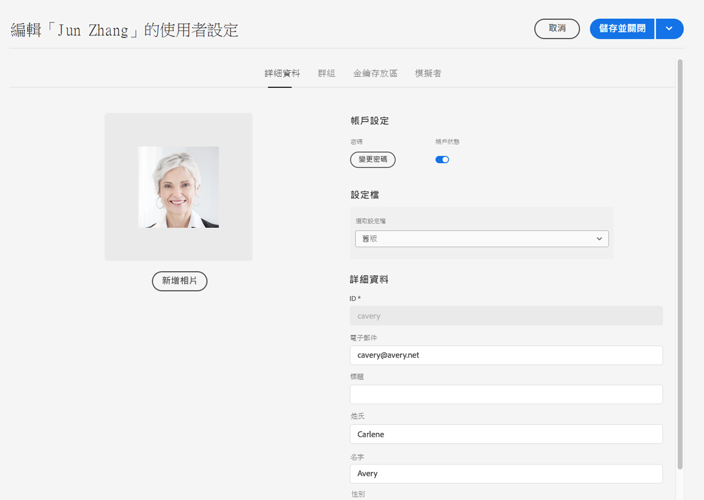
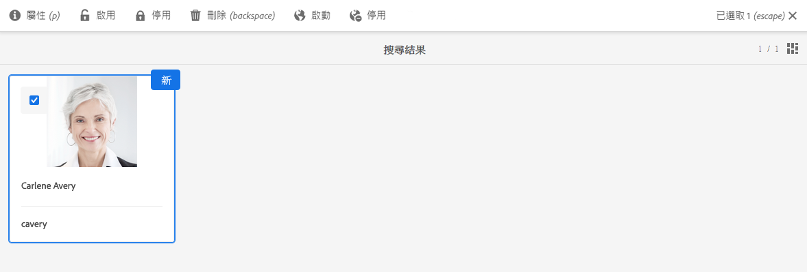
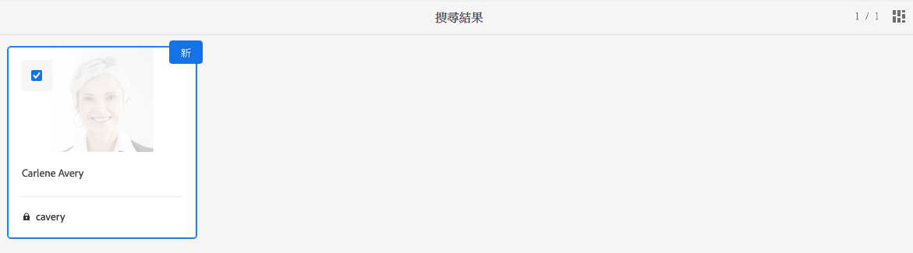

# Adobe Experience Manager as a Cloud Service對資料保護與資料隱私權法規的基礎整備 {#aem-foundation-readiness-for-data-protection-and-data-privacy-regulations}

>[!WARNING]
>
>本檔案的內容不構成法律建議，且用意並非取代法律建議。
>
>如需資料保護與資料隱私權法規的相關建議，請諮詢貴公司的法律部門。

>[!NOTE]
>
>如需有關Adobe對隱私權問題之回應，以及這對您身為Adobe客戶所代表之意義的詳細資訊，請參閱 [Adobe的隱私中心](https://www.adobe.com/privacy.html).

## AEM Foundation資料隱私權與保護支援 {#aem-foundation-data-privacy-and-protection-support}

在AEM Foundation層級，儲存的個人資料會保留在使用者設定檔中。 因此，本文的資訊主要探討如何分別存取和刪除使用者設定檔，以處理存取和刪除請求。

## 存取使用者設定檔 {#accessing-a-user-profile}

### 手動步驟 {#manual-steps}

1. 瀏覽至，開啟「使用者管理」主控台 **[!UICONTROL 工具 — 安全性 — 使用者]** 或直接瀏覽至 `https://<serveraddress>:<serverport>/security/users.html`

<!--
   
-->

1. 然後，在頁面頂端的搜尋列中輸入名稱，以搜尋有問題的使用者：

   

1. 最後，按一下使用者設定檔以開啟該使用者設定檔，然後核取 **[!UICONTROL 詳細資料]** 標籤。

   

### HTTP API {#http-api}

如前所述，Adobe提供存取使用者資料的API，以促進自動化。 您可以使用數種API:

**UserProperties API**

```shell
curl -u user:password http://localhost:4502/libs/granite/security/search/profile.userproperties.json\?authId\=cavery
```

**Sling API**

**探索使用者首頁：**

```xml
curl -g -u user:password 'http://localhost:4502/libs/granite/security/search/authorizables.json?query={"condition":[{"named":"cavery"}]}'
     {"authorizables":[{"type":"user","authorizableId_xss":"cavery","authorizableId":"cavery","name_xss":"Carlene Avery","name":"Carlene Avery","home":"/home/users/we-retail/DSCP-athB1NYLBXvdTuN"}],"total":1}
```

**正在檢索用戶資料：**

使用從上述命令傳回之JSON裝載的home屬性中的節點路徑：

```shell
curl -u user:password  'http://localhost:4502/home/users/we-retail/DSCP-athB1NYLBXvdTuN/profile.-1.json'
```

```shell
curl -u user:password  'http://localhost:4502/home/users/we-retail/DSCP-athB1NYLBXvdTuN/profiles.-1.json'
```

## 禁用用戶和刪除關聯的配置檔案 {#disabling-a-user-and-deleting-the-associated-profiles}

### 禁用用戶 {#disable-user}

1. 開啟「使用者管理」主控台，並依上述說明搜尋有問題的使用者。
2. 將滑鼠指標暫留在使用者上，然後按一下選取圖示。 輪廓將變為灰色，表示已選中。

3. 按下 **停用** 按鈕來禁用用戶：

   

4. 最後，確認動作。

   然後，使用者介面會移除並新增鎖定至設定檔卡片，以指出使用者帳戶已停用：

   

### 刪除用戶配置檔案資訊 {#delete-user-profile-information}

>[!NOTE]
>
>針對AEMas a Cloud Service,UI中沒有可用於刪除使用者設定檔的手動程式，因為無法存取CRXDE。

### HTTP API {#http-api-1}

以下過程使用命 `curl` 令行工具說明如何禁用具有預設位置 **[!UICONTROL 的用]**`userId` 戶並刪除其配置檔案。

**探索使用者首頁：**

```shell
curl -g -u user:password 'http://localhost:4502/libs/granite/security/search/authorizables.json?query={"condition":[{"named":"cavery"}]}'
     {"authorizables":[{"type":"user","authorizableId_xss":"cavery","authorizableId":"cavery","name_xss":"Carlene Avery","name":"Carlene Avery","home":"/home/users/we-retail/DSCP-athB1NYLBXvdTuN"}],"total":1}
```

**禁用用戶：**

使用從上述命令傳回之JSON裝載的home屬性中的節點路徑：

```shell
curl -X POST -u user:password -FdisableUser="describe the reasons for disabling this user (Data Privacy in this case)" 'http://localhost:4502/home/users/we-retail/DSCP-athB1NYLBXvdTuN.rw.userprops.html'
```

**刪除用戶配置檔案**

使用從帳戶探索命令傳回之JSON裝載的首頁屬性中的節點路徑，以及現成可用的設定檔節點位置：

```shell
curl -X POST -u user:password -H "Accept: application/json,**/**;q=0.9" -d ':operation=delete' 'http://localhost:4502/home/users/we-retail/DSCP-athB1NYLBXvdTuN/profile'
```

```shell
curl -X POST -u user:password -H "Accept: application/json,**/**;q=0.9" -d ':operation=delete' 'http://localhost:4502/home/users/we-retail/DSCP-athB1NYLBXvdTuN/profile'
```
