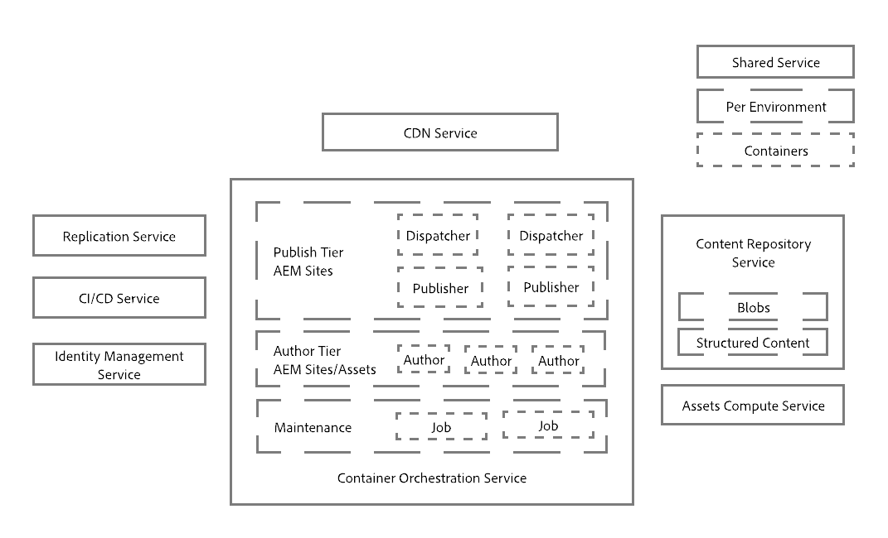

# An Introduction to the Architecture of Adobe Experience Manager as a Cloud Service {#an-introduction-to-the-architecture-adobe-experience-manager-as-a-cloud-service}

Adobe Experience Manager(AEM)做為雲端服務，已對架構進行變更。

## 縮放比例 {#scaling}

AEM即雲端服務現已具備：

* 具有可變數目AEM影像的動態架構。

此架構：

* 會根據實際流量和 *實際* 活動 *縮放* 。

* 具有僅在需要時運行的單個實例。

* 使用模組化應用程式。

* 具有作者群集作為預設值； 這樣可以避免維護任務的停機。

如此可針對各種使用模式自動縮放：

為達成此目的，AEM雲端服務的所有執行個體都會建立相等，每個執行個體在節點數、已分配記憶體和已分配運算容量方面，都具有相同的預設大小調整特性。

AEM做為雲端服務，是以使用協調引擎為基礎，可：

* 持續監控服務狀態。

* 根據實際需求動態調整每個服務實例； 都可視需要放大或縮小。

此：

* 適用於每個節點的節點數、記憶體量和分配的CPU容量。

* 允許AEM做為雲端服務，在流量模式變更時適應您的流量模式。

服務的每個租用戶實例的縮放可以是自動或手動的，在兩個軸上：

* 垂直： 對於固定數目的節點，可以放大或縮小已分配的記憶體和CPU容量。

* 水準： 指定服務的節點數可以增加或減少。

## 環境 {#environments}

>[!NOTE]
>
> 如需詳細資訊，請參 [閱部署——執行模式](/help/implementing/deploying/overview.md#runmodes)

AEM做為Cloud Service可以做為個別執行個體使用，每個執行個體代表完整的AEM環境。 AEM為雲端服務提供的環境有四種類型：

* **生產環境**: 為業務從業者代管應用程式。

* **舞台環境**: 始終以1:1的關係耦合到單個生產環境。 在將應用程式的變更推送至生產環境之前，階段環境會用於各種效能和品質測試。

* **開發環境**: 可讓開發人員在與舞台和生產環境相同的執行時期條件下，建置AEM應用程式。

* **演示環境**: 可用於評估、展示、建立原型和訓練。

開發和展示環境通常稱為非 *生產環境* 。

## 計畫 {#programs}

任何新的AEM專案一律系結至一個特定的程式碼基底，您可以在其中儲存專案的設定和自訂程式碼。 這些資訊會儲存在程式碼儲存庫中，可透過一般的Git用戶端存取，並在建立新程式時提供給您。

AEM程式是包含：

|  程式元素 |  數字 |
|--- |--- |
| 程式碼儲存庫(Git) |  1 |
| 基準影像（網站或資產） |  1 |
| 舞台和生產環境集(1:1) | 0或1 |
| 非生產環境（開發或展示） | 0到N |
| 適用於每個環境的管線 | 0或1 |

AEM的「雲端服務」最初提供兩種類型的程式：

* AEM Cloud Sites服務

* AEM Cloud資產服務

這兩者都允許訪問一些特性和功能。 作者層將包含所有程式的所有網站和資產功能，但資產程式預設沒有發佈層。

## 執行時期架構 {#runtime-architecture}

此新架構有多種主要元件：

<!--- needs reworking -->

* 針對AEM Sites的雲端服務：

   * 針對每個環境（在高階層），仍有製作層和發佈層的概念。

   * 作者層由單個作者群集中的兩個或多個節點組成。 它會根據撰寫活動自動縮放。

      * 內容作者／創作者登入AEM作者層，以建立、編輯和管理內容。

      * 登入作者層由Adobe Identity Management Services(IMS)管理。

      * 資產整合與處理使用專屬的資產計算服務。
   * 發佈層由單個發佈群中的兩個或多個節點組成： 它們可以相互獨立地運作。 每個節點都由AEM發行者和配備AEM Dispatcher模組的網頁伺服器所組成。 它會根據網站流量需求自動調整規模。

      * 使用者或網站訪客可透過AEM Publish Service瀏覽網站。

* 針對AEM Assets as a Cloud Service:

   * 此架構僅包含製作環境。

* 作者層和發佈層都會讀取內容，並將內容存留自／存留至內容儲存庫服務。

   * 發佈層僅讀取持久層中的內容。

   * 作者層從持久層讀取和寫入內容。

   * Blobs儲存空間在發佈層與作者層間共用； 檔案不會 *移動*。

   * 當內容從作者層核準時，這表示內容可以啟動，因此會推送至發佈層永續性層。 這通過中間件管線Replication Service來實現。 該管線接收新內容，其中各個發佈服務節點訂閱推送到管線的內容。

      >[!NOTE]
      >
      >有關詳細資訊，請參 [閱複製](/help/operations/replication.md)。

   * 開發人員和管理員使用Continuous Integration/Continuous Delivery(CI/CD)服務(透過 [Cloud Manager](/help/overview/what-is-new-and-different.md#cloud-manager))將AEM管理為雲端服務應用程式。 這包括使用Cloud Manager的CI/CD管道進行程式碼和組態部署。 Cloud Manager中的客戶可以看到任何與監控、維護和疑難排解（如日誌檔案）相關的內容。

   * 存取作者和發佈層時，一律會透過負載平衡器進行。 每個層中的活動節點隨時都是最新的。

   * 對於發佈層，也提供連續傳送網路(CDN)服務作為第一個入口點。

* 對於AEM做為雲端服務的示範例項，架構會簡化為單一作者節點。 因此，它沒有呈現標準開發、階段或生產環境的所有特點。 這也意味著可能會出現一些停機，並且不支援備份／恢復操作。

## 部署架構 {#deployment-architecture}

Cloud Manager會將AEM例項的所有更新作為雲端服務進行管理。 它是強制性的，是建立、測試和部署客戶應用程式的唯一方式，同時適用於作者和發佈層。 這些更新可在AEM Cloud服務新版準備就緒時由Adobe觸發，或在新版應用程式準備就緒時由客戶觸發。

從技術上講，這是由於部署管線的概念，與程式內的每個環境相耦合而實現的。 當Cloud Manager管道正在運行時，它會為作者和發佈層建立客戶應用程式的新版本。 這是結合最新客戶套件和最新基準Adobe影像而實現的。 當新映像構建並成功測試後，Cloud Manager會使用滾動更新模式更新所有服務節點，從而完全自動切換到最新版本的映像。 這不會造成作者或發佈服務的停機。

<!--- needs reworking -->

## 內容散發 {#content-distribution}

Adobe Experience Manager作為雲端服務，已修改發佈內容的運作方式。 將AEM當做雲端服務時，舊版AEM的複製架構將不再用於發佈頁面（將變更從作者例項移至發佈例項）。

AEM as a Cloud Service現在使用 [Sling Content Distribution](https://sling.apache.org/documentation/bundles/content-distribution.html) (Sling Content Distribution)功能來移動適當的內容。 這會使用在Adobe I/O上執行的管道服務，此服務在AEM執行時期之外。

設定會自動進行，包括在執行時期新增、移除或回收發佈節點時的自動自我設定。

單一發佈或取消發佈請求可包含多個資源，但會傳回套用至所有資源的單一狀態； 它將會在AEM Publish Service中成功處理所有資源，或失敗於所有資源。 這可確保AEM Publish Service中的資源不會處於不一致狀態。

**高階內容發佈架構圖**

## 關鍵演變 {#key-evolutions}

AEM雲端服務的新架構與前幾代產品相比，提供了一些根本的改變與創新：

* 所有檔案(blob)都會直接從雲端資料存放區上傳和提供。 相關的位元串流永遠不會透過AEM Author和Publish服務的JVM。 因此，AEM作者和發佈服務的節點可以更小，更符合快速自動縮放的期望。 對商業從業人員而言，這可讓上傳和下載影像、視訊等時的體驗更快速。

* 現在，所有包含發佈內容的作業都需要遵循訂閱模式的管道。 發佈內容被推送到管線中的各種隊列，發佈服務的所有節點都訂閱這些隊列。 因此，作者層不需要知道發佈服務中的節點數； 這可讓發佈層快速自動縮放。

* 引入金色主節點的概念，以自動化發佈節點的生命週期。 Golden Master是專門的發佈節點，任何最終用戶都不會訪問它，並且會從中建立發佈服務的所有節點。 維護操作（如壓縮）對附加到Golden Master的內容儲存庫執行。 這些發佈節點每天都被回收，不需要任何例行維護； 在過去，這種維護需要一些停機時間，尤其是對於作者實例。

* 該架構將應用程式內容與應用程式碼和組態完全分離。 所有代碼和配置實際上都是不可改變的，並且被映射到用於建立作者和發佈服務的各種節點的基線影像中。 因此，我們絕對保證每個節點都相同，而且只有執行Cloud Manager管道，才能對代碼和配置進行全局更改。
