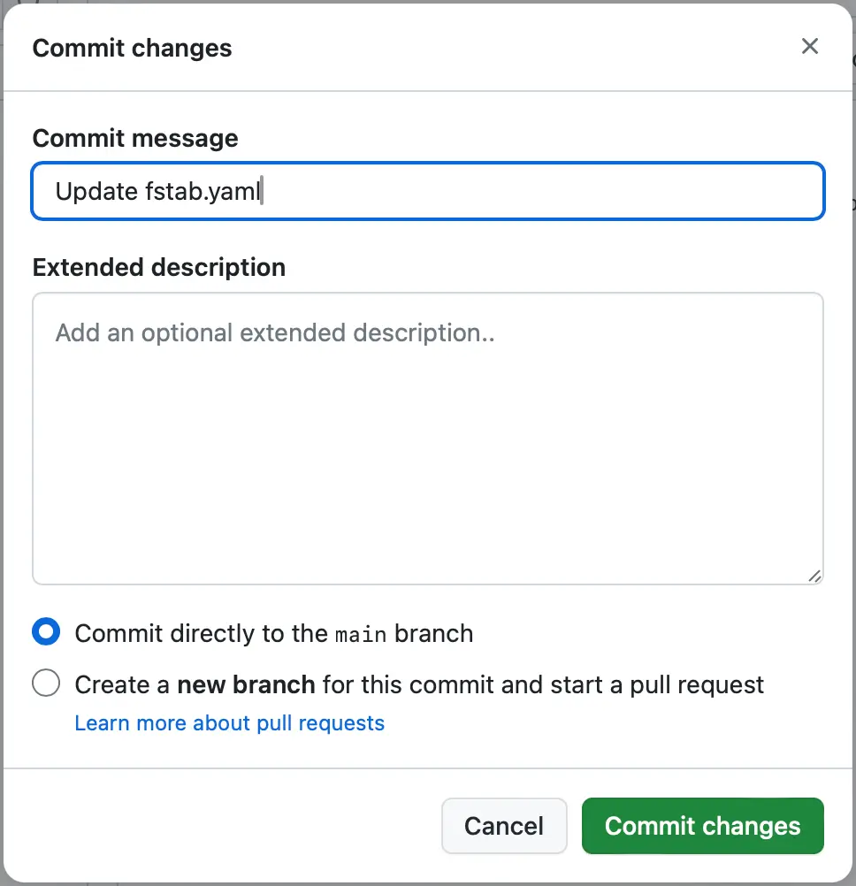

# 使用 Edge Delivery Services 進行 AEM 製作的開發人員快速入門指南 {#edge-dev-getting-started}

本指南將協助您啟動並執行新的 Adobe Experience Manager 網站，以使用 Edge Delivery Services 和 Universal Editor 進行內容製作。

## 先決條件 {#prerequisites}

在開始執行本指南之前，您應該要熟悉 Edge Delivery Services 的基礎知識並有權存取 Edge Delivery Services，其內容包括：

* 您已完成 [Edge Delivery Service 教學課程。](/help/edge/developer/tutorial.md)
* 您有權存取 [AEM Cloud Service 沙箱。](/help/implementing/cloud-manager/getting-access-to-aem-in-cloud/introduction-sandbox-programs.md)
* 您已[在同一沙箱環境中啟用 Universal Editor。](/help/implementing/universal-editor/getting-started.md)

## 選擇正確的編輯器 {#editor-choice}

AEM 提供兩種不同的內容編輯器，請您根據情況選擇要使用的編輯器。

* **Universal Editor** - 這是新網站的預設選項。
* **AEM 頁面編輯器** - 應選擇此編輯器將現有 AEM Sites 移轉到 Edge Delivery Services。

本指南重點在於使用 Universal Editor 的 Edge Delivery Services 上的 AEM 專案。請參閱文件「[透過 AEM 使用 Edge Delivery Services](/help/edge/using.md)」，以進一步了解有關選擇正確編輯器以及將現有 AEM Sites 移轉到 Edge Delivery Services 的詳細資訊。

## 開發 Edge Delivery Services 時的核心概念 {#core-concepts}

Edge Delivery Services 以區塊概念為基礎。AEM 包含完整的預先定義區塊資料庫，您可以擴充該資料庫來符合專案需求。Edge Delivery Services 專案的程式碼是在 GitHub 中管理。

### 區塊 {#blocks}

區塊是由 Edge Delivery Services 提供的頁面最基本部分。區塊可封裝驅動內容頁面邏輯元件的樣式和程式碼。

AEM 會提供標準區塊，作為本產品在專案範本中的一部分。這些區塊包括標題、文字、影像、連結、清單等。

>[!TIP]
>
>請參閱 Edge Delivery Services 文件的[「建置」區段](/help/edge/developer/block-collection.md) ，了解有關區塊以及如何開發 Edge Delivery Services 更多詳細資訊。

### Edge Delivery Services 和 GitHub {#github-edge}

Edge Delivery 運用 GitHub，可讓您直接從自己的 GitHub 存放庫管理和部署程式碼。

您的作者可以使用以文件為主的製作來建立內容，或使用 Universal Editor 在 AEM 中建立內容。無論作者如何建立他們的內容，開發人員都可以使用 GitHub 中的 CSS 和 JavaScript 來自訂網站的功能。

系統會自動為您的每個分部建立網站，從內容預覽到生產都包括在內。您放入 GitHub 存放庫的每個資源都可以在您的網站上使用，無需任何建置程序。

>[!TIP]
>
>請參閱 Edge Delivery Services 文件的[「建置」區段](/help/edge/developer/block-collection.md) ，了解有關區塊以及如何開發 Edge Delivery Services 更多詳細資訊。

## AEM Authoring 和 Edge Delivery Services 快速入門 {#getting-started}

滿足[先決條件](#prerequisites)並選擇[使用Universal Editor](#editor-choice) 後，您就可以開始製作自己的專案。

### 建立您的 GitHub 專案 {#create-github-project}

首先，您需要根據 Adobe 範本在 GitHub 上建立一個新專案。

1. 瀏覽至 [`https://github.com/adobe-rnd/aem-boilerplate-xwalk`](https://github.com/adobe-rnd/aem-boilerplate-xwalk)，然後按一下「**使用此範本**」並選取「**建立新存放庫**。

   * 您需要登入 GitHub 才能看到此選項。

   

1. 預設情況下，將會指派存放庫給您。請根據需要進行變更，並提供存放庫名稱和說明，然後按一下「**建立存放庫**」。

   

1. 在同一瀏覽器的新標籤中，瀏覽至 [`https://github.com/apps/aem-code-sync`](https://github.com/apps/aem-code-sync)，然後按一下「**設定**」。

   

1. 請對您在上一個步驟中建立新存放庫的組織，按一下「**設定**」。

   

1. 在 AEM Code Sync GitHub 頁面的「**存放庫存取權**」底下，選取「**僅選取存放庫**」，選取您在上一個步驟中建立的存放庫，然後按一下「**儲存**」。

   

1. 安裝 AEM Code Sync 後，您會收到確認畫面。返回新存放庫的瀏覽器標籤。

   

1. 按一下「`fstab.yaml`」檔案將其打開，然後按一下「**編輯此檔案**」圖示進行編輯。

   

1. 編輯 `fstab.yaml` 檔案以更新專案的掛載點。將預設的 Google 文件 URL 替換為 AEM as a Cloud Service 製作執行個體的 URL，然後按一下「**提交變更...**」。

   * `https://<aem-author>/bin/franklin.delivery/<owner>/<repository>/main`
   * 變更掛載點會告訴 Edge Delivery Services 在哪裡可以找到網站的內容。

   

1. 根據需要新增提交訊息，然後按一下「**提交變更**」，將其直接提交到 `main` 分支。

   

1. 返回存放庫的根目錄，按一下「`paths.json`」，然後按一下「**編輯此檔案**」圖示。

   

1. 預設對應將使用存放庫的名稱。使用 `/content/<site-name>/:/` 依您的專案需求更新預設對應，然後按一下「**提交變更...**」。

   * 提供您自己的 `<site-name>`。後續步驟中還會需要它。
   * 對應會告訴 Edge Delivery Services 如何將 AEM 存放庫中的內容對應到網站 URL。

   

1. 根據需要新增提交訊息，然後按一下「**提交變更**」，將其直接提交到 `main` 分支。

   

### 建立和編輯新的 AEM 網站 {#create-aem-site}

現在您已擁有 GitHub 專案，接著必須建立該專案可以使用的新 AEM 網站。

>[!NOTE]
>
>若要使用 Universal Editor 編輯您的網站，您必須使用 Chromium 式瀏覽器。

1. 從 GitHub 下載最新的「使用 Edge Delivery Services 進行 AEM 製作」網站範本：[`https://github.com/adobe-rnd/aem-boilerplate-xwalk/releases`](https://github.com/adobe-rnd/aem-boilerplate-xwalk/releases)

1. 登入您的 AEM as a Cloud Service 製作執行個體，並瀏覽至 Sites 主控台，然後點選或按一下「**建立** -> **根據範本的網站**」。

   

1. 在建立網站精靈的「**選取網站範本**」標籤上，按一下「**匯入**」按鈕以匯入新範本。

   

1. 上傳您從 GitHub 下載的「使用 Edge Delivery Services 進行 AEM 製作」網站範本。

   * 該範本只能上傳一次。上傳後，可以重複使用它來建立其他網站。

1. 匯入範本後，該範本將出現在精靈中。點選或按一下以選取該範本，然後點選或按一下「**下一步**」。

   

1. 提供以下欄位，然後點選或按一下「**建立**」。

   * **網站標題** - 為網站新增描述性標題。
   * **網站標題** - 使用您在[上一個步驟](#create-github-project)中定義的 `<site-name>`。
   * **GitHub URL** - 使用您在上一個步驟中建立的 GitHub 專案的 URL。

   

1. AEM 會透過對話方塊確認建立網站。點選或按一下「**確認**」以關閉對話方塊。

   

1. 在網站主控台上，瀏覽到新建立網站的 `index.html`，然後在工具列中點選或按一下「**編輯**」。

   

1. Universal Editor 會在新標籤中開啟。您可能需要點選或按一下「**使用 Adobe 登入**」進行身分驗證以編輯您的頁面。

   

現在您可以使用 Universal Editor 編輯您的網站。如需詳細資訊，請參閱 [Universal Editor 文件](/help/sites-cloud/authoring/universal-editor/authoring.md)。

### 發佈您的新網站 {#publishing}

使用 Universal Editor 編輯完新網站後，您就可以發佈內容。

1. 在網站主控台上，選取所有您為新網站建立的頁面，然後點選或按一下工具列中的「**快速發佈**」。

   

1. 點選或按一下確認對話方塊中的「**發佈**」以啟動該程序。

   

1. 在同一瀏覽器中開啟一個新標籤並瀏覽到新網站的 URL。

   * `https://main--<repository-name>--<owner>.hlx.page`

1. 查看您發佈的內容。

   

## 後續步驟 {#next-steps}

現在您已經有使用 Edge Delivery Services 專案進行的 AEM 製作環境，您可以開始建立自己的區塊並設計其樣式。

請參閱指南「[建立經檢測適用 Universal Editor 的區塊](/help/edge/aem-authoring/create-block.md)」，了解更多資訊。

>[!TIP]
>
>有關建立新的 Edge Delivery Services 專案的端對端操作示範，該專案支援使用 AEM as a Cloud Service 作為內容來源進行 AEM 製作，請觀看[「AEM GEM 網路研討會」。](https://experienceleague.adobe.com/zh-hant/docs/events/experience-manager-gems-recordings/gems2024/aem-authoring-and-edge-delivery)

