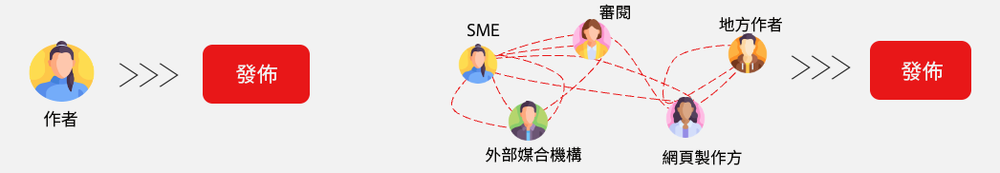
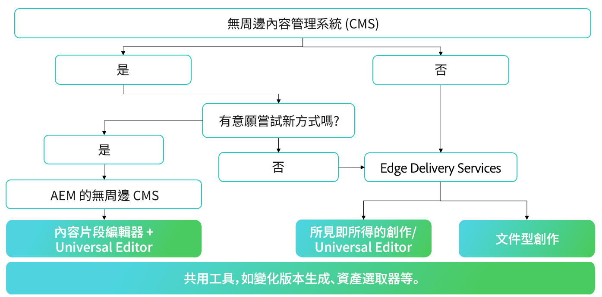
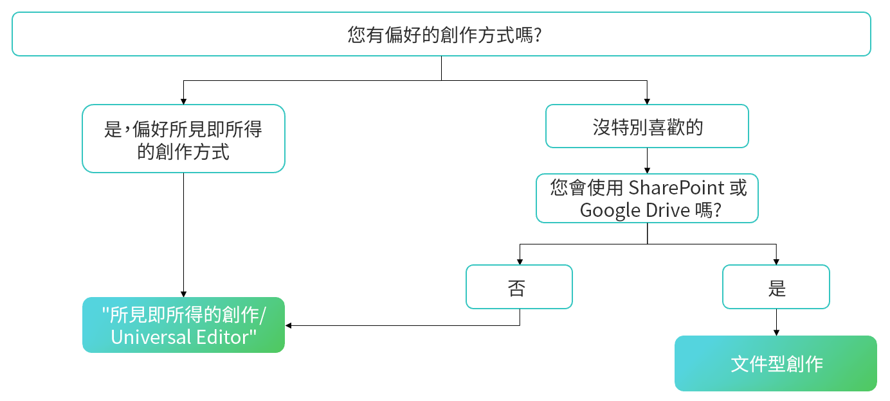

# 選擇製作方法 {#authoring-methods}

了解在決定如何在 AEM 中製作內容時有哪些重要考量，幫助您為內容作者做出最佳決定。

## 考量概觀 {#overview}

無論您選擇文件型製作或所見即所得創作，AEM 的靈活性都能確保滿足您的製作需求。當您開始考量時，請記住以下事實。

* **隨時讓您的內容作者參與決定。** - 內容作者是您的專家，他們的分析至關重要。
* **可以實作多種製作方法。** - 儘管 Adobe 建議先從簡單的形式開始，再視需要進行複雜性分層，但多種製作方法可以在一個專案中協同運作。
* **您之後隨時都可以變更製作方法。** - 無論您做了什麼決定，都不會被鎖定。在 Adobe 自動遷移工具的協助下，從一種方法變更為另一種方法是非常簡單的。
* **不要在實作之前做決定，而是將其作為實作的一部分。** - AEM 是一項整合的產品，因此這個重要決定不需要成為合約協商的一部分。購買 AEM 時，您全部都能獲得。相對地，這是在實作期間進行的決定。

在實作期間，Adobe 可以幫助您確定哪種 (或多種) 方法最適合您的要求。

## 並非一體適用 {#one-size}

AEM 的每項實作都有自己的工作流程和目標。一個專案可能涉及一種簡單的製作模型，由內容作者負責自己的發佈。另一個專案則可能具有複雜的投稿人和核准網絡。

不同的專案可能有不同的 (且多個) 使用案例。

Adobe 深知這一點，因此並未提供一體適用的方法。AEM 是您的單一解決方案，它提供不同的內容傳遞和內容建立方法，以最貼近您的需求。

若要確定最佳方法，您需要考慮四項。

1. [您有偏好的內容傳遞方式嗎？](#content-delivery)
1. [您有偏好的內容製作方式嗎？](#content-authoring)
1. [您的專案目標是什麼？](#project-goals)
1. [您目前面臨哪些製作上的挑戰？](#authoring-challenges)

## 內容傳遞偏好 {#content-delivery}

您的優先考量應該是您希望如何傳遞內容。Edge Delivery Services 提供閃電般快速的網站，但也許您的焦點是 Headless 傳遞。下方的決策樹可以幫助您考量選項。

這可以幫助您決定是否需要：

* [AEM as a Headless CMS](/help/headless/introduction.md)，使用內容片段編輯器和/或通用編輯器。
* 使用[檔案式編輯](/help/edge/docs/authoring.md)或使用Universal Editor](/help/edge/wysiwyg-authoring/authoring.md)進行[WYSIWYG編寫的AEMEdge Delivery Services。

## 內容製作偏好 {#content-authoring}

您下一個考量應該是您希望如何製作內容。下方的決策樹可以幫助您考量選項。

這可以幫助您決定是否需要：

* 使用[檔案式編輯](/help/edge/docs/authoring.md)的AEMEdge Delivery Services。
* 使用通用編輯器[WYSIWYG編寫](/help/edge/wysiwyg-authoring/authoring.md)。

## 專案目標 {#project-goals}

對您來說，成功的製作是什麼樣子？您如何定義專案的成功？

* 也許您需要讓更多人能夠建立內容，但希望避免進行新工具集的訓練。(例如文件型製作。)
* 也許您需要增加產生的內容量。(例如文件型製作。)
* 也許您需要將焦點放在視覺內容版面，但盡量減少對編碼知識的需求。(例如所見即所得製作。)

於實作開始時便明確陳述專案目標，將幫助您在製作方法上做出明智的決定。

## 製作挑戰 {#authoring-challenges}

最後，請考量您目前製作內容時面臨的特定挑戰。

* 也許您面臨在 CMS 外部建立之內容的工作重複，也就是需要匯入或複製貼上。(例如文件型製作。)
* 也許您需要減少培訓作者使用 CMS 所需的時間。(例如文件型製作。)
* 也許您的作者需要經常編輯內容的視覺版面，因而會持續需要開發人員的支援。(例如所見即所得製作。)
