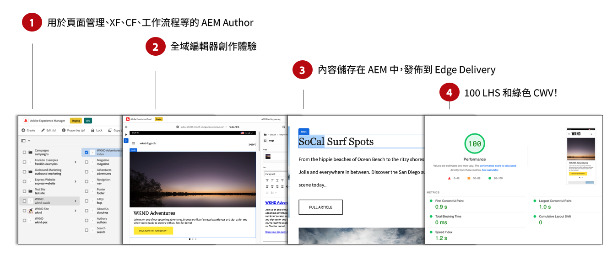
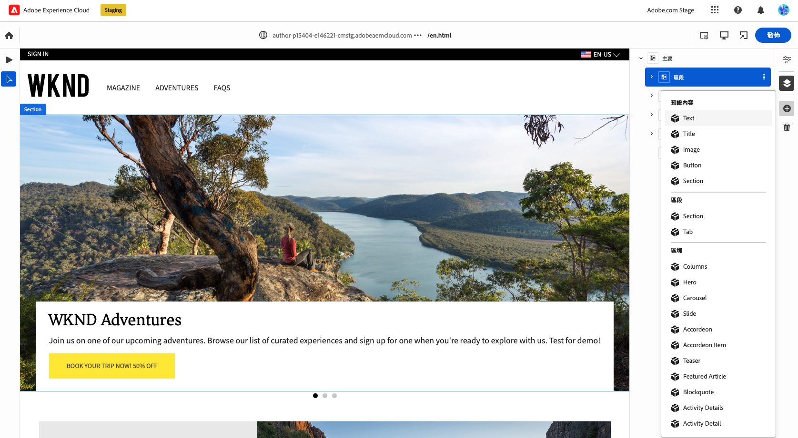
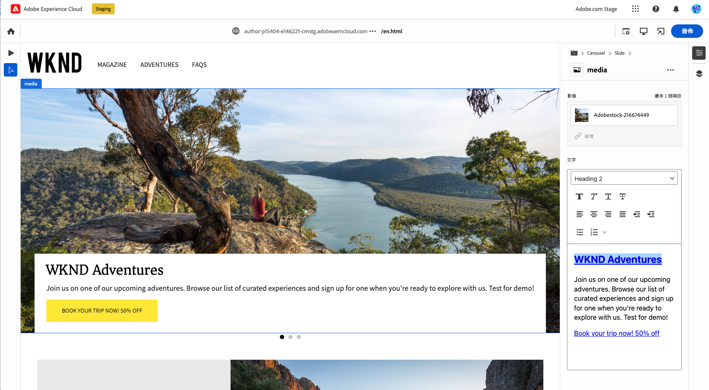

# 為Edge Delivery Services製作內容 {#authoring-edge}

透過 Edge Delivery Services，製作變得簡單、快速且靈活。您有兩個選項可撰寫Edge Delivery Services的內容：

* [檔案式撰寫](#document-based)  — 例如Microsoft Word或Google檔案
* [通用編輯器](#universal-editor)  — 在AEM內編寫內容的現代化UI

## 檔案式製作 {#document-based}

在以文件為主編寫情況中，您可以使用各種來源，例如 Microsoft Word 和 Google Docs。來自這些來源的文件會成為您網站上的頁面。標題、清單、影像、字體元素、影片都可以從初始來源傳輸到您的網站。您可以為 SEO 目的新增中繼資料，或者使用塊處理結構化內容並新增功能。

如需檔案式撰寫的詳細資訊，請參閱 [此檔案位於Edge Delivery Services檔案中。](/help/edge/docs/authoring.md)

## Universal Editor製作 {#universal-editor}

搭配AEMas a Cloud Service使用Edge Delivery Services時，最根本的事實是要瞭解，您編寫的內容會儲存在AEMas a Cloud Service中。

1. [AEM製作環境](/help/sites-cloud/authoring/getting-started/quick-start.md) 用於內容管理，例如建立新頁面、體驗片段、內容片段等。
   * AEM的所有功能都可供使用，例如工作流程、MSM、翻譯、啟動等。
1. [通用編輯器](/help/implementing/universal-editor/authoring.md) 用於製作AEM中管理的內容。
   * 通用編輯器為內容製作提供全新且現代化的UI。
   * 進行製作時，AEM會轉譯HTML，但包含Edge Delivery Services的指令碼、樣式、圖示和其他資源。
   * 雖然已使用通用編輯器，所有變更仍會儲存至AEM。
   * Universal Editor尚未與AEM Page Editor具有同等功能，並且有些AEM功能可能無法在Universal Editor中使用。
1. 您使用通用編輯器編寫並儲存至AEM的內容會發佈至Edge Delivery Services。
   * 內容仍會儲存在AEM中。
   * AEM會呈現內嵌所需的語意HTML。
   * 內容會發佈至Edge Delivery Services。
1. [Edge Delivery Services](/help/edge/developer/keeping-it-100.md) 確定100%燈塔分數。

區塊是Edge Delivery Services所提供頁面的基本元件。 作者可從由Adobe以標準形式提供的預設區塊，或來自開發人員為您的專案自訂的區塊，進行選擇。

Universal Editor提供現代且直覺式的GUI，讓您透過拖放區塊來製作內容。

接著，您就可以在屬性邊欄中設定區塊的詳細資料。

如需有關如何使用通用編輯器編寫的詳細資訊，請參閱檔案 [使用通用編輯器製作內容。](/help/implementing/universal-editor/authoring.md)

請參閱 [使用Edge Delivery Services進行AEM編寫的開發人員快速入門手冊](/help/edge/edge-dev-getting-started.md) 以瞭解如何開始您自己的專案，以便使用AEM和Edge Delivery Services進行創作。

## 如何開始使用 {#how-to-get-started}

請聯絡您的Adobe代表以取得此功能的存取權。
