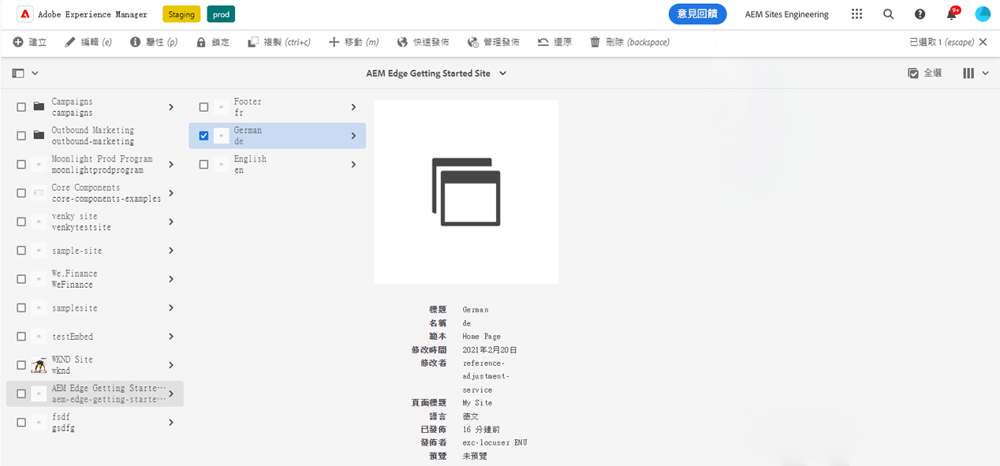
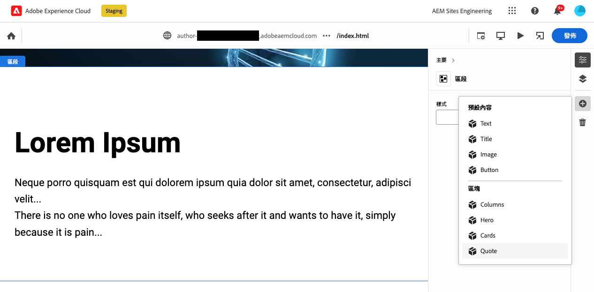
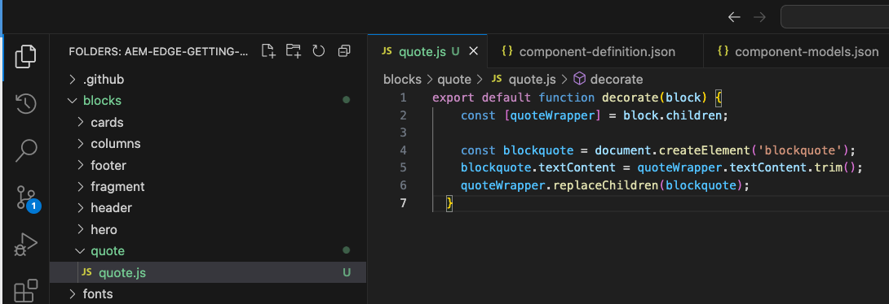
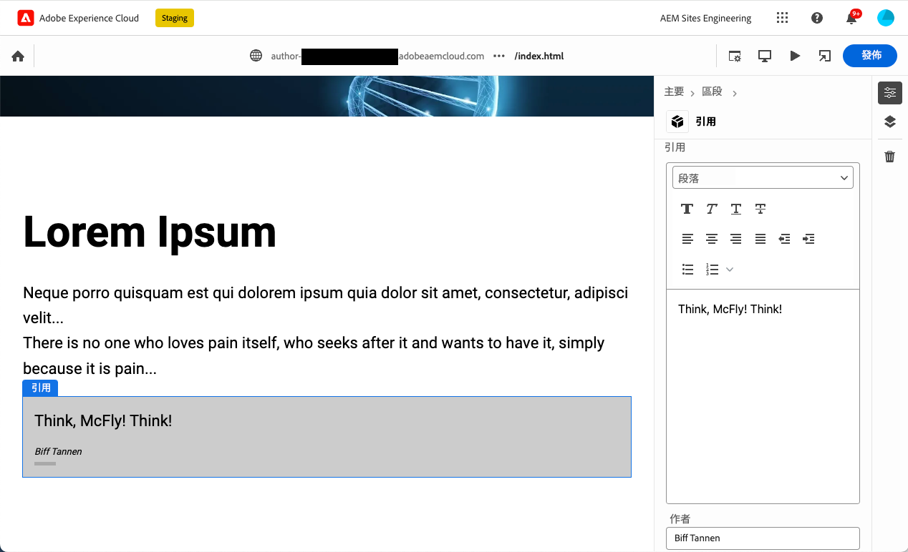

# 建立可搭配通用編輯器使用的區塊 {#create-block}

瞭解如何建立在AEM製作和Edge Delivery Services專案中可搭配通用編輯器使用的區塊。

{{aem-authoring-edge-early-access}}

## 先決條件 {#prerequisites}

本指南提供逐步指示，說明如何透過Edge Delivery Services專案在AEM編寫中建立為通用編輯器檢測的區塊。 內容包括新增元件、在Universal Editor中載入元件定義、發佈頁面、實施區塊裝飾和樣式、將變更帶入生產環境以及驗證變更。 完成本指南後，您可以為自己的專案建立和部署新區塊。

本指南需要有關Edge Delivery Services專案及Universal Editor的AEM編寫的現有知識。 開始使用本指南前，您應該已能存取Edge Delivery Services，並熟悉其基本知識，包括：

* 您已完成 [Edge傳遞服務教學課程。](/help/edge/developer/tutorial.md)
* 您有權存取 [AEM Cloud Service沙箱。](/help/implementing/cloud-manager/getting-access-to-aem-in-cloud/introduction-sandbox-programs.md)
* 您有 [已在相同沙箱環境中啟用通用編輯器。](/help/implementing/universal-editor/getting-started.md)
* 您已完成 [使用Edge Delivery Services進行AEM編寫的開發人員快速入門手冊](/help/edge/edge-dev-getting-started.md) 指南。

本指南建立在 [使用Edge Delivery Services進行AEM編寫的開發人員快速入門手冊](/help/edge/edge-dev-getting-started.md) 指南。

## 新增區塊至您的專案 {#add-block}

在本指南中，您將建置區塊，以在您的頁面上呈現令人難忘的報價。

為了簡化此範例，所有變更都會 `main` 專案存放庫的分支。 當然，對於您實際的專案， [您應遵循開發最佳實務](https://www.aem.live/docs/dev-collab-and-good-practices) 在不同分支上開發，並在合併至之前透過提取請求檢閱所有變更 `main`.

Adobe建議您分三階段來開發區塊：

1. 建立區塊的定義和模型，檢閱區塊，並將其帶入生產環境。
1. 使用新區塊建立內容。
1. 實作新區塊的裝飾和樣式。

下列引號區塊範例遵循此方法。

### 建立區塊定義和模型 {#create-block-model}

1. 在本機複製您在中建立的GitHub專案 [使用Edge Delivery Services進行AEM編寫的開發人員快速入門手冊](/help/edge/edge-dev-getting-started.md) 指南，並在您選擇的編輯器中開啟。

   * Microsoft程式碼在此用於說明用途。

   

1. 編輯 `component-definition.json` 檔案於專案的根目錄，並為新的報價區塊新增下列定義並儲存檔案。

   ```json
   {
     "title": "Quote",
     "id": "quote",
     "plugins": {
       "xwalk": {
         "page": {
           "resourceType": "core/franklin/components/block/v1/block",
           "template": {
             "name": "Quote",
             "model": "quote",
             "quote": "<p>Think, McFly! Think!</p>",
             "author": "Biff Tannen"
           }
         }
       }
     }
   }
   ```

   

1. 編輯 `component-models.json` 檔案並新增下列內容 [模型定義](/help/implementing/universal-editor/field-types.md#model-structure) 以儲存檔案。

   * 請參閱檔案 [使用Edge Delivery Services專案進行AEM製作的內容模型](/help/edge/content-modeling.md) 以取得建立內容模型時請務必考量的詳細資訊。

   ```json
   {
     "id": "quote",
     "fields": [
        {
          "component": "text-area",
          "name": "quote",
          "value": "",
          "label": "Quote",
          "valueType": "string"
        },
        {
          "component": "text-input",
          "valueType": "string",
          "name": "author",
          "label": "Author",
          "value": ""
        }
      ]
   }
   ```

   

1. 編輯 `component-filters.json` 檔案於專案的根目錄，並將報價區塊新增至 [篩選器定義](/help/implementing/universal-editor/customizing.md#filtering-components) 將區塊新增至任何區段並儲存檔案。

   ```json
   {
     "id": "section",
     "components": [
       "text",
       "image",
       "button",
       "title",
       "hero",
       "cards",
       "columns",
       "quote"
      ]
   }
   ```

   

1. 使用Git將這些變更提交至 `main` 分支。

   * 提交至 `main` 僅供說明用途。 [遵循最佳實務](https://www.aem.live/docs/dev-collab-and-good-practices) 並使用實際專案工作的提取請求。

### 使用區塊建立內容 {#create-content}

現在您的基本報價區塊已定義並認可至範例專案，您可以新增報價區塊至現有頁面。

1. 在瀏覽器中，登入AEMas a Cloud Service。 [使用網站主控台，](/help/sites-cloud/authoring/getting-started/basic-handling.md) 導覽至您在中建立的網站 [使用Edge Delivery Services進行AEM編寫的開發人員快速入門手冊](/help/edge/edge-dev-getting-started.md) 指南並選取頁面。

   * 在這種情況下， `index` 用於說明用途。

   

1. 點選或按一下 **編輯** 在主控台的工具列中，通用編輯器開啟。

   * 若要載入頁面，您可能需要點選或按一下 **使用Adobe登入** 以在Universal Editor中驗證AEM。

1. 在Universal Editor中選取區段。 在屬性邊欄中，點選或按一下 **新增** 圖示，然後選取您的新專案 **引用** 功能表中的區塊。

   * 此 **新增** 圖示是加號。
   * 如果所選物件的藍色外框有一個標籤的話，您就知道您已選取一個截面 **章節**.
   * 在此範例中，點選或按一下略高於 **Lorem Ipsum** 標題會選取包含標題和lorem ipsum文字的區段。

   

1. 頁面會重新載入，引號區塊會新增至所選區段的底部，並在 `component-definitions.json` 檔案。

   * 報價區塊可以像其他任何區塊一樣就地或屬性邊欄中選取和編輯。
   * 樣式將在下一個步驟中套用。

   

1. 在您滿意報價內容後，可以點選或按一下 **發佈** 按鈕。

1. 導覽至已發佈的頁面，確認內容已發佈。 此連結將類似於 `https://<branch>--<repo>--<owner>.hlx.page`

   

### 設定區塊樣式 {#style-block}

現在您有了有效的引號區塊，就可以套用樣式了。

1. 返回專案的編輯器。

1. 建立 `quote` 下的資料夾 `blocks` 資料夾。

   

1. 新增 `quote` 資料夾，新增 `quote.js` 新增以下JavaScript並儲存檔案，以實施區塊裝飾。

   ```javascript
   export default function decorate(block) {
     const [quoteWrapper] = block.children;
   
     const blockquote = document.createElement('blockquote');
     blockquote.textContent = quoteWrapper.textContent.trim();
     quoteWrapper.replaceChildren(blockquote);
   }
   ```

   


1. 在 `quote` 資料夾，新增 `quote.css` 檔案來定義區塊的樣式，方法為新增下列CSS程式碼並儲存檔案。

   ```css
   .block.quote {
       background-color: #ccc;
       padding: 0 0 24px;
       display: flex;
       flex-direction: column;
       margin: 1rem 0;
   }
   
   .block.quote blockquote {
       margin: 16px;
       text-indent: 0;
   }
   
   .block.quote > div:last-child > div {
       margin: 0 16px;
       font-size: small;
       font-style: italic;
       position: relative;
   }
   
   .block.quote > div:last-child > div::after {
       content: "";
       display: block;
       position: absolute;
       left: 0;
       bottom: -8px;
       height: 5px;
       width: 30px;
       background-color: darkgray;
   }
   ```

   

1. 使用Git將這些變更提交至 `main` 分支。

   * 提交至 `main` 僅供說明用途。 [遵循最佳實務](https://www.aem.live/docs/dev-collab-and-good-practices) 並使用實際專案工作的提取請求。

1. 返回Universal Editor的瀏覽器標籤，您正在其中編輯專案的頁面，並重新載入頁面以檢視您的樣式區塊。

1. 請參閱頁面上的現成樣式的引號區塊。

   

1. 導覽至發佈的頁面，確認變更已推送至生產環境。 此連結將類似於 `https://<branch>--<repo>--<owner>.hlx.page`

   

恭喜！您現在擁有完整運作且樣式化的報價區塊。 您可以使用此範例作為設計您自己的專案特定區塊的基礎。

## 使用其他工作分支 {#other-branches}

本指南要求您直接認可 `main` 為了簡單起見而分支。 在範例存放庫中進行實驗時，這通常不是問題。 針對實際專案工作， [您應遵循開發最佳實務](https://www.aem.live/docs/dev-collab-and-good-practices) 在不同分支上開發，並在合併至之前透過提取請求檢閱所有變更 `main`.

當您不是在 `main` 分支，您可以附加 `?ref=<branch>` ，以從分支載入頁面。 `<branch>` 是將用於專案預覽或即時URL的分支名稱，例如 `https://<branch>--<repo>--<owner>.hlx.page`.

只有當模型合併至時，才支援使用新模型發佈內容。 `main` 分支。
