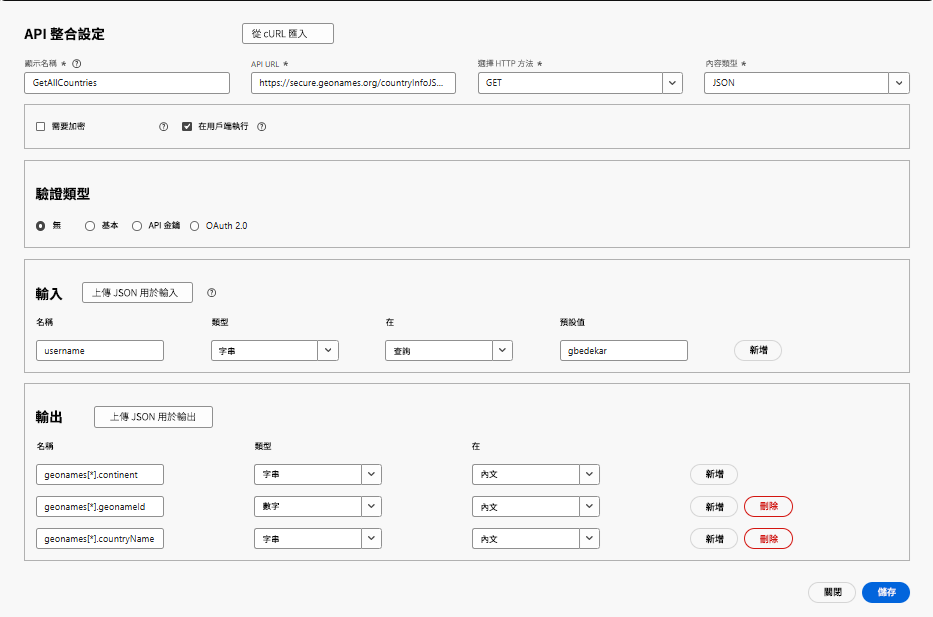

# 建立 API 整合

在本教學課程中，已建立2個API整合

- GetAllCountries傳回國家/地區清單
- GetChildren — 傳回geonameId所代表之國家或州的直接子系

## GetAllCountries - API整合設定

- API整合設定

   - 顯示名稱： GetAllCountries會在您的系統中→立此API的標籤。

   - API URL： `https://secure.geonames.org/countryInfoJSON` — 您呼叫的端點。

   - HTTP方法： GET — 您正在提出簡單的GET要求。

   - 內容型別： JSON — 回應應為JSON格式。

- 選項:

   - 未勾選「需要加密」 — 除了HTTPS以外，沒有加密層。

   - 檢查在使用者端執行 — 呼叫是從使用者端/瀏覽器執行，而不是從伺服器端執行。
- 驗證類型
   - 無 — 因為GeoNames API不需要在標題中使用OAuth或API金鑰
- 輸入：
   - 輸入區段會定義要傳送到API中的內容
   - **使用者名稱** →型別：字串，在查詢中傳送，預設： gbedekar。
   - 每個請求都會將？username=gbedekar附加至URL
- 輸出
   - 輸出會定義要擷取及使用JSON回應中的哪些欄位。
GeoNames回應如下所示：

  
   - 從geonames陣列內部對應兩個欄位：

     geonames[*].geonameId → as a Number

     geonames[*].countryName →為字串

     [*]表示它會針對陣列中的每個國家/地區重複執行。

## GetChildren

它會要求GeoNames提供其geonamesId作為查詢引數傳遞之位置的直接子系

- API整合設定

   - 顯示名稱： GetAllCountries會在您的系統中→立此API的標籤。

   - API URL： `https://secure.geonames.org/children`→您呼叫的端點。

   - HTTP方法： GET→您提出簡單的GET要求。

   - 內容型別： JSON→應會以JSON格式回應。

- 選項:

   - 「需要加密」未勾選→除了HTTPS外沒有加密層。

   - 在使用者端執行，→檢查呼叫是從使用者端/瀏覽器而不是伺服器端執行。
- 驗證類型
   - 無 — 因為GeoNames API不需要在標題中使用OAuth或API金鑰
- 輸入：
   - 定義會傳送至API的內容
   - **使用者名稱** →型別：字串，在查詢中傳送，預設： gbedekar。
   - 每個請求都會將？username=gbedekar附加至URL
   - **geonameId** ->型別：字串。 傳回geonameId所代表之國家/州的子系
   - **型別** =>字串。 將設為JSON會傳回JSON格式的回應。
- 輸出
   - 定義要擷取及使用JSON回應中的哪些欄位。
GeoNames回應如下所示：

  
   - 從geonames陣列內部對應兩個欄位：

     geonames[*].geonameId → as a Number

     geonames[*].name →為字串

     [*]表示它會針對陣列中的每個國家/地區重複執行。

