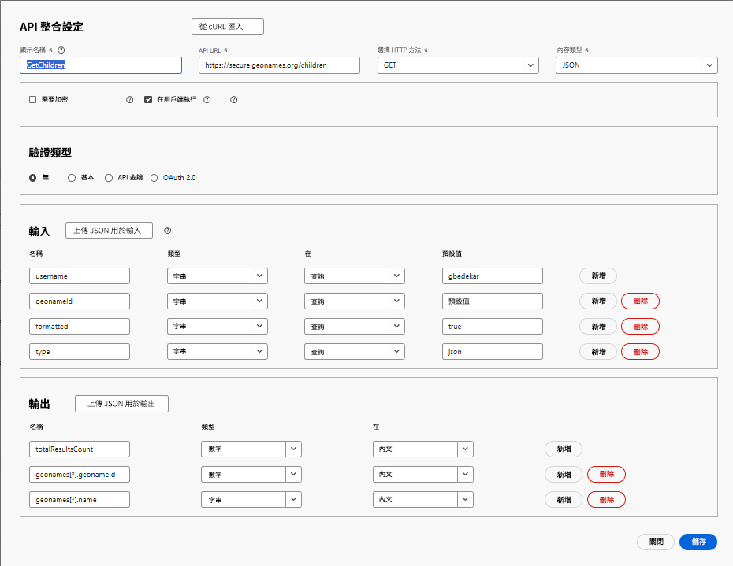

# 建立 API 整合

在此教學課程中，已建立 2 API 整合

- GetAllCountries 傳回國家/地區清單
- GetChildren：傳回 geonameId 所代表國家/地區或州的直接子系

## GetAllCountries：API 整合設定

- API 整合設定

   - 顯示名稱：GetAllCountries → 此 API 在您的系統中的標籤。

   - API URL：`https://secure.geonames.org/countryInfoJSON` (您正在呼叫的端點)。

   - HTTP 方法：GET (您正提出簡單的 GET 要求)。

   - 內容類型：JSON (回應預期為 JSON 格式)。

- 選項：

   - 取消勾選「需要加密」：除 HTTPS 外，沒有加密層。

   - 已勾選「在用戶端執行」：此呼叫從用戶端/瀏覽器執行，而非伺服器端。
- 驗證類型
   - 無：因為 GeoNames API 不需要在標頭使用 OAuth 或 API 金鑰
- 輸入：
   - 此輸入區段會定義要傳送至 API 中的內容
   - **使用者名稱** → 類別：字串、在查詢中傳送、預設：gbedekar。
   - 每個請求均會附加「?username=gbedekar」至 URL
- 輸出
   - 輸出會定義從 JSON 回應中擷取和使用的欄位。
GeoNames 回應如下所示：

  
   - 從 geonames 陣列內部對應兩個欄位：

     geonames[*].geonameId → 採用號碼形式

     geonames[*].countryName → 採用字串形式

     [*] 表示它會針對此陣列中的每個國家/地區重複執行。

## GetChildren

此功能會要求 GeoNames 提供其 geonamesId 作為查詢參數傳遞位置的直接下層

- API 整合設定

   - 顯示名稱：GetAllCountries → 此 API 在您的系統中的標籤。

   - API URL：`https://secure.geonames.org/children` → 您正在呼叫的端點。

   - HTTP 方法：GET → 您正提出簡單的 GET 要求。

   - 內容類型：JSON → 回應預期為 JSON 格式。

- 選項：

   - 取消勾選「需要加密」→ 除 HTTPS 外，沒有加密層。

   - 已勾選「在用戶端執行」→ 此呼叫從用戶端/瀏覽器執行，而非伺服器端。
- 驗證類型
   - 無：因為 GeoNames API 不需要在標頭使用 OAuth 或 API 金鑰
- 輸入：
   - 定義會傳送至 API 的內容
   - **使用者名稱** → 類別：字串、在查詢中傳送、預設：gbedekar。
   - 每個請求均會附加「?username=gbedekar」至 URL
   - **geonameId** -> 類別：字串。傳回 geonameId 所代表國家/地區或州的子系
   - **類型** => 字串。設為 JSON 會傳回 JSON 格式的回應。
- 輸出
   - 定義從 JSON 回應中擷取和使用的欄位。
GeoNames 回應如下所示：

  
   - 從 geonames 陣列內部對應兩個欄位：

     geonames[*].geonameId → 採用號碼形式

     geonames[*].name → 採用字串形式

     [*] 表示它會針對此陣列中的每個國家/地區重複執行。

