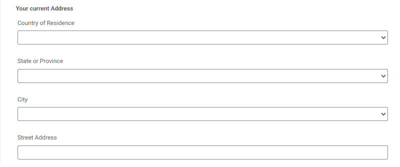
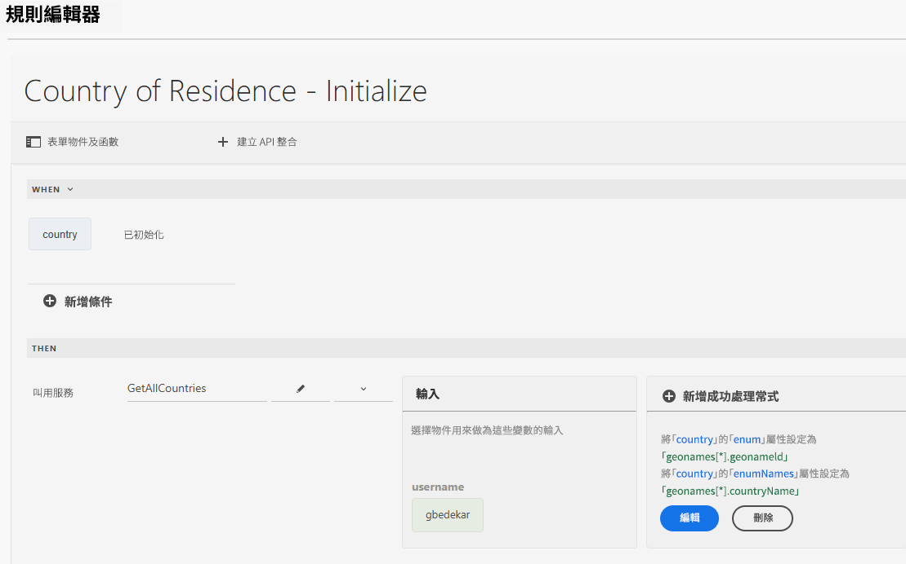
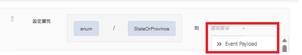
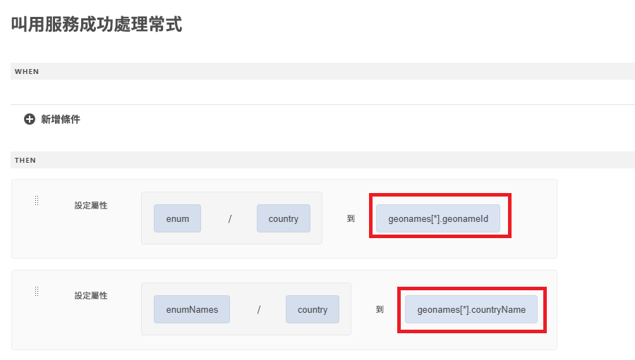
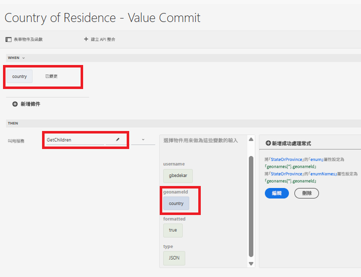
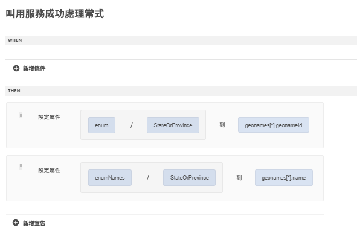

# 使用通用編輯器建立表單

使用通用編輯器建立下列表單。此表單有 3 個下拉式清單，其值將使用 API 整合填入

## 居住國家/地區

初始化時，居住國家/地區下拉式清單會填入 API 呼叫的結果。

## 成功處理常式

成功處理常式的定義是使用 geonames 陣列中的適當值來設定國家/地區的列舉和列舉名稱下拉式清單。geonames 陣列可在「事件承載」選項下使用

## 擷取子值

使用者在居住國家/地區下拉式清單中進行選擇時，會填入州或省下拉式清單。與所選國家/地區相關的 geonameId 會作為輸入參數，傳遞至 GetChildren API 整合

已定義成功處理常式，來設定 StateOrProvince 下拉式欄位的列舉/列舉名稱 

已選取州或省份後，您可以按照上述用於填入州或省份的下拉式清單模式，來填入城市下拉式清單。