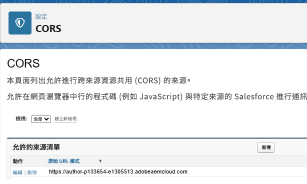
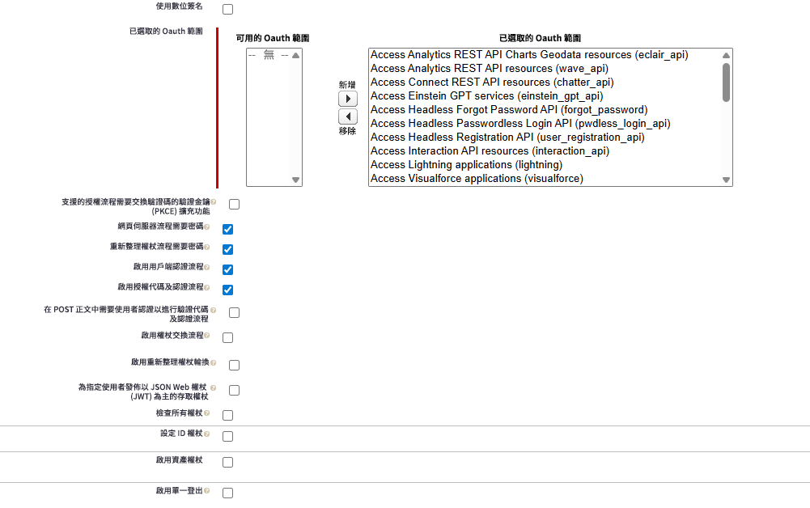
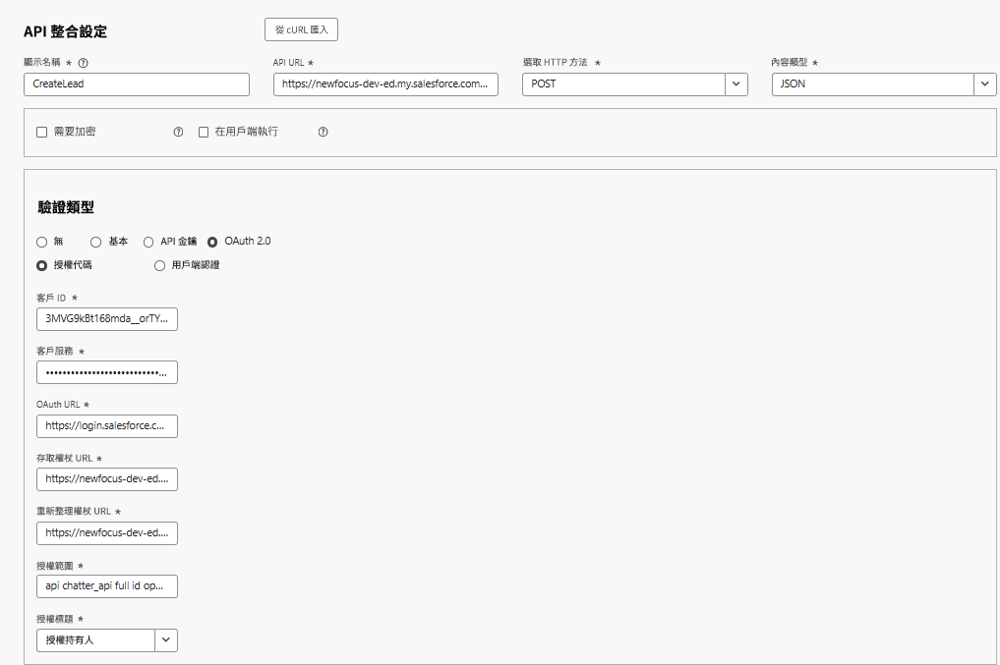
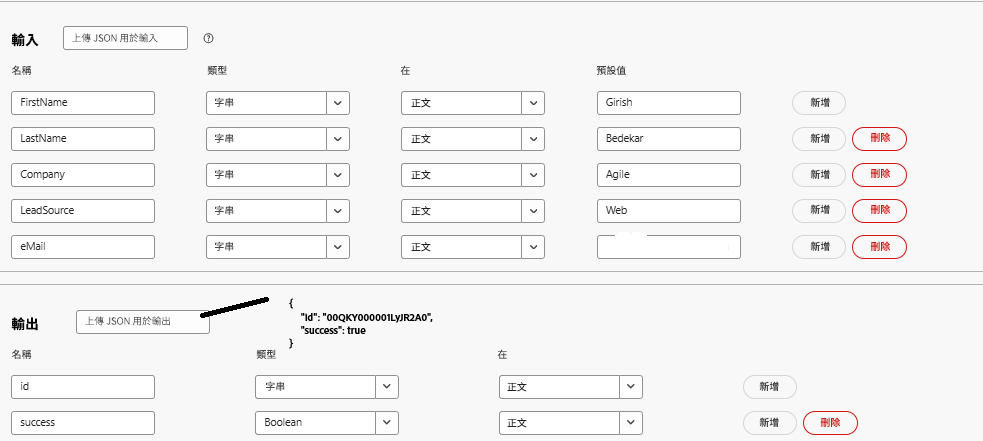
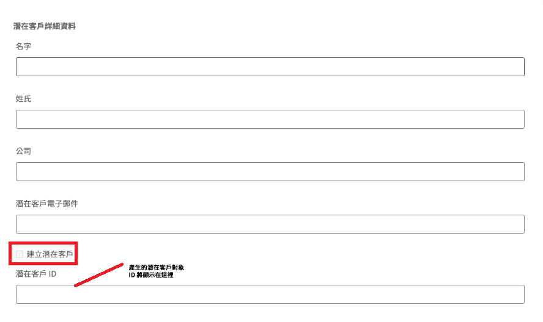
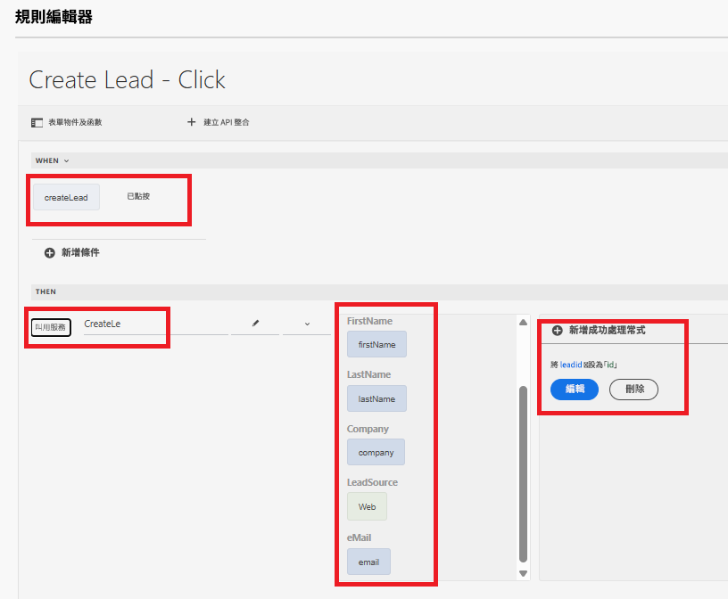

# 使用API整合建立Salesforce Lead物件

此使用案例會逐步說明如何使用API整合在Salesforce中建立Lead。 程式結束時，您能夠：

在Salesforce[中設定](https://help.salesforce.com/s/articleView?id=platform.ev_relay_create_connected_app.htm&type=5)連線應用程式，以啟用安全的API存取。

設定CORS （跨原始資源共用）以允許在網頁瀏覽器中執行的程式碼(例如JavaScript)從特定來源與Salesforce通訊，請將原始程式碼新增至允許清單，如下所示



## 連線應用程式設定

以下設定用於連線的應用程式中。 您可以根據自己的需求指派OAuth範圍。


## 建立 API 整合

| 名稱 | 值 |
|--------------------------------|------------------|
| API url | https://`<your-domain>`d.my.salesforce.com/services/data/v32.0/sobjects/Lead |
| 用戶端 ID | 專屬於您連線的應用程式 |
| 用戶端密碼 | 專屬於您連線的應用程式 |
| oAuth URL | https://login.salesforce.com/services/oauth2/authorize |
| 存取記號 URL | https://`<your-domain>`/services/oauth2/token |
| 重新整理記號 URL | https://`<your-domain>`/services/oauth2/token |
| 授權範圍 | api chatter_api完整id openid refresh_token visualforce網頁 |
| 授權標頭 | 授權持有人 |



## 輸入和輸出引數

定義API呼叫的輸入引數，並使用以下json對應輸出引數

```json
{
    "id": "00QKY000001LyJR2A0",
    "success": true
}
```



## 建立表單

使用Universal Editor建立簡易的最適化表單，以擷取Lead物件的詳細資訊，如下所示


使用規則編輯器處理「建立銷售機會」核取方塊上的點選事件。 將輸入引數對應至適當表單物件的值，如下所示。 顯示`leadid` TextField物件中新建立之Lead物件的識別碼


## 測試整合

- 預覽表單
- 輸入一些有意義的值
- 選取`Create Lead`核取方塊以觸發API呼叫
- 新建立之Lead物件的Lead ID會顯示在`Lead ID`文字欄位中。