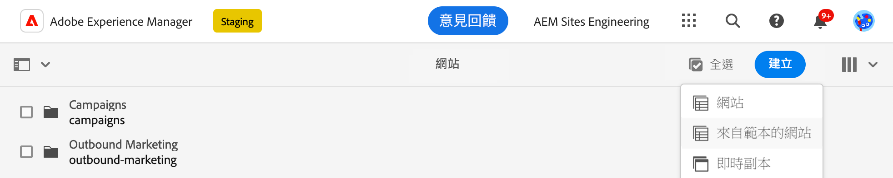
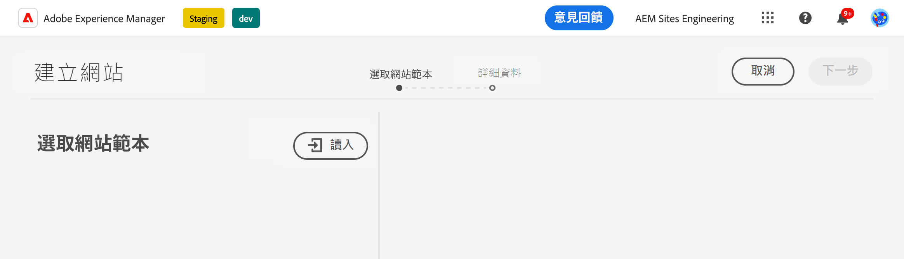
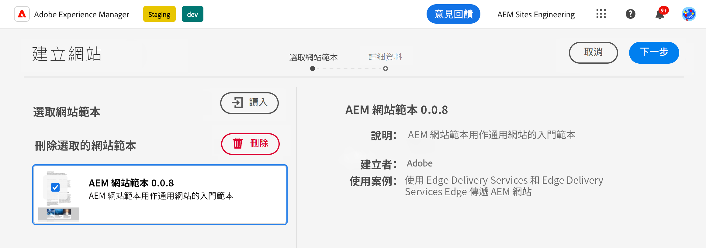
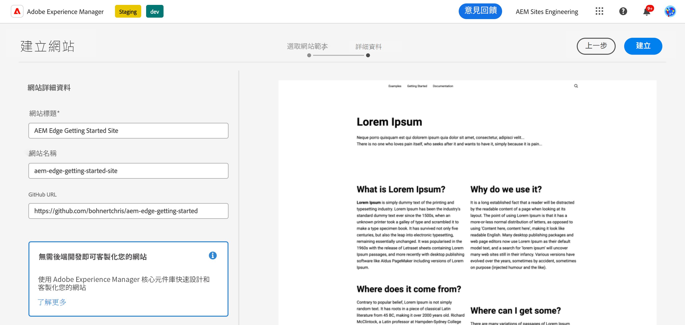
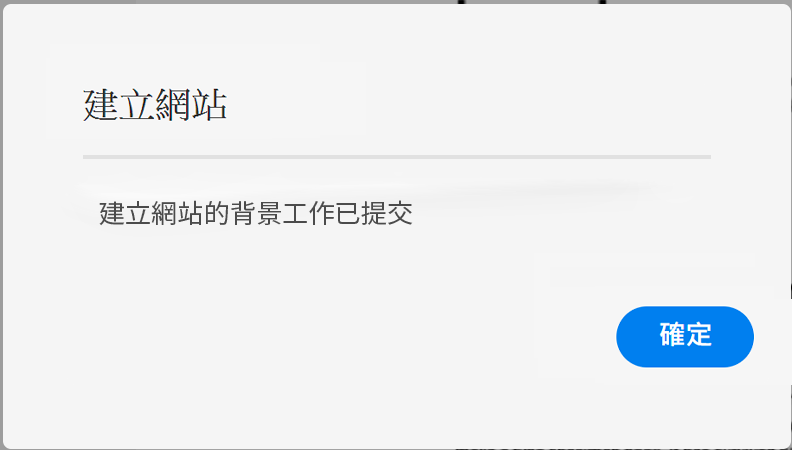
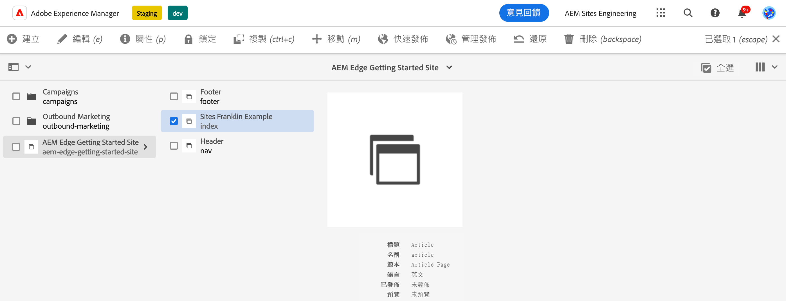
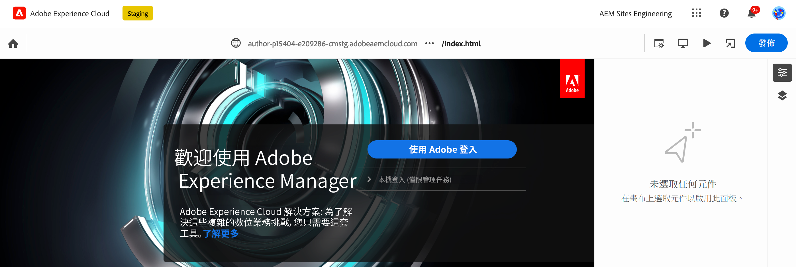
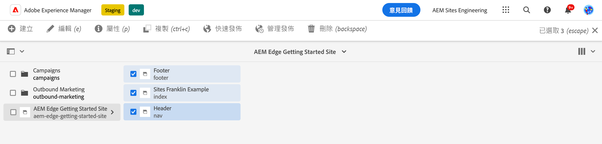
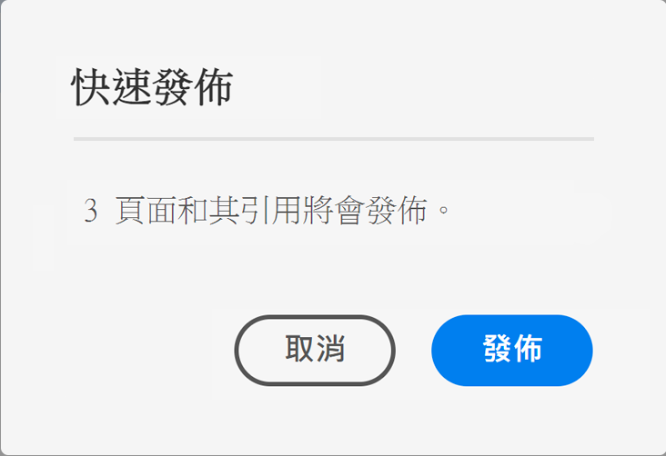

# 使用Edge Delivery Services進行AEM製作 {#edge-dev-getting-started}

本指南將引導您開始執行新的Adobe Experience Manager網站(使用Edge Delivery Services和通用編輯器進行內容製作)。

{{aem-authoring-edge-early-access}}

## 先決條件 {#prerequisites}

開始使用本指南之前，您應該已熟悉的基本知識並有權存取的Edge Delivery Services包括：

* 您已完成 [Edge傳遞服務教學課程。](/help/edge/developer/tutorial.md)
* 您有權存取 [AEM Cloud Service沙箱。](/help/implementing/cloud-manager/getting-access-to-aem-in-cloud/introduction-sandbox-programs.md)
* 您有 [已在相同沙箱環境中啟用通用編輯器。](/help/implementing/universal-editor/getting-started.md)

## 挑選正確的編輯器 {#editor-choice}

AEM提供兩種不同的內容編輯器，您會根據自己的情況選擇要使用的編輯器。

* **通用編輯器**  — 這應是新網站的預設選擇。
* **AEM頁面編輯器**  — 針對現有的AEM Sites移轉至Edge Delivery Services，應選擇此選項。

本指南著重於使用通用編輯器的Edge Delivery Services上的AEM專案。 檢視檔案 [針對Edge Delivery Services開發](/help/edge/developing.md) 深入瞭解如何選擇正確的編輯器，以及如何將現有的AEM網站移轉至Edge Delivery Services。

## AEM編寫和Edge Delivery Services快速入門 {#getting-started}

當您完成設定後 [必備條件](#prerequisites) 並且已製作 [選擇使用通用編輯器，](#editor-choice) 您可以開始使用自己的專案。

### 建立您的GitHub專案 {#create-github-project}

首先，您需要根據Adobe範本，在GitHub上建立新專案。

1. 瀏覽至 [`https://github.com/adobe-rnd/aem-boilerplate-xwalk`](https://github.com/adobe-rnd/aem-boilerplate-xwalk) 並按一下 **使用此範本** 並選取 **建立新的存放庫**.

   * 您必須登入GitHub才能檢視此選項。

   

1. 依預設，系統會將存放庫指派給您。 視需要變更此專案，並提供存放庫名稱和說明，然後按一下 **建立存放庫**.

   

1. 在同一瀏覽器的新標籤中，導覽至 [`https://github.com/apps/aem-code-sync`](https://github.com/apps/aem-code-sync) 並按一下 **設定**.

   

1. 按一下 **設定** 針對您在上一步中建立新存放庫的組織。

   

1. 在AEM Code Sync GitHub頁面上，於 **存放庫存取權**，選取 **僅選取存放庫**，選取您在上一步建立的存放庫，然後按一下 **儲存**.

   

1. 安裝AEM Code Sync後，您會收到確認畫面。 返回新存放庫的瀏覽器標籤。

   

1. 按一下 `fstab.yaml` 檔案以開啟，然後 **編輯此檔案** 圖示進行編輯。

   

1. 編輯 `fstab.yaml` 檔案來更新專案的掛載點。 將預設的Google檔案URL取代為AEMas a Cloud Service編寫執行個體的URL，然後按一下 **提交變更……**.

   * `https://<aem-author>/bin/franklin.delivery/<owner>/<repository>/main`
   * 變更掛載點可告知Edge Delivery Services在何處尋找網站內容。

   

1. 視需要新增認可訊息，然後按一下 **認可變更**，將直接提交至 `main` 分支。

   

1. 返回存放庫的根目錄，然後按一下 `paths.yaml` 然後 **編輯此檔案** 圖示。

   

1. 將預設對應取代為 `/content/<site-name>/:/` 並按一下 **提交變更……**.

   * 提供您自己的 `<site-name>`. 您將在後續步驟中用到它。
   * 對應會告訴Edge Delivery Services如何將您的AEM存放庫中的內容對應到網站URL。

   

1. 視需要新增認可訊息，然後按一下 **認可變更**，將直接提交至 `main` 分支。

   

### 建立和編輯新的AEM網站 {#create-aem-site}

現在您已擁有GitHub專案，必須建立專案可使用的新AEM網站。

>[!NOTE]
>
>若要使用通用編輯器編輯您的網站，您必須使用以Chromium為基礎的瀏覽器。

1. 請透過以下方式向Adobe工程部門請求最新的「使用Edge Delivery Services進行AEM編寫」網站範本： [專案Slack頻道。](/help/edge/docs/slack.md)

1. 登入您的AEMas a Cloud Service編寫執行個體，並導覽至網站主控台，然後點選或按一下 **建立** -> **從範本建立網站**.

   

1. 在 **選取網站範本** 建立網站精靈的索引標籤，按一下 **匯入** 按鈕以匯入新範本。

   

1. 上傳AEM Authoring以及Adobe工程提供給您的Edge Delivery Services網站範本。

1. 匯入範本後，它就會顯示在精靈中。 點選或按一下以選取它，然後點選或按一下 **下一個**.

   

1. 提供下列欄位，然後點選或按一下 **建立**.

   * **網站標題**  — 為網站新增描述性標題。
   * **網站標題**  — 使用 `<site-name>` 您在 [上一步。](#create-github-project)
   * **GitHub URL**  — 使用您在上一步建立的GitHub專案URL。

   

1. AEM會透過對話方塊確認網站建立。 點選或按一下 **確定** 關閉。

   

1. 在網站主控台上，導覽至 `index.html` ，然後點選或按一下 **編輯** （在工具列中）。

   

1. 「通用編輯器」會在新標籤中開啟。 您可能需要點選或按一下 **使用Adobe登入** 驗證以編輯您的頁面。

   

您現在可以使用通用編輯器編輯網站。 請參閱 [通用編輯器檔案](/help/implementing/universal-editor/authoring.md) 以取得詳細資訊。

### 發佈您的新網站 {#publishing}

使用通用編輯器編輯完新網站後，您就可以發佈內容。

1. 在網站主控台上，選取您為新網站建立的所有頁面，然後點選或按一下 **快速發佈** （在工具列中）。

   

1. 點選或按一下 **發佈** 在確認對話方塊中，以啟動程式。

   

1. 在相同瀏覽器中開啟新索引標籤，並導覽至新網站的URL。

   * `https://main--<site-name>--<owner>.hlx.page`

1. 檢視您的內容已發佈。

   

## 後續步驟 {#next-steps}

現在您已擁有使用Edge Delivery Services專案的AEM編寫功能，可以開始建立自己的區塊並設定樣式。

請參閱指南 [建立可搭配通用編輯器使用的區塊](/help/edge/create-block.md) 以取得詳細資訊。
