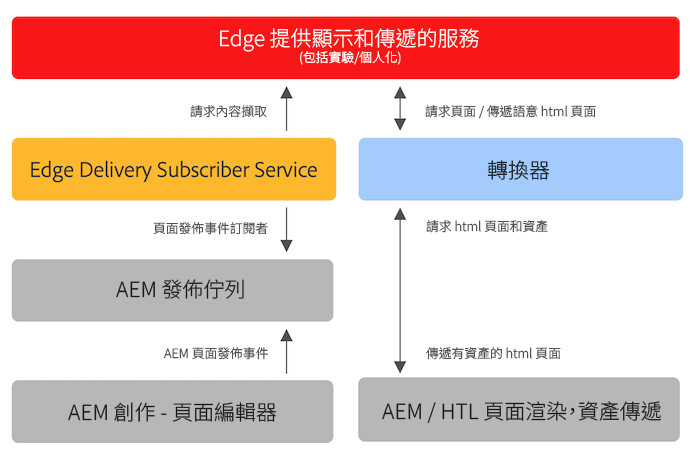

# 將Edge Delivery Services用於現有AEM專案 {#existing-projects}

您不需要等待新的AEM專案就能從Edge Delivery Services中獲益。 Edge Delivery Services可以整合到您現有的AEM專案中，因此您可以立即運用其效能提升。

## AEM頁面編輯器限制 {#page-editor}

在Edge Delivery Services出現之前，已使用AEM頁面編輯器編輯在AEM中管理的內容。 如果您的專案在Edge Delivery Services推出之前就已開始了，則幾乎可以肯定您使用的是頁面編輯器。

AEM頁面編輯器僅適用於 [AEM元件](/help/implementing/developing/components/overview.md) 例如 [核心元件。](https://experienceleague.adobe.com/docs/experience-manager-core-components/using/introduction.html) 這些元件與Edge Delivery Services不相容。 因此，將Edge Delivery Services匯入現有AEM專案需要兩個階段：

* [階段1 — 更換前端](#replace-front-end)
* [階段2 — 切換至通用編輯器](#switch-ue)

## 階段1 — 更換前端 {#replace-front-end}

在第一階段中，您可以繼續使用現有的AEM網站結構、元件及撰寫工具。 使用JavaScript和CSS的區塊將重建網站呈現，並將透過Edge Delivery Services傳遞。

請參閱 [建置區段](https://www.aem.live/docs/#build) Edge Delivery Services檔案，以取得區塊以及如何開發邊緣交付服務的詳細資訊。

App Builder上的轉換工具必須轉換AEM轉譯的HTML輸出，並傳送給Edge Delivery Services。

第二階段透過消除技術重疊來完成程式：AEM核心元件搭配AEM Author上的HTL和Java、Edge Delivery上的JS型區塊，以及nodeJS型轉換器。

## 階段2 — 切換至通用編輯器 {#switch-ue}

在此階段中，AEM頁面編輯器將取代為通用編輯器。 由於通用編輯器可直接處理區塊，因此不再需要AEM核心元件和轉換工具。

## 如何開始使用 {#how-to-get-started}

請聯絡您的Adobe代表以取得此功能的存取權。
