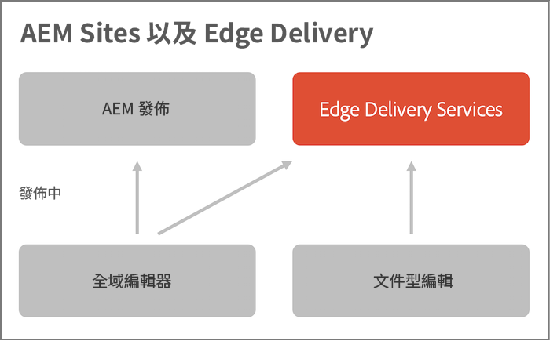

# Edge Delivery Services 概觀 {#edge-delivery-services}

透過 Edge Delivery Services，AEM 可提供促進參與度和轉換率的卓越體驗。AEM 會透過提供快速編寫和開發的高影響力體驗來實現這一目標。這是一組可組合的服務，有助建立快速開發環境；編寫作者可在其中快速更新和發佈，並且能快速推出新網站。因此，透過 Edge Delivery Services，您可以提高轉換率、降低成本並提供極高的內容速度。

透過 Edge Delivery Services，您可以：

* 建立具有完善 Lighthouse 分數功能的快速網站，並透過真實使用者監控 (RUM) 持續監控您的網站效能。
* 透過分離內容來源來提高編寫工作效率。您可以一開啟即使用 WYSIWYG 和文件型製作功能。因此，您可以在同一網站上使用多個內容來源。
* 使用內建的實驗框架，允許快速建立、執行測試而不影響效能，並快速發布測試獲勝者的生產。

## 敏捷反應商務需求 {#agile-reaction}

作為長期公認的業界領導者，Adobe 知道為您的客戶快速建立和發佈有意義的新內容有多重要。市場已經明確了擴大內容創作規模的常見挑戰，包括：

1. **對內容的需求持續成長。**
   * 需要解鎖新的內容作者來滿足這項需求。
   * 內容建立流程必須在整個企業範圍內有效擴展。
   * 作者必須能夠對不斷變化的趨勢做出快速反應。
1. **需要全通路內容。**
   * 無論內容傳遞如何，都需要版面配置控制。
   * 作者需要有權直接更改內容版面配置。
1. **提高內容投資報酬率的壓力越來越大。**
   * 作者本身需要有能力最佳化他們所創造的內容。

事實證明，整個產業都面臨著相同的趨勢。然而，各個專案的具體要求一定各不相同。任何 Edge Delivery Services 專案的目標都是專注於找到適合您使用者的解決方案。

1. **關注價值而不是功能。** - 確定最佳化的工作流程來為您的作者提供服務，而不是迷失在 AEM 廣泛的功能集中。
1. **利用 AEM 的靈活性。** - AEM 功能並不一定要獨立使用。使用每個使用案例所需的功能。
1. **利用作者的專業知識。** - 從一開始就讓真正的內容作者參與到專案中，以確保您透過實現有意義的功能來提供他們所需的價值。

透過專注於作者的價值，您的 Edge Delivery Services 專案可以滿足內容創作者面臨的現代產業需求，並快速提供內容來取悅您的客戶。

## 為您的內容創作者提供靈活的創作工具 {#overview}

Edge Delivery Services 是一組可組合的服務，可讓您以高度靈活的方式在網站上製作內容。您可以使用 [AEM 內容管理](https://experienceleague.adobe.com/zh-hant/docs/experience-manager-cloud-service/content/sites/authoring/author-publish)和 WYSIWYG 製作 (透過[通用編輯器](/help/sites-cloud/authoring/universal-editor/authoring.md)以及[文件型製作](https://www.aem.live/docs/authoring))。

下圖說明如何在 Microsoft Word (文件型製作) 中編輯內容並將其發佈到 Edge Delivery Services。圖表也展示使用 Universal Editor 的 WYSIWYG 編輯。

Edge Delivery Services 會使用 GitHub，可讓您直接從自己的 GitHub 存放庫管理和部署程式碼。新內容將立即加入，無需重建過程。

### 以文件為主的製作 {#document-based}

透過文件為主的製作，您可以直接使用 Microsoft Word 或 Google 文件的內容，使這些來源成為您網站上的頁面。標題、清單、影像、字體元素、都可以從初始來源傳輸到網站。

* 透過文件型製作，每個行銷人員都可以使用已知的創作工具 (Microsoft Word、Google Docs 等) 快速建立內容。
* 透過允許直接在來源文件中創作、檢閱和發佈，得以簡化內容建立流程。
* 由於使用了已知的工具，因此對內容作者沒有入門門檻，從而提高了內容創作速度。
* 您可以使用 GitHub 中的 CSS 和 JavaScript 來開發網站的功能。

進一步閱讀文件型製作文件：

* 有關如何開始使用 Edge Delivery 的詳細資訊，請參閱[「建置」區段](https://www.aem.live/docs/#build)。
* 若要了解如何使用 Edge Delivery 編寫和發佈內容，請參閱[「發佈」區段](https://www.aem.live/docs/authoring)。
* 若要了解如何正確啟動您的網站專案，請參閱[「啟動」區段](https://www.aem.live/docs/#launch)。

### WYSIWYG 製作 {#wysiwyg-authoring}

所見即所得 (WYSIWYG) 創作會利用通用編輯器，這是一個可自訂的一站式系統，可透過視覺預覽在上下文中即時編輯內容。

* 透過所見即所得創作，無論是無頭或有頭模式，您都可以提高創作效率。
* 您可以利用 AEM 全面的內容管理功能，包括工作流程和治理。
* 利用眾多擴充點來支援您自己的流程和整合。
* 您可以使用 GitHub 中的 CSS 和 JavaScript 來開發網站的功能。

進一步閱讀 WYSIWYG 製作文件：

* 有關通用編輯器和 WYSIWYG 製作的概觀，請參閱 [Edge Delivery Services 的 WYSIWYG 內容製作](/help/edge/wysiwyg-authoring/authoring.md)。
* 如需開發人員概觀，請參閱[使用 Edge Delivery Services 進行 WYSIWYG 製作的開發人員快速入門手冊](/help/edge/wysiwyg-authoring/edge-dev-getting-started.md)。

### 決定您的製作方法 {#authoring-method}

AEM 的靈活性可確保滿足您的創作需求。Adobe 可以幫助您確定哪種方法 (或多種方法) 最符合您的要求。

* 隨時讓您的內容作者參與決策。
* 可以實現多種創作方法。
* 您隨時可以在之後更改您的創作方法。
* 不需在實作之前做出決定，而是將其作為實作的一部分。

請參閱[選擇製作方法](authoring-methods.md)以了解更多資訊。

## Edge Delivery Services 和其他 Adobe Experience Cloud 產品 {#edge-other-products}

Edge Delivery Services 是 Adobe Experience Manager 的一部分。因此，Edge Delivery Services 和 AEM Sites 可以在同一網域中共存，這是大型網站的常見使用案例。此外，您的 AEM Sites 頁面可以無縫地使用 Edge Delivery Services 中的內容，反之亦然。

請參閱[使用 Edge Delivery Services 進行 WYSIWYG 的開發人員快速入門指南](/help/edge/wysiwyg-authoring/edge-dev-getting-started.md)，了解如何展開您自己的專案，使用 AEM 和 Edge Delivery Services 進行製作。

您也可以將 Edge Delivery Services 與 [Adobe Target](https://www.aem.live/developer/target-integration) 及[實際使用監控 (RUM)](https://www.aem.live/developer/rum) 搭配使用，以診斷網站的使用情況和效能，然後[啟動](https://experienceleague.adobe.com/zh-hant/docs/experience-platform/tags/home)。

## 開始使用 Edge Delivery Services {#getting-started}

遵循[開始使用 - 開發人員教學課程](https://www.aem.live/developer/tutorial)可輕鬆開始使用 Edge Delivery Services。

## 取得 Adobe 的協助 {#getting-help}

Adobe 提供三個頻道來幫助您使用 Edge Delivery Services：

* 利用[社群資源](#community-resources)進行一般查詢
* 存取您的[產品協作頻道](#collaboration-channel)來查詢特定問題。
* [記錄支援服務單](#support-ticket)以解決主要和關鍵問題。

### 存取社群資源 {#community-resources}

Adobe 致力為您提供 Edge Delivery Services、WYSIWYG 和文件型製作的最佳社群參與和支援服務。

* 參與 [Experience League 社群](https://adobe.ly/3Q6kTKl)，提出問題、分享回饋意見、發起討論、尋求 Adobe 專家和 AEM 顧問/達人的協助，以及與志趣相投的人即時交流。
* 加入 [Discord 頻道](https://discord.gg/aem-live)，這個較輕鬆的平台可讓您即時互動和交換靈感。

### 如何存取您的產品協作頻道 {#collaboration-channel}

鑑於與使用者直接溝通管道的重要性，所有 AEM 專案在啟動時都會建立 Slack 頻道，以提升作業效率、以及提供關鍵更新和有關體驗品質的擴充報告。您會獲得 Adobe 邀請，以加入您組織特定的 Slack 頻道。

若要了解更多資訊，請參閱「[使用 Slack 機器人](https://www.aem.live/docs/slack)」文件取得更多詳細資訊。

您可以透過預先被分配的產品協作頻道與 Adobe 產品團隊互動，回答有關產品使用或最佳實務的問題。沒有與透過產品協作頻道進行對話相關的服務層級目標 (SLT)。

### 記錄支援服務單 {#support-ticket}

{{support-ticket}}

## 下一步 {#whats-next}

開始先檢閱「[使用 Edge Delivery Services](/help/edge/using.md)」。
