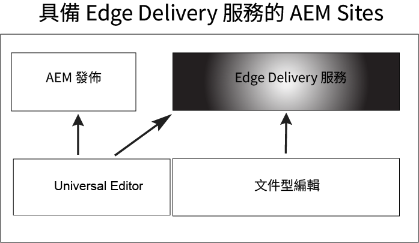

# 開始使用 Edge Delivery Services {#getstart-edge}

透過 Edge Delivery Services，AEM 可提供促進參與度和轉換率的卓越體驗。AEM 會透過提供快速編寫和開發的高影響力體驗來實現這一目標。這是一組可組合的服務，有助建立快速開發環境；編寫作者可在其中快速更新和發佈，並且能快速推出新網站。因此，透過 Edge Delivery Services，您可以提高轉換率、降低成本並提供極高的內容速度。

透過使用Edge Delivery，您可以：

* 建立具有完善 Lighthouse 分數功能的快速網站，並透過真實使用者監控 (RUM) 持續監控您的網站效能。
* 透過分離內容來源來提高編寫工作效率。您可以一開啟即使用 AEM 編寫和文件型編寫。因此，您可以在同一網站上使用多個內容來源。
* 使用內建的實驗框架，允許快速建立、執行測試而不影響效能，並快速發布測試獲勝者的生產。

## Edge Delivery 如何運作 {#edge-works}

下圖說明如何在Microsoft® Word （檔案式編輯）中編輯內容並發佈至Edge Delivery。 圖中還展示了使用各種編輯器的傳統 AEM 發佈方法。

Edge Delivery 是一組可組合的服務，可讓您以高度靈活的方式在網站上編寫內容。如前所述，您可以同時使用 [AEM 編寫](https://experienceleague.adobe.com/docs/experience-manager-cloud-service/content/sites/authoring/getting-started/concepts.html)和[文件型編寫](https://www.hlx.live/docs/authoring)。

例如，您可以直接從Microsoft®Word或Google檔案使用內容。 這表示這些來源的文件可以成為您網站上的頁面。此外，標題、清單、影像、字體元素、都可以從初始來源傳輸到網站。新內容會立即新增，不需要重新建置程式。

Edge Delivery使用GitHub，因此客戶可以直接從其GitHub存放庫管理和部署程式碼。 例如，您可以在Google檔案或Microsoft中撰寫內容®Word也可以在GitHub中使用CSS和JavaScript開發網站功能。 準備好後，您可以使用 Sidekick 瀏覽器擴充功能來預覽和發佈內容更新。

延伸閱讀：

* 有關如何開始使用 Edge Delivery 詳細資訊，請參閱 Edge Delivery 文件中的「[建置](https://www.hlx.live/docs/#build)」部份。 
* 若要了解如何使用 Edge Delivery 編寫和發佈內容，請參閱[「發佈」部份](https://www.hlx.live/docs/authoring)。
* 若要了解如何正確啟動您的網站項目，請參閱[「啟動」部分](https://www.hlx.live/docs/#launch)。

## Edge Delivery Services 和其他 Adobe Experience Cloud 產品 {#edge-other-products}

Edge Delivery Services 屬於 Adobe Experience Manager 一部份，因此 Edge Delivery 和 AEM 網站可以在相同網域中共存。這是大型網站的常見使用案例。此外，Edge Delivery的內容可輕鬆用於AEM Sites頁面，反之亦然。

您也可以將Edge Delivery Services與Adobe Target、Analytics和Launch搭配使用。

## 取得 Edge Delivery Services 存取權 {#getting-access}

Edge Delivery Services可讓您輕鬆上手。 請依照「[開始使用 - 開發人員教學課程](https://www.hlx.live/developer/tutorial)」步驟開始使用。

## 取得 Adobe 的協助 {#adobe-gethelp}

您可以透過預先被分配的產品協作頻道 (請參閱下文取得存取詳情) 與 Adobe 產品團隊互動，回答有關產品使用或最佳實務的問題。沒有透過產品共同作業管道與交談相關聯的服務等級條款(SLT)。 如果產品問題需要額外的調查和疑難排解，並且必須符合回應SLT，您可以遵循以下內容提交支援票證 [支援流程](https://experienceleague.adobe.com/?lang=en&amp;support-tab=home#support).

Adobe 提供三個頻道來幫助您使用 Edge Delivery Services：

* 利用社群資源進行一般查詢
* 存取您的產品協作頻道來查詢特定問題
* 記錄支援服務單以解決主要和關鍵問題

### 存取社群資源 {#community-resource}

Adobe 致力於為您提供 Edge Delivery Services 和文件型製作的最佳社群參與和支援。 參與 [Experience League 社群](https://adobe.ly/3Q6kTKl)，提出問題、分享意見、發起討論、尋求 Adobe 專家和 AEM 顧問/達人的協助，以及與志趣相投的人即時聯繫。 並加入我們的[探索頻道](https://discord.gg/aem-live)，一個更休閒的即時互動和快速思想交流平台。

### 如何存取您的產品協作頻道 {#collab-channel}

考慮到與客戶直接溝通管道的價值，所有AEM客戶在上市時都會建立Slack管道，用於速度、關鍵更新以及體驗品質的規模化報告。 您會收到Adobe的邀請，以加入貴組織專屬的Slack頻道。

若要了解更多資訊，請參閱「[使用 Slack 機器人](https://www.hlx.live/docs/slack)」文件取得更多詳細資訊。

### 記錄支援服務單 {#support-ticket}

透過 Admin Console 記錄支援服務單的步驟：

1. 將 **Edge Delivery** 加入服務單標題中。
2. 在說明中，提供下列詳細資訊：

   * 即時網站的 URL。例如：[www.mydomain.com]。
   * 原始網站的 URL (.hlx URL)。

## 下一步 {#whats-next}

檢閱以開始 [使用Edge Delivery Services](/help/edge/using.md).

## 實用資源 {#useful-resources}

有關 Edge Delivery Services 的更多詳細資訊，請參閱 [Edge Delivery Services 文件](https://www.hlx.live/docs/)。
