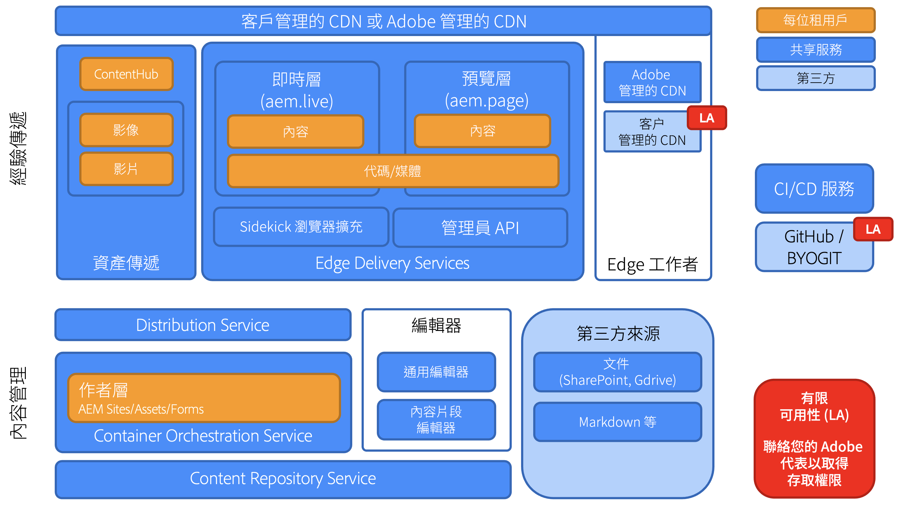
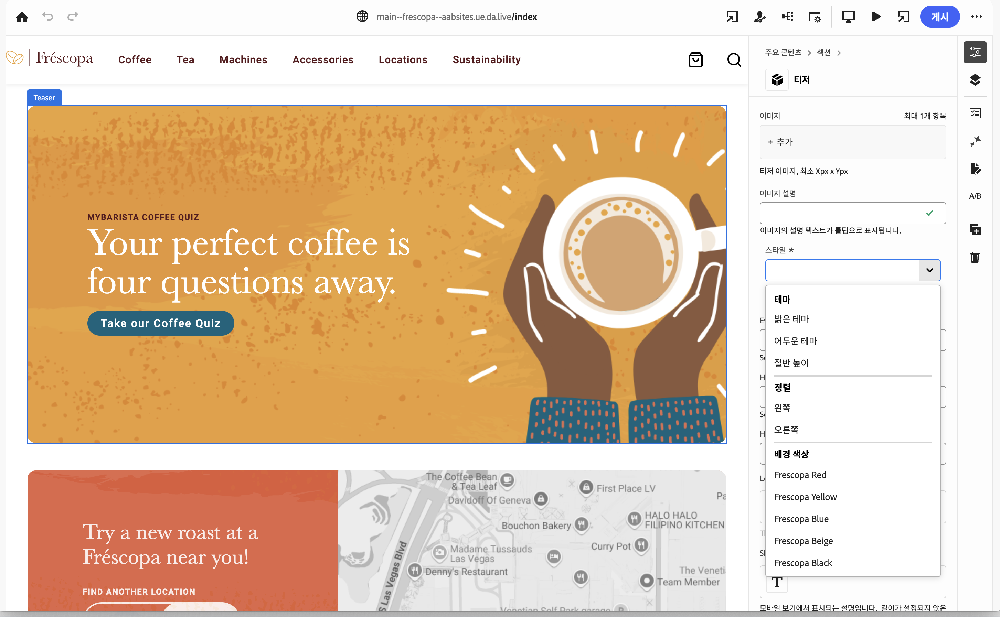

# Edge Delivery Services 概觀 {#edge-delivery-services}

>[!TIP]
>
>**想立即親手操作嗎？**
>
>如果您想要立即動手使用Edge Delivery Services，有兩個選項。
>* [使用預先建立的教學課程環境立即開始撰寫 — 已完整設定且準備就緒。](https://www.aem.live/developer/ue-trial)
>* 透過[檢視aem.live上的教學課程，深入瞭解詳細資訊，並在30分鐘內設定您自己的環境。](https://www.aem.live/developer/ue-tutorial)

## 什麼是 Edge Delivery Services？ {#what-is-edge}

Edge Delivery Services 為現代內容傳遞框架，重新構想網站的建置和傳遞方式，並針對速度、簡易性及擴充性進行最佳化。這是 Adobe Experience Manager 的核心部分，透過將轉譯和傳遞推送至更靠近使用者的位置，即網路邊緣，提供速度更快的數位體驗。

雖不能取代內容傳遞網路 (CDN)，但可以與您自己的 CDN 或隨附的 [Adobe 託管的 CDN](/help/implementing/dispatcher/cdn.md) 緊密整合。

## 為何要使用 Edge Delivery Services？ {#why-edge}

### 增加被搜尋到的機會以及流量 {#increase-traffic}

Edge Delivery 網站針對 LLM 進行搜尋引擎最佳化 (SEO) 和生成式引擎最佳化 (GEO)。這樣可確保所有現有和未來的自然流量來源都具有較高的可見度與可搜尋性。**效能優先的端到端架構**&#x200B;確保客戶擁有愉快的體驗，並對參與度產生正面影響。

### 開發人員效率 {#developer-efficientcy}

只需數天或數週即可上線，無需數月或數年！Edge Delivery 提供&#x200B;**現代網頁開發人員**&#x200B;喜愛的所有工具：GitHub、具有自動重新載入功能的本機開發、效能、簡易性，而且沒有任何複雜的程序 (無需轉譯、無需搭配程式、無需設定、沒有經常性費用)。

操作簡易的 Edge Delivery 不需要使用複雜的框架、工具或流程，非常適合用於建立 AI 程式碼。使用純 HTML、現代 CSS 以及原生 JavaScript 比以往更快速地建立出色的體驗。專注於工作，並減少培訓和學習新工具的時間。

Edge Delivery 讓每位開發人員皆獲得 100 分的 Lighthouse 分數。

### 支援多個內容來源 {#multiple-content-sources}

來自各種解決方案的內容可以直接與 Edge Delivery 整合，**包括您現有的所有 AEM 執行個體**。作者可以使用已知的工具來管理及&#x200B;**發佈來自任何系統的內容 (例如從 SharePoint 發佈至 Edge Delivery**)，以便加速完成工作。

### 可自由搭配組合的架構 {#composable-architeture}

無論是無周邊或有周邊，您皆可使用正確的格式傳遞正確的內容，並新增合適的裝飾，使其成為在任何管道中皆能脫穎而出的體驗。

## 運作方式 {#how-does-it-work}

Edge Delivery Services 是一套可自由搭配組合的服務，讓您擁有極大的彈性可決定如何製作網站內容。它採用多雲端 SaaS 解決方案和單純的前端開發方法，取代 AEM Publish/Dispatcher 以及使用 AEM Core Components 建置體驗的傳統方式。

Edge Delivery Services 會使用 GitHub，可讓您直接從自己的 GitHub 存放庫管理和部署程式碼。新內容將立即加入，無需重建過程。

## 製作 {#authoring}

### 就地編輯 {#in-context-editing}

[通用編輯器](/help/implementing/universal-editor/introduction.md)是所見即所得 (WYSIWYG)、可自訂的一站式工具，您可以透過視覺化預覽即時就地編輯內容。

* 使用 AEM 製作和通用編輯器可提高作者的效率，無論是無周邊或有周邊。
* 您可以利用 AEM 全方位的內容管理功能，包括工作流程和治理。
* 您可以利用眾多擴充點來支援自己的流程和整合。
* 您可以使用 GitHub 中的 CSS 和 JavaScript 來開發網站的功能。

### 文件型編輯 {#document-based-editing}

[另一種方法是文件型製作](https://www.aem.live/docs/authoring)，就是將內容視為文件進行管理。Microsoft Word 是大家常用的製作工具，因為許多企業皆具備 SharePoint 而且使用 SharePoint 來建立初始內容。無需學習新工具，直接從 SharePoint 和 Word 發佈內容，省卻將內容複製並貼上至 AEM 的麻煩程序。沒有 SharePoint 的客戶也可以使用 Google Drive 作為替代方案。

## 操作遙測 {#telemetry}

Adobe Experience Manager 使用[操作遙測](https://www.aem.live/docs/operational-telemetry)來收集操作資料，因為必須掌握這些操作資料，才能發現與修復 Adobe Experience Manager 支援之網站的功能性和效能問題。操作遙測相關資料可用於診斷效能問題並衡量實驗的效益。操作遙測透過[抽樣](https://www.aem.live/docs/operational-telemetry#operational-telemetry-data-is-sampled) (僅監視所有頁面檢視次數的一小部分) 和[審慎排除個人識別資訊](https://www.aem.live/docs/operational-telemetry#what-data-is-being-collected) (PII) 來保護訪客的隱私。

## 開始探索 {#start-exploring}

搭配通用編輯器和 Edge Delivery Services 開始使用 AEM 製作：

* Edge Delivery Services 文件 [Edge Delivery Services](https://www.aem.live)
* 有關使用通用編輯器進行 AEM 製作的概觀，請參閱 aem.live 文件中[使用適用於 Edge Delivery Services 的 AEM 進行製作](https://www.aem.live/docs/aem-authoring)的文件。
* 有關開發人員概觀，請參閱 aem.live 文件中[開始使用 - 通用編輯器開發人員教學課程](https://www.aem.live/developer/ue-tutorial)的文件。

## Edge Delivery Services 和其他 Adobe Experience Cloud 產品 {#edge-other-products}

Edge Delivery Services 是 Adobe Experience Manager 的一部分。因此，Edge Delivery Services 和 AEM Sites 可以在同一網域中共存，這是大型網站的常見使用案例。此外，您的 AEM Sites 頁面可以無縫地使用 Edge Delivery Services 中的內容，反之亦然。

您也可以將 Edge Delivery Services 與 [Adobe Target](https://www.aem.live/developer/target-integration) 和 [Launch](https://experienceleague.adobe.com/zh-hant/docs/experience-platform/tags/home) 搭配使用。

## 取得 Adobe 的協助 {#getting-help}

Adobe 提供三個層級的服務來協助您使用 Edge Delivery Services：

* 利用[社群資源](#community-resources)進行一般查詢
* 存取您的[產品協作頻道](#collaboration-channel)來查詢特定問題。
* [記錄支援服務單](#support-ticket)，解決&#x200B;**合約式支援 SLA 範圍內**&#x200B;重大且關鍵的問題。

### 存取社群資源 {#community-resources}

透過為 Edge Delivery Services、使用通用編輯器進行 AEM 製作以及文件型製作提供最佳的社群參與和支援服務，Adobe 致力於增強您的能力。

* 參與 [Experience League 社群](https://adobe.ly/3Q6kTKl)，提出問題、分享回饋意見、發起討論、尋求 Adobe 專家和 AEM 顧問/達人的協助，以及與志趣相投的人即時交流。
* 加入 [Discord 頻道](https://discord.gg/aem-live)，這個較輕鬆的平台可讓您即時互動和交換靈感。

### 記錄支援服務單 {#support-ticket}

{{support-ticket}}
