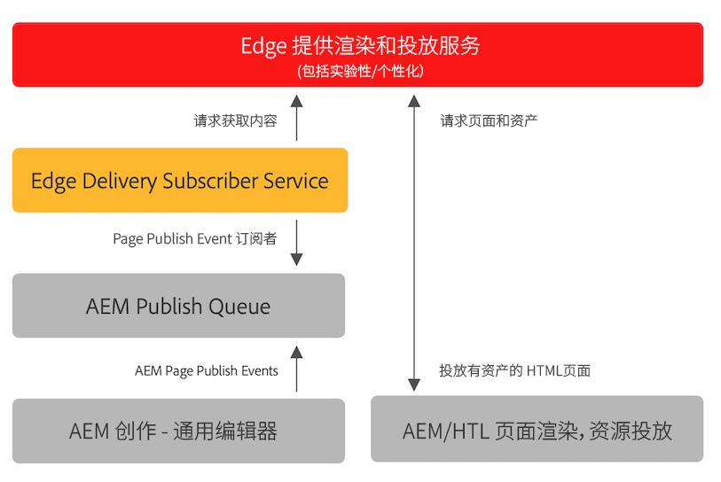

# 發佈Edge Delivery Services內容 {#publishing-edge}

透過Edge Delivery Services，無論內容來源為何，發佈內容都能順暢無礙：

* 檔案型內容 — 請參閱 [發佈區段](https://www.aem.live/docs/#publish) 的Edge Delivery Services檔案。
* AEM內容 — 請參閱下列詳細資料。

## 從AEM發佈流程 {#publishing-flow}

使用通用編輯器來撰寫AEM內容時，發佈就像按一下 **發佈** 按鈕。 請參閱檔案 [使用通用編輯器發佈內容。](/help/implementing/universal-editor/publishing.md)

發佈時的資訊流程如下。 一旦作者開始發佈，此流程就會自動完成，此處說明以供參考。

1. 內容作者會在通用編輯器中發佈AEM內容。
1. 發佈事件會推送至Adobe管道佇列。
1. Edge Delivery Publish服務會將相關事件轉送至Edge Delivery Admin API。
1. Edge傳送會從AEM作者中提取並擷取語意HTML。
1. AEM已更新發佈狀態。

## 如何開始使用 {#how-to-get-started}

請聯絡您的Adobe代表以取得此功能的存取權。
