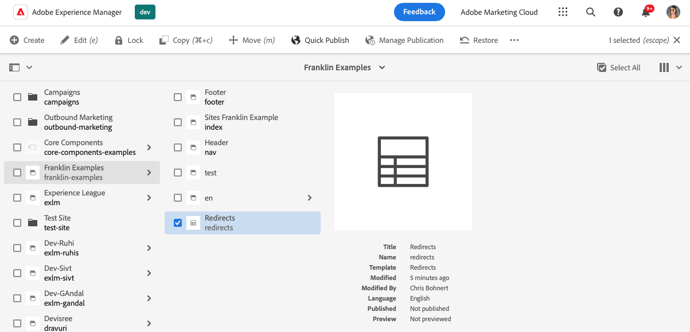
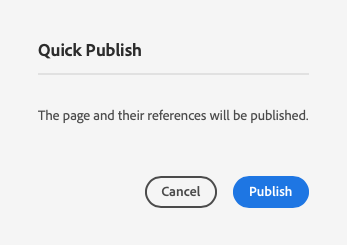

# 使用試算表管理表格資料 {#tabular-data}

瞭解如何使用試算表來管理各種值的表格資料，例如使用Edge Delivery Services網站的AEM的中繼資料和重新導向。

{{aem-authoring-edge-early-access}}

## 使用案例 {#use-cases}

對於任何具有Edge Delivery Services網站的AEM，需要維護表格式資料清單，例如索引鍵值對應。 這些可以是許多不同值的清單，例如中繼資料和重新導向。 Edge Deliver Services可讓您使用試算表這種直覺式工具來維護此類表格清單。 AEM會將這些試算表轉譯為JSON檔案，以便您的網站或網頁應用程式輕鬆使用。

常見的使用案例包括：

* [預留位置](/help/edge/docs/placeholders.md)
* [中繼資料](/help/edge/docs/bulk-metadata.md)
* [標頭](/help/edge/docs/custom-headers.md)
* [重新導向](/help/edge/docs/redirects.md)
* [設定](/help/edge/docs/setup-byo-cdn-push-invalidation.md) 例如CND設定

此外，您可以 [建立您的試算表](#own-spreadsheet) 任何結構的對應，以儲存您自己的對應。

本檔案以重新導向的範例說明如何建立這類試算表。 如需各個使用案例的詳細資訊，請參閱Edge Delivery Services檔案中先前連結的主題。

>[!TIP]
>
>如需一般試算表如何與Edge Delivery Services搭配使用的詳細資訊，請參閱檔案 [試算表和JSON。](/help/edge/developer/spreadsheets.md)

>[!TIP]
>
>試算表只應用於維護表格式資料。 儲存結構化資料時， [檢視AEM headless功能。](/help/headless/introduction.md)

## 先決條件 {#prerequisites}

若要使用包含Edge Delivery Services專案的AEM中的試算表建立對應，您必須使用最新的網站範本建立您的網站。

請參閱檔案 [使用Edge Delivery Services進行AEM編寫的開發人員快速入門手冊](/help/edge/edge-dev-getting-started.md) 以取得詳細資訊。

## 建立試算表 {#spreadsheet}

在此範例中，您將建立試算表來管理具有Edge Delivery Services網站的AEM的重新導向。 相同的步驟適用於 [其他試算表型別](#other) 要建立的物件。

1. 登入您的AEMas a Cloud Service編寫執行個體，前往 **網站** 主控台，並導覽至需要試算表的網站根目錄。 點選或按一下 **建立** -> **頁面**.

   

1. 在 **範本** 建立頁面精靈的索引標籤，點選或按一下 **重新導向** 範本以選取，然後點選或按一下 **下一個**.

   

1. 此 **屬性** 精靈的標籤會顯示重新導向試算表的預設值。 點選或按一下&#x200B;**建立**。

   * **標題**  — 維持此值不變。
   * **欄**  — 預先填入重新導向所需的最小欄數。
      * **來源**  — 要重新導向的頁面
      * **目的地**  — 要重新導向的頁面

   

1. 在 **成功** 對話方塊，點選或按一下 **開啟**.

   

1. 新標籤隨即開啟，試算表載入到具有預先定義之編輯器的中 **來源** 和 **目的地** 欄。 若要定義重新導向，請點選或按一下 **來源** 欄。 當您編輯試算表時，變更會自動儲存。

   

   * 此 **來源** 相對於您網站的網域，因此僅包含相對路徑。
   * 此 **目的地** 如果您重新導向不同的網站，可以是完整URL，如果您在自己的網站內重新導向，也可以是相對路徑。
   * 使用Tab鍵將焦點移至下一個儲存格。
   * 編輯器會視需求將新列新增至試算表。
   * 若要刪除或移動列，請使用 **刪除** 圖示和拖曳操作框分別位於每一列結尾和每一列開頭。

## 發佈試算表路徑.json {#paths-json}

為了讓AEM能在試算表中發佈資料，您另外還需要更新 `paths.json` 您的專案的檔案。

1. 在GitHub中開啟專案的根目錄。

1. 點選或按一下 `paths.json` 檔案以開啟其詳細資料，然後 **編輯** 圖示。

   

1. 新增線條以將新的試算表對應至 `redirects.json` 資源。

   ```json
   {
     "mappings": [
      "/content/<site-name>/:/",
      "/content/<site-name>/redirects:/redirects.json"
     ]
   }
   ```

1. 按一下 **提交變更……** 將變更儲存至 `main`.

   * 認可至 `main` 或根據您的流程建立提取請求。

1. 當您完成重新導向的定義並更新路徑對應時，請返回 **網站** 主控台。

1. 點選或按一下以選取您在主控台中建立的重新導向試算表，然後點選或按一下 **快速發佈** 以發佈試算表。

   

1. 在 **快速發佈** 對話方塊，點選或按一下 **發佈**.

   

1. 橫幅會確認發佈。

   

重新導向試算表現已發佈並可公開存取。

## 其他試算表型別 {#other}

現在您知道如何建立重新導向試算表，您可以建立任何其他標準試算表型別：

* 預留位置
* 中繼資料
* 標頭
* 設定

請遵循各節中的相同步驟 [建立試算表](#spreadsheet) 和 [更新paths.json](#paths-json) 並選擇適當的範本並更新 `paths.json` 檔案。

的 [設定](https://www.aem.live/docs/configuration)， [標頭](https://www.aem.live/docs/custom-headers) 和 [中繼資料](https://www.aem.live/docs/bulk-metadata) 請務必新增對應，以發佈至其預設位置：

* 設定： `/.helix/config.json`
* 標頭： `/.helix/headers.json`
* 中繼資料： `/metadata.json`

此外，您可以 [建立您自己的試算表](#own-spreadsheet) 任意欄位供您自行使用。

>[!NOTE]
>
>您不需要建立試算表來管理AEM與Edge Delivery Services專案as a Cloud Service的索引。
>
>如果您想建立自己的索引， [請依照本檔案操作](https://www.aem.live/developer/indexing#setting-up-more-index-configurations) 以建立您自己的 `helix-query.yaml` 檔案。

## 建立自己的試算表 {#own-spreadsheet}

1. 請依照區段中的相同步驟操作 [建立試算表。](#spreadsheet)

1. 選取範本時，選擇 **試算表**.

1. 在 **屬性** 標籤中，您可以新增自己的欄。

   

   * 在 **欄** 區段，點選或按一下 **新增** 以新增欄。
   * 提供欄的名稱。
   * 使用移除或重新組織欄 **刪除** 和拖曳控點圖示。

1. 依照重新導向試算表的指示，建立試算表並發佈。

1. 將對應新增至 `paths.json` 檔案，依照重新導向試算表的指示執行。
