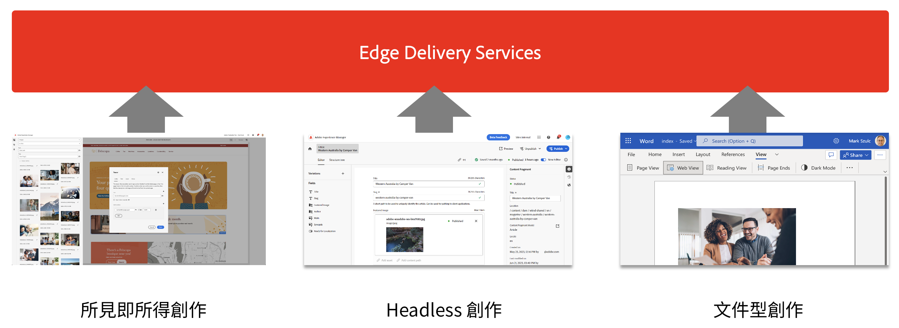
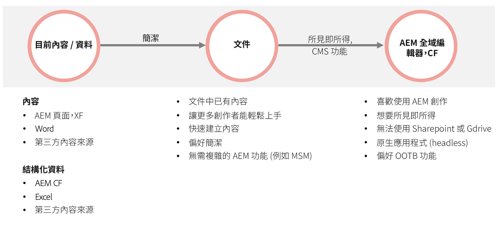

# 搭配AEM使用Edge Delivery Services {#using-edge}

Edge Delivery Services與內容來源是分離的，可擷取不同內容來源的內容。 這表示無論您選擇什麼來源，都可以在相同網站上透過順暢且簡化的發佈來使用多個內容來源。

透過Edge Delivery Services，您可以建立快速開發環境，讓作者可以快速更新和發佈內容，並快速啟動新網站。 從編輯到在網際網路上即時看到內容，只需要幾秒鐘的時間。

從多個內容來源擷取內容，為使用者提供出色的靈活性。Adobe 提供指引來協助您選擇最適合自身專案的內容來源。

在某些情況下，內容來源是預先定義或缺乏靈活性 (例如，專案無法使用 Sharepoint 或 Google 雲端硬碟)。但在很多情況下，工具並不是預先決定的，且工具的選擇也沒有明確的優劣之分。

Adobe 的指引原則很簡單。從檔案式撰寫開始，視需要增加複雜性。 如果需要變更工具，AEM 的 Edge Delivery Services 整合涵蓋內容移轉。

## 製作 {#authoring-edge}

透過 Edge Delivery Services，製作變得簡單、快速且靈活。您可以選擇使用檔案式撰寫或AEM式撰寫來撰寫，並使用通用編輯器。

若需更多資訊，請參閱文件「[為 Edge Delivery Services 製作內容](/help/edge/aem-authoring/authoring.md)」。

## 發佈 {#publishing-edge}

使用 Edge Delivery Services 時，無論內容來源為何，都可以流暢地發佈內容。

若需更多資訊，請參閱文件「[為 Edge Delivery Services 發佈內容](/help/edge/aem-authoring/publishing.md)」。

## 開發 {#developing-edge}

Edge Delivery Services 以區塊概念為基礎。AEM 包含完整的預先定義區塊資料庫，您可以擴充該資料庫來專案需求。Edge Delivery Services 專案的程式碼是在 GitHub 中管理。

請參閱文件「[使用 Edge Delivery Services 進行 AEM 製作的開發人員入門指南](/help/edge/aem-authoring/edge-dev-getting-started.md)」，了解更多資訊。

## 現有 AEM 專案 {#existing-projects}

您不需要等待新的 AEM 專案，即可取得 Edge Delivery Services 帶來的好處。Edge Delivery Services 可以整合到現有的 AEM 專案中，讓您可立即利用專案提升的效能。

若需更多資訊，請參閱文件「[在現有 AEM 專案中使用 Edge Delivery Services](/help/edge/aem-authoring/existing-projects.md)」。
