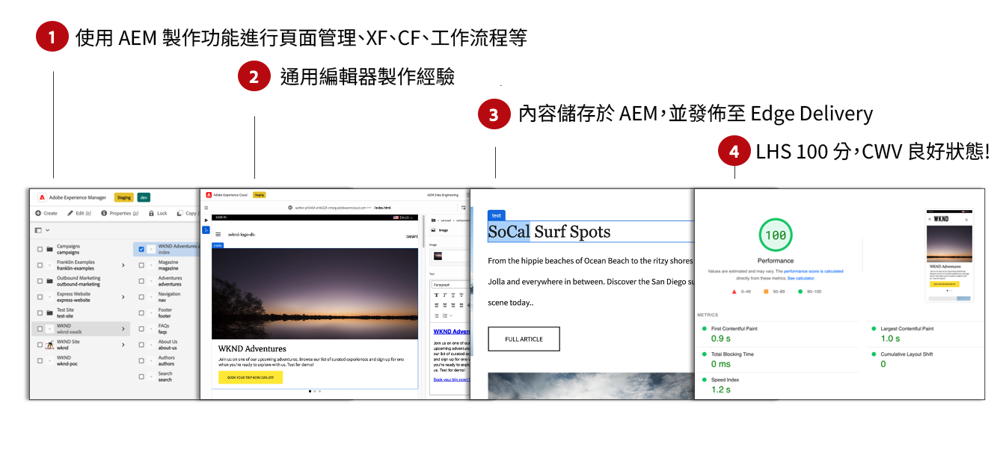
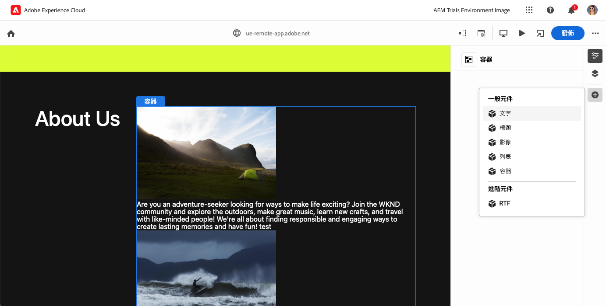
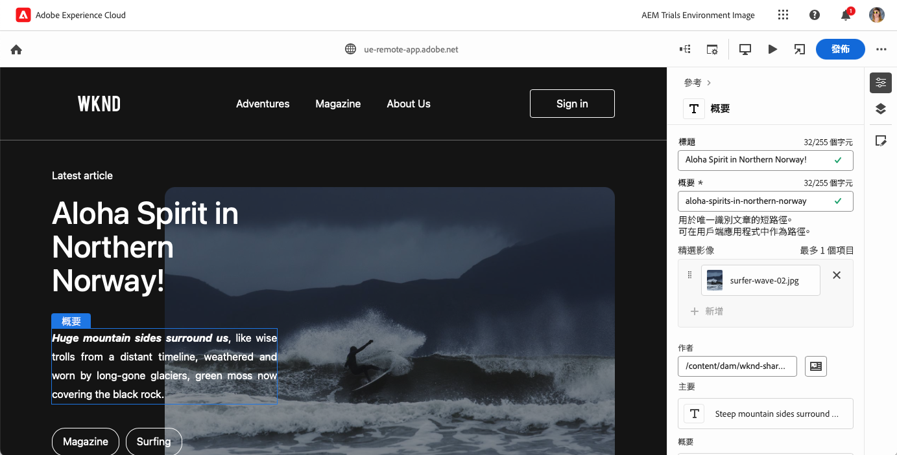

# Edge Delivery Services 的所見即所得內容製作 {#authoring-edge}

使用 Edge Delivery Services 時，製作很簡單、快速且靈活。您有兩種選擇來為 Edge Delivery Services 製作內容：

* [通用編輯器](#universal-editor) - 用於在 AEM 中製作內容的現代化所見即所得 (WYSIWYG) 使用者介面
* [文件型製作](#document-based) - 例如 Microsoft Word 或 Google Docs

## 通用編輯器製作 {#universal-editor}

將 Edge Delivery Services 與 AEM as a Cloud Service 搭配使用時，需要了解的最基本事實是您製作的內容將保留在 AEM as a Cloud Service 中。

1. [AEM Sites 環境](/help/sites-cloud/authoring/quick-start.md)用於內容管理，例如建立新頁面、體驗片段、內容片段等。
   * AEM 的所有功能均適用，例如工作流程、MSM、翻譯、啟動等。
1. [通用編輯器](/help/sites-cloud/authoring/universal-editor/authoring.md)會用於製作 AEM 所管理的內容。
   * 通用編輯器為內容製作提供了全新且現代化的使用者介面。
   * 在內容製作方面，AEM 會轉譯 HTML，但包括來自 Edge Delivery Services 的指令碼、樣式、圖示和其他資源。
   * 儘管使用了通用編輯器，但所有變更都會保留到 AEM。
   * 通用編輯器尚未與 AEM Page Editor 具有同等功能，且某些 AEM 功能在通用編輯器中可能無法使用。
1. 您使用通用編輯器製作並保留到 AEM 的內容將發佈到 Edge Delivery Services。
   * 內容仍儲存在 AEM 中。
   * AEM 會轉譯擷取所需的語意 HTML。
   * 內容發佈到 Edge Delivery Services。
1. [Edge Delivery Services](/help/edge/developer/keeping-it-100.md) 可確保 100% 的 Lighthouse 分數。

區塊是 Edge Delivery Services 提交的頁面基本元件。作者可以從 Adob&#x200B;&#x200B;e 作為標準提供的預設區塊或開發人員為您專案量身定制的區塊中進行選擇。

通用編輯器提供了一個現代且直觀的 GUI，可透過新增和排列區塊來製作內容。

然後可以在「屬性」面板內設定區塊的詳細資訊。

如需有關如何使用通用編輯器的詳細資訊，請參閱文件「[使用通用編輯器製作內容](/help/sites-cloud/authoring/universal-editor/authoring.md)」。

請參閱[使用 Edge Delivery Services 進行所見即所得製作的開發人員快速入門手冊](/help/edge/wysiwyg-authoring/edge-dev-getting-started.md)，了解如何展開您自己的專案，並使用 AEM 和 Edge Delivery Services 進行製作。

## 其他製作方法  {#authoring-methods}

所見即所得製作對於內容作者來說是一個強大且直覺的工具。但是，會有許多不同的製作使用案例，這也就是 AEM 可作為額外製作解決方案的原因。

請參閱文件：[選擇製作方法](/help/edge/authoring-methods.md)，了解更多關於 AEM 提供的製作解決方案，包括文件型製作和 Headless 製作。
