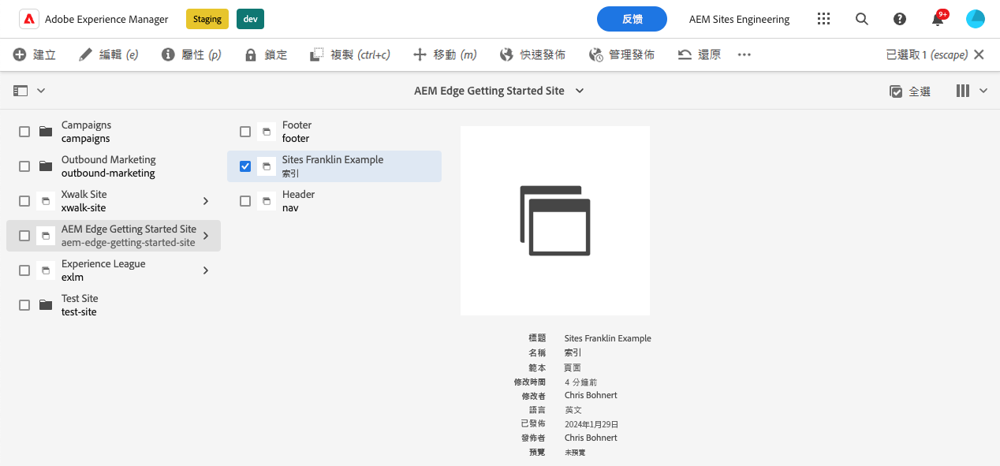
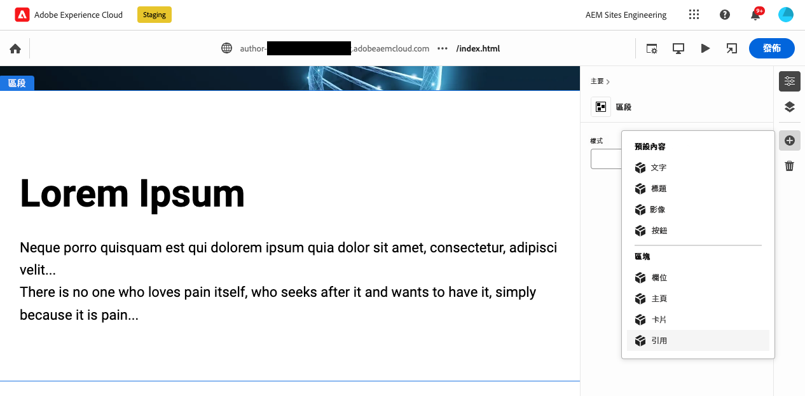
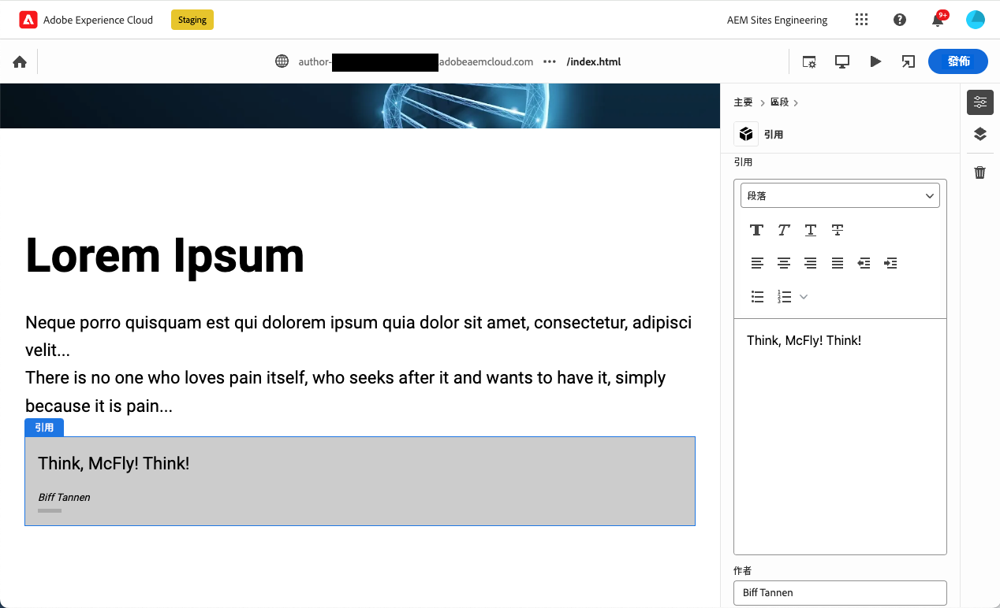

# 建立經檢測適用通用編輯器的區塊 {#create-block}

了解如何在使用 Edge Delivery Services 專案進行的所見即所得製作環境中，建立經檢測適用通用編輯器的區塊。

## 先決條件 {#prerequisites}

本指南提供逐步說明，讓您了解如何在使用 Edge Delivery Services 專案進行的所見即所得製作環境中，建立經檢測適用通用編輯器的區塊。內容包括新增元件、載入通用編輯器中的元件定義、發佈頁面、實作區塊裝飾和樣式、將變更引入生產以及進行變更驗證。完成本指南後，您可以為自己的專案建立和部署新區塊。

本指南需要具備使用 Edge Delivery Services 專案進行所見即所得製作及通用編輯器的知識。在開始執行本指南之前，您應該有 Edge Delivery Services 存取權並熟悉基本使用需知，包括：

* 您已完成 [Edge Delivery Service 教學課程](/help/edge/developer/tutorial.md)。
* 您有權存取 [AEM Cloud Service 沙箱](/help/implementing/cloud-manager/getting-access-to-aem-in-cloud/introduction-sandbox-programs.md)。
* 您已[在同一沙箱環境中啟用通用編輯器](/help/implementing/universal-editor/getting-started.md)。
* 您已完成[使用 Edge Delivery Services 進行所見即所得製作的開發人員快速入門手冊](/help/edge/wysiwyg-authoring/edge-dev-getting-started.md)指南。

本指南是以在[使用 Edge Delivery Services 進行所見即所得製作的開發人員快速入門手冊](/help/edge/wysiwyg-authoring/edge-dev-getting-started.md)指南中完成的工作為基礎。

## 為您的專案新增區塊 {#add-block}

在本指南中，您將建立一個區塊並在頁面上呈現令人難忘的引述。

為了簡化此範例，所有變更均針對專案儲存庫的 `main` 分支進行。當然，進行實際專案時[應該遵照開發最佳實務](https://www.aem.live/docs/dev-collab-and-good-practices)進行，在不同的分支上進行開發，並在合併到`main`之前透過提取請求檢查所有變更。

Adobe 建議您採用三階段方法來開發區塊：

1. 建立區塊的定義和模式、審查區塊，然後將區塊投入生產。
1. 使用新區塊建立內容。
1. 實作新區塊的裝飾和風格。

以下引述區塊範例即遵照此方法進行。

### 建立區塊定義和模式 {#create-block-model}

1\. 將您在[使用 Edge Delivery Services 進行所見即所得製作的開發人員快速入門手冊](/help/edge/wysiwyg-authoring/edge-dev-getting-started.md)指南中建立的 GitHub 專案原地複製到本機，並在您選擇的編輯器中將其開啟。

* 此處使用 Microsoft 程式碼是為了說明目的。


2\. 編輯專案根目錄的[`component-definition.json`檔案](/help/implementing/universal-editor/component-definition.md)，為新引述區塊新增以下定義並儲存檔案。

>[!BEGINTABS]

>[!TAB JSON 範例]

```json
{
  "title": "Quote",
  "id": "quote",
  "plugins": {
    "xwalk": {
      "page": {
        "resourceType": "core/franklin/components/block/v1/block",
        "template": {
          "name": "Quote",
          "model": "quote",
          "quote": "<p>Think, McFly! Think!</p>",
          "author": "Biff Tannen"
        }
      }
    }
  }
}
```

>[!TAB 螢幕擷圖]


>[!ENDTABS]

3\. 編輯專案根目錄下的 `component-models.json` 檔案，為新引述區塊新增以下[模式定義](/help/implementing/universal-editor/field-types.md#model-structure)並儲存檔案。

* 請參閱文件：[使用 Edge Delivery Services 專案進行所見即所得製作的內容模型](/help/edge/wysiwyg-authoring/content-modeling.md)，了解有關建立內容模型時需要考慮的重要事項詳細資訊。

>[!BEGINTABS]

>[!TAB JSON 範例]

```json
{
  "id": "quote",
  "fields": [
     {
       "component": "richtext",
       "name": "quote",
       "value": "",
       "label": "Quote",
       "valueType": "string"
     },
     {
       "component": "text",
       "valueType": "string",
       "name": "author",
       "label": "Author",
       "value": ""
     }
   ]
}
```

>[!TAB 螢幕擷圖]


>[!ENDTABS]

4\. 編輯專案根目錄下的[`component-filters.json`檔案](/help/implementing/universal-editor/filtering.md)，並將引述區塊新增至[篩選器定義](/help/implementing/universal-editor/filtering.md)中，以允許將該區塊新增至任何區段並且儲存檔案。

>[!BEGINTABS]

>[!TAB JSON 範例]

```json
{
  "id": "section",
  "components": [
    "text",
    "image",
    "button",
    "title",
    "hero",
    "cards",
    "columns",
    "quote"
   ]
}
```

>[!TAB 螢幕擷圖]


>[!ENDTABS]

5\. 使用 git，將這些變更提交到您的 `main` 分支。

* 提交至`main`僅是為了說明目的。[遵照最佳實務](https://www.aem.live/docs/dev-collab-and-good-practices)，並在實際專案工作中使用提取請求。

### 使用區塊建立內容。 {#create-content}

現在您的基本引述區塊已定義並提交給範例專案，您可以將引述區塊新增至現有頁面。

1. 在瀏覽器中，登入 AEM as a Cloud Service。[使用 Sites 主控台](/help/sites-cloud/authoring/basic-handling.md)，瀏覽至您在[使用 Edge Delivery Services 進行所見即所得製作的開發人員快速入門手冊](/help/edge/wysiwyg-authoring/edge-dev-getting-started.md)指南中建立的網站，然後選取一個頁面。

   * 在本案例中，`index`是用於說明目的。

   

1. 點選或按一下控制台工具列中的「**編輯**」，通用編輯器隨即開啟。

   * 為了載入該頁面，您可能需要點選或按一下「**使用 Adobe 登入**」，並在通用編輯器中對 AEM 進行驗證。

1. 在通用編輯器中，選取一個區段。在屬性面板中，點選或按一下「**新增**」圖示，然後從選單中選取新的「**引述**」區塊。

   *  **新增**&#x200B;圖示是一個加號。
   * 如果所選物件的藍色外框有一個標為「**區段**」的標記，表示您已選取了一個區段。
   * 在此範例中，在「**Lorem Ipsum**」標題上方輕輕點選或按一下，即可選取包含標題和 lorem ipsum 文字的區段。

   

1. 頁面重新加載，且引述區塊將新增至所選區段的底部，以及成為 `component-definitions.json` 檔案中指定的預設內容。

   * 與任何其他區塊一樣，引述區塊可在原處或屬性面板中供選取和編輯。
   * 樣式將在下一步中套用。

   

1. 當您對引述內容感到滿意時，可以在通用編輯器工具列中點選或按一下「**發佈**」按鈕。

1. 導覽至已發佈的頁面，驗證內容是否已發佈。該連結類似 `https://<branch>--<repo>--<owner>.aem.page`

   

### 區塊的樣式 {#style-block}

現在您已經有了一個可用的引述區塊，您可以對區塊套用樣式。

1\. 返回您的專案編輯器。

2\. 在`blocks`檔案夾中，建立一個`quote`檔案夾。


3\. 在新的 `quote` 資料夾中，透過新增以下 JavaScript，新增一個 `quote.js` 檔案以實施區塊裝飾，然後儲存檔案。

>[!BEGINTABS]

>[!TAB JavaScript 範例]

```javascript
export default function decorate(block) {
  const [quoteWrapper] = block.children;
 
  const blockquote = document.createElement('blockquote');
  blockquote.textContent = quoteWrapper.textContent.trim();
  quoteWrapper.replaceChildren(blockquote);
}
```

>[!TAB 螢幕擷圖]


>[!ENDTABS]

4\. 在 `quote` 資料夾中，透過新增以下 CSS 程式碼，新增一個 `quote.css` 檔案以定義區塊樣式，然後儲存檔案。

>[!BEGINTABS]

>[!TAB CSS 範例]

```css
.block.quote {
    background-color: #ccc;
    padding: 0 0 24px;
    display: flex;
    flex-direction: column;
    margin: 1rem 0;
}
 
.block.quote blockquote {
    margin: 16px;
    text-indent: 0;
}
 
.block.quote > div:last-child > div {
    margin: 0 16px;
    font-size: small;
    font-style: italic;
    position: relative;
}
 
.block.quote > div:last-child > div::after {
    content: "";
    display: block;
    position: absolute;
    left: 0;
    bottom: -8px;
    height: 5px;
    width: 30px;
    background-color: darkgray;
}
```

>[!TAB 螢幕擷圖]


>[!ENDTABS]

5\. 使用 git，將這些變更提交到您的 `main` 分支。

* 提交至`main`僅是為了說明目的。[遵照最佳實務](https://www.aem.live/docs/dev-collab-and-good-practices)，並在實際專案工作中使用提取請求。

6\. 返回通用編輯器的瀏覽器分頁，即您之前編輯專案頁面處，並重新載入頁面以檢視已設定樣式的區塊。

7\. 請參閱頁面上現在附有樣式的引述區塊。



8\. 導覽至已發佈的頁面，驗證變更是否已推至生產。該連結類似 `https://<branch>--<repo>--<owner>.aem.page`


恭喜！您現在擁有一個完全可使用且附樣式的引述區塊。您可以此範例為基礎，用來設計您自己專案的特定區塊。

### 區塊選項 {#block-options}

如果您需要區塊的外觀或行為在某些情況下略有不同，但又不足以使其本身成為一個新區塊，您可以讓作者從[區塊選項](content-modeling.md#type-inference)中進行選擇。

在區塊中新增一個 `classes` 屬性，簡單區塊的屬性會轉譯於表格標頭中，而容器區塊的項目則會轉譯為值清單。

```json
{
  "id": "simpleMarquee",
  "fields": [
    {
      "component": "text",
      "valueType": "string",
      "name": "marqueeText",
      "value": "",
      "label": "Marquee text",
      "description": "The text you want shown in your marquee"
    },
    {
      "component": "select",
      "name": "classes",
      "value": "",
      "label": "Background Color",
      "description": "The marquee background color",
      "valueType": "string",
      "options": [
        {
          "name": "Red",
          "value": "bg-red"
        },
        {
          "name": "Green",
          "value": "bg-green"
        },
        {
          "name": "Blue",
          "value": "bg-blue"
        }
      ]
    }
  ]
}
```

## 使用其他工作分支 {#other-branches}

為了簡單起見，本指南會讓您直接使用`main`分支。對於範例存放庫中的實驗，這通常不是問題。進行實際專案工作時[應該遵照開發最佳實務](https://www.aem.live/docs/dev-collab-and-good-practices)進行，在不同的分支上進行開發，並在合併到`main`之前透過提取請求檢查所有變更。

當你是在`main`分支上開發時，您可以在通用編輯器位置列中附加 `?ref=<branch>`，以便從您的分支載入頁面。`<branch>` 是分支名稱，因為此分支會用於專案的預覽或即時 URL，例如 `https://<branch>--<repo>--<owner>.aem.page`。

## 重新使用區塊進行文件型製作 {#reusing-blocks}

如果您遵循相同的內容模型，則可以使用為所見即所得製作所建立的區塊，使用通用編輯器進行文件型製作。

如需更多資訊，請參閱文件：[用於所見即所得和文件型製作的區塊](/help/edge/wysiwyg-authoring/wysiwyg-doc-blocks.md)。

## 後續步驟 {#next-steps}

既然您已經知道如何建立區塊，那麼了解如何以語義方式建立內容模式並實現精益開發人員體驗就很重要。

請參閱文件：[使用 Edge Delivery Services 專案為所見即所得製作建立內容模型](/help/edge/wysiwyg-authoring/content-modeling.md)，了解建立內容模型如何用於使用 Edge Delivery Services 專案進行所見即所得製作。

>[!TIP]
>
>如需建立新的 Edge Delivery Services 專案的端對端操作示範，該專案支援使用 AEM as a Cloud Service 作為內容來源進行所見即所得製作，請觀看[此 AEM GEM 網路研討會](https://experienceleague.adobe.com/zh-hant/docs/events/experience-manager-gems-recordings/gems2024/aem-authoring-and-edge-delivery)。
