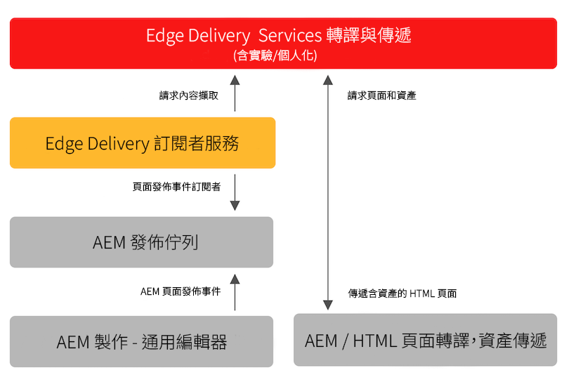

# 為 Edge Delivery Services 發佈內容 {#publishing-edge}

使用 Edge Delivery Services 時，無論內容來源為何，都可以流暢地發佈內容：

* 文件型內容 - 請參閱 Edge Delivery Services 文件的[「發佈」區段](/help/edge/docs/authoring.md) 。
* AEM 內容 - 請參閱下面的詳細資訊。

## AEM 的發佈流程 {#publishing-flow}

使用 Universal Editor 編輯 AEM 內容時，發佈內容如同在 Universal Editor 點擊「**發佈**」按鈕一樣簡單。請參閱文件「[使用 Universal Editor 發佈內容](/help/sites-cloud/authoring/universal-editor/publishing.md)」。

在發佈時的資訊流程如下。一旦作者開始發佈，此流程就會自動進行，且此處有說明可供資訊參考。

>[!NOTE]
>
>每天最多允許從製作 UI 或按工作流程發佈 5000 個路徑。不支援建立大量發佈工作負載的整合。如果您的專案需要更高的容量，請提議加入 [VIP 計劃](https://www.aem.live/vip/intake)。

1. 內容作者在 Universal Editor 中發布 AEM 內容。
1. 發佈事件會被推送到 Adob&#x200B;&#x200B;e 管道佇列。
1. Edge Delivery 發佈服務會將相關事件轉送到 Edge Delivery Services 管理 API。
1. Edge Delivery 會從 AEM 作者提取並擷取語義 HTML。
1. AEM 已更新發佈狀態。

>[!NOTE]
>
>依預設，Edge Delivery Services 管理 API 未受保護，可用於在未經驗證的情況下發佈或取消發佈文件。為了設定管理 API 的驗證 (如「[設定作者的身份驗證](https://www.aem.live/docs/authentication-setup-authoring)」中的文件所述)，您的專案必須配置 API_KEY 以授予發佈服務的存取權。[請聯絡 Slack 上的 Adob&#x200B;&#x200B;e 團隊](/help/edge/docs/slack.md)以要求指導。

