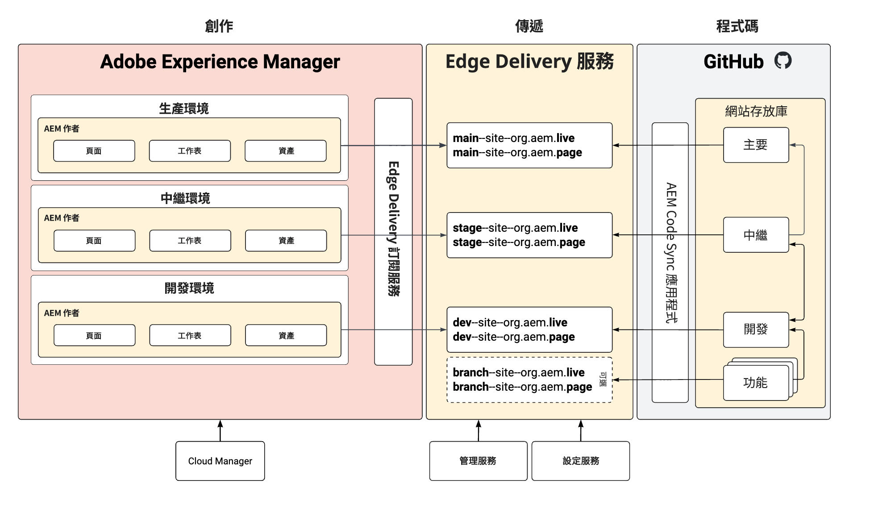

# 無存放庫的中繼和生產環境 {#repoless-stage-prod}

了解如何運用單一程式碼基底，以無存放庫的方式分別設定中繼和生產環境的網站。

## 概觀 {#overview}

您可能想要建立與中繼環境分開的生產環境網站。為了分開中繼和生產環境而建立第二個網站的過程，與[多網站管理所需的設定](/help/edge/wysiwyg-authoring/repoless-msm.md)類似。事實上，如有需要，此網站可與 MSM 網站結構相結合。

此文件使用中繼和生產環境分開的典型範例。您可以為任何您想要的環境建立獨立的環境。

## 要求 {#requirements}

若要設定無存放庫的中繼和生產環境，您必須先完成下列工作：

* 此文件假設您已根據[使用 Edge Delivery Services 進行所見即所得製作的開發人員快速入門手冊](/help/edge/wysiwyg-authoring/edge-dev-getting-started.md)，為專案建立網站。
* 您必須已經[為專案啟用無存放庫功能。](/help/edge/wysiwyg-authoring/repoless.md)

## 設定 {#configuration}

此文件說明如何使用相同的程式碼基底，為您的專案設定獨立的生產網站。我們採用以下假設。

* 中繼網站已完成設定，而您現在要為生產網站建立設定。
* 類似於 AEM 製作的內容結構。
* 中繼和生產將使用相同的路徑對應。

在此範例中，我們假設已經為名為「wknd」的專案建立一個生產網站，而其 GitHub 存放庫也稱為「wknd」。

設定獨立的生產網站有兩個步驟。

1. [為您的生產環境建立新的 Edge Delivery Services 網站](#create-edge-site)。
1. [在 AEM 中更新生產網站的雲端設定](#update-cloud-configuration)。

### 為您的生產環境建立新的 Edge Delivery Services 網站 {#create-edge-site}

1. 獲取您的授權權杖和您方案的技術帳戶。
   * 請參閱&#x200B;**跨網站重複使用程式碼**&#x200B;的文件，詳細了解如何[取得存取權杖](/help/edge/wysiwyg-authoring/repoless.md#access-token)和您的方案之[技術帳戶](/help/edge/wysiwyg-authoring/repoless.md#access-control)。
1. 透過對設定服務進行下列呼叫來建立新網站。請考量下列事項：
   * POST URL 中的專案名稱必須是您正在建立的新網站名稱。在此範例中，其名稱為 `wknd-prod`。
   * `code` 設定應與您初次建立專案時所使用的設定相同。
   * `content` > `source` > `url` 必須根據您正在建立的新網站名稱進行調整。在此範例中，其名稱為 `wknd-prod`。
   * 即 POST URL 中的網站名稱與 `content` > `source` > `url` 必須相同。
   * 調整 `admin` 區塊，以定義應該具有網站完整管理存取權的使用者。
      * 這個區塊包含許多電子郵件。
      * 可以使用萬用字元「`*`」。
      * 請參閱[設定作者驗證](https://www.aem.live/docs/authentication-setup-authoring#default-roles)的文件，以了解更多資訊。

   ```text
   curl --request POST \
     --url https://admin.hlx.page/config/<your-github-org>/sites/wknd-prod.json \
     --header 'x-auth-token: <your-token>' \
     --header 'Content-Type: application/json' \
     --data '{
       "code": {
           "owner": "<your-github-org>",
           "repo": "wknd",
           "source": {
               "type": "github",
               "url": "https://github.com/<your-github-org>/wknd"
           }
       },
       "content": {
           "source": {
               "url": "https://author-p<programID>-e<environmentID>.adobeaemcloud.com/bin/franklin.delivery/<your-github-org>/wknd-prod/main",
               "type": "markup",
               "suffix": ".html"
           }
       },
       "access": {
           "admin": {
               "role": {
                   "admin": [
                       "<email>@<domain>.<tld>"
                   ],
                   "config_admin": [
                       "<tech-account-id>@techacct.adobe.com"
                   ]
               },
               "requireAuth": "auto"
           }
       }
   }'
   ```

1. 透過對設定服務進行下列呼叫，加入新網站的路徑對應。

   ```text
   curl --request POST \
     --url https://admin.hlx.page/config/<your-github-org>/sites/wknd-prod/public.json \
     --header 'x-auth-token: <your-token>' \
     --header 'Content-Type: application/json' \
     --data '{
       "paths": {
           "mappings": [
               "/content/wknd/:/"
           ],
           "includes": [
               "/content/wknd/"
           ]
       }
   }'
   ```

透過呼叫 `https://main--wknd-prod--<your-github-org>.aem.page/config.json` 並驗證傳回的 JSON 內容，確認新網站的公開設定可以正常運作。

### 在 AEM 中更新生產網站的雲端設定 {#update-cloud-configuration}

生產 AEM 必須設定為使用您在上一個區段中為專用生產網站建立的新 Edge Delivery Sites。在此範例中，生產環境中 `/content/wknd` 的內容必須知道要使用您建立的 `wknd-prod` 網站。

1. 登入 AEM 生產執行個體，並前往「**工具**」->「**雲端服務**」->「**Edge Delivery Services 設定**」。
1. 選取自動為您的專案建立的設定。
1. 點選或按一下工具列中的「**屬性**」。
1. 在 **Edge Delivery Services 設定**&#x200B;視窗中：
   * 在「**組織**」欄位中提供您的 GitHub 組織。
   * 將此網站名稱變更為您在上一個區段中建立的網站名稱。在此情況下，名稱將是「`wknd-prod`」。
   * 將專案類型變更為「**無存放庫設定的 aem.live**」。
1. 點選或按一下「**儲存並關閉**」。

## 驗證您的設定 {#verify}

現在您已完成所有必要的設定變更，請檢查一切是否按預期運作。

1. 登入您的 AEM 生產製作執行個體。
1. 前往「**導覽**」->「**Sites**」，以導覽至「**Sites 主控台**」。
1. 選取您網站中的頁面。
1. 點選或按一下工具列中的「**編輯**」。
1. 確保此頁面在通用編輯器中正確轉譯，並使用與網站根目錄相同的程式碼。
1. 對此頁面進行變更並重新發佈。
1. 請造訪新的 Edge Delivery Services 網站以瀏覽該頁面，網址為 `https://main--wknd-prod--<your-github-org>.aem.page`。

如果您看得到所做的變更，表示您的獨立生產網站設定正常運作。

## 使用情況 {#usage}

您使用無存放庫的中繼和生產環境設定專案後，即可獨立管理其程式碼。下圖說明 AEM、Edge Delivery Services 網站及 GitHub 存放庫中，各種環境內容之間的關係。


