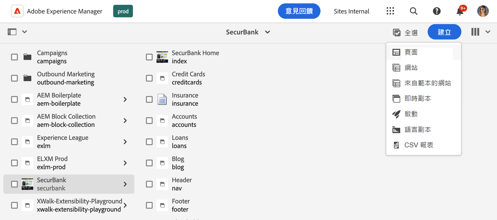
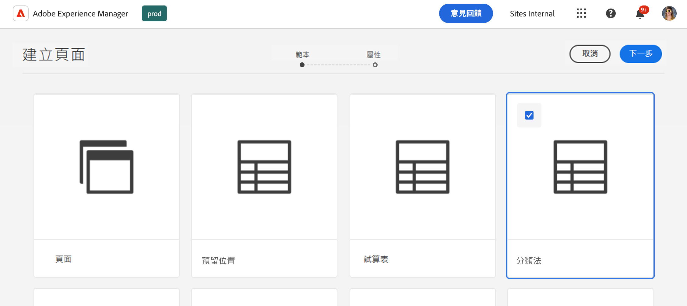
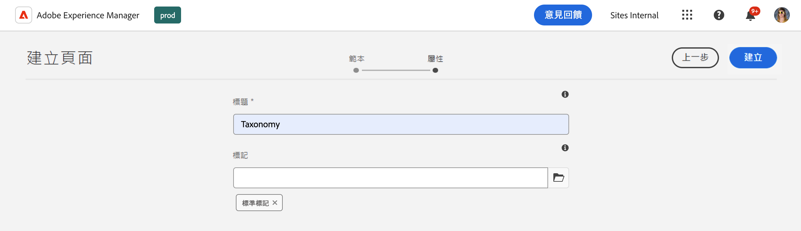
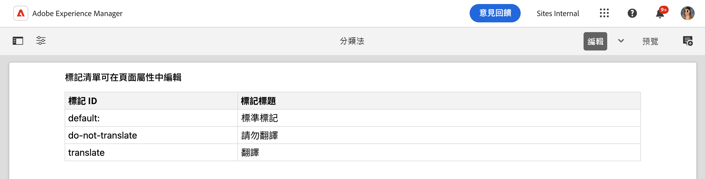
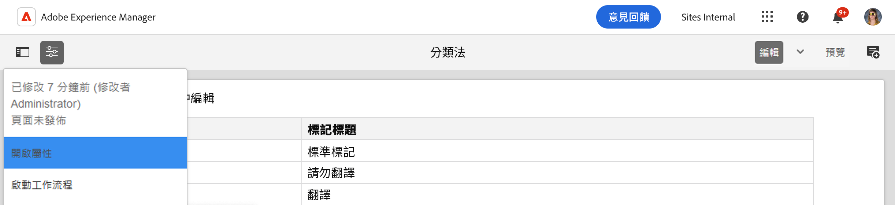
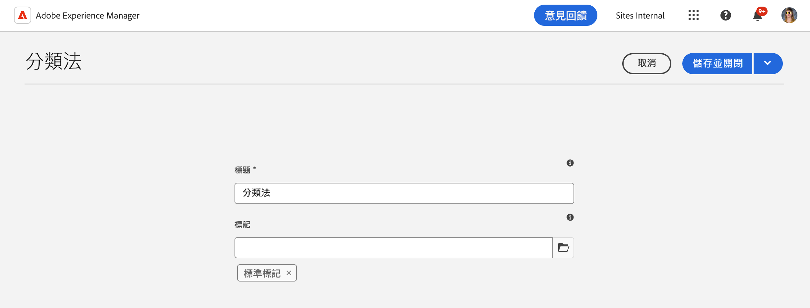

# 管理分類資料 {#managing-taxonomy-data}

瞭解如何管理分類資料，以便在AEM和Edge Delivery Services網站中使用標籤。

## 簡介 {#introduction}

標籤是協助您組織和管理頁面的一項重要功能。 [AEM中的標籤主控台](/help/sites-cloud/administering/tags.md#tagging-console)可讓您建立豐富的標籤分類法，以組織您的頁面。

這些標籤不僅對您和您的作者編排內容非常有用，也適合您的讀者。 標籤及其分類法可用於頁面上的元件，以協助您的讀者導覽您的內容。

通用編輯器僅適用於標籤的ID。 透過為內容建立分類頁面，您可以向通用編輯器公開所有語言中這些標籤的描述，以便在呈現內容時使用該資訊。

## 建立分類頁面 {#creating}

分類法的建立方式與AEM中的[任何其他頁面相同。](/help/sites-cloud/authoring/sites-console/creating-pages.md)

1. 導覽至&#x200B;[**網站**&#x200B;主控台。](/help/sites-cloud/authoring/sites-console/introduction.md)

1. 選取您要建立分類法的位置。

1. 點選或按一下「**建立** -> **頁面**」。

   

1. 在&#x200B;**建立頁面**&#x200B;精靈的&#x200B;**範本**&#x200B;標籤上，選取&#x200B;**分類**&#x200B;範本，然後點選或按一下&#x200B;**下一步**。

   

1. 在&#x200B;**建立頁面**&#x200B;精靈的&#x200B;**屬性**&#x200B;索引標籤上，為頁面提供有意義的&#x200B;**標題**，並在&#x200B;**標籤**&#x200B;欄位中，[使用標籤選擇器](/help/sites-cloud/authoring/sites-console/tags.md)來選取您要納入分類法的標籤或名稱空間。

   

1. 點選或按一下「**建立**」。

分類頁面隨即建立。 在&#x200B;**成功**&#x200B;對話方塊中，您可以點選或按一下&#x200B;**完成**&#x200B;對話方塊以關閉訊息，或是&#x200B;**開啟**&#x200B;以在[頁面編輯器中編輯頁面。](/help/sites-cloud/authoring/page-editor/introduction.md)

記下分類頁面產生的頁面名稱，以用於下列步驟。

## 編輯分類頁面 {#editing}

您可以像編輯AEM中的其他頁面一樣開始編輯分類頁面。

1. 導覽至&#x200B;[**網站**&#x200B;主控台。](/help/sites-cloud/authoring/sites-console/introduction.md)

1. 選取您要編輯的分類。

1. 在動作列中點選或按一下&#x200B;**編輯**。

1. 「頁面編輯器」隨即開啟，顯示分類法。

   * 分類頁面在頁面編輯器中是唯讀的。

   

1. 點選或按一下工具列中的&#x200B;**頁面資訊**&#x200B;圖示，然後選取&#x200B;**開啟屬性**。

   

1. 在&#x200B;**頁面屬性**&#x200B;視窗中，您可以更新頁面名稱，並使用標籤選取器來更新分類中包含的標籤和名稱空間。

   

1. 點選或按一下&#x200B;**儲存並關閉**。

「頁面編輯器」中顯示的頁面是唯讀的，因為分類的內容是從選取的標籤和名稱空間自動產生的。 它們可作為自動產生分類法內容的篩選器。 因此，沒有必要直接在編輯器中編輯頁面。

當您更新基礎標籤和名稱空間時，AEM會自動更新分類頁面的內容。 不過，您必須在任何變更後[重新發佈分類](#publishing)，才能讓這些變更可供您的使用者使用。

## 更新分類發佈的路徑.json {#paths-json}

就像在[管理和發佈Edge Delivery Services網站的表格資料時，](/help/edge/wysiwyg-authoring/tabular-data.md)您需要更新專案的`paths.json`檔案，以允許發佈分類資料。

1. 在 GitHub 中開啟專案的根目錄。

1. 點選或按一下 `paths.json` 檔案以開啟其詳細資訊，然後按一下「**編輯**」圖示。

   

1. 新增一行以將您的新分類頁面對應到`.json`資源。

   ```json
   {
     "mappings": [
      "/content/<site-name>/:/",
      "/content/<site-name>/<taxonomy-page-name>:/<taxonomy-json-name>.json"
     ]
   }
   ```

   * `<taxonomy-page-name>`必須符合您建立的[分類頁面的名稱。](#creating)
   * `<taxonomy-json-name>`可以是您選擇的任何有效名稱。

1. 按一下「**提交變更...**」，將變更儲存到 `main`。

   * 根據您的流程提交 `main` 或建立提取請求。

每個分類頁面只需執行一次此程式。 完成後，您可以發佈分類。

>[!TIP]
>
>如需有關路徑對應的詳細資訊，請參閱檔案[Edge Delivery Services的路徑對應。](/help/edge/wysiwyg-authoring/path-mapping.md)

## 發佈分類法 {#publishing}

在分類發佈之前，通用編輯器或您的使用者都無法使用分類法。

分類頁面會像任何其他頁面一樣由[使用工具列中的&#x200B;**快速Publish**&#x200B;或&#x200B;**管理出版物**&#x200B;圖示發佈。](/help/sites-cloud/authoring/sites-console/publishing-pages.md)

每次您符合以下條件時，都必須重新發佈分類頁面：

* 編輯分類頁面。
* 編輯或新增到分類頁面中包含的標籤和名稱空間。

如果您建立新的分類頁面，您必須先將對應新增至專案中的`paths.json`檔案[。](#paths-json)

## 存取分類資訊 {#accessing}

您的分類發佈後，通用編輯器將可運用其資訊，並讓您的使用者看得見。

您可以在下列位址以JSON資料的形式存取分類法。

`https://<branch>--<repository>--<owner>.hlx.page/<taxonomy-json-name>.json`

使用您在[將分類對應至專案中的`paths.json`檔案時所定義的`<taxonomy-json-name>`。](#paths-json)分類資料會像下列範例一樣以JSON資料傳回。

```json
{
  "total": 3,
  "offset": 0,
  "limit": 3,
  "data": [
    {
      "tag": "default:",
      "title": "Standard Tags"
    },
    {
      "tag": "do-not-translate",
      "title": "Do Not Translate"
    },
    {
      "tag": "translate",
      "title": "Translate"
    }
  ],
  ":type": "sheet"
}
```

當您更新分類法並重新發佈時，此JSON資料會自動更新。 您的應用程式可以程式設計方式為使用者存取此資訊。

[如果您維護多種語言的標籤，](/help/sites-cloud/administering/tags.md#managing-tags-in-different-languages)您可以將ISO2語言代碼作為`sheet=`引數的值傳入，以存取這些語言。
