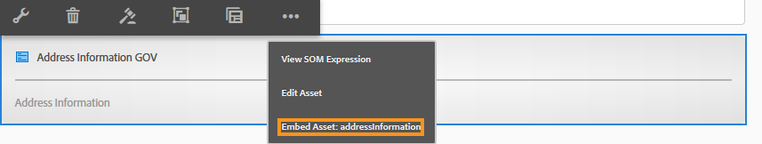

# 最適化表單片段{#adaptive-form-fragments}

雖然每個表單都是為特定目的而設計的，但大多數表單中有一些常見的段落，例如提供姓名和地址、家庭詳細資訊、收入詳細資訊等個人詳細資訊。 每次建立新表單時，都需要表單開發人員建立這些公用段。

自適應Forms提供了一種方便的機制，可僅建立面板或一組欄位等表單段，並跨自適應Forms重用它們。 這些可重用和獨立的段稱為自適應表單片段。

## 建立片段 {#create-a-fragment}

可以從頭建立自適應表單片段，或將現有自適應表單中的面板另存為片段。

### 從頭建立片段 {#create-fragment-from-scratch}

1. 登錄 [!DNL AEM Forms] https://[*主機名*]:[*埠*]/aem/forms.html。
1. 按一下 **「建立」>「自適應表單片段」**。
1. 指定片段的標題、名稱、說明和標籤。

   >[!NOTE]
   >
   >確保為片段指定唯一名稱。 如果已存在同名的另一個片段，則無法建立該片段。

1. 按一下以開啟 **窗體模型** 的 **從中選擇** 下拉菜單中，為片段選擇以下模型之一：

   * **無**:指定從頭建立片段而不使用任何表單模型。
   * **表單模板**:指定使用上載到的XDP模板建立片段 [!DNL AEM Forms]。 選擇適當的XDP模板作為片段的表單模型。

   

   還顯示在所選表單模板中標籤為片段的子表單。 可以從下拉清單中選擇「自適應表單片段」的子表單。

   

   此外，通過在下拉框中為子表單指定SOM表達式，可以使用未在表單模板中標籤為片段的子表單建立自適應表單片段。

   * **XML架構**:指定使用上載到的XML架構建立片段 [!DNL AEM Forms]。 可以上載或從可用的XML架構中選擇作為片段的表單模型。

   

   也可以通過從下拉框中選擇所選架構中存在的complexType來建立自適應表單片段。

   

1. 按一下 **建立** 然後按一下 **開啟** 以編輯模式使用預設模板開啟片段。

在編輯模式下，可以將任何Adaptive Form元件從旁腳拖放AEM到片段上。 <!-- For information about Adaptive Form components, see Introduction to authoring Adaptive Forms. -->

此外，如果選擇XML架構或XDP表單模板作為片段的表單模型，則內容查找器中將顯示一個顯示表單模型層次的新頁籤。 它允許您將表單模型元素拖放到片段上。 添加的表單模型元素將轉換為表單元件，同時保留關聯的XDP或XSD中的原始屬性。

### 將面板另存為片段 {#save-panel-as-a-fragment}

1. 開啟一個包含要另存為自適應表單片段的面板的自適應表單。
1. 在面板工具欄中，按一下 **[!UICONTROL 另存為片段]**。 「另存為片段」(Save As Fragment)對話框開啟。

   >[!NOTE]
   >
   >如果要另存為片段的面板包含子面板，則生成的片段將包含這些子面板。

1. 在「片段建立」對話框中，指定以下資訊：

   * **名稱**:片段的名稱。 預設值是面板的元素名稱。 這是一個強制欄位。
      >[!NOTE]
      >
      >確保為片段指定唯一名稱。 如果已存在同名的另一個片段，則無法建立該片段。

   * **標題**:片段的標題。 預設值是面板的標題。

   * **說明**:片段的說明。

   * **標籤**:標籤片段的元資料。

   * **目標路徑**:保存片段的儲存庫路徑。 如果未指定路徑，則會在包含自適應表單的節點旁邊建立與片段名稱相同的節點。 片段保存在此節點中。

   * **窗體模型**:根據「自適應表單」的表單模型，此欄位顯示 **XML架構**。 **表單模板**&#x200B;或 **無**。 它是不可編輯的欄位。

   * **片段模型根**:僅在基於XSD的自適應Forms中顯示。 它指定片段模型的根。 您可以選擇 **/** 或下拉清單中的XSD複雜類型。 請注意，只有在選擇複雜類型作為片段模型根時，才可在另一個自適應表單中重新使用該片段。
如果您選擇 **/** 作為片段模型根，根中的完整XSD樹在「自適應表單資料模型」頁籤中可見。 對於複雜類型片段模型根，在「自適應表單資料模型」頁籤中，只能看到選定複雜類型的後代。

   * **XSD參考**:僅在基於XSD的自適應Forms中顯示。 它顯示XML架構的位置。

   * **XDP參考**:僅在基於XDP的自適應Forms中顯示。 它顯示XDP表單模板的位置。

   

   「另存為片段」對話框

1. 按一下&#x200B;**「確定」**。

   面板將保存在儲存庫中指定或預設的位置。 在自適應表單中，面板被片段的快照替換。 如下所示，「一般資訊」面板及其子面板「個人資訊和地址」將保存為一個片段。

   要編輯片段，請按一下 **[!UICONTROL 編輯資產]** 的子菜單。 片段將在編輯模式下的新頁籤或窗口中開啟。

   

## 使用碎片 {#working-with-fragments}

### 配置片段外觀 {#configure-fragment-appearance}

您在Adaptive Forms中插入的任何片段都顯示為佔位符影像。 佔位符在片段中最多顯示十個子面板的標題。 您可以配置 [!DNL AEM Forms] 顯示完整片段，而不是佔位符影像。

執行以下步驟以在表單中顯示完整片段：

1. 轉到AEMhttps上的Web控制台配置頁：[*主機*]:[*埠*]/system/console/configMgr。

1. 搜索並按一下 **[!UICONTROL 自適應表單配置服務]** 以編輯模式開啟它。
1. 禁用 **[!UICONTROL 啟用佔位符代替片段]** 複選框可顯示完整片段，而不是佔位符影像。

### 在自適應窗體中插入片段 {#insert-a-fragment-in-an-adaptive-form}

您建立的「自適應表單片段」將出現在內容查找器的「自適應表單片AEM段」頁籤中。 要在自適應表單中插入自適應表單片段：

1. 在編輯模式下開啟要插入自適應表單片段的自適應表單。
1. 按一下 **資產**  欄。 在資產瀏覽器中，選擇 **自適應表單片段** 從下拉清單中。

   您還可以選擇根據表單模型（表單模板、XML架構或基本）顯示所有自適應表單片段或篩選器。

1. 將自適應表單片段拖放到自適應表單上。

   >[!NOTE]
   >
   >未啟用自適應表單片段以在自適應表單內進行創作。 此外，您不能在基於JSON的自適應表單中使用基於XSD的片段，而不能使用相反的方式。

自適應表單片段通過引用插入自適應表單中，並與獨立自適應表單片段同步。 這意味著在更新自適應表單片段時，所有使用片段的自適應Forms中都會反映這些更改。

### 在自適應表單中嵌入片段 {#embed-a-fragment-in-adaptive-form}

通過按一下，可以選擇在自適應表單中嵌入自適應表單片段 **嵌入資產：&lt;*片段名稱*>** 按鈕，將選定控制項在Tab鍵次序中上移一個位置。

>[!NOTE]
>
>嵌入的片段不再與獨立的片段連結。 可以從「自適應表單」中編輯嵌入片段中的元件。

### 在片段內使用片段 {#using-fragments-within-fragments}

可以建立嵌套的自適應表單片段，這意味著可以在另一個片段中拖放一個片段，並且可以具有嵌套的片段結構。

### 更改片段 {#change-fragments}

可以使用 **選擇片段資產** 屬性。

## 用於資料綁定的片段的自動映射 {#auto-mapping-of-fragments-for-data-binding}

使用XFA表單模板或XSD複雜類型建立自適應表單片段並將片段拖放到自適應表單時，XFA片段或XSD複雜類型將自動替換為相應的自適應表單片段，其片段模型根映射到XFA片段或XSD複雜類型。

可以從「編輯」元件對話框更改片段資產及其綁定。

>[!NOTE]
>
>您還可以在內容查找器中從自適應表單片段庫中拖放綁定的自適應表單片段AEM，並從「自適應表單片段」面板的「編輯」元件對話框中提供正確的綁定引用。

## 管理片段 {#manage-fragments}

可以使用 [!DNL AEM Forms] UI。

1. 前往 `https://[hostname]:'port'/aem/forms.html`.

1. 按一下 **選擇** 的 [!DNL AEM Forms] UI工具欄，然後選擇自適應表單片段。 工具欄顯示可對選定的自適應表單片段執行的下列操作。

<table>
 <tbody>
  <tr>
   <td>
<strong>操作</strong>
 </td>
   <td>
<strong>說明</strong>
 </td>
  </tr>
  <tr>
   <td>
開啟
 </td>
   <td>
在編輯模式下開啟選定的自適應表單片段。    
 </td>
  </tr>
  <tr>
   <td>
檢視屬性
 </td>
   <td>
開啟「屬性」面板。 在「屬性」面板中，可以查看和編輯屬性、生成預覽以及上載所選片段的縮略圖。 有關詳細資訊，請參見 <a href="manage-form-metadata.md" target="_blank">管理元資料</a>。    
 </td>
  </tr>
  <tr>
   <td>
複製
 </td>
   <td>
複製所選片段。 「貼上」(Paste)按鈕出現在工具欄中。    
 </td>
  </tr>
  <tr>
   <td>
下載
 </td>
   <td>
下載所選片段。    
 </td>
  </tr>
  <tr>
   <td>
預覽
 </td>
   <td>
通過將XML檔案中的資料與片段合併，提供選項，以HTML或自定義預覽形式預覽片段。 <!-- For more information, see <a href="previewing-forms.md" target="_blank">Previewing a form</a>.    -->
 </td>
  </tr>
  <tr>
   <td>
開始審閱/管理審閱
 </td>
   <td>
允許啟動和管理選定片段的審閱。 <!-- For more information, see <a href="create-reviews-forms.md" target="_blank">Creating and managing reviews</a>.    
 --> </td>
  </tr>
  <tr>
   <td>
建立字典
 </td>
   <td>
生成用於定位所選片段的字典。 <!-- For more information, see <a href="lazy-loading-adaptive-forms.md" target="_blank">Localizing Adaptive Forms</a>.    --> 
 </td>
  </tr>
  <tr>
   <td>
發佈/取消發佈
 </td>
   <td>
發佈/取消發佈所選片段。    
 </td>
  </tr>
  <tr>
   <td>
刪除
 </td>
   <td>
刪除所選片段。    
 </td>
  </tr>
 </tbody>
</table>

## 定位包含片段的自適應表單 {#localizing-adaptive-form-containing-fragments}

要定位包含自適應表單片段的自適應表單，需要分別定位該片段和表單。 其思想是將一個片段定位一次，然後在多個自適應Forms中重用。

>[!NOTE]
>
>片段中的本地化鍵不會出現在「自適應表單」的XLIFF檔案中。

## 處理碎片時要記住的要點 {#key-points-to-remember-when-working-with-fragments}

* 確保片段名稱唯一。 如果存在具有相同名稱的現有片段，則無法建立該片段。
* 在基於XDP的自適應表單中，如果將面板另存為包含另一個XDP片段的片段，則生成的片段將自動綁定到子XDP片段。 如果是基於XSD的自適應表單，則生成的片段將綁定到架構根。
* 建立自適應表單片段時，將建立一個片段節點，該節點類似於CRXDe Lite中自適應表單的guideContainer節點。
* 不支援使用不同表單資料模型的自適應表單中的片段。 例如，基於XSD的自適應表單不支援基於XDP的片段，反之亦然。
* 可通過內容查找器中的「自適應表單片段」頁籤使AEM用自適應表單片段。
* 獨立自適應表單片段中的任何表達式、指令碼或樣式在通過引用插入或嵌入自適應表單時保留。
* 不能編輯通過引用插入的自適應表單片段，該片段來自自適應表單。 要編輯，請編輯獨立的自適應表單片段，或在自適應表單中嵌入該片段。
* 發佈自適應表單時，需要發佈由引用插入的自適應表單片段，該片段是在自適應表單中插入的。
* 當您重新發佈更新的自適應表單片段時，這些更改將反映在使用片段的自適應表單的已發佈實例中。
* 包含Verify元件的Adaptive Form不支援匿名用戶。 此外，不建議在自適應表單片段中使用「驗證」元件。
* (**僅Mac**)要確保表單片段功能在所有方案中都能正常工作，請將以下條目添加到/private/etc/hosts檔案中：
   `127.0.0.1 <Host machine>` **主機**:AppleMac的機器 [!DNL AEM Forms] 已部署。

## 引用片段 {#reference-fragments}

可用於建立表單的引用自適應表單片段。 有關詳細資訊，請參見 [引用片段](reference-adaptive-form-fragments.md)。
