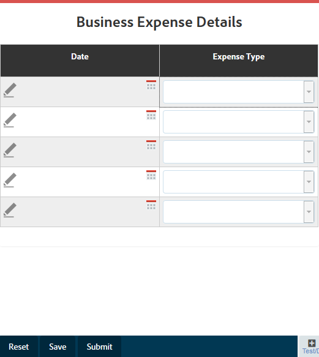

# 調適型表單中的表格 {#tables-in-adaptive-forms}

<span class="preview">Adobe 建議使用新式且可擴充的資料擷取[核心元件](https://experienceleague.adobe.com/docs/experience-manager-core-components/using/adaptive-forms/introduction.html)，用來[建立新的最適化表單](/help/forms/creating-adaptive-form-core-components.md)或[將最適化表單新增到 AEM Sites 頁面](/help/forms/create-or-add-an-adaptive-form-to-aem-sites-page.md)。這些元件代表最適化表單建立方面的重大進步，可確保令人印象深刻的使用者體驗。本文會介紹使用基礎元件編寫最適化表單的舊方法。</span>


| 版本 | 文章連結 |
| -------- | ---------------------------- |
| AEM 6.5 | [按一下這裡](https://experienceleague.adobe.com/docs/experience-manager-65/forms/adaptive-forms-basic-authoring/adaptive-forms-tables.html) |
| AEM as a Cloud Service  | 本文章 |


使用表格是呈現複雜資料的一種有效、簡化且有條理的方式。 它可協助使用者輕鬆識別資訊，並以有序的列和欄排列提供輸入。 金融服務和政府組織的大部分表單都需要大型資料表才能輸入數字和執行計算。

AEM Forms的側邊欄元件瀏覽器中提供表格元件，可讓您以最適化表單建立表格。 其提供的一些主要功能包括：

* 行動裝置上的回應式佈局
* 可設定的列和欄
* 在執行階段動態新增和刪除列
* 合併或合併及分割儲存格
* 可由熒幕助讀程式存取
* 使用CSS的自訂版面
* 與XDP表格元件相容並對應
* 支援使用XSD複雜型別元素來新增列或儲存格
* 從XML檔案合併資料

## 建立表格 {#create-a-table}

若要建立表格，請從最適化表單上sidekick的元件瀏覽器中拖放表格元件。 依預設，表格包含兩欄和三列，包括標題列。


### 關於頁首與內文儲存格 {#about-header-and-body-cells}

標題儲存格為文字欄位。 若要變更標頭的標籤，請在標頭儲存格上按一下滑鼠右鍵，然後按一下&#x200B;**編輯**。 在[編輯]對話方塊中，更新&#x200B;**值**&#x200B;欄位中的標籤，然後按一下&#x200B;**確定**。

依預設，內文儲存格為文字方塊。 您可以使用Sidekick中提供的任何其他最適化表單元件來取代內文儲存格，例如數值方塊、日期選擇器或下拉式清單。

例如，下表中的第一個內文列包含文字方塊、日期選擇器和下拉式清單元件，作為儲存格。


您可以合併兩個或多個內文儲存格，方法是選取要合併的儲存格，按一下滑鼠右鍵，然後選取&#x200B;**合併**。 您也可以用滑鼠右鍵按一下合併的儲存格並選取&#x200B;**分割儲存格**，以分割該儲存格。

### 新增、刪除、移動列和欄 {#add-delete-move-rows-and-columns}

您可以新增和刪除列或欄，以及在表格中上下移動列。

#### 新增、刪除或移動列

若要新增、刪除或移動列，請按一下列的任一儲存格。 開啟內容瀏覽器並選取對應的列，它會以工具列選項反白選取的列，您可以在此增加、刪除或上下移動列。

* **[!UICONTROL 上移]**&#x200B;和&#x200B;**[!UICONTROL 下移]**&#x200B;作業會上下移動選取的列。

* **[!UICONTROL 新增資料行]**&#x200B;作業會在選取的資料列下方新增一列。

* **[!UICONTROL 刪除資料行]**&#x200B;作業會刪除選取的資料列。


按兩下該列以設定列的屬性，例如「名稱」、「繫結參考」、「重複設定」、「CSS類別」。


#### 新增或刪除欄

若要新增或刪除欄，請按一下標題區段中的文字儲存格，工具列隨即開啟，其中包含新增或刪除欄的選項：


>[!NOTE]
>
>雖然您可以在表格中新增任何列數，但可新增的欄數上限為六。 此外，您無法從表格中刪除標題列。

### 新增表格說明 {#add-table-description}

您可以新增表格的說明，以說明資訊的組織方式，讓熒幕朗讀程式可以解譯和閱讀。 若要新增說明：

1. 選取資料表並選取，以在側欄中檢視其屬性。
1. 在「協助工具」標籤中指定摘要。
1. 按一下&#x200B;**「完成」**。

### 排序表格中的欄 {#sortcolumnstable}

您可以根據最適化表單中表格中的任何欄來排序資料。 欄中的值可以遞增或遞減順序排序。

排序可套用至包含下列專案的表格欄：

* 靜態文字
* 資料模型物件屬性
* 靜態文字和資料模型物件屬性的組合

若要在表格欄上套用排序，表格欄儲存格必須包含下列任何元件：數值方塊、數值步進器、日期輸入欄位、日期選擇器、文字或文字方塊。

若要啟用排序：

1. 選取表格並選取 （設定）。 您也可以在互動式通訊的Sidekick中使用&#x200B;**Content**&#x200B;瀏覽器來選取資料表。
1. 選取&#x200B;**啟用排序**。
1. 選取以儲存表格屬性。 欄標題中的排序圖示（向上和向下箭頭）表示已啟用排序。

   

1. 切換至&#x200B;**預覽**&#x200B;模式以檢視輸出。 表格會根據表格的第一個欄自動排序。
1. 按一下欄標題，根據欄排序值。

   具有向上箭頭的欄標題表示表格是根據該欄排序。 此外，欄中的值會以遞增順序顯示。

   

   同樣地，具有向下箭頭的欄標題表示欄中的值以降序顯示。

   您也可以在&#x200B;**預覽**&#x200B;模式的表格中進行變更，然後再次按一下欄標題來排序欄值。

## 設定表格的欄寬 {#set-column-width}

執行以下步驟來設定表格的欄寬：

1. 在&#x200B;**[!UICONTROL Content]**&#x200B;索引標籤中，選取&#x200B;**[!UICONTROL Table]**&#x200B;元件並選取[設定] （）圖示。

1.在&#x200B;**[!UICONTROL 欄寬]**&#x200B;欄位中輸入逗號分隔值清單，以指定表格中每一欄的按比例寬度。 例如，如果表格包含3個資料行，在&#x200B;**[!UICONTROL 資料行寬度]**&#x200B;欄位中指定2,4，6為值會導致將資料行的寬度設定為第一資料行的2/12、第二資料行的4/12和第三資料行的6/12。 2/12，因為第一欄的寬度是表格寬度的六分之一。 同樣地，「4/12」將第二個欄寬設為表格寬度的三分之一，而「6/12」將第三個欄寬設為表格寬度的一半。

## 設定表格樣式 {#configure}

您可以使用頁面工具列中的「樣式」模式來定義表格的樣式。 執行以下步驟以切換到樣式模式並編輯表格樣式

1. 在頁面工具列中，在[預覽]之前，選取 > **樣式**。

1. 在側邊欄中，選取表格並選取編輯按鈕。
您可以在側邊欄中看到樣式屬性。


>[!NOTE]
>
>您可以變更[LESS變數](https://lesscss.org//)的值，以變更標題與本文列的顏色主題。 如需詳細資訊，請參閱AEM Forms中的[主題](/help/forms/themes.md)。

## 動態新增或刪除列 {#add-or-delete-a-row-dynamically}

表格提供立即可用的支援，可在執行階段動態新增或刪除列。

1. 選取表格列，然後選取。
1. 在重複設定索引標籤中，指定最小和最大計數以限制表格中的列數。
1. 按一下&#x200B;**「完成」**。

在執行階段或預覽時，您會看到&#x200B;**+**&#x200B;和按鈕，用以新增或刪除列。


>[!NOTE]
>
>表格的左側行動版面配置中的標題不支援動態新增或刪除列。

## 表格中的運算式 {#expressions-in-a-table}

調適型表單中的表格可讓您在JavaScript中撰寫運算式，以誘導行為，例如顯示或隱藏表格或列、加總所有數字並在儲存格中顯示總計、啟用或停用儲存格、驗證使用者輸入等。 這些運算式使用適用性表單指令碼模型API。

雖然表格和列僅支援可見性運算式，以根據運算式傳回的值控制其可見性，但儲存格支援下列運算式：

* **初始化指令碼：**&#x200B;以在欄位初始化時執行動作。
* **值認可指令碼：**&#x200B;以在欄位值變更後變更表單元件。

>[!NOTE]
>
>如果XFA變更/退出指令碼也套用至相同欄位，則XFA變更/退出指令碼會在值認可指令碼之前執行。

* **計算運算式**：自動計算欄位的值。
* **驗證運算式**：驗證欄位。
* **存取運算式**：啟用/停用欄位。
* **可見性運算式**：控制欄位和面板的可見性。

表格或列的可見度運算式可以在它們對應的「編輯」元件對話方塊的「面板屬性」標籤中定義。 儲存格的運算式可在其「編輯」元件對話方塊的「指令碼」標籤中定義。

如需最適化表單類別、事件、物件和公用API的完整清單，請參閱[最適化表單的JavaScript資料庫API參考](https://helpx.adobe.com/experience-manager/6-5/forms/javascript-api/index.html)。

## 行動版面配置 {#mobile-layouts}

調適型表單中的表格因流動且回應式版面配置而提供無與倫比的體驗行動裝置。 AEM Forms提供兩種型別的表格行動佈局 — 左側標題和可摺疊欄。

您可以從表格的「編輯元件」對話方塊的「樣式」標籤設定表格的行動佈局。

### 標題在左側 {#headers-on-left}

在左側版面配置的Headers中，表格中的標題在左側調換，只有一個儲存格出現於標題。 此版面配置中的每一列都會顯示為不同的區段。 下列影像將桌上型電腦的表格與行動裝置上的表格進行比較。


標題在左側版面配置之表格的案頭檢視


頁首在左側版面配置的表格的行動裝置檢視

### 可摺疊欄配置 {#collapsible-columns-layout}

在「可收合」欄配置中，表格中的欄會根據裝置大小收合以顯示一或兩欄，而其他欄則會收合。 您可以按一下摺疊/展開圖示來檢視表格中的其他欄。

>[!NOTE]
>
>雖然可摺疊欄的版面配置已針對行動裝置進行最佳化，如果可用的寬度不足以顯示表格中的所有欄，案頭版面配置也會正常運作。

下列影像會比較表格在含有摺疊與展開欄的裝置上的外觀。



在行動裝置上只顯示兩欄的表格摺疊欄


行動裝置上表格的展開欄

## 合併表格中的資料 {#merge-data-in-a-table}

適用性表單中的表格可讓您在執行階段使用XML檔案的資料填入表格。 資料XML檔案可位於AEM Forms伺服器執行所在電腦的本機檔案系統中，或位於CRX存放庫中。

以下列銀行交易摘要表為例，我們要以XML檔案中的資料填入。


在此範例中，下列專案的Element name屬性：

* 資料列為&#x200B;**Row1**
* 交易日期下的內文儲存格為&#x200B;**tableItem1**
* 說明下的內文儲存格為&#x200B;**tableItem2**
* 交易型別下的內文儲存格是&#x200B;**型別**
* 在「USD金額」底下的內文儲存格為&#x200B;**tableItem3**

包含下列格式之資料的XML檔案：

```xml
<?xml version="1.0" encoding="UTF-8"?><afData>
  <afUnboundData>
    <data>
 <typeSelect>0</typeSelect>
 <Row1>
      <tableItem1>2015-01-08</tableItem1>
      <tableItem2>Purchase laptop</tableItem2>
      <type>0</type>
      <tableItem3>12000</tableItem3>
 </Row1>
 <Row1>
      <tableItem1>2015-01-05</tableItem1>
      <tableItem2>Transport expense</tableItem2>
      <type>0</type>
      <tableItem3>120</tableItem3>
 </Row1>
 <Row1>
      <tableItem1>2014-01-08</tableItem1>
      <tableItem2>Laser printer</tableItem2>
      <type>0</type>
      <tableItem3>500</tableItem3>
 </Row1>
 <Row1>
      <tableItem1>2014-12-08</tableItem1>
      <tableItem2>Credit card payment</tableItem2>
      <type>0</type>
      <tableItem3>300</tableItem3>
 </Row1>
 <Row1>
      <tableItem1>2015-01-06</tableItem1>
      <tableItem2>Interest earnings</tableItem2>
      <type>1</type>
      <tableItem3>12000</tableItem3>
 </Row1>
 <Row1>
      <tableItem1>2015-01-05</tableItem1>
      <tableItem2>Payment from a client</tableItem2>
      <type>1</type>
      <tableItem3>500</tableItem3>
 </Row1>
 <Row1>
      <tableItem1>2015-01-08</tableItem1>
      <tableItem2>Food expense</tableItem2>
      <type>0</type>
      <tableItem3>120</tableItem3>
 </Row1>
 </data>
  </afUnboundData>
  <afBoundData>
    <data/>
  </afBoundData>
  <afBoundData/>
</afData>
```

在範例XML中，資料列的資料由`<Row1>`標籤定義，這是資料表中資料列的元素名稱。 在`<Row1>`標籤內，每個儲存格的資料都定義在其元素名稱（例如`<tableItem1>`、`<tableItem2>`、`<tableItem3>`和`<type>`）的標籤內。

若要在執行階段將此資料與表格合併，我們需要將包含表格的調適型表單指向停用wcmmode的絕對XML位置。 例如，如果最適化表單位於&#x200B;*https://localhost:4502/myForms/bankTransaction.html*，而資料XML檔案儲存在&#x200B;*C：/myTransactions/bankSummary.xml*，您可以在下列URL檢視含有資料的表格：

*https://localhost:4502/myForms/bankTransaction.html?dataRef=file:/// C：/myTransactions/bankSummary.xml&amp;wcmmode=disabled*


## 使用XDP元件和XSD複雜型別 {#use-xdp-components-and-xsd-complex-types}

如果您根據XFA表單範本建立最適化表單，則AEM內容尋找器的「資料模型」標籤中會提供XFA元素。 您可以在最適化表單中拖放這些XFA元素，包括表格。

XFA表格元素對應至表格元件，可立即用於調適型表單。 XDP表格的所有屬性和功能在移入最適化表格時都會保留，而且您可以在其上執行任何操作，就像處理原生最適化表格一樣。 例如，如果XDP表格中的列標示為可重複，則在調適型表單中捨棄該列時也會重複。

此外，您可以拖放XDP子表單以在表格中新增列。 不過，請注意，捨棄巢狀子表單無法運作。

>[!NOTE]
>
>沒有標題列的XDP表格將不會對應至最適化表單表格元件。 相反地，它會對應至具有流動版面的最適化表單面板元件。 此外，當您從XDP新增巢狀表格至調適型表單時，外部表格會轉換為面板，同時保留內部表格。

此外，您可以拖放一組XSD複雜型別元素來建立表格列。 系統會在您捨棄元素的列正下方建立新的一列。 使用XSD複雜型別元素建立的儲存格會保留XSD的繫結參照。 您也可以將元素拖放到儲存格上，以XSD複雜型別元素來取代主體儲存格。

>[!NOTE]
>
>XDP表格元件、子表單或XSD複雜型別中的元素數量不能超過一列中的儲存格數量。 例如，您無法將四個元素拖放到只有三個儲存格的列。 這會導致錯誤。
>
>如果元素數小於一列中的儲存格數，則新列會先根據元素新增儲存格，然後新增預設儲存格以填入列中的其餘儲存格。 例如，如果您將一組三個元素拖放至包含四個儲存格的列，則前三個儲存格會根據您拖放的元素，而剩餘的一個儲存格為預設的表格儲存格。

## 主要考量事項 {#key-considerations}

* 如果您在編寫XSD型表格時上下行動資料列，提交表單時產生的資料XML中會顯示表格資料列的某些資料遺失。
* 預設表格中的每個內文儲存格都有與其關聯的預先定義元素名稱。 如果您以最適化表單新增另一個表格，則新表格中的預設內文儲存格將與第一個表格中的元素名稱相同。 在這種情況下，提交表單時產生的資料將僅在一個表格的預設內文儲存格中包含資料。 因此，請務必重新命名預設內文儲存格的元素名稱，以使其在表格中保持唯一，並避免資料遺失。

  僅適用於預設的內文儲存格。 如果您將更多列或欄新增至表格，將會自動為非預設內文儲存格產生唯一的元素名稱。

## 另請參閱 {#see-also}

{{see-also}}

