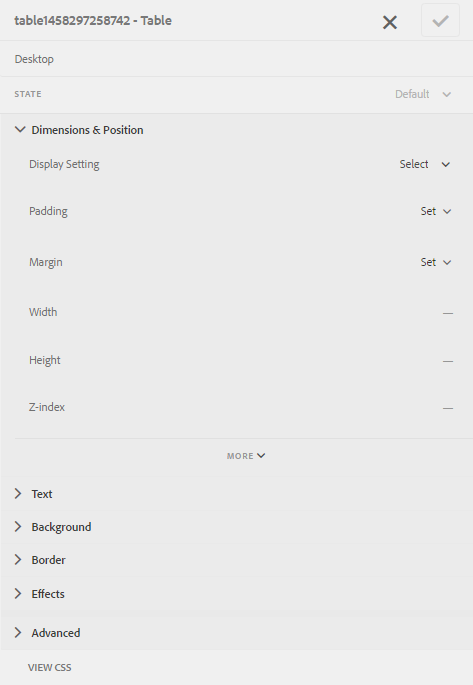

# 自適應窗體中的表 {#tables-in-adaptive-forms}

使用表是一種有效、簡化、有組織的表示複雜資料的方法。 它幫助用戶容易地識別資訊並以有序排列的行和列提供輸入。 金融服務和政府組織的大多數表格都要求使用大資料表來編製數字並執行計算。

AEM Forms在提要欄中的元件瀏覽器中提供「表」元件，允許您在自適應表單中建立表。 它提供的一些關鍵功能包括：

* 移動設備上的響應佈局
* 可配置的行和列
* 運行時動態添加和刪除行
* 合併或合併和拆分單元格
* 可由螢幕閱讀器訪問
* 使用CSS的自定義佈局
* 與XDP表元件相容並映射
* 支援使用XSD複雜類型元素添加行或單元格
* 從XML檔案合併資料

## 建立表 {#create-a-table}

要建立表，請在自適應窗體的旁鍵中從元件瀏覽器拖放表元件。 預設情況下，表包含兩列和三行，包括標題行。


### 關於標題和正文單元格 {#about-header-and-body-cells}

標題單元格是文本欄位。 要更改標題的標籤，請按一下右鍵標題單元格，然後按一下 **編輯**。 在「編輯」對話框中，更新 **值** 按一下 **確定**。

主體單元格預設為文本框。 可以使用旁鍵中可用的任何其他自適應表單元件（如數字框、日期選取器或下拉清單）替換正文單元格。

例如，下表中的第一個正文行包括文本框、日期選取器和下拉清單元件作為單元格。


通過選擇要合併的單元格，按一下右鍵並選擇，可以合併兩個或多個主體單元格 **合併**。 此外，還可以通過按一下右鍵合併的單元格並選擇 **拆分單元格**。

### 添加、刪除、移動行和列 {#add-delete-move-rows-and-columns}

可以添加和刪除行或列，並在表中上下移動行。

#### 添加、刪除或移動行

要添加、刪除或移動行，請按一下行的任何單元格。 開啟內容瀏覽器  並選擇相應行，它將使用工具欄選項加亮所選行，您可以從中向上或向下添加、刪除或移動該行。

* 的 **[!UICONTROL 上移]** 和 **[!UICONTROL 下移]** 操作將選定行上下移動。

* 的 **[!UICONTROL 添加列]** 操作將在選定行的下方添加一行。

* 的 **[!UICONTROL 刪除列]** 操作刪除選定的行。


按兩下該行以配置行的屬性，如「名稱」、「綁定引用」、「重複設定」和「CSS類」。


#### 添加或刪除列

要添加或刪除列，請按一下標題節中的文本單元格，將開啟一個工具欄，其中包含添加或刪除列的選項：


>[!NOTE]
>
>雖然可以在表中添加任意數目的行，但可添加的列數最大為6。 此外，不能從表中刪除標題行。

### 添加表說明 {#add-table-description}

您可以添加表的說明，以解釋螢幕閱讀器如何解釋和讀出資訊。 要添加說明，請執行以下操作：

1. 選擇表並點擊  查看其屬性。
1. 在「輔助功能」頁籤中指定摘要。
1. 按一下 **完成**。

### 對表中的列排序 {#sortcolumnstable}

您可以根據表格中的任意列以自適應格式對資料進行排序。 列中的值可以按升序或降序排序。

可以對包含以下內容的表列應用排序：

* 靜態文本
* 資料模型對象屬性
* 靜態文本和資料模型對象屬性的組合

要對表列應用排序，表列單元格必須包含以下任何元件：數字框、數字步進器、日期輸入欄位、日期選取器、文本或文本框。

要啟用排序，請執行以下操作：

1. 選擇表並點擊  （配置）。 也可以使用 **內容** 瀏覽器。
1. 選擇 **啟用排序**。
1. 點擊  的子菜單。 列標題中的排序表徵圖（上箭頭和下箭頭）表示已啟用排序。

   

1. 切換到 **預覽** 的子菜單。 表將根據表的第一列自動排序。
1. 按一下列標題可根據列對值進行排序。

   帶上箭頭的列標題表示表是根據該列排序的。 此外，列中的值按升序顯示。

   

   同樣，帶有向下箭頭的列標題表示列中的值按降序顯示。

   也可在 **預覽** 模式，然後再次按一下列標題以對列值進行排序。

## 設定表的列寬 {#set-column-width}

執行以下步驟來設定表的列寬：

1. 在 **[!UICONTROL 內容]** 頁籤 **[!UICONTROL 表格]** 元件並點擊配置(表徵圖。

1.在中輸入以逗號分隔的值清單 **[!UICONTROL 列寬]** 欄位以指定表中每列的相應寬度。 例如，對於包含3列的表，將2,4,6指定為 **[!UICONTROL 列寬]** 欄位將列寬設定為第一列的2/12，第二列的4/12，第三列的6/12。 2/12：第一列的寬度是表寬的六分之一。 同樣，4/12將第二列寬設定為表寬的三分之一，6/12將第三列寬設定為表寬的一半。

## 配置表樣式 {#configure}

可使用頁面工具欄中的「樣式」模式來定義表的樣式。 執行以下步驟以切換到樣式模式並編輯表樣式

1. 在頁面工具欄中，在「預覽」之前，點擊  > **樣式**。

1. 在提要欄中，選擇表並點擊編輯按鈕 。
您可以在邊欄中看到樣式屬性。



>[!NOTE]
>
>可以通過更改標題行和正文行的值來更改顏色主題 [LESS變數](https://lesscss.org//)。 有關詳細資訊，請參見 [AEM Forms主題](/help/forms/themes.md)。

## 動態添加或刪除行 {#add-or-delete-a-row-dynamically}

表為在運行時動態添加或刪除行提供了現成的支援。

1. 選擇表行並點擊 。
1. 在「重複設定」頁籤中，指定最小和最大計數以限制表中的行數。
1. 按一下 **完成**。

在運行時或預覽時，您將看到 **+** 和  按鈕添加或刪除行。


>[!NOTE]
>
>左移動表佈局的標題不支援動態添加或刪除行。

## 表中的表達式 {#expressions-in-a-table}

自適應表單中的表允許您在JavaScript中編寫表達式來誘導行為，如顯示或隱藏表或行、將所有數字加總並在單元格中顯示總數、啟用或禁用單元格、驗證用戶輸入等。 這些表達式使用自適應表單指令碼模型API。

雖然表和行僅支援可視性表達式，以便根據表達式返回的值控制其可見性，但單元格支援以下表達式：

* **初始化指令碼：** 執行欄位初始化操作。
* **值提交指令碼：** 的子菜單。

>[!NOTE]
>
>如果XFA更改/退出指令碼也應用到同一欄位，則XFA更改/退出指令碼在「值提交」指令碼之前執行。

* **計算表達式**:值。
* **驗證表達式**:來驗證欄位。
* **訪問表達式**:啟用/禁用欄位。
* **可見性表達式**:控制欄位和面板的可見性。

表或行的可見性表達式可在其相應的「編輯」元件對話框的「面板屬性」頁籤中定義。 單元格的表達式可以在其「編輯」元件對話框的「指令碼」頁籤中定義。

有關自適應表單類、事件、對象和公共API的完整清單，請參見 [用於自適應表單的JavaScript庫API參考](https://helpx.adobe.com/experience-manager/6-5/forms/javascript-api/index.html)。

## 移動佈局 {#mobile-layouts}

自適應形式的表格因其流暢和響應性佈局而提供了無與倫比的體驗移動設備。 AEM Forms為表格提供兩種類型的移動佈局 — 左側的標題和可折疊的列。

可以從表的「編輯」元件對話框的「樣式」頁籤中為表配置移動佈局。

### 左側的標題 {#headers-on-left}

在左側佈局的「標題」中，表格中的標題在左側換位，只有一個單元格出現在標題上。 此佈局中的每一行都顯示為不同的節。 以下影像將案頭上的表與移動設備上的表進行比較。


左佈局上帶有標題的表的案頭視圖


左佈局上帶有標題的表的移動視圖

### 可折疊列佈局 {#collapsible-columns-layout}

在「可折疊」列佈局中，表中的列會折疊以顯示一列或兩列，具體取決於設備大小，而其他列則會折疊。 可按一下折疊/展開表徵圖以查看表格中的其他列。

>[!NOTE]
>
>雖然可折疊列佈局已針對移動設備進行優化，但如果可用寬度不足以顯示表中的所有列，則它也將在案頭上工作。

以下影像比較表在具有折疊和展開列的設備上的外觀。


在移動設備上只顯示兩列的表的折疊列


移動設備上表的擴展列

## 合併表中的資料 {#merge-data-in-a-table}

自適應表單中的表允許您在運行時使用XML檔案中的資料填充表。 資料XML檔案可以駐留在運行AEM Forms伺服器的電腦的本地檔案系統中，也可以駐留在CRX儲存庫中。

讓我們舉一個示例，我們要用XML檔案中的資料填充以下銀行交易記錄匯總表。


在此示例中，為：

* 行 **行1**
* 交易記錄日期下的正文單元格為 **表項1**
* 說明下的body單元格為 **表項2**
* 「事務類型」下的正文單元格為 **類型**
* USD中Amounts下的body單元格為 **表項3**

包含以下格式的資料的XML檔案：

```xml
<?xml version="1.0" encoding="UTF-8"?><afData>
  <afUnboundData>
    <data>
 <typeSelect>0</typeSelect>
 <Row1>
      <tableItem1>2015-01-08</tableItem1>
      <tableItem2>Purchase laptop</tableItem2>
      <type>0</type>
      <tableItem3>12000</tableItem3>
 </Row1>
 <Row1>
      <tableItem1>2015-01-05</tableItem1>
      <tableItem2>Transport expense</tableItem2>
      <type>0</type>
      <tableItem3>120</tableItem3>
 </Row1>
 <Row1>
      <tableItem1>2014-01-08</tableItem1>
      <tableItem2>Laser printer</tableItem2>
      <type>0</type>
      <tableItem3>500</tableItem3>
 </Row1>
 <Row1>
      <tableItem1>2014-12-08</tableItem1>
      <tableItem2>Credit card payment</tableItem2>
      <type>0</type>
      <tableItem3>300</tableItem3>
 </Row1>
 <Row1>
      <tableItem1>2015-01-06</tableItem1>
      <tableItem2>Interest earnings</tableItem2>
      <type>1</type>
      <tableItem3>12000</tableItem3>
 </Row1>
 <Row1>
      <tableItem1>2015-01-05</tableItem1>
      <tableItem2>Payment from a client</tableItem2>
      <type>1</type>
      <tableItem3>500</tableItem3>
 </Row1>
 <Row1>
      <tableItem1>2015-01-08</tableItem1>
      <tableItem2>Food expense</tableItem2>
      <type>0</type>
      <tableItem3>120</tableItem3>
 </Row1>
 </data>
  </afUnboundData>
  <afBoundData>
    <data/>
  </afBoundData>
  <afBoundData/>
</afData>
```

在示例XML中，行的資料由 `<Row1>` 標籤，即表中行的元素名稱。 在 `<Row1>` 標籤，每個單元格的資料在標籤中為其元素名稱定義，如 `<tableItem1>`。 `<tableItem2>`。 `<tableItem3>`, `<type>`。

要在運行時將此資料與表合併，我們需要將包含該表的自適應表單指向禁用wcmmode的絕對XML位置。 例如，如果自適應窗體位於 *https://localhost:4502/myForms/bankTransaction.html* 資料XML檔案保存於 *C:/myTransactions/bankSummary.xml*，可以通過以下URL查看包含資料的表：

*https://localhost:4502/myForms/bankTransaction.html?dataRef=file:/// C:/myTransactions/bankSummary.xml&amp;wcmmode=disabled*


## 使用XDP元件和XSD複雜類型 {#use-xdp-components-and-xsd-complex-types}

如果基於XFA表單模板建立了自適應表單，則XFA元素可在Content Finder的「資料模型」選項AEM卡中使用。 可以以自適應形式拖放這些XFA元素，包括表。

XFA表元素被映射到表元件，並以自適應形式現成。 XDP表的所有屬性和功能在移動到自適應表單時都會保留，並且您可以像使用本機自適應表單表一樣對其執行任何操作。 例如，如果XDP表中的行被標籤為可重複，則在以自適應形式刪除時也會重複該行。

此外，還可以拖放XDP子窗體，以在表中添加新行。 但是，請注意，刪除嵌套子表單不起作用。

>[!NOTE]
>
>沒有標題行的XDP表將不會映射到自適應表單表元件。 相反，它將映射到具有流體佈局的自適應表單面板元件。 此外，當將嵌套表從XDP添加到自適應表單時，外表將在保留內表的同時轉換為面板。

此外，還可以拖放一組XSD複雜類型元素以建立表行。 將在刪除元素的行的正下方建立新行。 使用XSD複雜類型元素建立的單元格維護對XSD的綁定引用。 也可以通過將元素拖放到單元格中，用XSD複雜類型元素替換正文單元格。

>[!NOTE]
>
>XDP表元件、子窗體或XSD複雜類型中的元素數不能超過行中的單元格數。 例如，不能將四個元素放在只有三個單元格的行上。 將導致錯誤。
>
>如果元素數小於行中單元格數，則新行首先根據元素添加單元格，然後添加預設單元格以填充行中剩餘的單元格。 例如，如果將一組由三個元素組成的元素放在一個包含四個單元格的行中，則前三個單元格基於您刪除的元素，其餘一個單元格將是預設的表單元格。

## 主要注意事項 {#key-considerations}

* 如果您在創作基於XSD的表時上下移動行，則在提交表單時生成的資料XML中會看到表行中的一些資料丟失。
* 預設表中的每個正文單元格都具有與其關聯的預定義元素名稱。 如果在自適應表單中添加另一個表，則新表中的預設主體單元格將與第一個表中的元素名稱相同。 在這種情況下，提交表單時生成的資料將只包括其中一個表的預設正文單元格中的資料。 因此，請確保更名預設主體單元格的元素名稱，使其在表中保持唯一，並避免資料丟失。

   請注意，這僅適用於預設主體單元格。 如果向表中添加更多行或列，將自動為非預設主體單元格生成唯一元素名稱。
