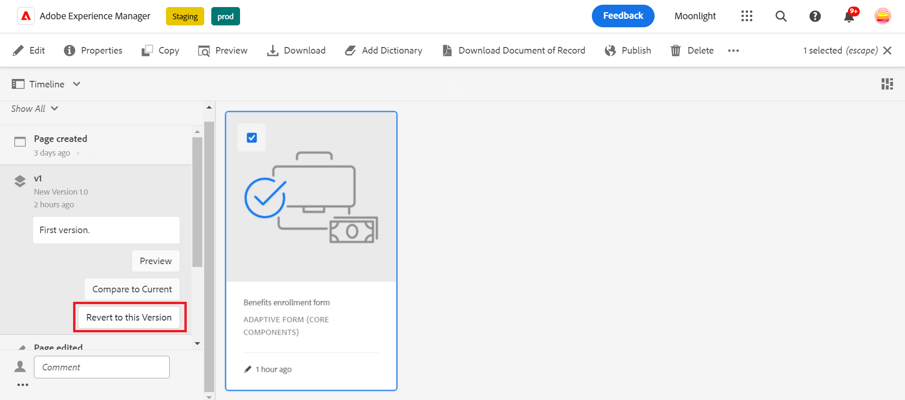

# 最適化表單的版本設定、稽核和註解

<!--Before you can use versionings, comments, and annotations in an Adaptive Form, you must ensure you have [enabled Adaptive Form Core Components](
https://experienceleague.adobe.com/zh-hant/docs/experience-manager-cloud-service/content/forms/setup-configure-migrate/enable-adaptive-forms-core-components).-->

<!--Adaptive Form Core Components facilitates to add versionings, comments, and annotations to a form. These features helps form authors and users to enhance the form development process where they can create multiple versions of a form, collaborate and add their comments to a form, and add annotations to form components.-->

最適化表單核心元件提供的功能可讓表單作者將版本設定、註解及註解整合至表單中。 這些功能可讓使用者建立和管理表單的多個版本、透過註釋參與合作討論，以及將註解附加至特定表單元件，藉此簡化表單開發流程，進而增強整體表單建立體驗。

## 最適化表單版本設定 {#adaptive-form-versioning}

最適化表單版本設定有助於將版本新增至表單。 表單作者可輕鬆建立多個版本的表單，最後再使用適合業務目標的版本。 此外，表單使用者也可以將表單還原成先前的版本。 它也會協助作者透過預覽來比較表單的任意兩個版本，讓他們更能從UI角度分析表單。 以下逐一介紹各項最適化表單版本設定功能：

### 建立表單版本 {#create-a-form-version}

若要建立版本的表單，請遵循下列步驟：

1. 建立表單或使用現有表單。
1. 在AEM UI上，導覽至&#x200B;**[!UICONTROL 表單]**>**[!UICONTROL Forms與檔案]**，然後選取您的&#x200B;**表單**。
1. 在左側面板上的選取下拉式清單中，選取&#x200B;**[!UICONTROL 版本]**。
   
1. 按一下左下方面板上的&#x200B;**三個點**，然後按一下&#x200B;**[!UICONTROL [另存為版本]]**。
1. 現在，為表單版本提供標籤，而您可以透過註解提供表單的相關資訊。
   

### 更新表單版本 {#update-a-form-version}

編輯和更新最適化表單時，您會將新版本新增至表單。 請依照上一節提供的步驟，為表單命名新版本，如影像所示：

### 還原表單版本 {#revert-a-form-version}

若要將表單版本還原成上一個版本，請選取表單版本，按一下&#x200B;**[!UICONTROL 還原成這個版本]**。

### 比較表單版本 {#compare-form-versions}

表單作者可比較兩個不同的表單版本，以供預覽。 若要比較版本，請選取任一表單版本，然後按一下[與目前版本比較]。**&#x200B;** 它會在預覽模式中顯示兩個不同的表單版本。

## 新增註解 {#add-comments}

稽核是一種機制，可讓一或多個稽核者在表單上加上註解。 任何表單使用者都可以評論表單或透過評論來檢閱表單。 若要在表單上加上註解，請選取&#x200B;**[!UICONTROL 表單]**，然後新增&#x200B;**[!UICONTROL 註解]**&#x200B;至表單。

>[!NOTE]
> 如上所述，當您在調適型表單核心元件中使用註解時，表單功能[建立及管理表單](/help/forms/create-reviews-forms.md)的稽核功能會停用。

## 新增註解 {#adaptive-form-annotations}

在許多情況下，表單群組使用者需要新增註解至表單以供檢閱，例如在表單的特定標籤上或表單的元件上。 在這種情況下，作者可以使用註解。 若要將註解新增至表單，請執行下列步驟：

1. 以&#x200B;**[!UICONTROL 編輯]**&#x200B;模式開啟表單。

1. 按一下位於右上邊欄的&#x200B;**新增圖示** （如影像所示）。
   

1. 按一下位於左上邊欄的&#x200B;**新增圖示** （如影像所指定）以新增註解。
   

1. 現在，您可以新增註解，用多種顏色繪製草圖以形成元件。

1. 若要檢視您在表單中新增的所有註解，請選取您的表單，然後您會看到在左側面板上新增的註解，如影像所示。

   

## 另請參閱 {#see-also}

{{see-also}}
