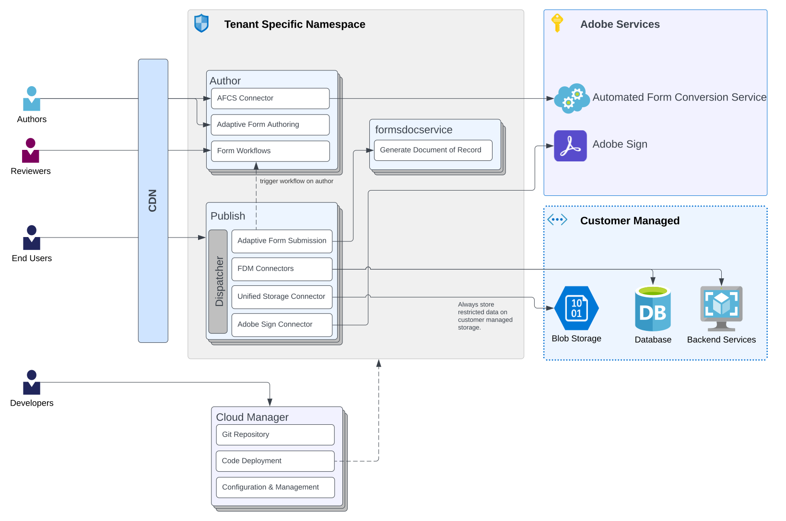

# [!DNL AEM] Formsas a Cloud Service架構 {#architecture}

[!DNL Adobe Experience Manager Forms] as a Cloud Service是雲端原生解決方案，供企業建立、管理、發佈和更新複雜的數位表單和通訊，同時將提交的資料與後端流程、業務規則整合，並將資料儲存在外部資料存放區。 它延伸 [!DNL Adobe Experience Manager as a Cloud Service]. 要進一步了解擴展、部署、環境和其他基礎架構，請參閱 [A.B.C. [!DNL Adobe Experience Manager as a Cloud Service]](https://experienceleague.adobe.com/docs/experience-manager-cloud-service/core-concepts/architecture.html).

AEM Formsas a Cloud Service支援兩種主要使用案例：數位註冊和客戶通訊。 下圖說明兩種使用案例的架構。

## Forms數位註冊

## Forms通訊

## 元件

Formsas a Cloud Service包含多個元件：

### CDN（內容傳遞網路）

每個AEM Formsas a Cloud Service計畫都可 [內建CDN服務](https://experienceleague.adobe.com/docs/experience-manager-cloud-service/content/implementing/content-delivery/cdn.html). 隨附於Forms的Cloud Services授權中。

### 作者

Author是在標準Author執行模式中執行的AEM Formsas a Cloud Service例項。 此範本適用於內部使用者、表單設計人員和開發人員。 製作環境可啟用下列功能：

* 製作和管理表單。
* 連線至Automated forms conversion服務，將PDF或XDP表單轉換為最適化表單。
* 建立並執行以Forms為中心的工作流程。
* 管理最適化表單資產。
* 管理通訊資產。
* 同步RESTful API（即時API）和批次API，以建立、組合及提供面向品牌的個人化通訊。
* 同步API來合併、重新排列及驗證PDF檔案。

### 發佈

Publish例項是在標準Publish執行模式中執行的AEM Formsas a Cloud Service。 發佈例項的用途為表單式應用程式的一般使用者，例如存取公開網站和提交表單的使用者。 可啟用下列功能：

* 為使用者轉譯和提交表單。
* 傳輸原始提交的表單資料，以便進一步處理和儲存在最終記錄系統中。
* 連接到客戶管理儲存以儲存資料。
* 與Adobe Sign連線，以電子簽署最適化表單提交記錄。
* 同步API以建立、組合及提供以品牌為導向的個人化通訊。
* 同步API以合併、重新排列及驗證PDF檔案。

AEMas a Cloud Service上無法使用「反向復寫」來將內容/資料從發佈服務傳送至製作服務。 不過，您可以設定在發佈上執行的適用性Forms，以將資料提交至作者的工作流程（工作流程只能在作者上執行）。 這在核准使用案例中很有幫助。

#### Dispatcher

[Dispatcher](https://experienceleague.adobe.com/docs/experience-manager-cloud-service/content/implementing/content-delivery/disp-overview.html) 是Adobe Experience Manager的快取和/或負載平衡工具，可與企業級Web伺服器搭配使用。

### Adobe Services

**automated forms conversion服務**

[automated forms conversion服務](https://experienceleague.adobe.com/docs/aem-forms-automated-conversion-service/using/introduction.html) 自動將PDF和XFA表單轉換為適合裝置、回應式且以HTML5為基礎的最適化表單。

**Adobe Sign**

Adobe Sign是雲端式電子簽名服務，可讓使用者使用瀏覽器或行動裝置來傳送、簽署、追蹤及管理簽名程式。 您可以整合Adobe Sign與最適化表單，以自動化簽署工作流程、簡化單一和多重簽名流程，以及以電子方式簽署最適化表單。

<!-- **PDF Service API**
Adobe’s PDF Services API lets create, combine, export, and extract data from PDFs through powerful and flexible cloud-based APIs. -->

### 客戶管理儲存

Formsas a Cloud Service提供可在外部儲存系統（如Blob儲存、資料庫或儲存服務）中儲存內容的選項。 您也可以將包含敏感個人資料(SPD)元素的處理中工作流程資料(AEM工作流程變數資料)儲存在客戶管理的存放庫中，以進行安全處理。 Adobe建議僅將敏感資料儲存在客戶管理的儲存上。

您可以使用 **統一儲存連接器** 連接到Blob儲存和 **表單資料模型** 連接到資料庫或後端服務（RESTful、SOAP、Azure Blob儲存等）。

### 文件服務

檔案服務包括：

* **輸出服務（通訊 — 檔案產生API）** 有助於建立品牌認可、個人化和標準化的檔案，例如業務往來函、對帳單、報銷申請處理信函、福利通知、每月帳單或歡迎套件。

* **組合器服務（通信 — 文檔操作API）** 有助於合併、重新排列和驗證PDF檔案。

* **記錄檔案(DoR)服務** 有助於生成記錄文檔(DoR)。 服務會在其自己的Pod中執行，形式分別為Forms as a Cloud Service的Author和Publish例項。 這可協助提供更佳效能，並根據負載獨立調整Pod。

### Cloud Manager

Cloud Manager是 [AEMas a Cloud Service](https://experienceleague.adobe.com/docs/experience-manager-cloud-service/overview/introduction.html). 它是我們客戶的運營和開發人員角色的單一入口點。 這是可管理AEM程式和環境的位置。 Cloud Manager已發展為自助入口網站，可在此建立及設定AEMas a Cloud Service的主要元件：

* 建立和管理方案
* 在方案中建立和管理AEM環境
* 建立和管理管道，以便將客戶代碼和配置部署到特定環境
* 收到這些元件重要生命週期事件的通知（例如產品更新）如需Cloud Manager的詳細資訊，請參閱 [了解AdobeCloud Manager](https://experienceleague.adobe.com/docs/experience-manager-learn/foundation/cloud-manager/understand-cloud-manager-for-aem.html) 和 [Cloud Manager簡介](https://experienceleague.adobe.com/docs/experience-manager-cloud-manager/using/introduction-to-cloud-manager.html).

### 開發人員控制台

開發人員控制台提供每個執行Forms as a Cloud Service環境的各種詳細資訊。 這些詳細資訊有助於偵錯環境。 如需詳細資訊，請參閱 [使用開發人員主控台除錯AEMas a Cloud Service](https://experienceleague.adobe.com/docs/experience-manager-learn/cloud-service/debugging/debugging-aem-as-a-cloud-service/developer-console.html).

<!--

+++CDN (Content Delivery Network):

Every AEM Forms as a Cloud Service program has access to Fastly CDN service. It is included in the licence of Forms as a Cloud Services.

+++

+++Adaptive Forms
Adaptive Forms enable customers to author web-friendly reflowable web forms and fragments that are used by the customers for their data capture needs. This feature enables customers to manage their complex data capture needs easily, by leveraging multiple integrations with Adobe Sign, Document Services, Form Data Model, Automated Forms Conversion service, and more.

+++

+++Automated Forms Conversion Service (AFCS)
Automated Forms Conversion service helps accelerate digitization and modernization of data capture experience through automated conversion of PDF forms to adaptive forms. The service, powered by Adobe Sensei, automatically converts your PDF forms to device-friendly, responsive, and HTML5-based adaptive forms. While leveraging the existing investments in PDF Forms and XFA, the service also applies appropriate validations, styling, and layout to adaptive form fields during conversion.

+++

+++Form Data Model
The Form Data Model (FDM) feature is the standard way of creating data integrations with external/internal data sources and using them across the different Forms as a Cloud Service features. FDM provides a rich editor for customers to integrate, define, and manage relationships between the different entities and data sources and perform operations on them. Form data is stored in a data store hosted on the customer premises. Organizations can also use blob store hosted by the cloud provider and Adobe Experince Platform to store data.

+++

+++Forms Workflows
Forms-centric workflows is an extension to the default AEM Workflow and provides our customers with additional workflow capabilities like Form Data review, task assignment, and document services invocation.

+++

+++Communications
Forms as a Cloud Service offering consists of multiple services tailored specifically for document processing.

+++

+++Document of Record
A Document of Record is a PDF version of a form. It provides an ability to keep a record of the information  that you provide and submit in an Adaptive Form in PDF fromat. The service provides a default DoR template and tools to develop a custom template.

+++

## Terminologies

<!-- ## Cloud Manager{#cloud-manager}

Cloud Manager is an essential component to [AEM as a Cloud Service](https://experienceleague.adobe.com/docs/experience-manager-cloud-service/overview/introduction.html?lang=en). Each new tenant of the [!DNL AEM Forms] as a Cloud Service is first provisioned for Cloud Manager access. Cloud Manager is the single-entry point for the operations and developer persona of our customers. It is the place from where the AEM programs and environments can be managed. Cloud Manager has evolved as a self-service portal where the main components of the AEM as a Cloud Service can be created and configured:

* Creating and managing programs
* Creating and managing the AEM environments within the programs
* Creating and managing the pipelines for deploying the customer code and configuration to a particular environment
* Getting notified of important lifecycle events for these components (e.g. product updates)
For more information about Cloud Manager, see [Understand Adobe Cloud Manager](https://experienceleague.adobe.com/docs/experience-manager-learn/foundation/cloud-manager/understand-cloud-manager-for-aem.html) and [Introduction to Cloud Manager](https://experienceleague.adobe.com/docs/experience-manager-cloud-manager/using/introduction-to-cloud-manager.html).

## Users and Authentication {#users-and-authentication}

AEM as a Cloud Service includes Admin Console support for AEM instances and Adobe Identity Management System (IMS) based authentication. The Admin Console allows administrators to centrally manage all Experience Cloud users. Users and Groups can be assigned to product profiles associated with AEM as a Cloud Service instances, allowing them to log in to that instance. For more information about users, authentication, and, and accessing an instance of AEM as a Cloud Service, see [IMS Support for [!DNL Adobe Experience Manager] as a Cloud Service](https://experienceleague.adobe.com/docs/experience-manager-cloud-service/security/ims-support.html?lang=en#introduction).

Various personas are involved in a typical [!DNL AEM Forms] project. After you log in to your [!DNL AEM Forms] as a Cloud Service instance, you can [add users in admin console](https://experienceleague.adobe.com/docs/experience-manager-cloud-service/security/ims-support.html) for personas applicable to your organization or project and [assign users to built-in groups](forms-groups-privileges-tasks.md) to provide them required privileges.

To learn various in-built [!DNL AEM Forms] specific user groups and privileges available on [!DNL AEM Forms] as a Cloud Services instance, see [Configure, user, roles and groups](forms-groups-privileges-tasks.md). 

## Developer Experience {#developer-experience}

The new architecture supporting AEM as a Cloud Service brings some key changes to the overall developer experience. One of the major goals for the changes to developer experience is to allow migration to AEM as a Cloud Service as quickly as possible, with little modifications to existing custom code.

## Cloud development {#cloud-development}

Here are the guidelines to run your existing code smoothly on AEM as a Cloud Service environment:

* Store your code and configurations to the Git repository of the associated Cloud Manager program. It makes managing and integrating code with CI/CD a breeze.  
* Make application code and configuration compatible with the baseline [!DNL AEM Forms] images. Using the latest APIs helps to build faster and secure applications.
* Use the Cloud Manager pipeline associated with the Cloud Manager environment to build and deploy applications. It helps you bring the latest features and bug fixed for [!DNL AEM Forms] as a Cloud Service to your environment.
* Try that your custom applications pass all the code quality, security, and performance gates enforced in the pipeline. It helps build secure and better performing applications which leads to better customer experience. You can always use Cloud Manager UI to skip some checks.
This process is commonly referred to as cloud-first development. [!DNL AEM Forms] as a Cloud Service also provides an SDK to support rapid development before the pending code and configuration changes are attempted in the cloud.
Some interfaces that were previously part of the AEM QuickStart are no longer available to the users of the AEM as a Cloud Service environment. For instance, the Web Console where OSGI bundles and their associated configuration are managed. The CRXDE Lite content repository browser becomes only accessible on non-production environment types. A subset of the Web Console functionalities that developers require, especially when it comes to diagnostics and status purposes, is made available via a new developer console.
Also, one of the most common requirements for developers is quick access to the log files of the various environments. With [!DNL AEM Cloud Service], the log files of the different nodes in the Author, Publish are made available via the Cloud Manager, either in the form of files that can be downloaded or via APIs for tailing the logs. Due to the clear separation of code and content, developers can leverage a particular process for updating content as part of a deployment. The typical use cases for mutable content are:
* Standard “default” content that is part of the customer project (e.g. folders, templates, workflows...)
* Search index definitions
* ACLs and permissions
* Service users and user groups
Set up your development environment, [Configure your CI/CD Pipeline](https://experienceleague.adobe.com/docs/experience-manager-cloud-manager/using/how-to-use/configuring-pipeline.html), and learn to [deploy your code](https://experienceleague.adobe.com/docs/experience-manager-cloud-manager/using/how-to-use/deploying-code.html) on the environment. -->

### 最適化表單製作 {#local-development}

當您設定並設定 [!DNL AEM Forms] as a Cloud Service環境，您可以設定開發、測試和生產環境。 此外，還可設定並設定本機開發環境，以快速反覆執行和開發。 您可以下載並設定AEM SDK，以及 [!DNL AEM Forms] 附加功能封存以設定本機 [!DNL Forms] as a Cloud Service開發環境。  如需詳細指示，請參閱 [設定本機開發環境](setup-local-development-environment.md).

## 偵錯 {#debugging}

AEMas a Cloud Service在自助式、可擴充的雲端基礎架構上執行。 它需要AEM開發人員了解AEMas a Cloud Service的各個層面並除錯，從建立和部署，到取得執行AEM應用程式的詳細資訊。 如需詳細資訊，請參閱 [除錯AEMas a Cloud Service](https://experienceleague.adobe.com/docs/experience-manager-learn/cloud-service/debugging/debugging-aem-as-a-cloud-service/overview.html).
